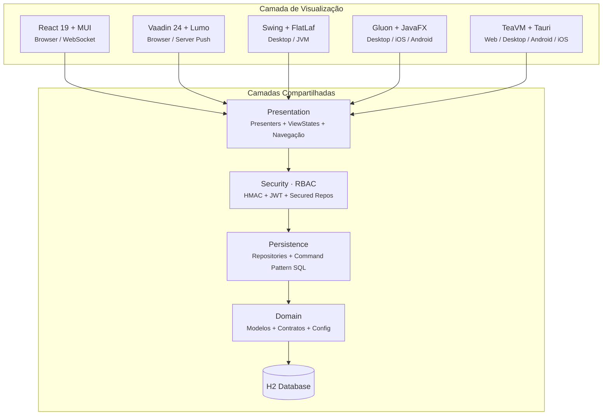
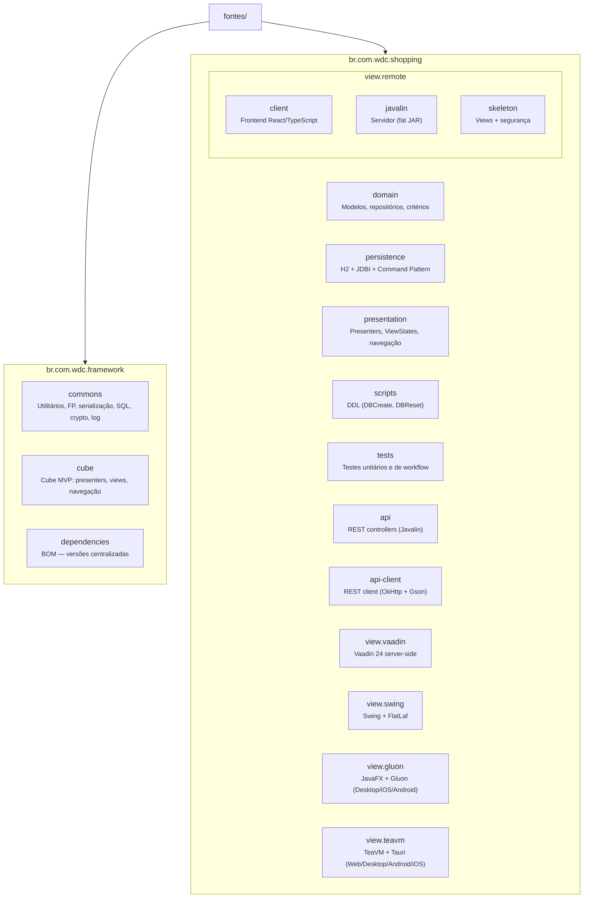
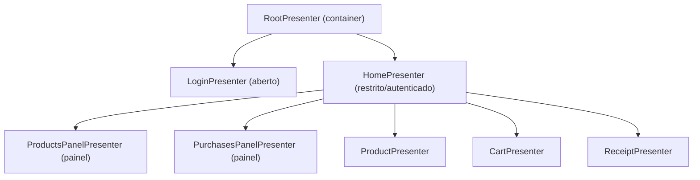

# WDC Cube Java v2

Proposta arquitetural para construção de aplicações utilizando o padrão **Cube MVP** — uma variação do Model-View-Presenter com presenters hierárquicos, navegação por intents e serialização de estado das views.

Este projeto serve como **referência arquitetural** para novos projetos, demonstrando a implementação completa de um sistema de e-commerce (Shopping) com backend Java e **cinco implementações de frontend independentes** — React (web/remoto), Vaadin (web/server-side), Swing (desktop), Gluon (desktop/iOS/Android via GraalVM Native Image) e TeaVM (web/desktop/Android/iOS via Tauri) — provando que a camada de visualização é totalmente desacoplada da lógica de apresentação.

## Visão Geral da Arquitetura



| Frontend | Tecnologia | Transporte | Módulo |
|----------|-----------|------------|--------|
| **Web (SPA)** | React 19 + TypeScript + MUI 9 | WebSocket (JSON delta) | `view.remote` |
| **Web (SSR)** | Vaadin 24 + Lumo | Server Push (Atmosphere) | `view.vaadin` |
| **Desktop** | Swing + FlatLaf 3.5 | Direto em memória | `view.swing` |
| **Multiplataforma** | JavaFX + Gluon Mobile | REST (OkHttp) | `view.gluon` |
| **Multiplataforma (TeaVM)** | TeaVM 0.14 + Tauri 2 + Bootstrap 5 | REST (OkHttp → JS) | `view.teavm` |

**Características principais:**

- **Independência de visualização** — mesmos Presenters/ViewStates alimentam React (web), Vaadin (web server-side), Swing (desktop), Gluon (desktop/iOS/Android) e TeaVM (web/desktop/Android/iOS)
- **Sem frameworks de DI** — injeção via `AtomicReference<T> BEAN` (service locator estático); services recebem dependências no construtor
- **Virtual Threads** (Java 21+) — conexões WebSocket com consumo mínimo de memória
- **Segurança RBAC** — autenticação HMAC challenge-response com JWT, controle de acesso por papéis (ADMIN, CUSTOMER, MANAGER), repositórios decorados com verificação de permissões
- **Segurança de transporte** — RSA + PBKDF2 + AES-GCM para troca de dados entre cliente React e servidor
- **Comunicação em tempo real** — WebSocket bidirecional com keep-alive automático
- **Configuração externa** — TOML para todas as implementações

## Estrutura de Módulos



### Framework

| Módulo | Descrição |
|--------|-----------|
| **framework.commons** | Interfaces funcionais com exceções checked (`ThrowingFunction`, `ThrowingConsumer`, etc.), serialização extensível, abstrações SQL (`SqlDataSource`), utilitários (`CoerceUtils`, `DateUtil`, `Defer`), criptografia (`RSA`, `Base62`), logging multiplataforma (`Log` — facade leve com backends JUL e SLF4J), concorrência (`ScheduledExecutor`) |
| **framework.cube** | Motor do padrão Cube MVP: `CubeApplication`, `CubePresenter`, `AbstractCubePresenter`, `AbstractChildPresenter`, `CubeView`/`CubeViewSlot`, `ViewState`, `CubePlace`, `CubeIntent`, `CubeNavigation` |
| **framework.dependencies** | POM do tipo BOM para gerenciamento centralizado de versões de dependências |

### Shopping — Backend

| Módulo | Descrição |
|--------|-----------|
| **domain** | Modelos de domínio (`User`, `Product`, `Purchase`, `PurchaseItem`), interfaces de repositório, classes de critérios para consultas, hierarquia de exceções (`BusinessException`), contratos de segurança (`SecurityContext`, `AuthenticationService`, `Role`) |
| **persistence** | Implementação de persistência com Command Pattern SQL (`InsertRowUserCmd`, `FetchProductsCmd`, etc.), `BaseRepository`, `BaseCommand`, DSL SQL (`SqlKeywords`), scripts DDL para H2, **decorators de segurança** (`SecuredUserRepository`, etc.) que verificam permissões RBAC |
| **presentation** | `ShoppingApplication` com proxy delegates de SecurityContext, hierarquia de presenters (Root → Login \| Home → Products/Purchases/Product/Cart/Receipt), ViewStates serializáveis, services com injeção via construtor, `CartManager`, sistema de rotas e navegação |

### Shopping — Frontend (View Implementations)

> **Princípio central:** todas as implementações usam exatamente os mesmos Presenters, ViewStates e regras de negócio. Apenas a camada de renderização muda.

| Módulo | Descrição |
|--------|-----------|
| **view.remote** | Visualização remota via browser — [detalhes](fontes/br.com.wdc.shopping/br.com.wdc.shopping.view.remote/README.md) |
| **view.remote.client** | SPA em React 19 + TypeScript + MUI 9, bundled via Parcel. Comunicação WebSocket bidirecional, gerenciamento de reconexão, segurança client-side |
| **backend** | Servidor Javalin 7 com Virtual Threads, WebSocket dispatcher, controllers REST, banco H2 embarcado. Gera fat JAR (~11 MB) |
| **view.remote.wiring** | Implementações de view para o servidor (`GenericViewImpl`), segurança (`AppSecurity` — RSA/PBKDF2/AES-GCM, `DataSecurity`), SPI de WebSocket |
| **view.vaadin** | Visualização web server-side com Vaadin 24 + Lumo theme + Jetty 12 embarcado — [detalhes](fontes/br.com.wdc.shopping/br.com.wdc.shopping.view.vaadin/README.md) |
| **view.swing** | Visualização desktop com Swing + FlatLaf (Material look-and-feel) — [detalhes](fontes/br.com.wdc.shopping/br.com.wdc.shopping.view.swing/README.md) |
| **view.gluon** | Multiplataforma (Desktop + iOS + Android) com JavaFX + Gluon Mobile + GraalVM Native Image — [detalhes](fontes/br.com.wdc.shopping/br.com.wdc.shopping.view.gluon/README.md) |
| **view.teavm** | Multiplataforma (Web + Desktop + Android + iOS) com TeaVM 0.14 + Tauri 2 + Bootstrap 5 — Java compilado para JS — [detalhes](fontes/br.com.wdc.shopping/br.com.wdc.shopping.view.teavm/README.md) |
| **api** | Controllers REST (Javalin) para expor repositórios como endpoints HTTP, filtro de segurança JWT (`SecurityFilter`), endpoints de autenticação (`AuthApiController`) |
| **api-client** | Client REST (OkHttp + Gson) que implementa as interfaces de repositório e `AuthenticationService` via HTTP, com Bearer token automático |

## Pré-requisitos

- **Java 21** (LTS)
  - **Temurin 21** ou **Microsoft JDK 21** — recomendado
  - JDK com suporte a JavaFX necessário para a versão Gluon
- **Maven 3.9+**
- **Node.js 20+** e **npm** (para o frontend React)

## Build

### Backend (Java)

```bash
export JAVA_HOME=<caminho-para-jdk-21>  # ex: /Library/Java/JavaVirtualMachines/temurin-21.jdk/Contents/Home
export PATH="$JAVA_HOME/bin:$PATH"

cd fontes
mvn clean package
```

O fat JAR será gerado em:
```
br.com.wdc.shopping/br.com.wdc.shopping/br.com.wdc.shopping.backend/target/br.com.wdc.shopping.backend-1.0.0.jar
```

### Frontend (React)

```bash
cd br.com.wdc.shopping/br.com.wdc.shopping.view.remote/remote.react

npm install        # instalar dependências
npm run build      # build de produção
npm run watch      # modo desenvolvimento (hot reload)
```

Os assets compilados são gerados diretamente em `remote.wiring/src/main/resources/META-INF/resources`.

## Execução

### Versão React (Web)

```bash
# Via script
cd br.com.wdc.shopping/br.com.wdc.shopping/br.com.wdc.shopping.backend
./start-server.sh [porta]

# Ou diretamente
java -jar target/br.com.wdc.shopping.backend-1.0.0.jar [porta]
```

- **Aplicação:** http://localhost:8080
- **Health check:** http://localhost:8080/health
- **Porta padrão:** 8080 (configurável via `work/config/application.toml`, argumento CLI ou variável `SERVER_PORT`)

### Versão Vaadin (Web — Server-Side)

```bash
export JAVA_HOME=<caminho-para-jdk-21>
export PATH="$JAVA_HOME/bin:$PATH"

cd br.com.wdc.shopping/br.com.wdc.shopping.view.vaadin
java -cp "$(mvn -q dependency:build-classpath -Dmdep.outputFile=/dev/stdout):target/classes" \
  br.com.wdc.shopping.view.vaadin.ShoppingVaadinMain
```

- **Aplicação:** http://localhost:8090
- UI inteiramente server-side — sem código JavaScript/TypeScript customizado

### Versão Gluon (Desktop / iOS / Android)

```bash
# Desktop (JVM)
cd br.com.wdc.shopping/br.com.wdc.shopping.view.gluon/br.com.wdc.shopping.view.gluon.desktop
mvn javafx:run

# iOS (simulador)
cd br.com.wdc.shopping/br.com.wdc.shopping.view.gluon/br.com.wdc.shopping.view.gluon.ios
./build-sim.sh
```

## Testes

```bash
cd fontes
mvn test
```

Estrutura de testes:

| Classe base | Finalidade |
|-------------|------------|
| `BaseBusinessTest` | Testes de lógica de negócio e repositórios |
| `BasePresentationTest` | Testes de workflow completo com mocks de view |

## Configuração

Ambas as implementações usam o arquivo `work/config/application.toml` para configuração externa:

```toml
[app]
# basedir = "work"

[database]
# url = "jdbc:h2:file:..."
# username = "sa"
# password = "sa"
# reset = false

[server]
# port = 8080    # apenas Javalin

[security]
# jwt.secret = "sua-chave-secreta"   # habilita autenticação JWT na API REST
```

Resolução: system property `shopping.config.file` → fallback para `work/config/application.toml`.

## Segurança (RBAC)

O sistema implementa autenticação e autorização em múltiplas camadas:

### Autenticação — HMAC Challenge-Response

```
Client                            Server
  │                                 │
  │──── GET /api/auth/challenge ───→│  Gera nonce com TTL
  │←─── { nonce, expiresAt } ──────│
  │                                 │
  │  passwordHash = MD5(password)   │
  │  digest = HMAC-SHA256(          │
  │    key=passwordHash,            │
  │    data=userName+nonce)         │
  │                                 │
  │──── POST /api/auth/login ─────→│  Valida digest + nonce
  │     { userName, digest, nonce } │  Cria sessão + JWT
  │←─── { accessToken,             │
  │       refreshToken,             │
  │       publicKey, expiresAt } ──│
  │                                 │
  │──── Bearer token em /api/repo/* │  SecurityFilter valida JWT
```

A senha nunca trafega em texto plano — apenas o digest HMAC-SHA256 com nonce de uso único.

### Autorização — Papéis e Permissões

| Papel | Permissões |
|-------|-----------|
| **ADMIN** | `user:*`, `product:*`, `purchase:*`, `purchase-item:*`, `data:all` |
| **CUSTOMER** | `product:read`, `purchase:read/write`, `purchase-item:read/write` |
| **MANAGER** | `product:read/write`, `purchase:read`, `purchase-item:read` |

Modelo **allow-wins**: permissão efetiva = união de todos os papéis do usuário.

### Camadas de Segurança

| Camada | Componente | Responsabilidade |
|--------|-----------|-----------------|
| **HTTP** | `SecurityFilter` | Valida Bearer JWT, popula `SecurityContextHolder` |
| **Repositório** | `SecuredXxxRepository` | Verifica permissões, restringe escopo ao userId (non-admin) |
| **Apresentação** | `SecurityContextDelegate` (proxy) | Propaga `SecurityContext` para a thread corrente em cada chamada |
| **Transporte** | `AppSecurity` (React) | RSA + PBKDF2 + AES-GCM para dados sensíveis via WebSocket |

### Configuração

```toml
[security]
jwt.secret = "sua-chave-secreta-aqui"
```

Se `jwt.secret` não estiver configurado, a API opera sem autenticação (modo desenvolvimento/testes locais).

## Padrão Cube MVP

O Cube MVP organiza a aplicação em uma **hierarquia de presenters** com navegação baseada em **intents**:



Cada presenter possui um **ViewState** serializável que é transmitido ao frontend via WebSocket. O frontend renderiza com base no estado recebido e envia eventos de volta ao presenter correspondente.

## Convenções de Nomenclatura

| Tipo | Padrão | Exemplo |
|------|--------|---------|
| Comando SQL | `Verbo` + `Entidade` + `Cmd` | `InsertRowUserCmd` |
| View State | `*ViewState` | `ProductViewState` |
| View Impl | `*ViewImpl` | `RootReactViewImpl` |
| Presenter | `*Presenter` | `CartPresenter` |
| Repositório | `*RepositoryImpl` | `UserRepositoryImpl` |
| Critério | `*Criteria` | `ProductCriteria` |
| Aplicador de critério | `Apply` + `Entidade` + `Criteria` | `ApplyProductCriteria` |

## Dependências Principais

| Categoria | Tecnologia | Versão |
|-----------|-----------|--------|
| Linguagem | Java (Temurin/Microsoft) | 21 |
| Build | Maven | 3.9+ |
| Servidor HTTP | Javalin | 7.2.0 |
| Web UI (server-side) | Vaadin | 24.6.3 |
| Servlet Container | Jetty | 12 |
| Desktop UI | JavaFX (via Gluon) | 21.0.7 |
| Multiplataforma | Gluon Mobile + GraalVM Native Image | 1.0.25 |
| Banco de dados | H2 | 2.4.240 |
| Acesso a dados | JDBI | 3.52.1 |
| Serialização | Gson | 2.13.2 |
| Logging | SLF4J + Logback | 2.0.16 / 1.5.32 |
| Testes | JUnit | 4.13.2 |
| Frontend | React | 19 |
| UI Components | MUI | 9 |
| Bundler | Parcel | 2.13.3 |
| Linguagem (frontend) | TypeScript | ES2024 |

## Licença

Este projeto é distribuído sob a [MIT License](https://github.com/mrcdom/wdc-cube-java-v2/blob/main/LICENSE).

Copyright (c) 2026 Marcelo Domingos / WeDoCode Consultoria LTDA
