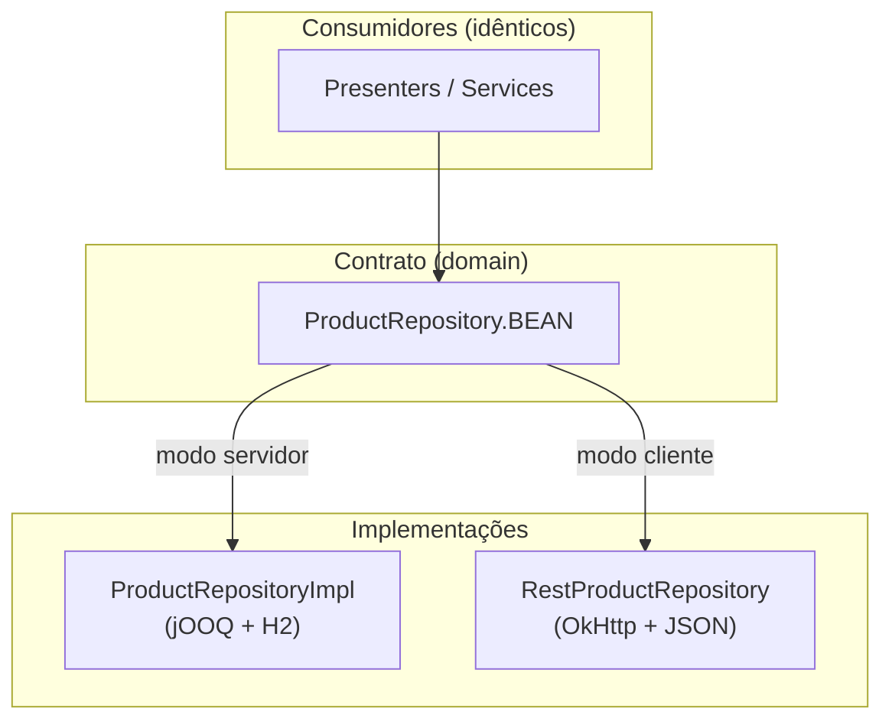
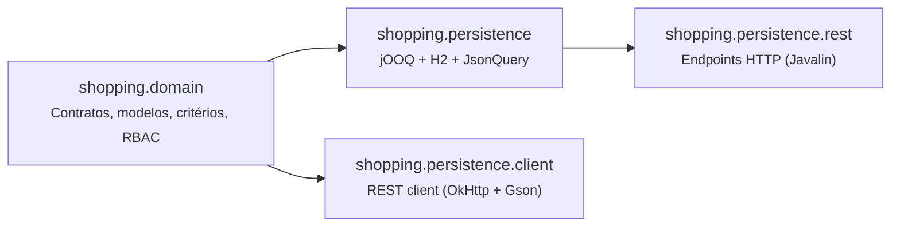
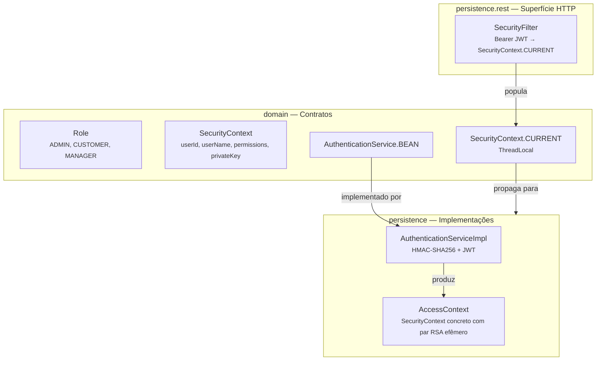
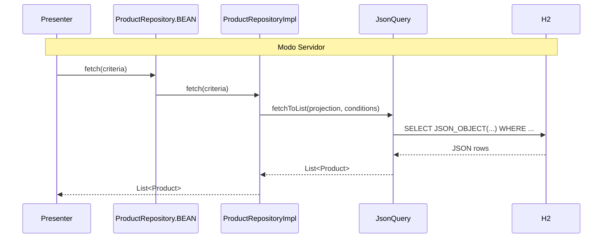
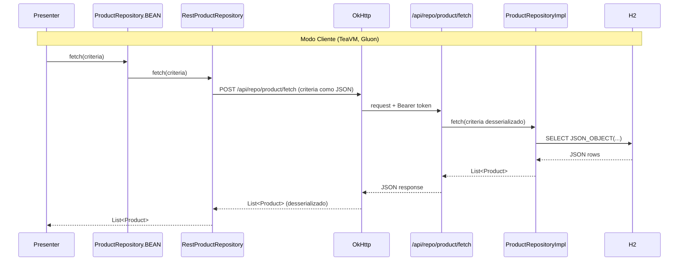

# Camada de Dados — Domain, Persistence e API REST

[Contextualização](#contextualização)  
[O Problema que essa Arquitetura Resolve](#o-problema-que-essa-arquitetura-resolve)  
[Visão Geral dos Módulos](#visão-geral-dos-módulos)  
[O Módulo Domain — O Contrato](#o-módulo-domain-o-contrato)  
[Repositórios como Interfaces Injetáveis](#repositórios-como-interfaces-injetáveis)  
[Critérios — Consultas sem String SQL](#critérios-consultas-sem-string-sql)  
[Projeção Seletiva — Só Carregue o que Precisa](#projeção-seletiva-só-carregue-o-que-precisa)  
[O Módulo Persistence — A Implementação](#o-módulo-persistence-a-implementação)  
[JsonQuery — Mapeamento Declarativo Bean↔Tabela](#jsonquery-mapeamento-declarativo-beantabela)  
[Relações Lazy — Subqueries sem N+1](#relações-lazy-subqueries-sem-n1)  
[Segurança RBAC — Permissões como Contrato de Domínio](#segurança-rbac-permissões-como-contrato-de-domínio)  
[O Módulo persistence.rest — A Superfície HTTP](#o-módulo-persistencerest-a-superfície-http)  
[O Módulo persistence.client — O Espelho HTTP](#o-módulo-persistenceclient-o-espelho-http)  
[A Simetria Total — o Mesmo Código, Dois Mundos](#a-simetria-total-o-mesmo-código-dois-mundos)  
[Fluxo Completo — Da View ao Banco](#fluxo-completo-da-view-ao-banco)  
[Transações — Atomicidade e Modo Dual JTA/JDBC](#transações-atomicidade-e-modo-dual-jtajdbc)  
[Conclusões](#conclusões)  

---

## Contextualização

Todo sistema que lida com dados enfrenta o mesmo dilema: onde colocar o SQL? Como isolar o domínio da tecnologia de banco? O que fazer quando parte das views roda no servidor e outra parte roda no cliente (browser, mobile)?

Esse documento descreve como o projeto WDC Shopping resolve esses problemas através de uma arquitetura em quatro módulos com separação de responsabilidades nítida — e como essa separação permite que **o mesmo código de domínio rode tanto com acesso direto ao banco quanto via HTTP**, sem nenhuma modificação.

---

## O Problema que essa Arquitetura Resolve

Imagine que você tem seis implementações de frontend para o mesmo sistema. Algumas rodam no servidor (Vaadin, SWT, modo remoto) e acessam o banco diretamente. Outras rodam no cliente (TeaVM compilado para JavaScript, Gluon/GraalVM Native Image para mobile) e precisam acessar os dados via HTTP.

A pergunta natural é: como o código de negócio — Presenters, serviços, regras — permanece **idêntico** em ambos os casos?

A resposta está no contrato: interfaces de repositório que o domínio define, e que podem ser implementadas de dois modos — uma que fala com o banco via jOOQ, outra que fala com o servidor via HTTP. Quem usa o repositório não sabe qual implementação está por baixo.



---

## Visão Geral dos Módulos



| Módulo | Dependências externas | Responsabilidade |
|--------|-----------------------|-----------------|
| `domain` | SLF4J, Commons IO | Modelos, interfaces, critérios, RBAC |
| `persistence` | jOOQ, H2, Gson, framework.jooq | Implementação SQL dos repositórios |
| `persistence.rest` | Javalin, Jackson | Expõe repositórios como API HTTP |
| `persistence.client` | OkHttp, Gson | Consome a API HTTP como repositórios |

---

## O Módulo Domain — O Contrato

O módulo `domain` é **puramente conceitual**. Não conhece banco de dados, nem HTTP, nem qualquer framework de persistência. Apenas define o que existe no sistema.

### Modelos

POJOs simples com campos públicos — sem anotações de persistência, sem herança obrigatória:

```java
public class Product {
    public Long id;
    public String name;
    public Double price;
    public String description;
    public byte[] image;
}
```

Nada de `@Entity`, `@Column`, `@JsonProperty`. O modelo é puro Java. Quem sabe mapeá-lo para banco é o módulo `persistence`. Quem sabe serializá-lo para JSON é o módulo `persistence.rest`.

### Repositórios como Interfaces Injetáveis

Cada entidade tem uma interface de repositório que define as operações disponíveis:

```java
public interface ProductRepository {
    AtomicReference<ProductRepository> BEAN = new AtomicReference<>();

    boolean insert(Product product);
    boolean update(Product newEntity, Product oldEntity);
    boolean insertOrUpdate(Product entity);
    int delete(ProductCriteria criteria);
    int count(ProductCriteria criteria);
    List<Product> fetch(ProductCriteria criteria);
    Product fetchById(Long id, Product projection);
}
```

O campo estático `BEAN` é o ponto de injeção — um Service Locator leve baseado em `AtomicReference`. A implementação concreta é registrada durante o bootstrap da aplicação:

```java
// Modo servidor (acesso direto ao banco):
ProductRepository.BEAN.set(new ProductRepositoryImpl());

// Modo cliente (acesso via HTTP):
ProductRepository.BEAN.set(new RestProductRepository(restConfig));
```

Todo código que consome produtos faz simplesmente:

```java
var products = ProductRepository.BEAN.get().fetch(criteria);
```

E não sabe — nem precisa saber — como esses produtos chegaram.

---

## Critérios — Consultas sem String SQL

Em vez de receber filtros como parâmetros avulsos ou Strings SQL, cada repositório trabalha com um objeto de critério tipado. O critério é uma classe imutável com uma API fluente:

```java
var criteria = new ProductCriteria()
    .withProductId(42L)
    .withOffset(0)
    .withLimit(20)
    .withOrderBy(ProductCriteria.OrderBy.NAME_ASC);
```

**Por que isso é bom?**

1. **Type-safe** — não existe `fetch("name like ?", "%java%")`. Se o campo não existe, não compila.
2. **Serializável** — o mesmo objeto `ProductCriteria` trafega como JSON entre `persistence.client` e `persistence.rest`. O endpoint recebe o critério, desserializa, e executa. Não há mapeamento manual de parâmetros.
3. **Composível** — a camada `persistence` implementa `ApplyConditions` que traduz o critério em `Condition` jOOQ. Isso permite que o filtro de um repositório seja reutilizado dentro de subqueries de outro.

---

## Projeção Seletiva — Só Carregue o que Precisa

Um recurso pouco comum e muito poderoso: o chamador controla quais campos devem ser carregados. A projeção é um objeto do mesmo tipo do modelo, onde os campos não-nulos indicam "quero esse campo":

```java
// Só preciso de id e name — sem price, description ou image
var projection = new Product();
projection.id = 0L;
projection.name = "";

var products = ProductRepository.BEAN.get().fetchById(42L, projection);
// SQL gerado: SELECT JSON_OBJECT('id', p.ID, 'name', p.NAME) FROM EN_PRODUCT p WHERE p.ID = 42
```

Sem a projeção, o jOOQ geraria `SELECT JSON_OBJECT('id',...,'name',...,'price',...,'description',...,'image',...)` — incluindo o campo `image` que pode ser um blob pesado. A projeção torna isso cirúrgico.

O mesmo mecanismo funciona ao serializar o critério para HTTP: o campo `"projection"` vai no body do POST, e o servidor aplica o mesmo filtro antes de executar a query.

---

## O Módulo Persistence — A Implementação

O módulo `persistence` implementa os repositórios usando **jOOQ** como query builder type-safe, **H2** como banco embarcado e o framework **JsonQueryBuilder** (módulo `framework.jooq`) para mapeamento declarativo bean↔tabela.

### JsonQuery — Mapeamento Declarativo Bean↔Tabela

No lugar de um ORM com anotações, o mapeamento é definido via código, em um objeto estático e imutável chamado `QUERY`. Cada repositório define o seu:

```java
public static final JsonQuery<Product, EnProduct> QUERY = new JsonQueryBuilder<Product, EnProduct>()
        .setAlias("p")
        .setBeanFactory(Product::new)
        .setTableFactory(EN_PRODUCT::as)
        .addI64("id",          p -> p.id,          (p, v) -> p.id = v,          t -> t.ID)
        .addStr("name",        p -> p.name,        (p, v) -> p.name = v,        t -> t.NAME)
        .addF64("price",       p -> p.price,       (p, v) -> p.price = v,       t -> t.PRICE)
        .addStr("description", p -> p.description, (p, v) -> p.description = v, t -> t.DESCRIPTION)
        .addBin("image",       p -> p.image,       (p, v) -> p.image = v,       t -> t.IMAGE)
        .build();
```

Cada linha descreve um campo com quatro funções lambda:
- `getter` — como ler o campo no bean (para projeção)
- `setter` — como escrever o campo no bean (após deserialização)
- `column` — qual coluna da tabela jOOQ corresponde

O `JsonQueryBuilder` usa esses descritores para:
1. Gerar `SELECT JSON_OBJECT(...)` incluindo apenas os campos com getter não-nulo na projeção
2. Desserializar o JSON retornado pelo banco diretamente para o bean, sem reflection
3. Reutilizar o mesmo mapeamento em subqueries de relações lazy

**A query gerada pelo banco para um `fetch` sem projeção parcial:**

```sql
SELECT JSON_OBJECT(
    'id',          p.ID,
    'name',        p.NAME,
    'price',       p.PRICE,
    'description', p.DESCRIPTION
) FROM EN_PRODUCT p
WHERE p.ID = 42
```

> O campo `image` é omitido porque é `byte[]` — binário pesado servido por endpoint dedicado.

---

### Relações Lazy — Subqueries sem N+1

O problema clássico de ORMs é o N+1: carregar uma lista de compras e, para cada compra, disparar uma query separada para buscar os itens. O `JsonQueryBuilder` resolve isso com **subqueries correlacionadas declarativas**:

```java
public static final JsonQuery<Purchase, EnPurchase> QUERY = new JsonQueryBuilder<Purchase, EnPurchase>()
        // ... campos diretos ...
        .lazy(qb -> {
            // Relação 1:1 — Purchase → User
            qb.addBeanField("user", p -> p.user, (p, v) -> p.user = v,
                    UserRepositoryImpl.QUERY, cq -> {
                        var enPurchase = cq.getSuperTable();
                        var enUser = cq.getChildTable();
                        cq.dsl().where()
                            .and(enUser.ID.eq(enPurchase.USERID));
                    });

            // Relação 1:N — Purchase → Items
            qb.addBeanListField("items", p -> p.items, (p, v) -> p.items = v,
                    PurchaseItemRepositoryImpl.QUERY, cq -> {
                        var enPurchase = cq.getSuperTable();
                        var enPurchaseItem = cq.getChildTable();
                        cq.dsl().where()
                            .and(enPurchaseItem.PURCHASEID.eq(enPurchase.ID));
                    });
        })
        .build();
```

O `lazy(...)` declara que esses campos só são carregados quando a projeção os inclui. Quando incluídos, o framework gera uma única query com subselects correlacionados:

```sql
SELECT JSON_OBJECT(
    'id',    pu.ID,
    'user',  (SELECT JSON_OBJECT('id', u.ID, 'name', u.NAME)
              FROM EN_USER u WHERE u.ID = pu.USERID),
    'items', (SELECT JSON_ARRAYAGG(JSON_OBJECT('id', pi.ID, 'amount', pi.AMOUNT, ...))
              FROM EN_PURCHASEITEM pi WHERE pi.PURCHASEID = pu.ID)
) FROM EN_PURCHASE pu WHERE ...
```

**Uma query. Zero N+1. Independente de quantas compras forem retornadas.**

---

## Segurança RBAC — Permissões como Contrato de Domínio

A arquitetura de segurança é definida no módulo `domain` — não na camada de persistência, não no HTTP. Isso garante que as regras de acesso sejam centrais e independentes de onde a request originou.



O fluxo de autenticação usa **HMAC challenge-response** para nunca trafegar a senha em texto plano:

```
1. Cliente → GET /api/auth/challenge
   ← { nonce: "abc123", expiresAt: "..." }

2. digest = HMAC-SHA256(key=sha256(password), data=userName+nonce)

3. Cliente → POST /api/auth/login { userName, digest, nonce }
   ← { accessToken, refreshToken, publicKey, expiresAt }

4. Requests subsequentes: Authorization: Bearer <accessToken>
```

O `SecurityContext.CURRENT` propaga o contexto via `ThreadLocal` — qualquer código que rode na mesma thread (incluindo repositórios) pode verificar permissões sem receber parâmetros extras.

Permissões são definidas no formato `entidade:operação`:

```java
public enum Role {
    ADMIN("user:read", "user:write", "product:read", "product:write", "purchase:read", "purchase:write"),
    CUSTOMER("product:read", "purchase:read", "purchase:write"),
    MANAGER("product:read", "product:write", "purchase:read");
}
```

---

## O Módulo persistence.rest — A Superfície HTTP

O módulo `persistence.rest` expõe os repositórios como uma API HTTP uniforme via Javalin. Não existe lógica de negócio aqui — apenas serialização, autenticação e delegação.

### Contrato Uniforme

Todas as entidades seguem o mesmo padrão de endpoints:

| Método | Path | Corpo | Resposta |
|--------|------|-------|----------|
| `POST` | `/api/repo/product/insert` | `Product` | `boolean` |
| `POST` | `/api/repo/product/update` | `{ newEntity, oldEntity }` | `boolean` |
| `POST` | `/api/repo/product/delete` | `ProductCriteria` | `int` |
| `POST` | `/api/repo/product/count` | `ProductCriteria` | `int` |
| `POST` | `/api/repo/product/fetch` | `ProductCriteria` | `List<Product>` |
| `POST` | `/api/repo/product/fetchById` | `{ id, projection }` | `Product` |

O critério e a projeção trafegam como JSON no body — estrutura idêntica ao objeto Java. Não há mapeamento manual entre parâmetros HTTP e objetos de domínio.

### SecurityFilter

Um before-filter registrado em `/api/repo/*` extrai o JWT do header `Authorization: Bearer`, valida-o via `AuthenticationService`, e popula o `SecurityContext.CURRENT`. O after-handler limpa o contexto ao final de cada request. Os endpoints de imagem (`/product/{id}/image`) são públicos — sem autenticação.

---

## O Módulo persistence.client — O Espelho HTTP

O módulo `persistence.client` implementa as mesmas interfaces de repositório do `domain`, mas cada chamada vira uma request HTTP via OkHttp:

```java
public class RestProductRepository implements ProductRepository {

    @Override
    public List<Product> fetch(ProductCriteria criteria) {
        return restConfig.postJson("/api/repo/product/fetch", criteria, productListType);
    }

    @Override
    public Product fetchById(Long id, Product projection) {
        return restConfig.postJson("/api/repo/product/fetchById",
                Map.of("id", id, "projection", projection), Product.class);
    }
}
```

O `RestConfig` encapsula toda a infraestrutura HTTP:
- Serialização/deserialização Gson com adapters para `OffsetDateTime` e exclusão de referências circulares
- Injeção automática do Bearer token em todos os requests autenticados
- Renovação transparente de token expirado via refresh endpoint
- Tratamento de `AccessDeniedException` a partir de respostas HTTP 403

O **bootstrap** é uma única chamada que registra todas as implementações REST nos BEANs:

```java
var config = new RestConfig("http://localhost:8080");
RestRepositoryBootstrap.initialize(config);
// A partir daqui, ProductRepository.BEAN.get() retorna RestProductRepository
```

---

## A Simetria Total — o Mesmo Código, Dois Mundos

Esse é o ponto central da arquitetura. O código que consome repositórios — Presenters, serviços, regras de negócio — é **literalmente o mesmo arquivo Java** rodando em dois contextos completamente diferentes:

```
Modo servidor (Vaadin, SWT, modo remoto):
  ProductRepository.BEAN → ProductRepositoryImpl → jOOQ → H2

Modo cliente (TeaVM, Gluon):
  ProductRepository.BEAN → RestProductRepository → OkHttp → /api/repo/product/fetch → ProductRepositoryImpl → jOOQ → H2
```

O `CartPresenter` que busca produtos para exibir no carrinho não tem uma linha de código diferente entre os dois modos. A diferença está apenas no bootstrap — em qual implementação é registrada no `BEAN`.

---

## Fluxo Completo — Da View ao Banco

O diagrama abaixo mostra o caminho de uma consulta de produtos iniciada pelo Presenter, nos dois modos:





Do ponto de vista do Presenter, as duas sequências são indistinguíveis.

---

## Transações — Atomicidade e Modo Dual JTA/JDBC

Uma operação de negócio raramente é uma única instrução SQL. Finalizar uma compra, por exemplo, insere a linha da compra **e** uma linha para cada item. Se a inserção falhar no meio, o que sobra no banco? Em modo *autocommit* — onde cada `INSERT` é confirmado isoladamente — sobra uma **compra órfã**, sem itens. A solução clássica é a transação: ou tudo é confirmado, ou nada é.

O projeto resolve isso com uma camada de transação **programática no estilo CMT (Container-Managed Transaction)** do EJB, com uma propriedade rara: o mesmo código de domínio funciona com transação **JDBC direta** (padrão) ou **JTA/XA** (Narayana), trocando por configuração — e **sem que os repositórios mudem uma linha**.

### O contrato — `TransactionService`

A abstração vive em `framework.domain.transaction` (puro contrato, sem tecnologia). A fronteira da transação é sempre o trabalho fornecido (um lambda): em retorno normal **commita**, em qualquer exceção **reverte** e repropaga. O `TransactionContext` entregue ao trabalho serve para marcar rollback e introspecção.

```java
// holder por módulo, populado pelo backend (ex.: ShoppingTransactions.BEAN.get())
ShoppingTransactions.BEAN.get().required(tx -> {
    purchaseRepository.insert(purchase);   // compra + itens
    if (regraDeNegocioFalhou) {
        tx.setRollbackOnly();              // aborta sem lançar exceção
    }
});
```

Os atributos de propagação espelham o EJB (cada um com forma `void` e forma `…Call` que retorna valor, evitando ambiguidade de overload de lambda):

| Propagação | Comportamento |
|------------|---------------|
| `required` | Junta-se à transação ativa ou abre uma nova |
| `requiresNew` | Suspende a ativa, abre uma nova, retoma ao final |
| `mandatory` | Exige transação ativa (senão `TransactionRequiredException`) |
| `supports` | Participa se houver; senão executa sem transação |
| `notSupported` | Suspende a ativa e executa sem transação |
| `never` | Proíbe transação ativa (senão `TransactionNotAllowedException`) |

### O motor — `TransactionScope` (modo dual)

A implementação (`framework.persistence`) é um *frame* ligado à thread (`ThreadLocal`) que opera em dois modos, decididos em runtime:

- **JDBC** (padrão): gerencia a transação direto na `Connection` (`autoCommit=false`, `commit`/`rollback`). Sem coordenador externo.
- **JTA**: delega `begin`/`commit`/`rollback` a um `TransactionManager` (Narayana); a conexão, obtida de um `DataSource` *JTA-aware*, é enlistada como recurso **XA** — habilitando 2PC quando houver mais de um recurso.

A reentrância de `required` compartilha a **mesma conexão física** do *owner*; só o *owner* commita/fecha (participantes são no-op).

### Como os repositórios participam — sem mudar

Os `*RepositoryImpl` continuam declarativos: usam o `DSLContext` compartilhado e nunca tocam em conexão ou transação. A ligação acontece num único ponto — o `DSLContext` é construído sobre um **`TransactionAwareConnectionProvider`** (em `framework.jooq`):

- **dentro de uma transação**: entrega a conexão do `TransactionScope` corrente → todas as queries do bloco compartilham a mesma transação física;
- **fora**: empresta uma conexão avulsa do pool (autocommit), como antes.

O resultado: envolver uma operação em `required(...)` torna atômicas todas as queries que os repositórios executam dentro dela — em JDBC e em JTA — sem qualquer alteração nos repositórios.

### Onde a transação é aberta

A fronteira fica nos **casos de uso de escrita**, não nos repositórios:

- **Fluxo Host** (presenters server-side): a finalização da compra (`CartManager.doPurchase`) envolve o `insert` da compra+itens. É *null-safe* — em ambientes sem `TransactionService` (ex.: TeaVM no browser, que usa repositórios HTTP) executa direto.
- **Fluxo REST** (`persistence.rest`): um decorador `RepositoryApiRoutes.transactional(...)` envolve os handlers de escrita (`insert`/`update`/`delete`) no registro das rotas, preservando o tipo da exceção original para que os *exception mappers* do Javalin continuem funcionando.

### Configuração e neutralidade

O modo é escolhido em `application.toml`:

```toml
[database]
# "jta" = TransactionManager Narayana + pool Agroal enlistado em XA
# "non-jta" = JDBC direto (autocommit por statement) — padrão
transaction = "jta"
```

Um princípio guia a separação: **a tecnologia concreta (Agroal, Narayana, driver XA) vive no host** (`cube.backend`), que constrói o `DataSource` e o `TransactionManager` e os injeta em holders neutros. O módulo `framework.persistence` permanece agnóstico — depende apenas de `javax.sql.DataSource` e `jakarta.transaction` (padrões), nunca de uma implementação de pool ou TM. Trocar Agroal/Narayana por outra stack é mudança isolada no host.

### Contextualização por módulo (hexagonal)

Não existe holder global de `DataSource` nem de `TransactionService`. Cada **módulo** expõe seus holders como SPI — `ShoppingDSLContext` (DSLContext) e `ShoppingTransactions` (TransactionService) — populados pelo **backend (composition root)**, que conhece todos os módulos. O `TransactionServiceImpl` recebe o `DataSource` do módulo na construção (`Supplier<DataSource>`), de modo que cada módulo tem sua transação ligada ao **seu** banco.

Se o backend dá a dois módulos o mesmo `DataSource` (banco compartilhado) ou bancos distintos é decisão dele — **transparente para o módulo**, que apenas usa seu próprio holder. O `TransactionManager` JTA permanece **único por JVM** (coordenador): é ele que permite uma transação atravessar vários módulos/datasources em XA — por isso *não* é contextualizado por módulo.

---

## Conclusões

A camada de dados do WDC Shopping demonstra que é possível ter **zero duplicação de lógica de negócio** entre um frontend servidor e um frontend cliente, desde que a fronteira seja definida no lugar certo — nas interfaces de repositório.

Os pontos que tornam essa arquitetura robusta:

- **Domain sem dependências de infraestrutura** — modelos e interfaces que qualquer módulo pode referenciar sem arrastar dependências indesejadas
- **Critérios tipados e serializáveis** — o mesmo objeto que constrói a query SQL trafega como JSON entre cliente e servidor, sem mapeamento manual
- **JsonQuery declarativo** — mapeamento bean↔tabela sem reflection em runtime, com projeção seletiva e relações lazy que eliminam N+1
- **Segurança como contrato de domínio** — permissões definidas em `Role`, propagadas via `SecurityContext.CURRENT`, verificadas nos controllers REST
- **Simetria de bootstrap** — trocar de modo servidor para modo cliente é uma única linha de inicialização

A consequência prática: quando um novo frontend é adicionado ao sistema, ele herda gratuitamente todo o comportamento de acesso a dados — incluindo segurança, projeção e paginação — simplesmente registrando a implementação adequada no BEAN.
