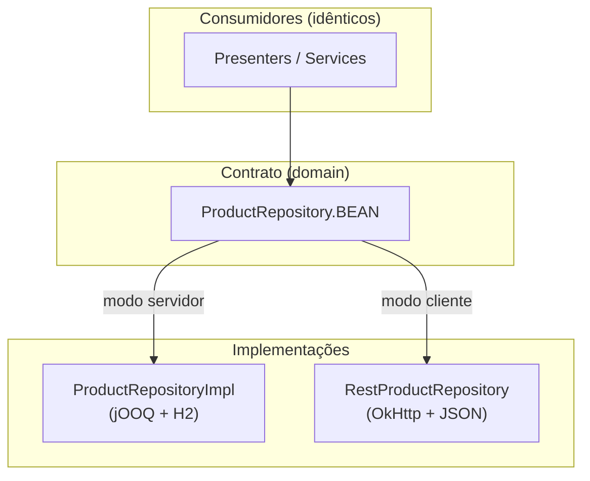
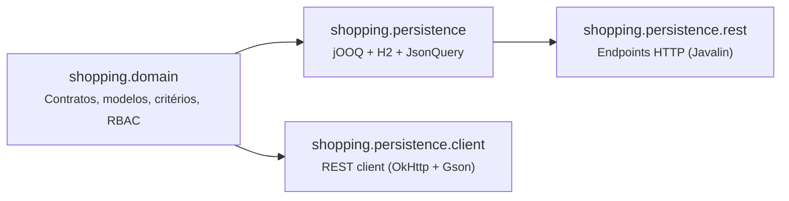
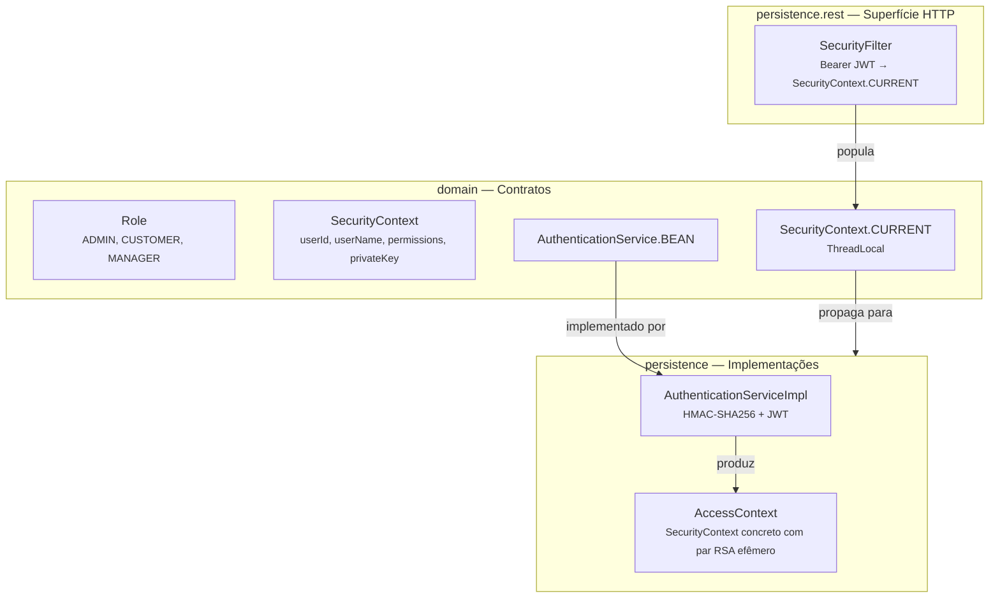
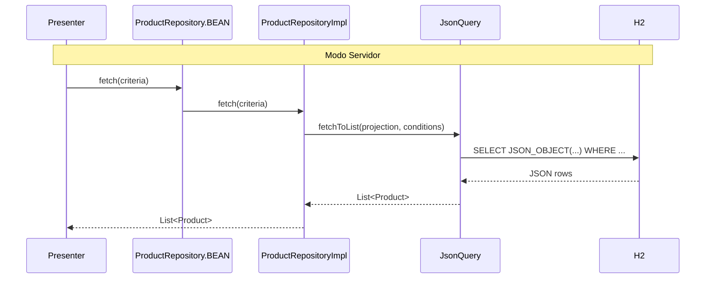
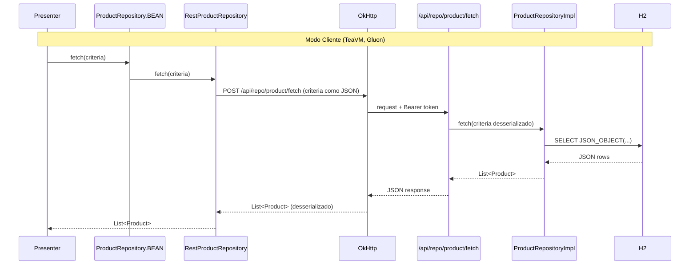

# Camada de Dados — Domain, Persistence e API REST

[Contextualização](#contextualização)  
[O Problema que essa Arquitetura Resolve](#o-problema-que-essa-arquitetura-resolve)  
[Visão Geral dos Módulos](#visão-geral-dos-módulos)  
[O Módulo Domain — O Contrato](#o-módulo-domain-o-contrato)  
[Repositórios como Interfaces Injetáveis](#repositórios-como-interfaces-injetáveis)  
[Critérios — Consultas sem String SQL](#critérios-consultas-sem-string-sql)  
[Projeção Seletiva — Só Carregue o que Precisa](#projeção-seletiva-só-carregue-o-que-precisa)  
[O Módulo Persistence — A Implementação](#o-módulo-persistence-a-implementação)  
[JsonQuery — Mapeamento Declarativo Bean↔Tabela](#jsonquery-mapeamento-declarativo-beantabela)  
[Relações Lazy — Subqueries sem N+1](#relações-lazy-subqueries-sem-n1)  
[Segurança RBAC — Permissões como Contrato de Domínio](#segurança-rbac-permissões-como-contrato-de-domínio)  
[O Módulo persistence.rest — A Superfície HTTP](#o-módulo-persistencerest-a-superfície-http)  
[O Módulo persistence.client — O Espelho HTTP](#o-módulo-persistenceclient-o-espelho-http)  
[A Simetria Total — o Mesmo Código, Dois Mundos](#a-simetria-total-o-mesmo-código-dois-mundos)  
[Fluxo Completo — Da View ao Banco](#fluxo-completo-da-view-ao-banco)  
[Transações — Atomicidade e Modo Dual JTA/JDBC](#transações-atomicidade-e-modo-dual-jtajdbc)  
[Transações Remotas Dirigidas pelo Cliente](#transações-remotas-dirigidas-pelo-cliente-sobre-rest)  
[Conclusões](#conclusões)  

---

## Contextualização

Todo sistema que lida com dados enfrenta o mesmo dilema: onde colocar o SQL? Como isolar o domínio da tecnologia de banco? O que fazer quando parte das views roda no servidor e outra parte roda no cliente (browser, mobile)?

Esse documento descreve como o projeto WDC Shopping resolve esses problemas através de uma arquitetura em quatro módulos com separação de responsabilidades nítida — e como essa separação permite que **o mesmo código de domínio rode tanto com acesso direto ao banco quanto via HTTP**, sem nenhuma modificação.

---

## O Problema que essa Arquitetura Resolve

Imagine que você tem seis implementações de frontend para o mesmo sistema. Algumas rodam no servidor (Vaadin, SWT, modo remoto) e acessam o banco diretamente. Outras rodam no cliente (TeaVM compilado para JavaScript, Gluon/GraalVM Native Image para mobile) e precisam acessar os dados via HTTP.

A pergunta natural é: como o código de negócio — Presenters, serviços, regras — permanece **idêntico** em ambos os casos?

A resposta está no contrato: interfaces de repositório que o domínio define, e que podem ser implementadas de dois modos — uma que fala com o banco via jOOQ, outra que fala com o servidor via HTTP. Quem usa o repositório não sabe qual implementação está por baixo.


```mermaid
graph TD
    subgraph Consumers["Consumidores (idênticos)"]
        P["Presenters / Services"]
    end

    subgraph Contract["Contrato (domain)"]
        R["ProductRepository.BEAN"]
    end

    subgraph Impl["Implementações"]
        DB["ProductRepositoryImpl<br/>(jOOQ + H2)"]
        HTTP["RestProductRepository<br/>(OkHttp + JSON)"]
    end

    P --> R
    R -->|"modo servidor"| DB
    R -->|"modo cliente"| HTTP
```

---

## Visão Geral dos Módulos


```mermaid
graph LR
    domain["shopping.domain<br/><small>Contratos, modelos, critérios, RBAC</small>"]
    persistence["shopping.persistence<br/><small>jOOQ + H2 + JsonQuery</small>"]
    rest["shopping.persistence.rest<br/><small>Endpoints HTTP (Javalin)</small>"]
    client["shopping.persistence.client<br/><small>REST client (OkHttp + Gson)</small>"]

    domain --> persistence
    domain --> client
    persistence --> rest
```

| Módulo | Dependências externas | Responsabilidade |
|--------|-----------------------|-----------------|
| `domain` | SLF4J, Commons IO | Modelos, interfaces, critérios, RBAC |
| `persistence` | jOOQ, H2, Gson, framework.jooq | Implementação SQL dos repositórios |
| `persistence.rest` | Javalin, Jackson | Expõe repositórios como API HTTP |
| `persistence.client` | OkHttp, Gson | Consome a API HTTP como repositórios |

---

## O Módulo Domain — O Contrato

O módulo `domain` é **puramente conceitual**. Não conhece banco de dados, nem HTTP, nem qualquer framework de persistência. Apenas define o que existe no sistema.

### Critério: um campo, vários pedidos

Cada campo filtrável de um `XxxCriteria` é um `Criterion`, e o tipo do campo decide o que se pode pedir dele:

| Classe | Acrescenta | Para |
|---|---|---|
| `Criterion` | `eq` `ne` `in` `isNull` `isNotNull` | o que só se compara por identidade — enum, booleano, chave estrangeira |
| `ComparableCriterion` | `gt` `ge` `lt` `le` `between` | número, data, timestamp |
| `TextCriterion` | `like` `ilike` `containing` `startingWith` | texto |

```java
var criteria = new ProductCriteria();
criteria.productId().in(1L, 2L, 3L);

new UserCriteria().userName().startingWith("adm");
```

Isso impede na compilação um `between` sobre um campo sem ordem útil: quem declara o campo conhece o tipo da coluna e escolhe a classe.

**Pedidos sucessivos acumulam, e por padrão valem juntos (`AND`).** É o que faz `ge(inicio)` seguido de `le(fim)` — como sai de dois campos de tela — significar intervalo, e `ne(1)` com `ne(2)` excluir os dois. Fosse `OR` o padrão, esses casos devolveriam quase toda a tabela sem nada indicar o erro. Alternativa se pede com `or()`, e a disjunção vale **dentro** do campo; entre campos é sempre `AND`:

```java
criteria.userName().or().eq("admin");
criteria.userName().eq("fulano");     // (userName = 'admin' OR userName = 'fulano')
```

**Valor nulo não acrescenta pedido**, em vez de apagar os anteriores — é o que preserva o costume de montar filtro a partir de tela, onde vazio significa "não filtrar por isto". Para apagar, `clear()`; para comparar com nulo, `isNull()`. Os atalhos `withXxx(valor)` continuam existindo, e são `xxx().eq(valor)`.

A tradução para jOOQ é escrita **uma vez**, no `CriterionTranslator`. O que resta a cada entidade é dizer qual coluna corresponde a cada campo e, quando o tipo do domínio difere do da coluna, como converter o valor:

```java
return CriterionTranslator.and(Arrays.asList(
        CriterionTranslator.translate(enProduct.ID, criteria.productId()),
        CriterionTranslator.translate(enProduct.NAME, criteria.name()),
        // A coluna é NUMERIC e o domínio fala em Double: a conversão é do campo, e vale igual
        // para eq, between e in.
        CriterionTranslator.translate(enProduct.PRICE, criteria.price(), BigDecimal::valueOf)));
```

Campo que não é coluna da tabela — `PurchaseCriteria.productId`, que vive nos itens — continua saindo como `EXISTS`, mas a condição interna também vem do tradutor, de modo que `in`, `between` e a disjunção valem ali do mesmo jeito.

> **Cuidado ao migrar:** `criteria.productId()` nunca é `null` — o campo existe sempre, informado ou não. Testar `criteria.productId() == null` compila e é sempre falso. O que decide é `hasProductId()`. Foi assim que duas guardas de `delete` — as que impedem apagar a tabela inteira — deixaram de valer na migração, sem o compilador dizer nada.

**No transporte**, o campo vira um objeto com os pedidos, e não o valor solto que trafegava antes:

```json
"price": { "or": true, "p": [ { "o": "GE", "v": [10.0] }, { "o": "IS_NULL" } ] }
```

O valor solto não bastaria: um campo carrega vários pedidos, cada um com seu operador e sua aridade, e a disjunção é do campo. Reduzir isso a `"price": 10.0` descartaria tudo menos a igualdade, e em silêncio. O formato antigo continua sendo aceito na leitura, como igualdade.

### A especificação OpenAPI é derivada do domínio

O documento servido em `GET /openapi.json` não descreve os critérios por escrito: ele os **deriva**. Para cada
entidade há um esquema — `ProductCriteria`, `UserCriteria`, … — cujos campos saem de `Criteria.criterions()` e cujo
`orderBy` traz o `enum` do `OrderBy` daquela entidade. A família de cada campo (identidade, ordenável, texto) é lida
da classe do próprio `Criterion`.

Isso existe por uma razão concreta: a especificação já ficou para trás uma vez. Enquanto as listas eram escritas à
mão, o formato do critério mudou e o documento seguiu descrevendo o anterior, sem que nada quebrasse — código que só
descreve não falha quando o que ele descreve muda. Derivando, acrescentar um campo ao critério o faz aparecer na
documentação no mesmo build.

O `OpenApiSpecTest` fecha o resto: confere que os campos e as ordenações documentados são exatamente os do domínio.
Vale notar o que esse teste **não** cobre — remover um campo do critério o remove dos dois lados, e ele continua
passando. O que ele pega é a especificação ficar atrás do domínio, que é o defeito que de fato ocorreu.

### Ordenação: conceitos provisionados, não campos

O `OrderBy` de cada `XxxCriteria` **não** é uma lista de campos ordenáveis com uma direção. Cada constante é uma **ordenação inteira** — um conceito —, cujo nome diz o efeito obtido, e a tradução decide por quais colunas isso se faz:

```java
public enum OrderBy {
    OLDEST_FIRST,          // ordem de cadastro
    NEWEST_FIRST,
    NAME_A_TO_Z,           // ORDER BY NAME asc, ID asc
    CHEAPEST_FIRST,        // ORDER BY PRICE asc, ID asc
    MOST_EXPENSIVE_FIRST,
}
```

Os nomes anteriores — `ASCENDING` e `DESCENDING` — induziam ao erro de ler o enum como "campo mais direção", quando o que faziam era ordenar pela chave: ordem de criação. O nome atual diz isso.

**A lista é curta de propósito.** Ordenação nova entra por decisão, e entra junto com o índice que a sustenta — é o que mantém explícito o que o banco precisa aguentar. Oferecer ordenação livre por qualquer campo pareceria generoso e produziria varredura completa na primeira consulta grande. Os índices vivem no `DBCreate`, ao lado da tabela, com o comentário dizendo qual ordenação cada um serve.

Duas consequências práticas do desenho:

- **A escolha das colunas mora no repositório**, não no critério. `MOST_RECENT_PURCHASE_FIRST` ordena por `BUYDATE desc, ID desc`; quem pede não precisa saber disso.
- **Toda ordenação por campo não único desempata pela chave.** Sem isso, duas execuções da mesma consulta podem devolver as linhas em ordens diferentes — e, com recorte, trazer conjuntos diferentes.

### Transporte da coleção projetada

Tudo o que se descreveu — critério expressivo, ordem e recorte da coleção filha — vale igual em acesso direto e via REST, porque a projeção inteira trafega. O ponto sutil é a **coleção projetada**: uma `ProjectionList` não é uma lista de resultados, é *uma* forma de item mais o critério que a filtra e o recorte a aplicar. No transporte, ela vira um envelope, distinto do array de resultado pelo próprio formato:

```json
// projeção (cliente → servidor)
"items": {
  "shape":  { "id": 1, "amount": 1, "product": { "id": 1 } },
  "where":  { "productId": { "p": [ { "o": "EQ", "v": [7] } ] }, "orderBy": "DESCENDING" },
  "limit":  5,
  "offset": 1
}

// resultado (servidor → cliente) — o array de sempre
"items": [ { "id": 10, ... }, { "id": 11, ... } ]
```

O leitor decide pelo token: objeto é projeção, array é resultado — o mesmo campo `items` serve os dois sentidos, e o resultado segue inalterado. O `where` reusa o codec do item (`CriterionCodec`), de modo que `in`, `between` e a disjunção valem no sub-critério como valem no de topo. O `ProjectionCollectionCodec` cuida do envelope; o codec da entidade filha, do conteúdo do critério — os dois colaboram.

Antes disso, `writeEntity` serializava a coleção só como a forma dos itens: em REST, pedir "os itens do produto X, ordenados, 5 primeiros" trazia todos os itens, sem filtro nem ordem. Os testes de coleção vivem agora nos `Abstract*RepositoryTest` e rodam nos dois modos, então a paridade é verificada, não presumida.

### Coleção filha ordenada e recortada

A coleção 1:N declarada com `addBeanListField` pode ser ordenada e recortada pela própria projeção. A ordem vem do `OrderBy` do critério que a coleção carrega; o recorte, de `withLimit`/`withOffset`:

```java
var itens = pv.singletonList(itemPrj, new PurchaseItemCriteria()
                .withOrderBy(PurchaseItemCriteria.OrderBy.DESCENDING))
        .withOffset(1)
        .withLimit(2);

var prj = new Purchase().withId(pv.i64).withItems(itens);
```

Para o repositório saber traduzir o `OrderBy`, ele registra a tradução uma vez:

```java
.setOrdering(PurchaseItemRepositoryImpl::orderingOf)
```

**A forma do SQL não é livre.** A coleção sai de uma subconsulta correlacionada com a linha do pai (`filha.fk = pai.id`), e isso descarta o caminho óbvio — envolver a coleção numa tabela derivada, onde caberia um `ORDER BY ... LIMIT` comum. Uma derivada não enxerga o escopo externo, e a correlação fica fora de alcance: *column pai.id not found*. `LATERAL` também não serve — o H2 só o aceita depois de uma tabela à esquerda no `FROM`.

O que funciona, e é o que o framework emite:

```sql
(select LISTAGG(<projeção>, ',') WITHIN GROUP (ORDER BY "pi2"."ID" desc)
   from "EN_PURCHASEITEM" "pi2"
  where "pi2"."PURCHASEID" = "p1"."ID"                    -- correlação com o pai
    and "pi2"."ID" in (select "pi3"."ID"                  -- recorte: subconsulta correlacionada,
          from "EN_PURCHASEITEM" "pi3"                    -- que enxerga o pai
         where "pi3"."PURCHASEID" = "p1"."ID"
         order by "pi3"."ID" desc
         offset ? rows fetch next ? rows only))
```

Ou seja: a **ordem entra dentro da agregação** (`LISTAGG ... WITHIN GROUP` no H2, `string_agg(... ORDER BY ...)` no PostgreSQL), e o **recorte sai como `IN` sobre a chave primária** — a PK vem da tabela gerada pelo jOOQ, sem declaração. O `IN` repete o mesmo filtro da coleção, para que o corte caia sobre o conjunto já filtrado.

Sem ordem nem recorte, a consulta sai exatamente como antes — mesmo SQL, mesmo plano.

Dialeto que não sabe ordenar dentro do agregado **recusa** o pedido com exceção, em vez de devolver a coleção fora de ordem: um resultado ordenado errado passa por certo, e o erro só apareceria longe dali. Hoje honram a ordem H2 e PostgreSQL — os dois que a aplicação usa.

### Associação projetada só pela chave não gera subselect

Uma relação 1:1 declarada com `addBeanField` normalmente vira um subselect correlacionado. Mas a projeção mais comum traz a associação **apenas para carregar o id** — e esse id já está na linha, na coluna da chave estrangeira. Buscá-lo do outro lado é uma consulta para descobrir o que já se sabe.

Declarando a chave na relação, o framework monta o objeto a partir da própria linha:

```java
.addBeanField("product", pi -> pi.product(), (pi, v) -> pi.withProduct(v), ProductRepositoryImpl.QUERY,
        cq -> cq.dsl().where().and(cq.getChildTable().ID.eq(cq.getSuperTable().PRODUCTID)),
        key -> key.addI64("id", t -> t.PRODUCTID))
```

Os nomes declarados em `key` são os do **JSON do filho** (`"id"`), e as colunas são as **desta** tabela (`PRODUCTID`) — é assim que a leitura do outro lado reconhece o objeto.

O atalho é condicional: `JsonQuery.projectsBeyond(...)` pergunta se a projeção da associação pede algo além da chave. Se pedir, a consulta sai como antes. Com `PurchaseItem.newProjection()`, que projeta `purchase` e `product` só com id, os dois subselects por linha desaparecem:

```sql
-- antes: dois subselects correlacionados por linha
KEY 'product' VALUE (select ... from "EN_PRODUCT" "p2" where "p2"."ID" = "pi1"."PRODUCTID")

-- agora: a chave sai da própria linha
KEY 'product' VALUE JSON_OBJECT(KEY 'id' VALUE "pi1"."PRODUCTID")
```

### Organização: um pacote por entidade

Os pacotes seguem as **entidades**, não os tipos de classe. Cada entidade reúne num único pacote tudo o que diz respeito a ela — modelo, critério de consulta, codec de serialização e contrato de repositório:

```
domain/
  product/      Product, ProductCriteria, ProductCodec, ProductRepository
  user/         User, UserCriteria, UserCodec, UserRepository
  purchase/     Purchase, PurchaseCriteria, PurchaseCodec, PurchaseRepository
  purchaseitem/ PurchaseItem, PurchaseItemCriteria, PurchaseItemCodec, PurchaseItemRepository

  exception/    InvalidCartItemException
  security/     Role
  ShoppingConfig, ShoppingTransactions
```

Assim, mexer numa entidade é mexer numa pasta só, e uma entidade nova nasce como um pacote completo — em vez de quatro arquivos espalhados por quatro pacotes técnicos.

### Modelos

POJOs simples com estado encapsulado e **API fluente** — a mesma superfície dos `XxxCriteria`: um acessor `campo()` e um setter `withCampo(...)` que devolve `this`. Sem anotações de persistência, sem herança obrigatória (apenas `KeyedEntity`, que expõe a chave de identidade para o detector de ciclos da serialização):

```java
public class Product implements KeyedEntity {

    private Long id;

    public Long id() {
        return id;
    }

    public Product withId(Long id) {
        this.id = id;
        return this;
    }

    // ... name, price, description, image seguem o mesmo par

    @Override
    public Long key() {
        return id;
    }
}
```

Isso deixa a construção legível em uma expressão só, inclusive nas relações:

```java
var prj = new PurchaseItem()
        .withId(pv.i64)
        .withAmount(pv.i32)
        .withPurchase(new Purchase().withId(pv.i64));
```

Nada de `@Entity`, `@Column`, `@JsonProperty`. O modelo é puro Java. Quem sabe mapeá-lo para banco é o módulo `persistence`. Quem sabe serializá-lo para JSON é o módulo `persistence.rest`.

### Repositórios como Interfaces Injetáveis

Cada entidade tem uma interface de repositório que define as operações disponíveis:

```java
public interface ProductRepository {
    AtomicReference<ProductRepository> BEAN = new AtomicReference<>();

    boolean insert(Product product);
    boolean update(Product newEntity, Product oldEntity);
    boolean insertOrUpdate(Product entity);
    int delete(ProductCriteria criteria);
    int count(ProductCriteria criteria);
    List<Product> fetch(ProductCriteria criteria);

    // Busca pela chave: um ProductCriteria com igualdade sobre a chave primária.
    // É default aqui, e não abstrato no Repository, porque o contrato genérico
    // conhece o tipo do critério mas não qual campo dele é a chave.
    default Product fetchById(Long productId, Product projection) {
        var found = fetch(new ProductCriteria()
                .withProductId(productId)
                .withProjection(projection != null ? projection : newProjection()), 0, 1);
        return found.isEmpty() ? null : found.get(0);
    }
}
```

Buscar pela chave é, então, a mesma consulta das outras — mesmo tratamento de projeção,
de segurança e de transação — em vez de um caminho paralelo por implementação.

O campo estático `BEAN` é o ponto de injeção — um Service Locator leve baseado em `AtomicReference`. A implementação concreta é registrada durante o bootstrap da aplicação:

```java
// Modo servidor (acesso direto ao banco):
ProductRepository.BEAN.set(new ProductRepositoryImpl());

// Modo cliente (acesso via HTTP):
ProductRepository.BEAN.set(new RestProductRepository(restConfig));
```

Todo código que consome produtos faz simplesmente:

```java
var products = ProductRepository.BEAN.get().fetch(criteria);
```

E não sabe — nem precisa saber — como esses produtos chegaram.

---

## Critérios — Consultas sem String SQL

Em vez de receber filtros como parâmetros avulsos ou Strings SQL, cada repositório trabalha com um objeto de critério tipado. O critério é uma classe imutável com uma API fluente:

```java
var criteria = new ProductCriteria()
    .withProductId(42L)
    .withOffset(0)
    .withLimit(20)
    .withOrderBy(ProductCriteria.OrderBy.NAME_ASC);
```

**Por que isso é bom?**

1. **Type-safe** — não existe `fetch("name like ?", "%java%")`. Se o campo não existe, não compila.
2. **Serializável** — o mesmo objeto `ProductCriteria` trafega como JSON entre `persistence.client` e `persistence.rest`. O endpoint recebe o critério, desserializa, e executa. Não há mapeamento manual de parâmetros.
3. **Composível** — a camada `persistence` implementa `ApplyConditions` que traduz o critério em `Condition` jOOQ. Isso permite que o filtro de um repositório seja reutilizado dentro de subqueries de outro.

---

## Projeção Seletiva — Só Carregue o que Precisa

Um recurso pouco comum e muito poderoso: o chamador controla quais campos devem ser carregados. A projeção é um objeto do mesmo tipo do modelo, onde os campos não-nulos indicam "quero esse campo":

```java
// Só preciso de id e name — sem price, description ou image
var projection = new Product();
projection.id = 0L;
projection.name = "";

var products = ProductRepository.BEAN.get().fetchById(42L, projection);
// SQL gerado: SELECT JSON_OBJECT('id', p.ID, 'name', p.NAME) FROM EN_PRODUCT p WHERE p.ID = 42
```

Sem a projeção, o jOOQ geraria `SELECT JSON_OBJECT('id',...,'name',...,'price',...,'description',...,'image',...)` — incluindo o campo `image` que pode ser um blob pesado. A projeção torna isso cirúrgico.

O mesmo mecanismo funciona ao serializar o critério para HTTP: o campo `"projection"` vai no body do POST, e o servidor aplica o mesmo filtro antes de executar a query.

---

## O Módulo Persistence — A Implementação

O módulo `persistence` implementa os repositórios usando **jOOQ** como query builder type-safe, **H2** como banco embarcado e o framework **JsonQueryBuilder** (módulo `framework.jooq`) para mapeamento declarativo bean↔tabela.

### JsonQuery — Mapeamento Declarativo Bean↔Tabela

No lugar de um ORM com anotações, o mapeamento é definido via código, em um objeto estático e imutável chamado `QUERY`. Cada repositório define o seu:

```java
public static final JsonQuery<Product, EnProduct> QUERY = new JsonQueryBuilder<Product, EnProduct>()
        .setAlias("p")
        .setBeanFactory(Product::new)
        .setTableFactory(EN_PRODUCT::as)
        .addI64("id",          p -> p.id,          (p, v) -> p.id = v,          t -> t.ID)
        .addStr("name",        p -> p.name,        (p, v) -> p.name = v,        t -> t.NAME)
        .addF64("price",       p -> p.price,       (p, v) -> p.price = v,       t -> t.PRICE)
        .addStr("description", p -> p.description, (p, v) -> p.description = v, t -> t.DESCRIPTION)
        .addBin("image",       p -> p.image,       (p, v) -> p.image = v,       t -> t.IMAGE)
        .build();
```

Cada linha descreve um campo com quatro funções lambda:
- `getter` — como ler o campo no bean (para projeção)
- `setter` — como escrever o campo no bean (após deserialização)
- `column` — qual coluna da tabela jOOQ corresponde

O `JsonQueryBuilder` usa esses descritores para:
1. Gerar `SELECT JSON_OBJECT(...)` incluindo apenas os campos com getter não-nulo na projeção
2. Desserializar o JSON retornado pelo banco diretamente para o bean, sem reflection
3. Reutilizar o mesmo mapeamento em subqueries de relações lazy

**A query gerada pelo banco para um `fetch` sem projeção parcial:**

```sql
SELECT JSON_OBJECT(
    'id',          p.ID,
    'name',        p.NAME,
    'price',       p.PRICE,
    'description', p.DESCRIPTION
) FROM EN_PRODUCT p
WHERE p.ID = 42
```

> O campo `image` é omitido porque é `byte[]` — binário pesado servido por endpoint dedicado.

---

### Relações Lazy — Subqueries sem N+1

O problema clássico de ORMs é o N+1: carregar uma lista de compras e, para cada compra, disparar uma query separada para buscar os itens. O `JsonQueryBuilder` resolve isso com **subqueries correlacionadas declarativas**:

```java
public static final JsonQuery<Purchase, EnPurchase> QUERY = new JsonQueryBuilder<Purchase, EnPurchase>()
        // ... campos diretos ...
        .lazy(qb -> {
            // Relação 1:1 — Purchase → User
            qb.addBeanField("user", p -> p.user, (p, v) -> p.user = v,
                    UserRepositoryImpl.QUERY, cq -> {
                        var enPurchase = cq.getSuperTable();
                        var enUser = cq.getChildTable();
                        cq.dsl().where()
                            .and(enUser.ID.eq(enPurchase.USERID));
                    });

            // Relação 1:N — Purchase → Items
            qb.addBeanListField("items", p -> p.items, (p, v) -> p.items = v,
                    PurchaseItemRepositoryImpl.QUERY, cq -> {
                        var enPurchase = cq.getSuperTable();
                        var enPurchaseItem = cq.getChildTable();
                        cq.dsl().where()
                            .and(enPurchaseItem.PURCHASEID.eq(enPurchase.ID));
                    });
        })
        .build();
```

O `lazy(...)` declara que esses campos só são carregados quando a projeção os inclui. Quando incluídos, o framework gera uma única query com subselects correlacionados:

```sql
SELECT JSON_OBJECT(
    'id',    pu.ID,
    'user',  (SELECT JSON_OBJECT('id', u.ID, 'name', u.NAME)
              FROM EN_USER u WHERE u.ID = pu.USERID),
    'items', (SELECT JSON_ARRAYAGG(JSON_OBJECT('id', pi.ID, 'amount', pi.AMOUNT, ...))
              FROM EN_PURCHASEITEM pi WHERE pi.PURCHASEID = pu.ID)
) FROM EN_PURCHASE pu WHERE ...
```

**Uma query. Zero N+1. Independente de quantas compras forem retornadas.**

---

## Segurança RBAC — Permissões como Contrato de Domínio

A arquitetura de segurança é definida no módulo `domain` — não na camada de persistência, não no HTTP. Isso garante que as regras de acesso sejam centrais e independentes de onde a request originou.


```mermaid
graph TD
    subgraph Domain["domain — Contratos"]
        Role["Role<br/><small>ADMIN, CUSTOMER, MANAGER</small>"]
        SecCtx["SecurityContext<br/><small>userId, userName, permissions, privateKey</small>"]
        SecHolder["SecurityContext.CURRENT<br/><small>ThreadLocal</small>"]
        AuthSvc["AuthenticationService.BEAN"]
    end

    subgraph Persistence["persistence — Implementações"]
        AuthImpl["AuthenticationServiceImpl<br/><small>HMAC-SHA256 + JWT</small>"]
        AccessCtx["AccessContext<br/><small>SecurityContext concreto com par RSA efêmero</small>"]
    end

    subgraph REST["persistence.rest — Superfície HTTP"]
        Filter["SecurityFilter<br/><small>Bearer JWT → SecurityContext.CURRENT</small>"]
    end

    AuthSvc -->|"implementado por"| AuthImpl
    AuthImpl -->|"produz"| AccessCtx
    Filter -->|"popula"| SecHolder
    SecHolder -->|"propaga para"| Persistence
```

O fluxo de autenticação usa **HMAC challenge-response** para nunca trafegar a senha em texto plano:

```
1. Cliente → GET /api/auth/challenge
   ← { nonce: "abc123", expiresAt: "..." }

2. digest = HMAC-SHA256(key=sha256(password), data=userName+nonce)

3. Cliente → POST /api/auth/login { userName, digest, nonce }
   ← { accessToken, refreshToken, publicKey, expiresAt }

4. Requests subsequentes: Authorization: Bearer <accessToken>
```

O `SecurityContext.CURRENT` propaga o contexto via `ThreadLocal` — qualquer código que rode na mesma thread (incluindo repositórios) pode verificar permissões sem receber parâmetros extras.

Permissões são definidas no formato `entidade:operação`:

```java
public enum Role {
    ADMIN("user:read", "user:write", "product:read", "product:write", "purchase:read", "purchase:write"),
    CUSTOMER("product:read", "purchase:read", "purchase:write"),
    MANAGER("product:read", "product:write", "purchase:read");
}
```

---

## O Módulo persistence.rest — A Superfície HTTP

O módulo `persistence.rest` expõe os repositórios como uma API HTTP uniforme via Javalin. Não existe lógica de negócio aqui — apenas serialização, autenticação e delegação.

### Contrato Uniforme

Todas as entidades seguem o mesmo padrão de endpoints:

| Método | Path | Corpo | Resposta |
|--------|------|-------|----------|
| `POST` | `/api/repo/product/insert` | `Product` | `boolean` |
| `POST` | `/api/repo/product/update` | `{ newEntity, oldEntity }` | `boolean` |
| `POST` | `/api/repo/product/delete` | `ProductCriteria` | `int` |
| `POST` | `/api/repo/product/count` | `ProductCriteria` | `int` |
| `POST` | `/api/repo/product/fetch` | `ProductCriteria` | `List<Product>` |
| `POST` | `/api/repo/product/fetch-by-id` | `{ id, projection }` | `Product` |
| `GET` | `/api/repo/product/{id}` | — | `Product` (404 se não existir) |

> Os dois últimos existem para quem consome a API de fora. O cliente HTTP deste projeto
> **não** os usa: o `fetchById` dele é o `default` da interface, que monta o critério e vai
> por `/fetch`. Quem os cobre é o `FetchByIdEndpointTest`.

O critério e a projeção trafegam como JSON no body — estrutura idêntica ao objeto Java. Não há mapeamento manual entre parâmetros HTTP e objetos de domínio.

### SecurityFilter

Um before-filter registrado em `/api/repo/*` extrai o JWT do header `Authorization: Bearer`, valida-o via `AuthenticationService`, e popula o `SecurityContext.CURRENT`. O after-handler limpa o contexto ao final de cada request. Os endpoints de imagem (`/product/{id}/image`) são públicos — sem autenticação.

---

## O Módulo persistence.client — O Espelho HTTP

O módulo `persistence.client` implementa as mesmas interfaces de repositório do `domain`, mas cada chamada vira uma request HTTP via OkHttp:

```java
public class RestProductRepository implements ProductRepository {

    @Override
    public List<Product> fetch(ProductCriteria criteria) {
        return restConfig.postJson("/api/repo/product/fetch", criteria, productListType);
    }

    @Override
    public Product fetchById(Long id, Product projection) {
        return restConfig.postJson("/api/repo/product/fetchById",
                Map.of("id", id, "projection", projection), Product.class);
    }
}
```

O `RestConfig` encapsula toda a infraestrutura HTTP:
- Serialização/deserialização Gson com adapters para `OffsetDateTime` e exclusão de referências circulares
- Injeção automática do Bearer token em todos os requests autenticados
- Renovação transparente de token expirado via refresh endpoint
- Tratamento de `AccessDeniedException` a partir de respostas HTTP 403

O **bootstrap** é uma única chamada que registra todas as implementações REST nos BEANs:

```java
var config = new RestConfig("http://localhost:8080");
RestRepositoryBootstrap.initialize(config);
// A partir daqui, ProductRepository.BEAN.get() retorna RestProductRepository
```

---

## A Simetria Total — o Mesmo Código, Dois Mundos

Esse é o ponto central da arquitetura. O código que consome repositórios — Presenters, serviços, regras de negócio — é **literalmente o mesmo arquivo Java** rodando em dois contextos completamente diferentes:

```
Modo servidor (Vaadin, SWT, modo remoto):
  ProductRepository.BEAN → ProductRepositoryImpl → jOOQ → H2

Modo cliente (TeaVM, Gluon):
  ProductRepository.BEAN → RestProductRepository → OkHttp → /api/repo/product/fetch → ProductRepositoryImpl → jOOQ → H2
```

O `CartPresenter` que busca produtos para exibir no carrinho não tem uma linha de código diferente entre os dois modos. A diferença está apenas no bootstrap — em qual implementação é registrada no `BEAN`.

---

## Fluxo Completo — Da View ao Banco

O diagrama abaixo mostra o caminho de uma consulta de produtos iniciada pelo Presenter, nos dois modos:


```mermaid
sequenceDiagram
    participant Presenter
    participant BEAN as ProductRepository.BEAN
    participant Impl as ProductRepositoryImpl
    participant QUERY as JsonQuery
    participant DB as H2

    note over Presenter,DB: Modo Servidor
    Presenter->>BEAN: fetch(criteria)
    BEAN->>Impl: fetch(criteria)
    Impl->>QUERY: fetchToList(projection, conditions)
    QUERY->>DB: SELECT JSON_OBJECT(...) WHERE ...
    DB-->>QUERY: JSON rows
    QUERY-->>Impl: List<Product>
    Impl-->>Presenter: List<Product>
```


```mermaid
sequenceDiagram
    participant Presenter
    participant BEAN as ProductRepository.BEAN
    participant Rest as RestProductRepository
    participant HTTP as OkHttp
    participant API as /api/repo/product/fetch
    participant Impl as ProductRepositoryImpl
    participant DB as H2

    note over Presenter,DB: Modo Cliente (TeaVM, Gluon)
    Presenter->>BEAN: fetch(criteria)
    BEAN->>Rest: fetch(criteria)
    Rest->>HTTP: POST /api/repo/product/fetch (criteria como JSON)
    HTTP->>API: request + Bearer token
    API->>Impl: fetch(criteria desserializado)
    Impl->>DB: SELECT JSON_OBJECT(...)
    DB-->>Impl: JSON rows
    Impl-->>API: List<Product>
    API-->>HTTP: JSON response
    HTTP-->>Rest: List<Product> (desserializado)
    Rest-->>Presenter: List<Product>
```

Do ponto de vista do Presenter, as duas sequências são indistinguíveis.

---

## Transações — Atomicidade e Modo Dual JTA/JDBC

Uma operação de negócio raramente é uma única instrução SQL. Finalizar uma compra, por exemplo, insere a linha da compra **e** uma linha para cada item. Se a inserção falhar no meio, o que sobra no banco? Em modo *autocommit* — onde cada `INSERT` é confirmado isoladamente — sobra uma **compra órfã**, sem itens. A solução clássica é a transação: ou tudo é confirmado, ou nada é.

O projeto resolve isso com uma camada de transação **programática no estilo CMT (Container-Managed Transaction)** do EJB, com uma propriedade rara: o mesmo código de domínio funciona com transação **JDBC direta** (padrão) ou **JTA/XA** (Narayana), trocando por configuração — e **sem que os repositórios mudem uma linha**.

### O contrato — `TransactionService`

A abstração vive em `framework.domain.transaction` (puro contrato, sem tecnologia). A fronteira da transação é sempre o trabalho fornecido (um lambda): em retorno normal **commita**, em qualquer exceção **reverte** e repropaga. O `TransactionContext` entregue ao trabalho serve para marcar rollback e introspecção.

```java
// holder por módulo, populado pelo backend (ex.: ShoppingTransactions.BEAN.get())
ShoppingTransactions.BEAN.get().required(tx -> {
    purchaseRepository.insert(purchase);   // compra + itens
    if (regraDeNegocioFalhou) {
        tx.setRollbackOnly();              // aborta sem lançar exceção
    }
});
```

Os atributos de propagação espelham o EJB (cada um com forma `void` e forma `…Call` que retorna valor, evitando ambiguidade de overload de lambda):

| Propagação | Comportamento |
|------------|---------------|
| `required` | Junta-se à transação ativa ou abre uma nova |
| `requiresNew` | Suspende a ativa, abre uma nova, retoma ao final |
| `mandatory` | Exige transação ativa (senão `TransactionRequiredException`) |
| `supports` | Participa se houver; senão executa sem transação |
| `notSupported` | Suspende a ativa e executa sem transação |
| `never` | Proíbe transação ativa (senão `TransactionNotAllowedException`) |

### O motor — `TransactionScope` (modo dual)

A implementação (`framework.persistence`) é um *frame* ligado à thread (`ThreadLocal`) que opera em dois modos, decididos em runtime:

- **JDBC** (padrão): gerencia a transação direto na `Connection` (`autoCommit=false`, `commit`/`rollback`). Sem coordenador externo.
- **JTA**: delega `begin`/`commit`/`rollback` a um `TransactionManager` (Narayana); a conexão, obtida de um `DataSource` *JTA-aware*, é enlistada como recurso **XA** — habilitando 2PC quando houver mais de um recurso.

A reentrância de `required` compartilha a **mesma conexão física** do *owner*; só o *owner* commita/fecha (participantes são no-op).

### Como os repositórios participam — sem mudar

Os `*RepositoryImpl` continuam declarativos: usam o `DSLContext` compartilhado e nunca tocam em conexão ou transação. A ligação acontece num único ponto — o `DSLContext` é construído sobre um **`TransactionAwareConnectionProvider`** (em `framework.jooq`):

- **dentro de uma transação**: entrega a conexão do `TransactionScope` corrente → todas as queries do bloco compartilham a mesma transação física;
- **fora**: empresta uma conexão avulsa do pool (autocommit), como antes.

O resultado: envolver uma operação em `required(...)` torna atômicas todas as queries que os repositórios executam dentro dela — em JDBC e em JTA — sem qualquer alteração nos repositórios.

### Onde a transação é aberta

A fronteira fica nos **casos de uso de escrita**, não nos repositórios:

- **Fluxo Host** (presenters server-side): a finalização da compra (`CartManager.doPurchase`) envolve o `insert` da compra+itens. É *null-safe* — em ambientes sem `TransactionService` (ex.: TeaVM no browser, que usa repositórios HTTP) executa direto.
- **Fluxo REST** (`persistence.rest`): um decorador `RepositoryApiRoutes.transactional(...)` envolve os handlers de escrita (`insert`/`update`/`delete`) no registro das rotas, preservando o tipo da exceção original para que os *exception mappers* do Javalin continuem funcionando. Esse decorador tem **dois comportamentos**: sem `X-Tx-Id`, abre uma transação isolada por requisição (o caso acima); com `X-Tx-Id`, junta-se a uma transação remota dirigida pelo cliente (próxima seção).

### Configuração e neutralidade

O modo é escolhido em `application.toml`:

```toml
[database]
# "jta" = TransactionManager Narayana + pool Agroal enlistado em XA
# "non-jta" = JDBC direto (autocommit por statement) — padrão
transaction = "jta"
```

Um princípio guia a separação: **a tecnologia concreta (Agroal, Narayana, driver XA) vive no host** (`cube.backend`), que constrói o `DataSource` e o `TransactionManager` e os injeta em holders neutros. O módulo `framework.persistence` permanece agnóstico — depende apenas de `javax.sql.DataSource` e `jakarta.transaction` (padrões), nunca de uma implementação de pool ou TM. Trocar Agroal/Narayana por outra stack é mudança isolada no host.

### Contextualização por módulo (hexagonal)

Não existe holder global de `DataSource` nem de `TransactionService`. Cada **módulo** expõe seus holders como SPI — `ShoppingDSLContext` (DSLContext) e `ShoppingTransactions` (TransactionService) — populados pelo **backend (composition root)**, que conhece todos os módulos. O `TransactionServiceImpl` recebe o `DataSource` do módulo na construção (`Supplier<DataSource>`), de modo que cada módulo tem sua transação ligada ao **seu** banco.

Se o backend dá a dois módulos o mesmo `DataSource` (banco compartilhado) ou bancos distintos é decisão dele — **transparente para o módulo**, que apenas usa seu próprio holder. O `TransactionManager` JTA permanece **único por JVM** (coordenador): é ele que permite uma transação atravessar vários módulos/datasources em XA — por isso *não* é contextualizado por módulo.

---

## Transações Remotas Dirigidas pelo Cliente (sobre REST)

A seção anterior torna atômico um bloco que roda **dentro de uma fronteira**: um caso de uso no Host, ou *uma* requisição de escrita REST (o decorador `transactional`). Mas e um frontend que fala com o backend **por HTTP** (React, Flutter — usando os repositórios de `persistence.client`) e precisa que **várias chamadas REST separadas** — inserir a compra, depois inserir cada item — sejam atômicas? Cada chamada HTTP é uma requisição própria, com sua própria conexão no servidor; o decorador por requisição não consegue abranger todas.

A solução mantém a transação física **viva entre requisições** no servidor, identificada por um `txId`, enquanto o cliente demarca a fronteira remotamente. O ponto-chave: isso reaproveita o **mesmo contrato `TransactionService`** — `ShoppingTransactions.BEAN.get().required(...)` funciona idêntico in-process (Host) ou sobre HTTP (cliente). Assim como os repositórios, **a fronteira da transação é simétrica** entre os dois mundos.

### O cliente — `RestTransactionService`

No cliente, `ShoppingTransactions.BEAN` resolve para `RestTransactionService` (uma implementação de `TransactionService` sobre HTTP, em `persistence.client`). Um `required(...)`:

1. faz `POST /api/tx/begin` → recebe o `txId` e o prende à thread (`ThreadLocal`);
2. propaga o `txId` no header **`X-Tx-Id`** em cada chamada de repositório do bloco (via `HttpTransport.setTransactionIdSupplier`) — o servidor as junta à mesma transação física;
3. em retorno normal faz `POST /api/tx/commit`; em exceção (ou após `setRollbackOnly`), `POST /api/tx/rollback`.

A matriz de propagação (`requiresNew`, `mandatory`, `supports`, `notSupported`, `never`) espelha a implementação in-process — single-thread, como o coordenador do servidor.

### O servidor — `RemoteTransactionCoordinator`

Do lado servidor, `TxApiController` expõe `/api/tx/{begin,commit,rollback}`, delegando a um `RemoteTransactionCoordinator`. Ele guarda, por `txId`, um `TransactionScope` **suspenso** (transação física viva, sem dono de thread):

| Operação | Efeito |
|----------|--------|
| `begin` | abre a tx, suspende e devolve o `txId` |
| `resume` / `suspend` | religa/desliga a tx na thread que atende cada requisição |
| `commit` / `rollback` | finalizam e removem do registro |

O elo com as escritas é o decorador `transactional` já citado: quando a requisição carrega `X-Tx-Id`, ele faz `resume` da tx remota, executa o handler e `suspend` — **sem commitar** (a fronteira é do cliente). Sem `X-Tx-Id`, cai no caso da seção anterior (tx isolada por requisição).

```
cliente (RestTransactionService)          servidor (TxApiController + coordinator)
  begin ─────────────────────────────────▶ abre tx física, suspende, devolve txId
  insert(compra)   [X-Tx-Id: txId] ───────▶ resume → executa na tx → suspend
  insert(item)     [X-Tx-Id: txId] ───────▶ resume → executa na tx → suspend
  commit           [X-Tx-Id: txId] ───────▶ resume → COMMIT → remove
```

Funciona nos **dois modos** do `TransactionScope`: JDBC (mantém uma conexão única aberta entre as requisições) e JTA (suspend/resume no `TransactionManager`).

### Onde cada peça vive (e por quê)

O coordenador é um SPI **puramente server-side de persistência** — por isso vive em `framework.persistence.transaction`, **não** em `framework.domain`. A camada de apresentação (os seis frontends) depende transitivamente do domínio; expor ali um mecanismo de servidor seria vazamento. No domínio fica só o contrato de **demarcação** (`TransactionService`/`TransactionContext`), esse sim usado pelos casos de uso.

O holder `RemoteTransactions.COORDINATOR` vive em `persistence.rest` (lado servidor), populado pelos **composition roots** — `BusinessContext` (backend) e `TestEnvironment` (testes) — ligado ao `DataSource` do módulo. O `ShoppingTransactions` (domínio) guarda apenas o `TransactionService` da aplicação. É o mesmo princípio hexagonal da seção anterior: o contrato neutro no domínio, a tecnologia e os holders server-side fora dele.

### Segurança e ciclo de vida

- **Autenticação e dono:** as rotas `/api/tx/*` ficam atrás do mesmo filtro de `/api/repo/*` (registrado só quando a segurança está ativa). O **dono** (`ownerKey`, derivado em `TxApiController.currentOwnerKey`) é `user:<userId>` quando autenticado, ou `anon:<X-Client-Id>` com segurança desligada — namespaces separados para um cliente anônimo não colidir com (nem se passar por) um usuário real. O coordenador revalida o dono em `resume`/`commit`/`rollback` — outro usuário não sequestra uma tx pelo `txId`.
- **Guarda de atomicidade:** se chega uma escrita **sem** `X-Tx-Id` mas o dono **tem transação remota aberta** (`hasOpenTransactionForOwner`, índice O(1)), o decorador `transactional` **rejeita** (`409 Conflict`, via `TransactionConflictException`) em vez de autocommitar uma escrita órfã fora da transação — defesa server-side contra falha de propagação do header no cliente.
- **Tetos (proteção do pool):** teto **global** e **por dono** de transações abertas no `begin` (cada uma segura uma conexão); estouro → `429`. Impede um cliente monopolizar/esgotar o pool.
- **Tx abandonadas:** cada `txId` segura uma conexão/transação viva até o fim. Um *reaper* reverte e remove por **ociosidade** (60s) **ou** por **tempo de vida absoluto** (10 min — barra o cliente que "pinga" para nunca expirar), varredura preguiçosa no `begin`.
- **Idempotência:** `commit`/`rollback` lembram o desfecho por uma janela de retenção — um retry (resposta anterior perdida) com o mesmo desfecho é no-op de sucesso; o oposto conflita (`409`). `GET /api/tx/status` (`open`/`committed`/`rolledback`/`unknown`) desambigua.
- **Concorrência:** uma tx é single-thread; uso concorrente do mesmo `txId` é rejeitado — o cliente deve serializar as requisições de uma transação.
- **Observabilidade:** o coordenador expõe `stats()` (gauges de abertas/donos + contadores acumulados) e loga reaper/rejeições.
- **Configuração:** timeouts (idle/lifetime), retenção de desfecho e tetos vêm de `application.toml` (`[database]` → `remoteTransaction.*`, em segundos), via `RemoteTransactionOptions.fromConfig`; ausentes → defaults do coordenador.

> **Desenho aprofundado:** quem é o dono de uma transação, como esse identificador é gerado com unicidade (estratégia local vs. emitido pelo servidor), o modelo de confiança contra ids forjados e a evolução para **posse por contexto (aba)** estão em [Transação Remota — Identidade do Cliente e Posse da Transação](transacao-remota-identidade-e-posse.md).

---

## Conclusões

A camada de dados do WDC Shopping demonstra que é possível ter **zero duplicação de lógica de negócio** entre um frontend servidor e um frontend cliente, desde que a fronteira seja definida no lugar certo — nas interfaces de repositório.

Os pontos que tornam essa arquitetura robusta:

- **Domain sem dependências de infraestrutura** — modelos e interfaces que qualquer módulo pode referenciar sem arrastar dependências indesejadas
- **Critérios tipados e serializáveis** — o mesmo objeto que constrói a query SQL trafega como JSON entre cliente e servidor, sem mapeamento manual
- **JsonQuery declarativo** — mapeamento bean↔tabela sem reflection em runtime, com projeção seletiva e relações lazy que eliminam N+1
- **Segurança como contrato de domínio** — permissões definidas em `Role`, propagadas via `SecurityContext.CURRENT`, verificadas nos controllers REST
- **Transação simétrica** — o mesmo `TransactionService.required(...)` torna escritas atômicas in-process (Host) ou através de várias chamadas REST (cliente), sem o caso de uso saber em qual mundo roda
- **Simetria de bootstrap** — trocar de modo servidor para modo cliente é uma única linha de inicialização

A consequência prática: quando um novo frontend é adicionado ao sistema, ele herda gratuitamente todo o comportamento de acesso a dados — incluindo segurança, projeção e paginação — simplesmente registrando a implementação adequada no BEAN.
