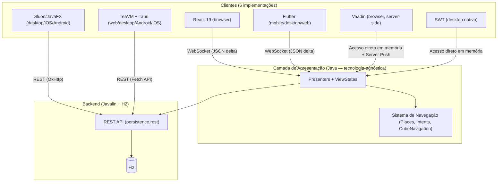
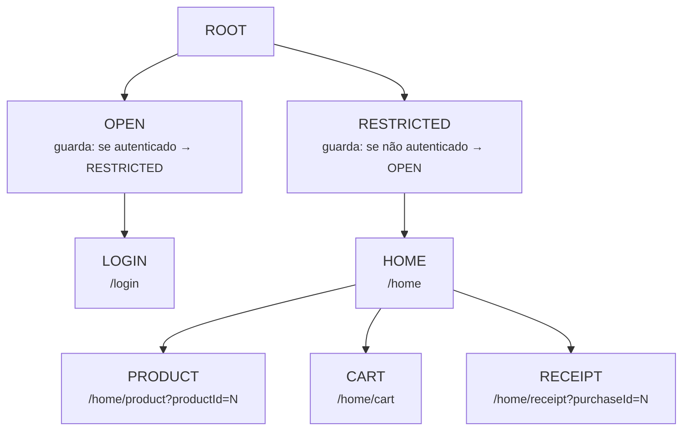
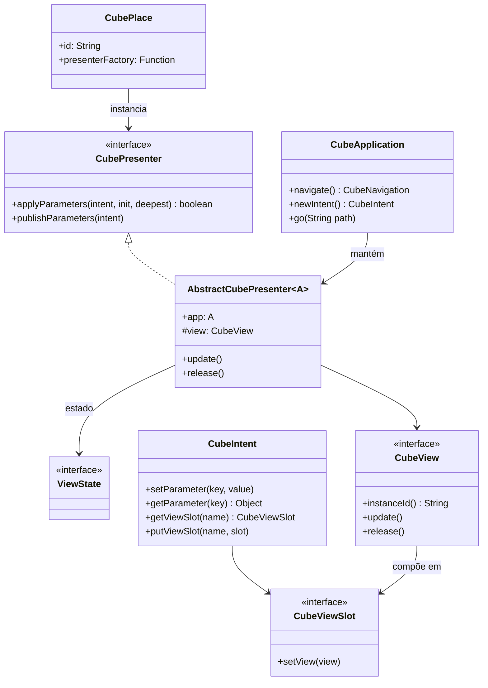
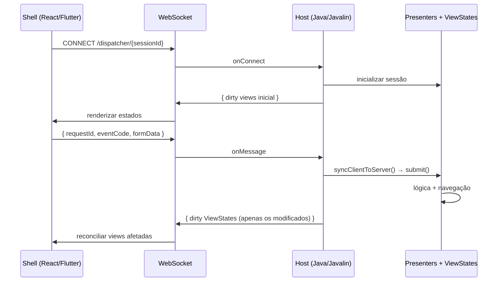

# Cube MVP — Arquitetura de Apresentação Multiplataforma em Java

[Contextualização](#contextualização)  
[Requisitos Fundamentais](#requisitos-fundamentais)  
[A Pilha Tecnológica](#a-pilha-tecnológica)  
[Java e o Sistema de Tipos](#java-e-o-sistema-de-tipos)  
[Javalin — O Servidor HTTP](#javalin-o-servidor-http)  
[Arquitetura da Aplicação de Referência](#arquitetura-da-aplicação-de-referência)  
[Perspectiva de Camadas](#perspectiva-de-camadas)  
[O Padrão Cube MVP](#o-padrão-cube-mvp)  
[Visão de Estados](#visão-de-estados)  
[Estruturas de Controle](#estruturas-de-controle)  
[Controle de Rotas — Places e Intents](#controle-de-rotas-places-e-intents)  
[Controle de Acesso — Guardas de Navegação](#controle-de-acesso-guardas-de-navegação)  
[Diagrama de Classes](#diagrama-de-classes)  
[Composições de View — Slots](#composições-de-view-slots)  
[A Camada de Visão — Seis Implementações Independentes](#a-camada-de-visão-seis-implementações-independentes)  
[Apresentação Remota — O Protocolo Host/Shell](#apresentação-remota-o-protocolo-hostshell)  
[O ViewState como Contrato de Serialização](#o-viewstate-como-contrato-de-serialização)  
[Conclusões](#conclusões)  
[Trabalhos Futuros](#trabalhos-futuros)

---

## Contextualização

Este projeto é a materialização em Java da arquitetura de Visão Passiva Hierárquica definida em 2015 ([referência](https://docs.google.com/document/d/1Rcbt3gIjdX50j2gr2zqs9VqTQVg8527h9lOUF1xrhag/edit?tab=t.0#heading=h.3wkx7ie3r9yu)). O WDC Cube Java v2 mantém a mesma lógica de apresentação — os mesmos Presenters, os mesmos ViewStates, as mesmas regras de negócio e de navegação — e a executa em seis implementações de frontend completamente independentes:

| Implementação | Tecnologia | Plataformas |
|---|---|---|
| `view.remote / remote.shell.react` | React 19 + TypeScript + MUI 9 | Web (browser) |
| `view.remote / remote.shell.flutter` | Flutter + Dart | Web, Desktop, Mobile |
| `view.vaadin` | Vaadin 24 + Java | Web (server-side push) |
| `view.swt` | Eclipse SWT + Java | Desktop nativo (Windows, Linux, macOS) |
| `view.gluon` | JavaFX + Gluon Mobile | Desktop + iOS + Android (GraalVM Native Image) |
| `view.teavm` | TeaVM + Tauri 2 + Java | Web, Desktop, Android, iOS |

O princípio central da arquitetura é que a camada de apresentação não sabe nada sobre qual tecnologia renderiza a interface. A view é um artefato plugável — uma implementação de um contrato Java que recebe estado e notifica ações.

Este artigo descreve como essa arquitetura foi consolidada, que problemas foram resolvidos, que inovações surgiram (em especial o protocolo de Apresentação Remota), e o que ainda permanece como trabalho futuro.

---

## Requisitos Fundamentais

Os requisitos a seguir orientaram as decisões arquiteturais do projeto e permitem avaliar o que foi conquistado e o que permanece desafiador.

**Lógica de navegação independente da biblioteca de View** ✅  
O sistema de navegação baseado em `CubeNavigation`, `CubePlace` e `CubeIntent` é puramente Java e não referencia nenhuma tecnologia de UI.

**Maximizar a porção de código comprometida apenas com tecnologias de vida longa** ✅  
Java existe há mais de 30 anos. A camada de apresentação — Presenters e ViewStates — reside num módulo Maven sem dependências de UI.

**Modelo de construção de software independente do ambiente de execução** ✅  
A mesma lógica de apresentação compila e executa em browser (React, TeaVM, Vaadin), desktop (SWT, Gluon, TeaVM/Tauri) e mobile (Gluon/GraalVM, Flutter, TeaVM/Tauri).

**Representação consistente do estado na URL do navegador** ✅  
O sistema de navegação serializa o estado ativo em query-string. O protocolo de Apresentação Remota sincroniza o hash da URL entre shell e host.

**Restabelecimento preciso do estado após F5** ✅  
Cada implementação reconstrói o estado a partir da URL no ciclo de `applyParameters`. O modo Remoto usa o `sessionId` para reconectar à sessão server-side.

**Testar todos os fluxos de navegação via views mock** ✅  
As factories de view (`Presenter.createView`) são referências estáticas substituíveis. Nos testes, basta apontar para implementações mock antes de executar a navegação.

**Mais de uma implementação para a mesma visão** ✅  
Esse é hoje o principal ponto de validação da arquitetura: seis implementações coexistindo sobre os mesmos Presenters.

**Contratos e sistemas de tipos para rastreabilidade** ✅  
Java oferece verificação estática em tempo de compilação. O campo `public static Function<XxxPresenter, CubeView> createView` garante que cada implementação de view receba o tipo correto de Presenter.

**Gestão do escopo de propagação do estado nas composições** ✅  
Slots (`CubeViewSlot`) são lambdas que encapsulam a atribuição de uma view a um ponto de composição específico, sem expor o Presenter pai.

**Composição de Views independente da tecnologia** ✅  
O conceito de slot é tecnologia-agnóstico. Cada implementação de view trata o slot à sua maneira.

**Manutenção da complexidade sob controle** ✅  
A hierarquia de Presenters divide responsabilidades. Cada Presenter trata de um fragmento do estado total da aplicação.

---

## A Pilha Tecnológica

A pilha tecnológica do lado servidor — onde a lógica vive — é deliberadamente minimalista:

| Categoria | Tecnologia | Versão |
|---|---|---|
| Linguagem | Java (Temurin/Microsoft) | 21 |
| Build | Maven | 3.9+ |
| Servidor HTTP | Javalin | 7.2.0 |
| Banco de dados | H2 | 2.4.240 |
| Acesso a dados | jOOQ | 3.19.16 |
| Serialização | Gson | 2.13.2 |
| Logging | SLF4J + Logback | 2.0.16 / 1.5.32 |
| Testes | JUnit | 4.13.2 |

Notavelmente ausente desta lista está qualquer framework de injeção de dependências (Spring, CDI, Guice). A injeção é feita via `AtomicReference<T>` estático — um service locator simples e transparente. Essa escolha elimina uma camada de mágica que, nas aplicações do ecossistema Spring, normalmente obscurece o fluxo de execução e dificulta a instrumentação das fábricas de view.

### Java e o Sistema de Tipos

Java oferece um sistema de tipos estático robusto com suporte nativo de ferramentas (refatoração global, rastreabilidade de símbolos, navegação por código). A verificação em tempo de compilação elimina uma classe inteira de erros de integração entre Presenter e View — se o tipo de Presenter esperado pela implementação de view não bate com o declarado pelo sistema, o compilador recusa o build.

### Javalin — O Servidor HTTP

Javalin é um framework HTTP leve para Java/Kotlin. No projeto, serve dois papéis distintos:

1. **API REST** (`persistence.rest`) — expõe os repositórios de domínio para consumo pelo módulo `persistence.client`, usado pelas implementações de view client-side (TeaVM, Gluon).
2. **WebSocket** (`view.remote / remote.host`) — canal bidirecional do protocolo de Apresentação Remota. Cada conexão WebSocket é tratada por uma Virtual Thread (Java 21), permitindo escalar para milhares de sessões simultâneas sem overhead de threading tradicional.

---

## Arquitetura da Aplicação de Referência

A aplicação de referência é um sistema de e-commerce simplificado: **WeDoCode Shopping**. É deliberadamente funcional — permite login, navegação por catálogo de produtos, carrinho e geração de recibos — mas mantida pequena o suficiente para que a arquitetura seja o foco, não a complexidade de negócio.

Os módulos estão organizados em dois grupos:

**Framework** — biblioteca genérica e reutilizável:

| Módulo | Responsabilidade |
|---|---|
| `framework.commons` | Interfaces funcionais com checked exceptions, serialização extensível, abstração SQL, criptografia (RSA, Base62), logging multiplataforma |
| `framework.cube` | Motor do Cube MVP: presenters, views, navegação, intents, slots |
| `framework.cube.remote` | Protocolo de Apresentação Remota: serialização de ViewStates, dispatcher WebSocket, bridges para React/Flutter/TeaVM |
| `framework.jooq` | Suporte jOOQ: `JooqDSLContext`, helpers de query JSON (`JsonQuery`, `JsonQueryBuilder`, `JsonChildQueryBuilder`) |
| `framework.dependencies` | BOM Maven para versões centralizadas |

**Shopping** — a aplicação em si:

| Módulo | Responsabilidade |
|---|---|
| `shopping.domain` | Modelos de domínio, repositórios, critérios de consulta |
| `shopping.persistence` | H2 + jOOQ (classes geradas) |
| `shopping.persistence.rest` | REST controllers (Javalin) |
| `shopping.persistence.client` | REST client (OkHttp + Gson) |
| `shopping.presentation` | Presenters, ViewStates, navegação — **tecnologia-agnóstico** |
| `shopping.view.*` | Seis implementações de frontend |

---

## Perspectiva de Camadas



A separação é estrutural, não apenas conceitual: o módulo `shopping.presentation` não possui dependências de nenhuma tecnologia de UI. Ele depende apenas de `framework.cube`, `shopping.domain` e `slf4j-api`. Qualquer tecnologia capaz de implementar a interface `CubeView` pode ser plugada.

---

## O Padrão Cube MVP

O Cube MVP é uma variação do Passive View com dois princípios centrais:

1. **A View tem acesso ao ViewState, mas não ao Presenter.** O ViewState é um objeto Java simples com campos públicos — o estado público da tela. O Presenter é responsável por nutrir o ViewState antes de sinalizar `update()`.

2. **Nenhuma consulta cruzada entre Presenter e View.** O Presenter notifica a View via `view.update()`. A View notifica o Presenter via chamadas diretas de método (os handlers `onXxx`). Não há retorno de valores nessas comunicações.

O nome "Cube" reflete a terceira dimensão da arquitetura: além do eixo Presenter/View, há o eixo da **hierarquia** — Presenters são compostos em árvore, cada nó responsável por uma porção do estado total da aplicação.

### O Presenter

Todo Presenter navegável estende `AbstractCubePresenter<ShoppingApplication>` e define seu ViewState como classe interna estática:

```java
public class CartPresenter extends AbstractCubePresenter<ShoppingApplication> {

    // Factory de view — substituível (testes, implementações alternativas)
    public static Function<CartPresenter, CubeView> createView;

    // ViewState — estado público, lido pela view para renderização
    public static class CartViewState implements ViewState {
        public List<CartItem> items;
        public int errorCode;
        public String errorMessage;
    }

    public final CartViewState state = new CartViewState();

    private CubeViewSlot ownerSlot;

    public CartPresenter(ShoppingApplication app) {
        super(app);
        this.state.items = Collections.emptyList();
    }

    // Chamado pelo motor de navegação ao ativar este Presenter
    @Override
    public boolean applyParameters(CubeIntent intent, boolean initialization, boolean deepest) {
        this.state.items = this.app.getCart().getCartItems();

        if (initialization) {
            this.ownerSlot = intent.getViewSlot(PlaceAttributes.SLOT_OWNER);
            this.view = createView.apply(this);
        }

        this.ownerSlot.setView(this.view);
        this.update();
        return true;
    }

    // Ação do usuário — chamada diretamente pela View
    public void onConfirm() {
        // lógica de negócio...
        this.update();
    }
}
```

O campo estático `createView` é um `Function<CartPresenter, CubeView>`. Cada implementação de view registra sua factory neste campo durante a inicialização da aplicação. Ao criar uma instância do Presenter, a factory é invocada — sem que o Presenter saiba qual tecnologia de UI está sendo usada.

Há dois tipos de Presenter no projeto:

| Tipo | Classe base | Ciclo de vida |
|---|---|---|
| **Navegável** | `AbstractCubePresenter<A>` | Gerenciado pelo motor de navegação (`applyParameters`, `release`) |
| **Filho (painel)** | `AbstractChildPresenter<A>` | Gerenciado manualmente pelo Presenter pai (`initialize()`, `release()`) |

O segundo tipo é usado para painéis embutidos — como `ProductsPanelPresenter` e `PurchasesPanelPresenter`, que vivem dentro de `HomePresenter` e não são endereçáveis diretamente pela navegação.

---

## Visão de Estados

A aplicação de referência possui 8 *places* organizados em 4 níveis hierárquicos:



Os estados são aditivos. O estado `/home/product?productId=42` implica a ativação encadeada de `RootPresenter → RestrictedPresenter → HomePresenter → ProductPresenter`. Cada Presenter na cadeia recebe a URL e extrai os parâmetros que lhe cabem.

A parte dinâmica da URL — os parâmetros de query-string — é encapsulada em `CubeIntent`:

```java
// Navegar para o detalhe do produto 42
var intent = app.newIntent();
intent.setParameter(PlaceParameters.PRODUCT_ID, 42L);
Routes.product(app, intent);
```

A classe `Routes` centraliza as composições de navegação, tornando todos os destinos possíveis rastreáveis estaticamente:

```java
public class Routes {
    public static void product(ShoppingApplication app, CubeIntent intent) {
        app.navigate()
           .step(Places.ROOT)
           .step(Places.RESTRICTED)
           .step(Places.HOME)
           .step(Places.PRODUCT)
           .execute(intent);
    }
}
```

---

## Estruturas de Controle

### Controle de Rotas — Places e Intents

O motor de navegação `CubeNavigation` executa transições entre states da seguinte forma:

1. Para cada `CubePlace` na cadeia solicitada, verifica se já existe uma instância do Presenter correspondente.  
2. Se não existe, instancia via `CubePlace.presenterFactory()`.  
3. Invoca `applyParameters(intent, initialization, deepest)` em cada Presenter da cadeia, na ordem da hierarquia.  
4. Invoca `release()` nos Presenters que não fazem mais parte do state ativo, na ordem inversa (do mais profundo para o mais raso).  
5. Invoca `commitComputedState()` em todos — oportunidade para sincronizar estados derivados.  
6. Propaga `update()` às views afetadas.

Ao navegar de `/home/product?productId=5` para `/home/cart`, a sequência é:

- `applyParameters` invocado para `Root`, `Restricted`, `Home`, `Cart`  
- `release()` invocado para `Product`  

Presenters compartilhados entre o state anterior e o novo não são recriados — apenas notificados com `applyParameters(intent, false, ...)`.

### Controle de Acesso — Guardas de Navegação

`OpenPresenter` e `RestrictedPresenter` funcionam como guardas. Cada um verifica uma condição no início do `applyParameters` e, se não satisfeita, redireciona para outro state:

```java
@Override
public boolean applyParameters(CubeIntent intent, boolean initialization, boolean deepest) {
    if (this.app.getSubject() != null) {
        // Usuário já autenticado — redirecionar para área restrita
        Routes.restricted(this.app, this.app.newIntent());
        return false;
    }
    // Continuar navegação normal...
    return true;
}
```

O retorno `false` interrompe a cadeia de navegação — os Presenters mais profundos não são ativados.

---

## Diagrama de Classes



A aplicação é um grafo de instâncias de `AbstractCubePresenter`. Cada instância conhece seu ViewState (o campo `state`) e sua View (o campo `view`). A relação entre Presenter e View passa exclusivamente pela interface `CubeView` — nenhuma implementação de view é referenciada diretamente pelo Presenter.

---

## Composições de View — Slots

Um slot é um ponto de composição declarado pelo Presenter pai, que permite que um Presenter filho se encaixe na árvore de views sem que haja acoplamento direto entre eles.

```java
// HomePresenter declara um slot de conteúdo
private final CubeViewSlot contentSlot = this::setContentView;

private void setContentView(CubeView view) {
    if (this.state.contentView != view) {
        this.state.contentView = view;
        this.update();
    }
}
```

O slot `contentSlot` é registrado no `CubeIntent` antes de seguir para o Presenter filho:

```java
@Override
public boolean applyParameters(CubeIntent intent, boolean initialization, boolean deepest) {
    // ...
    if (!deepest) {
        // Propagar slot para o Presenter filho
        intent.putViewSlot(PlaceAttributes.SLOT_OWNER, this.contentSlot);
    }
    return true;
}
```

O Presenter filho recebe o slot e o usa para se encaixar:

```java
// ProductPresenter recebe o slot
this.ownerSlot = intent.getViewSlot(PlaceAttributes.SLOT_OWNER);
this.ownerSlot.setView(this.view);
```

A view pai simplesmente renderiza `state.contentView` — seja lá qual for a view filha que o Presenter filho colocou ali. Essa mecânica funciona idêntica em todas as seis implementações de view.

---

## A Camada de Visão — Seis Implementações Independentes

### A Interface CubeView

Toda implementação de view implementa `CubeView`:

```java
public interface CubeView {
    String instanceId();  // identificador único — usado no protocolo remoto
    void update();        // Presenter notifica que o estado mudou
    void release();       // ciclo de vida encerrado
}
```

### O Ciclo de Vida de uma View

1. O Presenter chama `createView.apply(this)` — a factory registrada instancia a view e passa a si mesmo como argumento.  
2. A view armazena a referência ao Presenter e ao ViewState.  
3. Quando `update()` é chamado, a view lê os campos do ViewState e reconcilia a interface.  
4. Quando o usuário interage, a view chama diretamente o método `onXxx` no Presenter.  
5. Quando `release()` é chamado, a view libera recursos.

### As Implementações

**view.swt** — Implementação nativa para desktop com Eclipse SWT (Windows, Linux, macOS). Cada view estende `AbstractViewSwt` e usa a DSL declarativa `SwtDom` para construir composições. O ciclo de atualização usa `Display.asyncExec()` para garantir execução na thread de eventos:

```java
public class CartViewSwt extends AbstractViewSwt<CartPresenter> {
    @Override
    protected void performUpdate() {
        var state = this.presenter.state;
        this.itemList.setItems(state.items.stream()
            .map(item -> item.name + " × " + item.quantity)
            .toArray(String[]::new));
    }
}
```

**view.vaadin** — Implementação para browser via Vaadin Flow (server-side push). O Vaadin gerencia o transporte Atmosphere (WebSocket/Long Polling) e a reconciliação de componentes no DOM. A view usa `ui.access()` para garantir thread-safety nas atualizações:

```java
public class CartViewVaadin extends AbstractViewVaadin<CartPresenter> {
    @Override
    protected void doUpdate() {
        var state = this.presenter.state;
        this.grid.setItems(state.items);
    }
}
```

**view.teavm** — As views Java são compiladas para JavaScript pelo plugin TeaVM. No browser, o resultado é um SPA completo. Para desktop, Android e iOS, o SPA é empacotado num WebView via Tauri 2 (Rust). As views estendem `AbstractVDomView` e implementam `render()` retornando uma árvore `VNode`:

```java
public class CartViewVDom extends AbstractVDomView<CartPresenter> {
    @Override
    protected VNode render() {
        var state = this.presenter.state;
        return div(Css.CART).children(
            ul().children(state.items.stream()
                .map(item -> li().text(item.name + " × " + item.quantity))
                .toArray(VNode[]::new)),
            spButton("accent").on("click", onConfirm).children(
                span().text("Confirmar"))
        );
    }
    private final JSFunction onConfirm = e -> this.presenter.onConfirm();
}
```

**view.gluon** — JavaFX com Gluon Mobile, compilado para binário nativo via GraalVM Native Image para iOS e Android. A view usa FXML ou API fluente JavaFX.

**view.remote / remote.shell.react** — Shell React em TypeScript. A view é um componente funcional que renderiza o estado recebido via WebSocket e emite eventos de volta:

```tsx
const CartView: React.FC<{ scope: ViewScope<CartViewState> }> = ({ scope }) => {
  const state = scope.useSnapshot();
  return (
    <Stack>
      {state.items.map(item => (
        <Typography key={item.id}>{item.name} × {item.quantity}</Typography>
      ))}
      <Button onClick={() => scope.submit(EventCodes.CONFIRM)}>Confirmar</Button>
    </Stack>
  );
};
```

**view.remote / remote.shell.flutter** — Shell Flutter em Dart. O mesmo protocolo WebSocket, mas com widgets Flutter para renderização:

```dart
class CartViewWidget extends StatelessWidget {
  final ViewScope<CartViewState> scope;
  const CartViewWidget({required this.scope});

  @override
  Widget build(BuildContext context) {
    final state = scope.watch(context);
    return Column(children: [
      ...state.items.map((item) => Text('${item.name} × ${item.quantity}')),
      ElevatedButton(
        onPressed: () => scope.submit(EventCodes.confirm),
        child: const Text('Confirmar'),
      ),
    ]);
  }
}
```

---

## Apresentação Remota — O Protocolo Host/Shell

O protocolo de Apresentação Remota transfere estado e recebe eventos, tornando o cliente um thin shell sem lógica de negócio.

### Analogia com Remote Desktop

O protocolo é análogo a um Remote Desktop, mas operando na camada de dados da aplicação em vez de pixels. O servidor mantém toda a lógica — Presenters, ViewStates, regras de negócio, navegação. O cliente renderiza estados serializados e envia eventos de interação de volta.



### Segurança do Canal

O protocolo implementa criptografia de sessão em duas camadas:

1. **Handshake RSA**: no início da sessão, o shell gera uma chave AES-256 efêmera, encripta com a chave pública RSA do servidor e envia via cookie `app_signature`. O servidor decripta e deriva a chave de sessão via PBKDF2 (salt + 250.000 iterações).  
2. **Tráfego AES-GCM**: após o handshake, todos os payloads são cifrados com a chave AES-256 de sessão.

Adicionalmente, a URL da sessão é assinada com HMAC-SHA256, impedindo que um cliente forje navegações para estados que não lhe foram concedidos.

### Serialização Delta de ViewStates

Uma propriedade crucial do protocolo é que apenas os ViewStates que mudaram (*dirty*) são enviados a cada ciclo. Isso é possível porque o Presenter marca explicitamente sua view como dirty ao chamar `app.markDirty(view)`. O host coleta apenas as views marcadas, serializa seus ViewStates para JSON e transmite o delta.

O ViewState é serializado pelo `ViewStateSerializer` do framework, que inspeciona os campos `public` por reflection:

```json
{
  "#": "cart:0",
  "items": [
    { "id": 1, "name": "Produto A", "price": 49.90, "quantity": 2 }
  ],
  "errorCode": 0,
  "errorMessage": null
}
```

O campo `"#"` é o `instanceId` que vincula o estado JSON à instância de view correspondente no shell.

### Virtual Threads para Escalabilidade

Cada sessão WebSocket é gerenciada por uma Virtual Thread (Java 21). Diferente de threads de plataforma, Virtual Threads são leves o suficiente para alocar uma por sessão ativa — o servidor pode manter milhares de sessões simultâneas sem o overhead de thread pools tradicionais.

---

## O ViewState como Contrato de Serialização

Além de ser o estado público lido pela view para renderização, o `ViewState` serve como contrato de serialização para o modo remoto.

A interface `ViewState` é puramente marcadora — sem métodos. A serialização é feita exclusivamente pelo `ViewStateSerializer` do framework:

- Itera todos os campos `public` do ViewState via reflection
- Pula campos `static` e `transient`
- Injeta `"#": instanceId` como primeiro campo do objeto JSON
- Serializa campos `CubeView`/`ViewState` como `"<nome>Id": vsid` (referência por ID)
- Suporta primitivos, `String`, coleções, `Map`, `Record` e POJOs com campos públicos

O `ViewState` em si nunca implementa lógica de serialização — isso é responsabilidade do framework, não do código de aplicação.

---

## Conclusões

O modelo arquitetural provou-se robusto ao longo de uma década de evolução tecnológica significativa — e mais importante, expandiu-se para domínios que inicialmente eram trabalho futuro.

Os princípios que se mostraram mais duradouros:

**A hierarquia de Presenters como unidade de modularidade.** A divisão do estado da aplicação em Presenters hierárquicos mantém a complexidade localizada. Adicionar um novo módulo significa criar um novo Presenter, registrá-lo em `Routes` e implementar uma view em cada tecnologia de interesse — sem tocar no restante da aplicação.

**O ViewState como fronteira entre lógica e apresentação.** O ViewState é simultaneamente simples (campos públicos Java) e poderoso (serialização automática, diff incremental no modo remoto). Ele resolve o problema de transferência de dados sem criar objetos de transferência de valor separados — o mesmo objeto serve ao Presenter para nutrir a view e ao protocolo remoto para transmitir o estado.

**O slot como mecanismo de composição sem acoplamento.** O slot isola o Presenter pai do filho. O pai não sabe qual tipo de Presenter filho estará no slot — apenas que receberá uma `CubeView`. O filho não sabe em que parte da tela pai ele estará.

**A factory de view como ponto de extensão.** O campo estático `Function<XxxPresenter, CubeView> createView` é o único ponto de variabilidade entre implementações de view. Basta registrar uma nova factory para trocar toda a camada de UI.

O **modo de Apresentação Remota** é a inovação central: ele demonstra que a separação entre lógica de apresentação e renderização não é apenas uma boa prática arquitetural — é uma propriedade física da arquitetura. O Presenter genuinamente não sabe onde a view roda: pode ser um processo local na mesma JVM, pode ser um browser a milhares de quilômetros de distância, ou um dispositivo móvel conectado via WebSocket.

A escolha do Java foi determinante. O sistema de tipos estático elimina uma classe inteira de erros de integração e torna o código mais rastreável. A plataforma JVM, com Virtual Threads, permite escalar o modo remoto a um custo computacional viável. O compilador Maven reproduz resultados determinísticos. E a longevidade da linguagem garante que o código escrito hoje ainda será compreensível em 2036.

---

## Trabalhos Futuros

- **Carga dinâmica de módulos**: a arquitetura suporta o conceito, mas não há implementação de referência para lazy loading de módulos Java no modo remoto.  
- **Rascunhos persistentes**: a instância da aplicação no backend pode ser descartada por diversos motivos — reinício do servidor, fechamento e reabertura da página, expiração de sessão. Ao retomar, o Presenter poderia usar um identificador presente na URL para buscar em storage externo (banco de dados, Redis, etc.) os dados de rascunho previamente salvos. Para o usuário, seria imperceptível que se trata de uma nova instância de aplicação no backend — o estado do formulário estaria preservado exatamente como foi deixado.  
- **Portabilidade do modo remoto para outros ambientes**: o protocolo host/shell está documentado o suficiente para ser implementado em Swift (iOS nativo) ou Kotlin (Android nativo) sem Flutter.  
- **Testes de integração end-to-end do protocolo remoto**: hoje os fluxos de navegação são testados via views mock. Seria valioso adicionar testes que exercitem o ciclo completo — WebSocket → Presenter → ViewState serializado → deserialização no shell.
