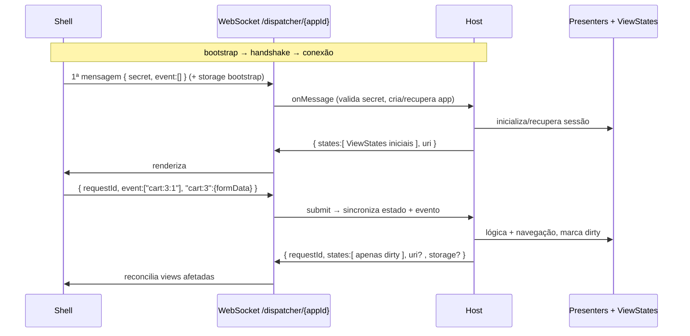

# Especificação do Protocolo Bridge/Skeleton — Apresentação Remota (Host/Shell)

> **Status:** normativo. Esta é a fonte de verdade do protocolo usado pelos clientes *thin* (navegador web, aplicativos desktop e aplicativos móveis) que acessam remotamente a camada de apresentação no servidor.
>
> **Objetivo do documento:** capturar todos os detalhes de nível de fio (wire-level) — identidade, segurança, autoridade sobre ViewStates, storage de página e de site, ciclo de vida da conexão, fluxo de refresh — de modo que o protocolo possa ser reimplementado fielmente em **qualquer** tecnologia, tanto no cliente quanto no servidor, em qualquer plataforma.
>
> A especificação é **independente de linguagem e de biblioteca de UI**: descreve o contrato de fio e o comportamento observável, não uma implementação. Onde ela mencionar plataformas (navegador, desktop, móvel), é porque o protocolo foi projetado com requisitos dessas plataformas em mente. As implementações de referência (host e shells de cliente) residem neste repositório sob os módulos de apresentação remota; onde este documento divergir delas, **as implementações prevalecem** — reporte a divergência.

## Sumário

1. [Modelo conceitual e papéis](#1-modelo-conceitual-e-papéis)
2. [Terminologia e identificadores](#2-terminologia-e-identificadores)
3. [Identidade da sessão — o `appId`](#3-identidade-da-sessão--o-appid)
4. [Material criptográfico do servidor](#4-material-criptográfico-do-servidor)
5. [Modos de entrada (bootstrap da sessão)](#5-modos-de-entrada-bootstrap-da-sessão)
6. [Handshake de segurança — derivação do `secret`](#6-handshake-de-segurança--derivação-do-secret)
7. [Canal WebSocket — ciclo de vida](#7-canal-websocket--ciclo-de-vida)
8. [Formato das mensagens — cliente → servidor](#8-formato-das-mensagens--cliente--servidor)
9. [Formato das mensagens — servidor → cliente](#9-formato-das-mensagens--servidor--cliente)
10. [Códigos de evento e códigos de fechamento](#10-códigos-de-evento-e-códigos-de-fechamento)
11. [Serialização de ViewState](#11-serialização-de-viewstate)
12. [Autoridade sobre ViewStates e coleta de lixo de views](#12-autoridade-sobre-viewstates-e-coleta-de-lixo-de-views)
13. [Navegação e assinatura de URL](#13-navegação-e-assinatura-de-url)
14. [Storage do cliente — página e site](#14-storage-do-cliente--página-e-site)
15. [Fluxo de refresh (F5) e reconexão](#15-fluxo-de-refresh-f5-e-reconexão)
16. [Keep-alive, timeouts, capacidade e intervalos](#16-keep-alive-timeouts-capacidade-e-intervalos)
17. [Notas de portabilidade entre plataformas](#17-notas-de-portabilidade-entre-plataformas)
18. [Apêndice — tabela literal de constantes](#18-apêndice--tabela-literal-de-constantes)

---

## 1. Modelo conceitual e papéis

O protocolo é análogo a um **Remote Desktop operando na camada de dados da aplicação**, e não em pixels. Toda a lógica — Presenters, ViewStates, regras de negócio, navegação — vive no **Host** (servidor). O **Shell** (cliente) é *thin*: apenas renderiza estados serializados e devolve eventos de interação.

| Papel | Responsabilidade |
|---|---|
| **Host** | Mantém a árvore de Presenters/ViewStates, processa eventos, executa navegação, serializa deltas de estado, é a **autoridade** sobre quais views existem. |
| **Shell** | Estabelece a sessão, faz o handshake criptográfico, renderiza ViewStates, emite eventos do usuário, mantém storage local, reconecta após queda. |
| **Bridge** | A camada de código, em ambos os lados, que fala este protocolo. No cliente, é desejável um núcleo reutilizável entre plataformas de UI. |

**Invariantes fundamentais:**

- O Shell **nunca** contém lógica de negócio nem regras de navegação. Ele não decide para onde navegar; ele **pede** e o Host decide.
- Todo estado renderizável é um **ViewState** identificado por um `instanceId` (vsid). O Host envia apenas os ViewStates *dirty* (delta).
- O Host é a **única** autoridade sobre a existência e a identidade das views. O Shell nunca inventa vsids.
- Uma view especial e fixa, a **Browser View** (vsid `7b32e816a191:0`), é a raiz do shell e o canal por onde trafegam navegação, alertas e keep-alive. (O nome "Browser" designa a view-raiz que "navega" entre lugares; não se refere a navegador web.)



---

## 2. Terminologia e identificadores

| Termo | Definição |
|---|---|
| **`appId`** | Identificador da sessão. Formato assinado `parte1.parte2` (ver §3). Vai no path do WebSocket: `/dispatcher/{appId}`. |
| **`appSKey`** | Chave pública RSA do servidor para o handshake, no formato string `"expoente:modulo"` em **base36**. |
| **`vsid` (View State ID / instanceId)** | Identidade de uma instância de view. Formato `"<classId>:<n>"`, ex.: `cart:3`, `7b32e816a191:0`. `classId` pode ser um nome ou um hash hex. `n` é o número da instância. |
| **`classId`** | Identidade da *classe* da view. É o `parts[0]` do vsid. |
| **`secret`** | Assinatura de sessão que carrega o material do handshake AES-GCM. Formato de 3 partes: `<rsa(pwd) base36>.<salt base64url>.<iv base64url>`. |
| **Browser View** | View-raiz singleton do shell. `classId = 7b32e816a191`, vsid fixo `7b32e816a191:0`. |
| **`p.path`** | Campo de formData que carrega a rota (query-path da aplicação) nos eventos de navegação. |
| **`"#"`** | Campo reservado dentro de cada objeto de ViewState serializado, cujo valor é o vsid daquele estado. |

**Regra de parsing do vsid dentro de um evento:** um item de `event` tem o formato `"<vsid>:<eventCode>"`. Como o próprio `vsid` contém `:`, o parsing usa o **último** `:` como separador: tudo antes é o vsid, o inteiro depois é o `eventCode`. Ex.: `"7b32e816a191:0:-1"` → vsid `7b32e816a191:0`, eventCode `-1`.

---

## 3. Identidade da sessão — o `appId`

O `appId` é auto-verificável (contém um checksum assinado), de modo que o servidor detecta forja sem consultar armazenamento.

**Formação (servidor):**

```
parte1 = base62( 32 bytes aleatórios de gerador criptográfico )
parte2 = base62( signAsHash( bytes_utf8(parte1) ) )
appId  = parte1 + "." + parte2
```

Onde `signAsHash(bytes)` = `MD5( assinaturaRSA-SHA256( bytes, chavePrivadaDeAssinatura ) )` — a assinatura é reduzida por MD5 a um hash curto (ver §4).

**Validação (servidor, no `onConnect` do WebSocket):**

1. O `appId` do path deve ser não-vazio.
2. Split por `.` (codec Base62) → deve produzir **exatamente 2** partes; senão → fecha com código `4001 reload_required`.
3. Recalcula `esperado = base62(signAsHash(bytes_utf8(parte1)))` e compara com `parte2`. Divergência → `4001 reload_required`.

Isso impede que um cliente forje um `appId` arbitrário: sem a chave privada de assinatura do servidor, não é possível produzir uma `parte2` válida para uma `parte1` escolhida.

---

## 4. Material criptográfico do servidor

O servidor mantém **dois pares de chaves RSA distintos**, com propósitos separados. Ambos são gerados no primeiro boot (512 bits nas defaults de desenvolvimento) e persistidos numa configuração local; **devem ser substituídos em produção**.

| Par | Formato | Uso |
|---|---|---|
| **Handshake RSA** | `"expoente:modulo"` em **base36** | Cliente cifra a senha AES efêmera com a **pública**; servidor decifra com a **privada**. RSA *textbook* via exponenciação modular (`m^e mod n`), **sem** padding OAEP/PKCS#1. |
| **Assinatura RSA** | DER **Base64 URL-safe** (X.509 *SubjectPublicKeyInfo* para a pública, PKCS#8 para a privada) | Assinar/verificar o `appId` (parte2) e o fragmento de URL (navegação). |

Constantes de assinatura:
- Algoritmo: assinatura **RSA sobre SHA-256** (RSASSA-PKCS1-v1_5).
- `sign(bytes)` → assinatura RSA crua.
- `signAsHash(bytes)` → `MD5( assinaturaRSA-SHA256(bytes) )` — hash curto usado para `appId.parte2` e para a assinatura do fragmento de URL.
- `isSignatureValid(bytes, sig)` → verificação com a chave pública de assinatura.

A **chave pública de handshake** (`appSKey` = `"expoente:modulo"` base36) é entregue ao cliente (via cookie `app_skey` ou campo `appSKey` do endpoint de init) para que ele cifre a senha AES no handshake.

---

## 5. Modos de entrada (bootstrap da sessão)

Existem **dois modos** de obter `appId` + `appSKey`. Ambos convergem para o mesmo protocolo WebSocket. Um cliente deve suportar pelo menos um deles.

### 5.1 Modo navegador (cookies plantados pela página)

Para clientes que carregam uma página HTML servida pelo Host. Antes de servir `/{ctx}/index.html`, o servidor (handler `before`) planta cookies:

| Cookie | Valor | MaxAge | Observações |
|---|---|---|---|
| `app_id` | `appId` (§3) | `10` (segundos) | Identidade da sessão, curta duração. |
| `app_skey` | `appSKey` (`"expoente:modulo"` base36) | `-1` (cookie de sessão) | Chave pública de handshake. |

Cabeçalhos anti-cache: `Cache-Control: no-cache, no-store`, `Pragma: no-cache`, `Expires: 0`.

O atributo `Secure` do cookie só é setado quando a requisição é HTTPS (header `X-Forwarded-Proto == "https"` atrás de proxy, ou esquema `https`). **Requisito de plataforma:** em HTTP puro, navegadores (ex.: Firefox) rejeitam cookies `Secure`, o que faria a sessão cair em loop `4001`/reload (sem `app_id`, o handshake do WebSocket não valida). Por isso o `Secure` é condicional ao transporte real ser HTTPS.

O cliente lê os cookies, **remove-os** (path `/`), e escreve de volta o cookie `app_signature` (a assinatura do handshake — §6) para que ele acompanhe o handshake do WebSocket (a conexão WS é aberta com envio de credenciais/cookies habilitado).

### 5.2 Modo init explícito (`GET /api/session/init`)

Para clientes que não têm cookies de página (tipicamente aplicativos desktop e móveis). Endpoint:

```
GET /api/session/init          (e também GET /{ctx}/api/session/init)
```

Cabeçalhos anti-cache idênticos. Respostas:

- **Capacidade atingida:** HTTP `503` com corpo `{"error":"capacity_exceeded"}`.
- **OK:** HTTP `200`, `Content-Type: application/json`, corpo:

```json
{ "appId": "<appId>", "appSKey": "<expoente:modulo em base36>" }
```

Nenhum cookie ou header de autenticação é exigido nesta chamada. O cliente então abre o WebSocket e envia o `secret` na **primeira mensagem** (ver §6/§8), já que não há cookie `app_signature`.

---

## 6. Handshake de segurança — derivação do `secret`

O handshake estabelece uma chave AES-256-GCM de sessão. Executa-se **inteiramente no cliente**; o servidor reconstrói a mesma chave a partir do `secret`.

### 6.1 Passos no cliente

1. **Senha efêmera:** 12 bytes aleatórios → **Base64 URL-safe sem padding** → string `pwd`.
2. **Salt:** 16 bytes aleatórios. **IV:** 12 bytes aleatórios (nonce GCM).
3. **Derivação da chave AES-256:**
   ```
   aesKey = PBKDF2( PRF=HMAC-SHA256, senha=bytes_utf8(pwd), salt=salt,
                    iterações=250000, tamanho=256 bits )
   ```
   > Nota: o input do PBKDF2 é a sequência de **bytes UTF-8** da string `pwd` (que é ASCII base64url). Implementações que derivam a partir de caracteres devem garantir a codificação equivalente.
4. **Cifra RSA da senha** (RSA *textbook*):
   ```
   m           = inteiro positivo a partir de  bytes_utf8( Base64_padrão( bytes_utf8(pwd) ) )
   encrypted   = m ^ expoentePublico  mod  moduloPublico
   encBase36   = base36(encrypted)
   ```
   Isto é, a senha é **re-codificada em Base64 padrão** (com padding), vira bytes UTF-8, é interpretada como inteiro positivo e cifrada por exponenciação modular. Resultado em **base36**.
5. **Montagem do `secret`:**
   ```
   secret = encBase36 + "." + base64url_semPad(salt) + "." + base64url_semPad(iv)
   ```

Essa string é: o cookie `app_signature` (modo navegador) **e/ou** o campo `secret` da primeira mensagem WebSocket (ambos os modos).

### 6.2 Reconstrução no servidor

Ao receber o `secret`, o servidor faz split por `.`:
1. `parte0` (base36) → inteiro → decifra RSA (com a privada de handshake) → bytes → decodifica Base64 → bytes da senha.
2. `parte1` → salt (Base64 URL-safe).
3. `parte2` → IV (Base64 URL-safe).

Deriva a mesma `aesKey` via PBKDF2-HMAC-SHA256, 250000 iterações, 256 bits.

### 6.3 Cifra simétrica de payload (AES-GCM)

Após o handshake, valores sensíveis do protocolo (valores de storage e `accessToken`) trafegam cifrados:

- Transform: **AES-256-GCM**, **tag de autenticação de 128 bits**.
- **IV fixo por sessão de segurança** (o mesmo IV do handshake é reutilizado em todas as operações da sessão — não há IV por mensagem no payload de protocolo).
- Codificação no fio: **Base64 padrão** (com padding). Funções conceituais: `b64Cipher(text)` / `b64Decipher(b64)`.

> **Atenção de portabilidade:** o IV é constante por sessão. Reusar `(chave, IV)` no GCM para múltiplos textos-claros distintos é uma fraqueza conhecida do modo GCM; o design aceita isso pois a confidencialidade primária vem do transporte (TLS). Uma reimplementação **deve** replicar o comportamento (mesmo IV) para interoperar, mas idealmente opere sempre sobre `wss://`/HTTPS.

### 6.4 Criptografia em navegador (contexto seguro)

**Requisito de plataforma (navegador):** a API de criptografia nativa dos navegadores normalmente só está disponível em **contexto seguro** (HTTPS ou `localhost`). Sobre HTTP puro, o cliente precisa fornecer sua própria implementação dos primitivos (PBKDF2-SHA256 250k → AES-256-GCM tag 128), com parâmetros **idênticos**, para permanecer interoperável com o servidor. Fora do navegador (apps desktop/móveis), usa-se a biblioteca criptográfica da própria plataforma.

---

## 7. Canal WebSocket — ciclo de vida

### 7.1 Endpoint

```
ws(s)://<host>/dispatcher/{appId}          (e /{ctx}/dispatcher/{appId})
```

- O esquema deriva do transporte de origem: `http→ws`, `https→wss`.
- O `appId` viaja **apenas no path**. Não há header/cookie customizado obrigatório além do cookie `app_signature` (modo navegador).
- **Subprotocolo:** o cliente pode abrir com o subprotocolo `"wdc"`; o servidor não o exige. Recomendado, não obrigatório.
- No modo navegador, a conexão é aberta com envio de credenciais/cookies habilitado, para que o cookie `app_signature` acompanhe o handshake.

### 7.2 Lado servidor — comportamento

O servidor mantém um mapa de handlers ativos por `appId`. Cada handler guarda `appId`, `appSignature`, flags de assinatura/token pendentes, a conexão atual e o identificador interno dessa conexão.

- **onConnect:**
  1. Localiza ou cria o handler da sessão.
  2. Valida o `appId` (não-vazio, casa com o path, checksum de assinatura — §3). Falha → fecha com `4001 reload_required`.
  3. Lê cookie `app_signature`: se presente → guarda como `appSignature`; se ausente → marca assinatura **pendente** (a validação fica para a 1ª mensagem, campo `secret`).
  4. Habilita pings automáticos a cada 15 s.
  5. Registra a conexão como ativa. Se a aplicação da sessão já existe → reassocia a conexão e **reinicializa a sessão para reconexão** (§15).

- **onMessage:** faz parse do JSON. Se a assinatura está pendente, extrai `secret` (obrigatório; ausente → fecha `4001`) e `accessToken` (opcional). Cria/recupera a aplicação da sessão (injetando `secret`/`accessToken` quando é criação), reassocia a conexão, estende a vida da sessão e processa a requisição (§8).

- **onClose:** desabilita os pings. Se a conexão que fecha **não** é a ativa (caso típico de F5, em que uma nova conexão substituiu a antiga) o close é **ignorado**, para não derrubar a sessão recém-reconectada. Caso contrário, desassocia a conexão; se a sessão **não** está autenticada **ou** o servidor está em modo de liberação imediata → libera a sessão. Remove o handler.

- **onError:** um erro de canal fechado (desconexão abrupta) é rotina e apenas registrado; outros erros geram aviso e um alerta de erro inesperado à sessão.

### 7.3 Lado cliente — máquina de estados

Fases:

1. **Bootstrap** — obtém `appId` + `appSKey` (§5).
2. **Handshake** — deriva `secret` (§6).
3. **Conectando** — abre o WebSocket.
4. **Conectado** — envia a 1ª mensagem, recebe o push inicial, opera.
5. **Reconectando** — em queda, aplica backoff e refaz a conexão (§15).

Um núcleo de cliente reutilizável deve oferecer, no mínimo: aguardar a próxima mensagem, ou aguardar a resposta correlacionada a um `requestId` específico — descartando mensagens intermediárias (cujos ViewStates **já foram aplicados** ao estado local antes do enfileiramento, tornando o descarte seguro). Timeout recomendado de resposta e de conexão: **10 segundos**.

---

## 8. Formato das mensagens — cliente → servidor

Toda mensagem é **um objeto JSON**. Campos reconhecidos (todos opcionais, combináveis):

| Campo | Tipo | Significado |
|---|---|---|
| `ping` | `boolean` | Keep-alive. Se `true`, o servidor estende a vida da sessão e responde o ping (§9.2); **não** processa eventos. |
| `secret` | `string` | Assinatura do handshake (§6). Obrigatório na 1ª mensagem quando não há cookie `app_signature`. Também usado para atualizar o secret. |
| `accessToken` | `string` | (Opcional) token de auto-login para clientes sem cookie. |
| `requestId` | inteiro 64 bits | Id monotônico crescente. Requests com `requestId <= lastRequestId` ou nulo são **descartados** (idempotência/dedup). |
| `event` | `string[]` | Lista de eventos, cada item `"<vsid>:<eventCode>"`. Itens repetidos são contados. |
| `"<vsid>"` | `object` | Para cada vsid presente como chave de topo, o valor é o **formData** daquela view (sincronização cliente→servidor). |
| `storage` | `object` | Bootstrap do client storage (§14), com sub-objetos `session` / `persistent` / `persistent-secure`. |

**Convenção de formData:** campos de parâmetro de método do presenter são prefixados com `p.` (ex.: `p.path`, `p.productId`, `p.password`); campos diretos vão sem prefixo. Parâmetros sensíveis (ex.: `p.password`) podem ser cifrados com `b64Cipher` antes do envio; o servidor os decifra.

### 8.1 Exemplos

**Primeira mensagem (modo init explícito) — dispara o push inicial:**
```json
{ "secret": "3f9x...z.AbC-.Xy12", "event": [] }
```
Opcionalmente com `storage` de bootstrap.

**Início / rota inicial (evento `-1` na Browser View):**
```json
{
  "requestId": 1,
  "event": ["7b32e816a191:0:-1"],
  "7b32e816a191:0": { "p.path": "/home/product?productId=42&sign=AbC123" }
}
```

**Navegação por histórico (evento `-2`):** idêntico ao anterior trocando o eventCode para `-2`.

**Submit de evento de view (ex.: confirmar carrinho, eventCode `1`):**
```json
{
  "requestId": 7,
  "event": ["cart:3:1"],
  "cart:3": { "p.quantity": 2 }
}
```

**Keep-alive:**
```json
{ "ping": true }
```

---

## 9. Formato das mensagens — servidor → cliente

### 9.1 Envelope de resposta / push de estado

Um objeto JSON. Campos (todos opcionais). O envelope **não é enviado** se estiver vazio (`{}`).

| Campo | Tipo | Significado |
|---|---|---|
| `requestId` | inteiro 64 bits | Ecoado quando a resposta corresponde a um request. **Ausente** em flush de background (push assíncrono). |
| `storage` | `object` | Delta de client storage (§14). Por escopo → por chave → valor cifrado (`b64Cipher`) ou `null` (remoção). |
| `uri` | `string` | Fragmento/hash de navegação atual (com o parâmetro `sign`). Enviado quando houve navegação ou o fragmento mudou. |
| `states` | `object[]` | Array de ViewStates *dirty* serializados. Cada objeto tem `"#"` = vsid (§11). |

**Exemplo:**
```json
{
  "requestId": 7,
  "uri": "/home/cart?sign=AbC123",
  "states": [
    { "#": "cart:3",
      "items": [ { "id": 1, "name": "Produto A", "price": 49.9, "quantity": 2 } ],
      "errorCode": 0 }
  ],
  "storage": { "persistent": { "authToken": "k8s2...==" } }
}
```

Notas:
- Antes de serializar cada view, o servidor consolida o estado derivado do presenter, sob lock.
- Campos de erro (`errorCode`, `errorMessage`) vivem **dentro** dos fields de cada ViewState, não no envelope.
- `accessToken` também pode aparecer no fluxo servidor→cliente (token cifrado AES-GCM) como mecanismo de auto-login; o cliente decifra com `b64Decipher`.

### 9.2 Envelope de ping/controle

Enviado em resposta a `{ ping: true }`. Campos condicionais:

| Campo | Tipo | Significado |
|---|---|---|
| `releasedViews` | `string[]` | vsids de views liberadas desde o último envio (GC *eager* no cliente). |
| `activeViews` | `string[]` | Snapshot de **todas** as views vivas. Enviado periodicamente (a cada ~5 min) para reconciliação/GC completo no cliente. |

---

## 10. Códigos de evento e códigos de fechamento

### 10.1 Códigos de evento da Browser View (`classId 7b32e816a191`)

| eventCode | Método | Semântica |
|---|---|---|
| `-1` | `onStart(path)` | Boot / rota inicial. Lê `p.path`, navega e reenvia todas as views. |
| `-2` | `onHistoryChanged(path)` | Mudança de histórico/hash (voltar/avançar). Lê `p.path`, navega. |
| `1` | `onAlertOk()` | Confirma/dispensa o alerta atual. |
| `2` | `onKeepAlive()` | Estende a vida da sessão. (Alternativa à mensagem `{ping:true}`.) |

Eventos de views comuns usam códigos `>= 0` definidos por cada view. eventCodes negativos são reservados ao protocolo.

### 10.2 Alertas (campos da Browser View)

O estado da Browser View pode carregar um alerta comandado pelo servidor:
- `alertMessage.id` (ou `alertId`): código do alerta; `-1` = erro inesperado; `0` = limpo (após OK).
- `alertMessage.args`: `string[]` de argumentos.

### 10.3 Códigos de fechamento do WebSocket

Usam a faixa reservada à aplicação (`4000–4999`):

| Código | Reason | Ação esperada no cliente |
|---|---|---|
| `4001` | `reload_required` | sessionId inválido/forjado, assinatura ausente/ruim, ou 1ª mensagem sem `secret`. Cliente **deve** descartar o `appId` persistido e recarregar/reiniciar para obter um novo `appId`. |
| `4003` | `capacity_exceeded` | Servidor no limite de sessões. Equivalente ao HTTP `503 {"error":"capacity_exceeded"}` do endpoint de init. |

---

## 11. Serialização de ViewState

O ViewState é o estado público de uma view, transmitido como objeto JSON. O **contrato observável** é:

- O objeto injeta `"#"` como **primeiro** campo, valor = `instanceId` (vsid).
- Campos booleanos são **sempre** presentes (mesmo `false`).
- Campos `null` (não-booleanos) são **omitidos**.
- Um campo cujo valor é uma **referência a outra view** é serializado como `"<nome>Id": <vsid da view referenciada>` — é assim que referências entre views viram ponteiros por id.
- Strings de topo são incluídas **apenas se não forem vazias/em branco** (strings em branco são omitidas nesse nível).
- Campos numéricos são sempre incluídos.
- Datas são serializadas em **ISO-8601**: data (`YYYY-MM-DD`), hora (`HH:MM:SS[.sss]`) ou data-hora com offset em **UTC**, conforme o tipo.
- Valores aninhados (dentro de objetos e arrays): objetos → objeto JSON; listas → array JSON; escalares → valores diretos; referências a view aninhadas aparecem como o vsid puro (string, sem sufixo `Id`); strings aninhadas **não** são filtradas por vazio.
- Campos marcados como não-serializáveis ou derivados/temporários **não** aparecem no fio.

**Formação do instanceId:** `"<classId>:<n>"`. A Browser View é fixa em `7b32e816a191:0`. Demais views usam um contador incremental que inicia em `1`.

**Semântica de aplicação no cliente:** cada objeto de `states` **substitui integralmente** o ViewState anterior daquela vsid (replace total, não merge campo-a-campo). O cliente indexa por vsid; o campo `"#"` é removido e o restante vira o estado da view.

---

## 12. Autoridade sobre ViewStates e coleta de lixo de views

O **servidor é a autoridade** sobre quais views existem. O cliente nunca cria vsids.

**No servidor:**
- Um mapa `vsid → view` é a lista autoritativa. Toda view é registrada ao ser criada.
- **Validação de entrada:** ao processar formData/eventos, o servidor só aceita vsids que existam nesse mapa. Um vsid desconhecido:
  - em sincronização de estado: é ignorado;
  - em evento: o servidor re-sincroniza **todas** as views ao fim do dispatch, para corrigir o cliente dessincronizado. Isso neutraliza tentativas de forja.
- **Dirty tracking:** marcar uma view como suja a enfileira para flush (imediato durante o processamento de um submit; senão no flush de background a cada ~50 ms).
- **Coleta de delta:** o servidor retira atomicamente as views sujas para serializar em `states`.
- **Liberação:** quando uma view é removida, seu vsid é enfileirado e enviado como `releasedViews` no próximo ping response.

**No cliente (garbage collector de views):**
- Mantém o conjunto de views atualmente **montadas** (renderizadas na árvore de UI).
- `release(releasedViews)` — **GC eager (~15 s)**: remove do mapa local cada vsid liberado pelo servidor que **não** esteja montado.
- `sweep(activeViews)` — **varredura completa (~5 min)**: remove do mapa local todo vsid que **não** conste em `activeViews` **e não** esteja montado.
- Regra geral: o cliente só remove uma view se (1) ela não consta na lista do servidor **e** (2) não está montada. A Browser View nunca é removida.

---

## 13. Navegação e assinatura de URL

A navegação é **dirigida pelo servidor** e a URL é **assinada** para impedir que o cliente force estados não concedidos.

**Emissão (servidor → cliente):** ao atualizar o histórico, o servidor monta o intent (place + parâmetros), calcula `sign = base62(signAsHash(bytes_utf8(intent.toString())))`, injeta o parâmetro `sign=<...>` no intent, e envia o resultado no campo `uri`. Exemplo: `/home/product?productId=42&sign=AbC123`.

**Recepção (cliente → servidor):** o cliente navega enviando `p.path` (a URI com `sign`) via eventos `-1`/`-2` na Browser View. O servidor:
1. Faz o parse do path e **remove** o parâmetro `sign` (a assinatura recebida).
2. Recalcula `esperado = base62(signAsHash(bytes_utf8(intent.toString())))`.
3. Se a assinatura recebida ≠ esperada → a URL foi adulterada: o intent do cliente é **descartado** e o servidor navega para o place raiz, forçando a atualização do histórico. Assim, o cliente não consegue forjar navegação para parâmetros/lugares arbitrários não assinados.

**Reflexo no histórico (navegador):** o campo `uri` é aplicado ao histórico do navegador como hash (`#`): substituição (*replace*) na primeira resposta de URI e em navegação vinda de voltar/avançar; empilhamento (*push*) nos demais casos. O shell deriva a rota inicial do hash da URL no boot.

---

## 14. Storage do cliente — página e site

Este é o ponto mais sutil da especificação. O modelo tem **dois escopos**, cada um com uma **variante segura**, resultando em **três escopos no fio**:

| Escopo no fio | Nome conceitual | Tempo de vida | Backing (navegador) | Backing (desktop/móvel, sugerido) |
|---|---|---|---|---|
| `session` | **Storage de página** | Sobrevive a F5; **não** sobrevive ao fechamento da aba. | armazenamento de sessão do navegador | memória por-sessão |
| `persistent` | **Storage de site** | Sobrevive a reload e fechamento de aba/app (por origem/instalação). | armazenamento local do navegador | arquivo/preferências por-app |
| `persistent-secure` | **Storage de site (seguro)** | Igual a `persistent`. | armazenamento local do navegador, cifrado em repouso com chave dedicada | cofre de segredos da plataforma (ex.: Keychain no macOS/iOS, KeyStore no Android) |

**Regras invariantes:**

1. **Todo valor que trafega pelo WebSocket é cifrado** com a chave AES-GCM da sessão (`b64Cipher`), **independentemente do escopo**. A variante `secure` **não** muda a cifra em trânsito — é apenas uma **dica** para o cliente usar um backing store mais protegido **em repouso**.
2. No navegador, um valor `persistent-secure` acaba cifrado **duas vezes** com chaves diferentes: em repouso (chave dedicada de armazenamento local) e em trânsito (chave de sessão derivada por PBKDF2). São ortogonais. A cifra em repouso é detalhe do cliente, fora do contrato de fio.
3. Não existe `session-secure` no protocolo — apenas `session`, `persistent`, `persistent-secure`.

**Isolamento (namespace de sincronização):** toda chave é prefixada por um `syncNamespace` no formato `~<shellId>:` (ex.: `~rr:`). O `~` marca a chave como sincronizável; `<shellId>:` isola os dados de um shell dos demais na mesma origem/instalação. O prefixo é **removido** ao montar o mapa enviado no bootstrap, e só chaves com esse prefixo entram no bootstrap.

**Bootstrap (cliente → servidor):** na primeira mensagem, o cliente coleta todas as chaves de cada escopo, **cifra cada valor** com `b64Cipher`, e monta:
```json
"storage": {
  "session":            { "chave": "<valor cifrado>" },
  "persistent":         { "chave": "<valor cifrado>" },
  "persistent-secure":  { "chave": "<valor cifrado>" }
}
```
Escopos vazios são omitidos; se tudo estiver vazio (ou não houver `secret`), o campo `storage` é omitido. Objetivo: permitir ao servidor **restaurar a sessão do usuário** (ex.: auto-login por token persistente).

> Nota do servidor: ao carregar o bootstrap, os escopos `persistent` e `persistent-secure` são ambos lidos para o **mesmo** armazenamento persistente in-memory do servidor (assimetria: na escrita/delta eles são mantidos separados). Valores adulterados que não decifram são silenciosamente ignorados.

**Delta (servidor → cliente):** em qualquer resposta, o servidor pode comandar escrita/remoção:
```json
"storage": {
  "persistent": { "authToken": "<valor cifrado>", "chaveAntiga": null }
}
```
Para cada entrada: valor string não-vazio → o cliente **decifra** (`b64Decipher`) e grava; valor `null`/vazio → o cliente **remove** a chave. Assim o servidor controla escrita e remoção em qualquer dos três escopos.

**Em clientes sem navegador:** o escopo `session` é específico do navegador; um cliente desktop/móvel tipicamente trata apenas `persistent` (armazenamento local por-app) e `persistent-secure` (cofre de segredos da plataforma) no bootstrap/delta.

---

## 15. Fluxo de refresh (F5) e reconexão

O objetivo é que, para o usuário, um F5 (ou uma reconexão) seja imperceptível: mesma sessão, mesmo estado.

### 15.1 O que o cliente preserva localmente

| Item | Onde (navegador) | Por quê |
|---|---|---|
| `appId` | armazenamento de sessão do navegador (chave `app_id`) | Sobrevive a F5 → permite reusar a **mesma sessão** no servidor. |
| contador de requests | armazenamento de sessão do navegador (chave `req_seq`) | Evita colisão de `requestId` após reload. |
| storage session/persistent/secure | armazenamentos locais do navegador | Relidos do próprio cliente; reenviados cifrados ao servidor no bootstrap. |

### 15.2 Sequência (modo navegador)

1. Página recarrega; o cliente é reconstruído.
2. **Recupera `appId`:** lê cookie `app_id` (se o servidor plantou um novo) e o remove; então **prioriza** o valor do armazenamento de sessão. Como esse armazenamento sobrevive ao F5, o **mesmo `appId`** é reutilizado. Se não houver nem cookie nem valor persistido, gera um id local marcado como "fake".
3. **Recupera o contador de requests** → restaura a sequência de `requestId`.
4. **Segurança:** se veio novo `app_skey`, refaz o handshake (nova senha AES, novo `app_signature`). O storage seguro é redecifrado a partir da chave de cifra em repouso persistida localmente (que sobrevive ao F5).
5. **Reconecta o WebSocket** para `/dispatcher/{appId}`; ao abrir, reenvia `secret` + `storage` de bootstrap e faz flush das requisições pendentes.
6. **Restaura a rota:** deriva o `path` do hash da URL e submete `p.path` com evento `-1`. O servidor responde com `uri` (aplicada como *replace* no histórico).

### 15.3 Sequência (lado servidor)

1. O servidor reencontra/cria o handler. A **aplicação** (Presenters/ViewStates) persiste no registro de sessões enquanto não expirou.
2. Se a aplicação da sessão ainda está viva: reassocia a nova conexão e **reinicializa a sessão para reconexão**:
   - força reenvio do `uri` (limpa o último fragmento enviado);
   - marca o histórico como sujo;
   - limpa a fila de `releasedViews`;
   - marca **todas** as views como sujas → o próximo flush reenvia o **estado completo**.
3. **Conexão antiga (superseded):** o `onClose` da conexão anterior é ignorado se ela não é mais a ativa, evitando derrubar a sessão recém-reconectada.
4. **Se a sessão expirou** (foi removida por TTL sem conexão): a aplicação é **recriada** na primeira mensagem a partir de `secret` + `storage` (bootstrap) + `event -1` (`p.path`), reconstituindo o estado. Se o servidor estiver cheio → `4003 capacity_exceeded`.
5. **Dedup:** o `lastRequestId` por sessão descarta requests com id `<=` ao já processado. Numa sessão recriada, ele reinicia em `-1`.

### 15.4 Backoff de reconexão (cliente)

Ao cair a conexão (erro/close ≠ 4001):
- `delay = min(2000 * numTentativa, 120000)` ms (2 s por tentativa, teto 120 s).
- Um timer de 1 s faz o countdown visível; ao chegar a `0`, tenta reconectar; se a conexão volta, reseta o contador.
- O usuário pode forçar "tentar agora" (tentativa imediata).

### 15.5 Guarda anti-loop

Ao receber close `4001 reload_required`, o cliente **remove** o `appId` persistido e recarrega — assim o próximo boot obtém/gera um novo `appId` em vez de reutilizar o inválido, evitando loop de reload.

### 15.6 Reconexão em clientes sem navegador

Um núcleo de cliente mínimo pode não implementar reconexão automática — nesse caso, expõe um hook para limpar o mapa de ViewStates e deixa a política de reconexão a cargo de cada shell. Um shell desktop/móvel que queira paridade com o navegador deve: persistir o `appId` e o contador de requests, e ao reconectar refazer `init → handshake → WS → bootstrap(storage) → event -1`. Alternativamente, reconstrói a sessão do zero via novo init.

---

## 16. Keep-alive, timeouts, capacidade e intervalos

| Parâmetro | Valor | Lado |
|---|---|---|
| Pings automáticos do WS | 15 s | servidor |
| Keep-alive da aplicação | 15 s (mensagem `{ping:true}`; debounce de 80 ms) | cliente |
| Flush de background (dirty views) | 50 ms | servidor |
| Checagem de expiração | 30 s | servidor |
| Envio de `activeViews` (sweep) | 5 min | servidor |
| TTL de sessão (default) | 3 min | servidor |
| GC eager de views (via `releasedViews`) | ~15 s | cliente |
| Timeout de resposta | 10 s | cliente |
| Timeout de conexão WS | 10 s | cliente |
| Spinner "submitting" | aparece após 200 ms, some após ≤15 s | cliente |
| Backoff de reconexão | `min(2000·n, 120000)` ms | cliente |

**TTL configurável (servidor):**
- TTL `= 0` → liberação **imediata** na desconexão.
- TTL `> 0` → mantém a sessão viva por N segundos após a queda, aguardando reconexão.
- default → 3 min.

**Capacidade:**
- Limite máximo de sessões configurável (`-1` = ilimitado). Ao atingir o limite: o endpoint de init responde HTTP `503 {"error":"capacity_exceeded"}`; o WebSocket fecha com `4003`.

**Liberação na desconexão:** se a sessão **não** está autenticada **ou** o servidor está em modo de liberação imediata, ela é liberada na hora. Se autenticada e com TTL, permanece cacheada aguardando reconexão até expirar sem conexão.

---

## 17. Notas de portabilidade entre plataformas

Este protocolo foi projetado para múltiplas plataformas de cliente: **navegador web, desktop e móvel**. Para reimplementá-lo em qualquer tecnologia (cliente ou servidor), respeite:

**O que é imutável (o contrato de fio):**
- Formação e validação do `appId` (§3).
- Formato do `secret` = `<rsa(pwd) base36>.<salt b64url>.<iv b64url>` (§6).
- Primitivos criptográficos: RSA *textbook* via exponenciação modular com chave pública `"expoente:modulo"` base36; PBKDF2-HMAC-SHA256, **250000 iterações**, saída **256 bits**; AES-256-GCM, **tag 128 bits**, **IV fixo por sessão** no payload de protocolo; codificações Base64 (padrão para payload, URL-safe sem padding para salt/IV).
- Path do WebSocket `/dispatcher/{appId}` e (opcional) subprotocolo `wdc`.
- Campos das mensagens em ambas as direções (§8, §9), incluindo `"#"` no ViewState e `"<vsid>:<eventCode>"` no `event` com parsing pelo **último** `:`.
- Códigos de evento reservados (`-1`, `-2`, `1`, `2`) e de fechamento (`4001`, `4003`).
- Três escopos de storage (`session`, `persistent`, `persistent-secure`), com cifra em trânsito para **todos** e `secure` como dica de repouso.
- Assinatura do fragmento de URL (`sign`) — o cliente **nunca** deve tentar navegar para paths não assinados; ele apenas ecoa o `p.path` recebido.

**O que é livre por plataforma:**
- Como obter `appId`/`appSKey`: cookies (modo navegador) **ou** endpoint de init (modo explícito). Um cliente desktop/móvel tipicamente usa o **modo init explícito**.
- Backing dos escopos de storage: em desktop/móvel, `session` = memória; `persistent` = arquivo/preferências; `persistent-secure` = cofre de segredos da plataforma (Keychain no macOS/iOS, KeyStore no Android, secret store equivalente no desktop).
- Reconexão: implementar backoff e reuso de `appId` (paridade com o navegador) **ou** recriar a sessão via novo init.
- Renderização: a view lê o ViewState (indexado por vsid) e emite eventos via `submit(vsid, eventCode, formData)`; a tecnologia de UI é irrelevante para o protocolo.

**Requisitos de plataforma a observar:**
- **Navegador:** a criptografia nativa costuma exigir contexto seguro (HTTPS/localhost); sobre HTTP puro é preciso uma implementação própria dos primitivos, com parâmetros idênticos. Cookies `Secure` só funcionam sobre HTTPS. O reflexo de rota usa o hash (`#`) da URL.
- **Desktop/móvel:** sem cookies de página, usar o endpoint de init; usar o cofre de segredos da plataforma para `persistent-secure`; persistir `appId`/contador de requests para reconexão transparente.

**Armadilhas conhecidas:**
- O IV do payload é **fixo por sessão** — replique isso para interoperar, mas exija `wss://`/HTTPS em produção.
- O PBKDF2 recebe a senha como bytes UTF-8 da string base64url (não os 12 bytes crus).
- A senha é RSA-cifrada **após** ser re-embrulhada em Base64 padrão (não os bytes crus da senha).
- O parsing de `event` usa o **último** `:` (o vsid contém `:`).
- ViewState no cliente é **replace total** por vsid, não merge.
- O cliente é subordinado: nunca inventa vsids, nunca navega sem `sign`, e só faz GC de views que o servidor já não lista **e** que não estão montadas.

---

## 18. Apêndice — tabela literal de constantes

| Constante | Valor |
|---|---|
| Browser View classId | `7b32e816a191` |
| Browser View vsid | `7b32e816a191:0` |
| Campo de vsid no ViewState | `#` |
| Campo de rota no formData | `p.path` |
| Prefixo de parâmetro de método | `p.` |
| Endpoint init | `GET /api/session/init` → `{appId, appSKey}` |
| Endpoint WebSocket | `ws(s)://host/dispatcher/{appId}` |
| Subprotocolo WS | `wdc` (opcional) |
| Cookies (modo navegador) | `app_id` (MaxAge 10s), `app_skey` (MaxAge -1), `app_signature` (escrito pelo cliente) |
| Chaves persistidas no cliente (navegador) | `app_id`, `req_seq` (no armazenamento de sessão) |
| Escopos de storage no fio | `session`, `persistent`, `persistent-secure` |
| Prefixo de namespace de storage | `~<shellId>:` (ex.: `~rr:`) |
| eventCodes reservados | `-1` start, `-2` historyChanged, `1` alertOk, `2` keepAlive |
| Close codes | `4001 reload_required`, `4003 capacity_exceeded` |
| Resposta de capacidade (init) | HTTP `503 {"error":"capacity_exceeded"}` |
| RSA de handshake | `"expoente:modulo"` base36; RSA textbook (exponenciação modular) |
| RSA de assinatura | DER Base64 URL-safe (X.509 / PKCS#8); assinatura RSA sobre SHA-256 |
| `signAsHash` | `MD5( assinaturaRSA-SHA256(bytes) )` |
| `appId` | `base62(32 bytes rnd) + "." + base62(signAsHash(parte1))` |
| PBKDF2 | HMAC-SHA256, 250000 iterações, 256 bits |
| Senha efêmera | 12 bytes aleatórios → base64url sem padding |
| Salt / IV | 16 bytes / 12 bytes aleatórios |
| Cifra de payload | AES-256-GCM, tag 128 bits, IV fixo por sessão, Base64 padrão |
| Formato do `secret` | `<rsa(pwd) base36>.<salt b64url>.<iv b64url>` |
| Pings automáticos WS | 15 s |
| Keep-alive cliente | 15 s (debounce 80 ms) |
| Flush background | 50 ms |
| Checagem de expiração | 30 s |
| Sweep (`activeViews`) | 5 min |
| TTL default | 3 min |
| Backoff de reconexão | `min(2000·n, 120000)` ms |
| Timeout de resposta/conexão | 10 s |

---

*As implementações de referência (host e shells de cliente) residem neste repositório sob os módulos de apresentação remota. Ver também [cube-mvp-arquitetura-multiplataforma.md](cube-mvp-arquitetura-multiplataforma.md).*
