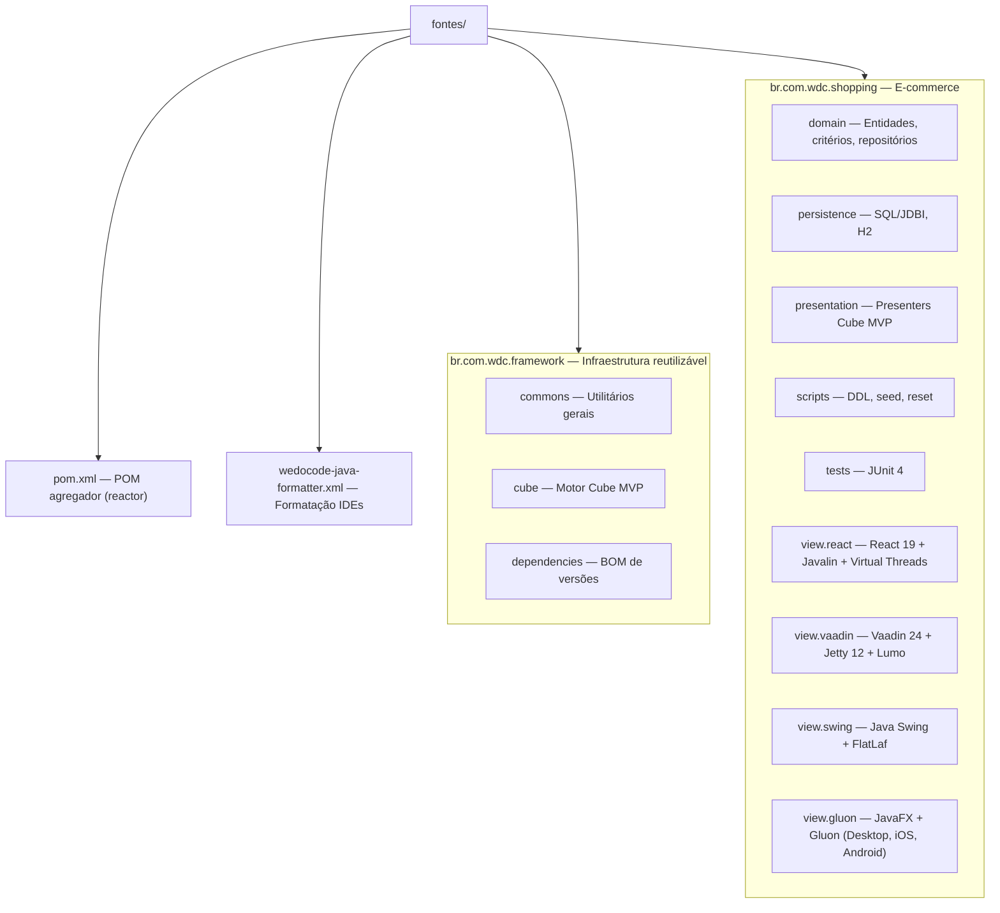

# fontes/

Raiz do código-fonte do projeto **WeDoCode Shopping** — um e-commerce de referência construído com a arquitetura **Cube MVP** sobre Java 26.

---

## Estrutura



---

## Módulos de Framework (`br.com.wdc.framework`)

| Módulo | Propósito |
|--------|-----------|
| **commons** | Interfaces funcionais (`ThrowingRunnable`, `ThrowingConsumer`, etc.), utilitários de uso geral. |
| **cube** | Implementação do padrão arquitetural Cube MVP — gerenciamento de scopes hierárquicos, ciclo de vida de presenters e binding de views. |
| **dependencies** | POM do tipo BOM que centraliza versões de dependências externas (JDBI, Gson, SLF4J, etc.). |

## Módulos da Aplicação (`br.com.wdc.shopping`)

| Módulo | Camada | Propósito |
|--------|--------|-----------|
| **domain** | Domínio | Entidades (`User`, `Product`, `Purchase`, `PurchaseItem`), critérios de busca, interfaces de repositório, utilitários de projeção (`ProjectionValues`, `ProjectionList`). |
| **persistence** | Infraestrutura | Implementação concreta dos repositórios usando JDBI + H2. Schema definido via classes `En*`, comandos SQL (Fetch/Insert/Update/Delete). |
| **presentation** | Aplicação | Presenters que orquestram a lógica de negócio e conectam domínio às views via Cube MVP. |
| **scripts** | Infraestrutura | DDL de criação de tabelas, dados de seed (`DBReset`), suporte a testes e inicialização. |
| **tests** | Teste | Suíte de testes JUnit 4 para repositórios (82 testes) e integração de serviços. |
| **view.react** | UI (Web) | Frontend React 19 + Material UI, servidor Javalin com Virtual Threads, comunicação segura RSA+AES-GCM. |
| **view.vaadin** | UI (Web) | Frontend Vaadin 24 + Lumo theme, servidor Jetty 12 embarcado, UI puramente server-side com push automático. |
| **view.swing** | UI (Desktop) | Frontend Java Swing + FlatLaf (Material look-and-feel) que reutiliza os mesmos presenters. |
| **view.gluon** | UI (Multiplataforma) | Frontend JavaFX + Gluon Mobile compilado nativamente para Desktop, iOS e Android via GraalVM. |

---

## Build

```bash
export JAVA_HOME=/Library/Java/JavaVirtualMachines/jdk-26.jdk/Contents/Home
export PATH="$JAVA_HOME/bin:$PATH"
cd fontes/
mvn clean install
```

Requisitos: **Java 26** (com `--enable-preview`) e **Maven 3.9+**.
