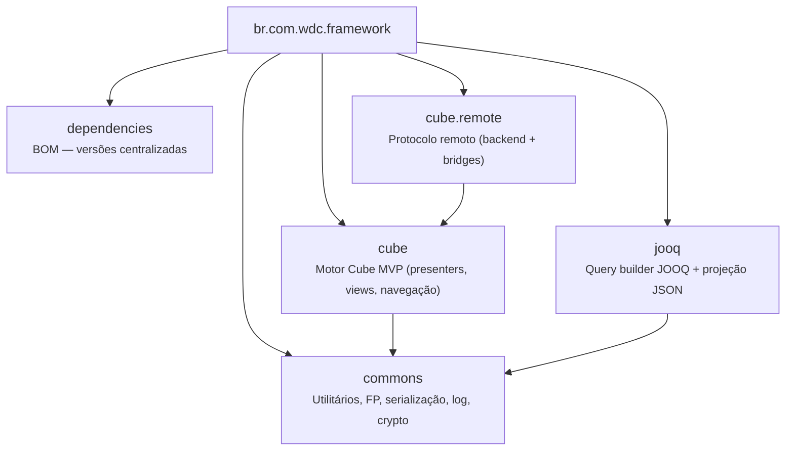

# WDC Framework

Infraestrutura reutilizável para aplicações Java 21 baseadas no padrão **Cube MVP**.

---

## Módulos



| Módulo | Propósito |
|--------|-----------|
| [`dependencies`](br.com.wdc.framework.dependencies/) | POM BOM — centraliza versões de todas as dependências externas |
| [`commons`](br.com.wdc.framework.commons/) | Interfaces funcionais, logging multiplataforma, serialização extensível, SQL, crypto, utilitários |
| [`jooq`](br.com.wdc.framework.jooq/) | Query builder declarativo sobre JOOQ com projeção JSON e dialetos multi-banco |
| [`cube`](br.com.wdc.framework.cube/) | Motor do padrão Cube MVP — presenters hierárquicos, views, slots, navegação por intents |
| [`cube.remote`](br.com.wdc.framework.cube.remote/) | Protocolo de comunicação remota — servidor (Javalin/WebSocket) e bridges para thin-clients (React, TeaVM) |

---

## Princípios

- **Zero DI frameworks** — injeção via `AtomicReference<T> BEAN` (service locator estático)
- **Multiplataforma** — commons e cube compilam para JVM, Android (Kotlin/Java) e JavaScript (TeaVM)
- **Sem dependências transitivas pesadas** — cada módulo declara apenas o mínimo necessário
- **Java 21** — records, sealed interfaces, Virtual Threads onde aplicável

## Build

```bash
cd fontes/br.com.wdc.framework
JAVA_HOME=$JAVA21_HOME mvn clean install
```
