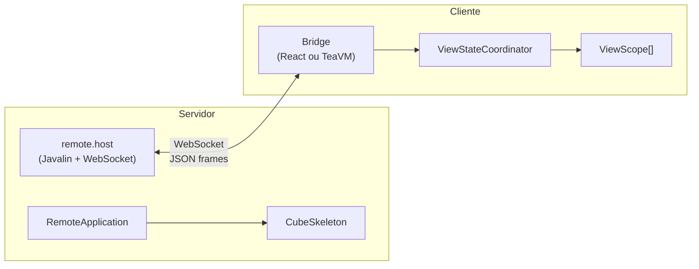

# WDC Framework — Cube Remote

Protocolo de comunicação remota para o motor Cube MVP, permitindo que **thin-clients** (browser, TeaVM) executem a lógica de presenters no servidor via WebSocket.

---

## Arquitetura



---

## Submódulos

| Submódulo | Linguagem | Descrição |
|-----------|-----------|-----------|
| `remote.backend` | Java 21 | Servidor — `RemoteApplication`, `RemoteApplicationSupport`, `ViewStateSerializer`, controllers Javalin (WebSocket + HTTP index) |
| `remote.bridge.react` | TypeScript/React | Bridge do thin-client React — `ViewStateCoordinator`, reconnection, data security, GC de views |
| `remote.bridge.teavm` | Java (TeaVM) | Bridge do thin-client TeaVM — mesma lógica que React, compilada para JavaScript via TeaVM |

---

## remote.backend

Classes principais no servidor:

| Classe | Responsabilidade |
|--------|-----------------|
| `RemoteApplication` | Contrato para apps remotas — autenticação, sessão WS, lifecycle |
| `RemoteApplicationSupport` | Infraestrutura delegada — gerencia id, WsContext, expiração |
| `RemoteApplicationRegistry` | Registra e localiza instâncias de `RemoteApplication` ativas |
| `RemoteBrowserPresenter` | Presenter especial que controla o "browser" do thin-client |
| `RemoteViewImpl` | Implementação de `CubeView` que serializa estado para o cliente |
| `ViewStateSerializer` | Serializa `ViewState` → JSON para envio via WebSocket |
| `RemoteHostModule` | Módulo Javalin que registra as rotas WS e HTTP |
| `DispatcherController` | Controller WebSocket — recebe eventos e despacha para o `CubeSkeleton` |
| `IndexHtmlController` | Serve o HTML do thin-client |
| `RemoteAppSecurity` / `RemoteDataSecurity` | Segurança da sessão e dos dados |

---

## remote.bridge.react

Módulo TypeScript que roda no browser:

| Arquivo | Responsabilidade |
|---------|-----------------|
| `ViewStateCoordinator.ts` | Coordenador central — WebSocket, reconnect, GC, render scheduling |
| `FlushRequestContext.ts` | Serializa formulários e envia eventos ao servidor |
| `ReconnectController.ts` | Exponential backoff para reconexão |
| `ViewGarbageCollector.ts` | Remove views órfãs do DOM |
| `ViewScope.ts` | Gerencia estado de uma view individual |
| `DataSecurity.ts` | Criptografia de dados (RSA) |
| `utils/` | Base64, BigInt, RSA, UTF8 |

---

## remote.bridge.teavm

Equivalente Java/TeaVM do bridge React:

| Classe | Responsabilidade |
|--------|-----------------|
| `ViewStateCoordinator` | Mesma lógica — WebSocket, factory de views, render via `requestAnimationFrame` |
| `FlushRequestContext` | Troca de contexto servidor ↔ cliente |
| `ReconnectController` | Backoff exponencial |
| `ViewGarbageCollector` | GC de views |
| `ViewScope` | Estado local de uma view |
| `DataSecurity` | RSA no lado TeaVM |
| `JsonParser` | Parsing JSON leve para TeaVM |
| `RemoteView` | Implementação de `CubeView` no lado cliente |
| `interop/` | Bindings JS: `Console`, `Timers`, `JsRunnable`, etc. |

---

## Coordenadas Maven

```xml
<!-- Backend (servidor) -->
<dependency>
    <groupId>br.com.wdc.framework</groupId>
    <artifactId>remote.backend</artifactId>
    <version>1.0.0</version>
</dependency>

<!-- Bridge TeaVM (thin-client) -->
<dependency>
    <groupId>br.com.wdc.framework</groupId>
    <artifactId>remote.bridge.teavm</artifactId>
    <version>1.0.0</version>
</dependency>
```
