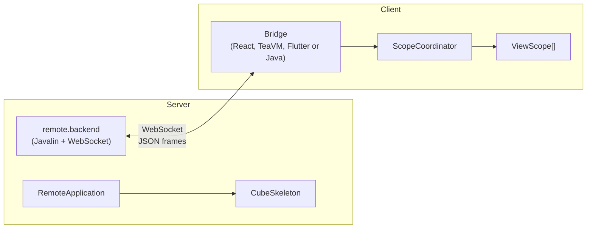

# WDC Framework — Cube Remote

Remote communication protocol for the Cube MVP engine, allowing **thin clients** (browser, desktop, mobile) to run the presenter logic on the server over WebSocket.

---

## Architecture


```mermaid
graph LR
    subgraph Server
        Host["remote.backend<br/>(Javalin + WebSocket)"]
        App["RemoteApplication"]
        Skel["CubeSkeleton"]
    end

    subgraph Client
        Bridge["Bridge<br/>(React, TeaVM, Flutter or Java)"]
        Coord["ScopeCoordinator"]
        VS["ViewScope[]"]
    end

    Host <-->|"WebSocket<br/>JSON frames"| Bridge
    App --> Skel
    Bridge --> Coord
    Coord --> VS
```

---

## Submodules

| Submodule | Language | Description |
|-----------|----------|-------------|
| `remote.backend` | Java 21 | Server — `RemoteApplication`, `RemoteApplicationSupport`, `ScopeSerializer`, Javalin controllers (WebSocket + HTTP index) |
| `remote.bridge.java` | Java 21 | Java bridge (fat client) — `HostClient`, `HostClientSession`, `AbstractPresenterClient`, protocol 1 handshake (ECDH P-256, AES-GCM); used by `remote.shell.probe` and `remote.shell.swt` |
| `remote.bridge.react` | TypeScript/React | React thin-client bridge — `ScopeCoordinator`, reconnection, data security, view GC |
| `remote.bridge.teavm` | Java (TeaVM) | TeaVM thin-client bridge — same logic as React, compiled to JavaScript via TeaVM |
| `remote.bridge.flutter` | Dart/Flutter | Flutter thin-client bridge — `ScopeCoordinator`, `BaseView`/`BaseViewState`, reconnection, data security, view GC; used by the Flutter shells |

---

## remote.backend

Main server-side classes:

| Class | Responsibility |
|-------|----------------|
| `RemoteApplication` | Contract for remote apps — authentication, WS session, lifecycle |
| `RemoteApplicationSupport` | Delegated infrastructure — manages id, WsContext, expiration |
| `RemoteApplicationRegistry` | Registers and looks up active `RemoteApplication` instances |
| `RemoteBrowserPresenter` | Presenter of the thin client's "browser" (alert, start, history, keep-alive): a `BrowserScope` with `CLASS_ID` and coded actions, like the others; its view has the fixed id `7b32e816a191:0` and the scope holds the root presenter's scope in `content` |
| `RemoteViewImpl` | The remote view of a scope (`forScope`, by `CLASS_ID`): serializes the scope, forwards events to the scope's skeleton, and releases the views it no longer refers to when written again |
| `ScopeSerializer` | Serializes the scope → JSON via reflection; a scope inside it is emitted as `"<field>ViewId"`, a list of scopes as `"<field>ViewIds"` |
| `RemoteHostModule` | Javalin module that registers the WS and HTTP routes |
| `DispatcherController` | WebSocket controller — receives events and dispatches them to the `CubeSkeleton` |
| `IndexHtmlController` | `before` handler on `/{ctx}/index.html`: plants the `app_id` session cookie |
| `SessionInitController` | `GET /api/session/init` → `{appId}` for clients without page cookies |
| `RemoteAppSecurity` / `RemoteDataSecurity` | Session and data security |

---

## remote.bridge.react

TypeScript module that runs in the browser:

| File | Responsibility |
|------|----------------|
| `ScopeCoordinator.ts` | Central coordinator — WebSocket, reconnect, GC, render scheduling |
| `FlushRequestContext.ts` | Serializes forms and sends events to the server |
| `ReconnectController.ts` | Linear backoff for reconnection (`min(2000·n, 120000)` ms) |
| `ViewGarbageCollector.ts` | Removes from the view map the views the server released that are not mounted |
| `ViewScope.ts` | Holds the scope of an individual view (its `values`) |
| `DataSecurity.ts` / `ChannelCrypto.ts` | The connection key (protocol 1 handshake: ECDH P-256 + HKDF-SHA256) and AES-GCM per value; Web Crypto, or noble on plain HTTP |
| `ClientStorage.ts` / `EncryptedLocalStorage.ts` | Session, persistent and persistent-secure client storage (secure entries under the `sec.` prefix, encrypted at rest) |
| `utils/` | Base64, UTF8, LangUtils |

---

## remote.bridge.teavm

Java/TeaVM equivalent of the React bridge:

| Class | Responsibility |
|-------|----------------|
| `ScopeCoordinator` | Same logic — WebSocket, view factory, rendering via `requestAnimationFrame` |
| `FlushRequestContext` | Server ↔ client context exchange |
| `ReconnectController` | Linear backoff (`min(2000·n, 120000)` ms) |
| `ViewGarbageCollector` | View GC |
| `ViewScope` | Local copy of a view's scope (its `values`) |
| `DataSecurity` / `Handshake` | The connection key (protocol 1 handshake, Web Crypto ECDH + HKDF, or the shell's `crypto-compat.js` on plain HTTP) and AES-GCM per value |
| `JsonParser` | Lightweight JSON parsing for TeaVM |
| `RemoteView` | Interface of the client-side views: `getVsid()`, `getElement()`, `forceUpdate()` |
| `interop/` | JS bindings: `Console`, `Timers`, `JsRunnable`, etc. |

---

## Maven Coordinates

```xml
<!-- Backend (server) -->
<dependency>
    <groupId>io.github.mrcdom.wdc.java</groupId>
    <artifactId>framework-cube-remote-backend</artifactId>
    <version>2.0.0</version>
</dependency>

<!-- TeaVM bridge (thin client) -->
<dependency>
    <groupId>io.github.mrcdom.wdc.java</groupId>
    <artifactId>framework-cube-remote-bridge-teavm</artifactId>
    <version>2.0.0</version>
</dependency>
```
