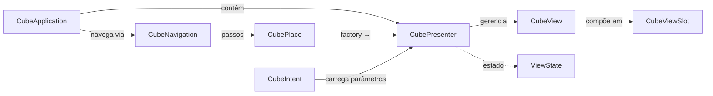

# WDC Framework — Cube

Motor do padrão **Cube MVP** — gerencia presenters hierárquicos, views, navegação por intents e estado reativo.

---

## Conceitos



### Ciclo de Navegação

1. O código cria um `CubeNavigation` passando a instância de `CubeApplication`.
2. Registra os passos desejados: `nav.step(place1).step(place2)`.
3. Monta um `CubeIntent` com parâmetros (key-value, query-string compatível).
4. Chama `nav.execute(intent)` — o motor:
   - Instancia presenters novos via `CubePlace.presenterFactory()`.
   - Invoca `applyParameters(intent, initialization, deepest)` em cada presenter.
   - Remove presenters que não fazem mais parte da hierarquia (chama `release()`).
   - Invoca `commitComputedState()` para todos.
5. A UI é atualizada por `CubeView.update()`.

---

## Classes Principais

| Classe/Interface | Responsabilidade |
|------------------|-----------------|
| `CubeApplication` | Singleton da app — mantém mapa de presenters e atributos, coordena navegação |
| `CubePresenter` | Contrato para presenters gerenciados pela navegação |
| `AbstractCubePresenter<A>` | Base genérica — associa app + view, delega `update()`/`release()` |
| `AbstractChildPresenter<A>` | Presenters filhos cujo ciclo é gerenciado pelo owner (não pela navegação) |
| `CubeView` | Interface da view — `instanceId()`, `update()`, `release()` |
| `CubeViewSlot` | Slot onde uma `CubeView` é encaixada na view pai |
| `CubePlace` | Identifica uma "tela" — id, nome, factory de presenter |
| `CubeIntent` | Encapsula destino (place) + parâmetros tipados (parse de query-string) |
| `CubeNavigation<T>` | Engine que executa transições: cria, reutiliza e destrói presenters |
| `CubeSkeleton` | Interface para comunicação remota: `submit(eventCode, formData)`, `syncState()` |
| `ViewState` | Marker interface para estados da view |
| `PresenterBase` | Interface raiz: `commitComputedState()` + `release()` |

---

## Utilitários

| Classe | Descrição |
|--------|-----------|
| `QueryStringBuilder` | Serializa parâmetros de `CubeIntent` em query-string |
| `QueryStringParser` | Deserializa query-string para `CubeIntent` |
| `ArrayUtils` | Operações em arrays |
| `ReflectArrayCompat` | Compatibilidade com reflexão em arrays (TeaVM) |

---

## Coordenadas Maven

```xml
<dependency>
    <groupId>br.com.wdc.framework</groupId>
    <artifactId>br.com.wdc.framework.cube</artifactId>
    <version>2.0.0</version>
</dependency>
```
