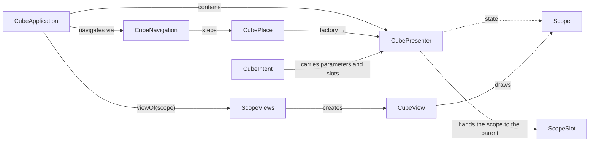

# WDC Framework — Cube

Engine of the **Cube MVP** pattern — manages hierarchical presenters, views, intent-based navigation and reactive state.

---

## Concepts


```mermaid
graph LR
    App["CubeApplication"]
    Nav["CubeNavigation"]
    Place["CubePlace"]
    Intent["CubeIntent"]
    Pres["CubePresenter"]
    View["CubeView"]
    Slot["ScopeSlot"]
    State["Scope"]
    Views["ScopeViews"]

    App -->|"contains"| Pres
    App -->|"navigates via"| Nav
    Nav -->|"steps"| Place
    Place -->|"factory →"| Pres
    Pres -.->|"state"| State
    Pres -->|"hands the scope to the parent"| Slot
    Intent -->|"carries parameters and slots"| Pres
    App -->|"viewOf(scope)"| Views
    Views -->|"creates"| View
    View -->|"draws"| State
```

### Navigation Cycle

1. The app declares the place tree as constants: `CubePlace.root("public", RootPresenter::new)` and, below it, `ROOT.child("home", HomePresenter::new)`. Each place's path comes from the tree, and its name is unique within it.
2. Builds a `CubeIntent` with parameters (key-value, query-string compatible).
3. Calls `app.navigate(place, intent)` — or `app.go("home?x=1")`, which finds the place by name (an unknown name goes to the root). The engine walks `place.getPath()` from the root to the destination:
   - Instantiates the missing presenters through the place's factory.
   - Invokes `applyParameters(intent, initialization, deepest)` on each presenter.
   - Releases the presenters that are not part of the hierarchy (calls `release()`, deepest first).
   - Calls `app.updateHistory()` so the host republishes the address.
4. The host draws the root presenter's scope (`app.viewOf(rootPresenter.state)`); each view asks for the views of the scopes it holds (`app.viewOf(state.content.get())`). The UI is updated by `CubeView.update()`, called when a scope `Prop` changes. `commitComputedState()` (derived state) is not part of the navigation: the remote host calls it on all presenters (`CubeApplication.commitComputedState()`) before writing the dirty states.

---

## Main Classes

| Class/Interface | Responsibility |
|-----------------|----------------|
| `CubeApplication` | App singleton — keeps the map of presenters and attributes, coordinates navigation; `viewOf(scope)` creates the scope's view the first time it is requested (and draws it once), `releaseView(scope)` releases it along with the views of the scopes inside it, `liveViews()` lists the live views |
| `CubePresenter` | Contract for presenters managed by navigation |
| `AbstractPresenter<A>` | Common base — app, `bind(state)` (binds the scope; it then shares the presenter's event map), `scope()`, `update()` (requests a redraw of the scope), `release()` (releases the scope's view and the inner ones), `detach(segment)` (releases the view of a smaller scope that left — including a list row) and the stored actions (`action`, `actionOf`, `actionOf2`, with or without an event code). The presenter never creates a view |
| `AbstractCubePresenter<A>` | Presenter of a place — `applyParameters`/`publishParameters`; knows no view: it hands the scope to the parent's slot |
| `CubeView` | View interface — `instanceId()`, `update()`, `release()` |
| `ScopeSlot` | Where a child presenter shows up in the parent: `setScope(scope)` puts the child's scope into a `Prop<Scope>` of the parent (`content`). Travels in the intent (`CubeIntent.setSlot/getSlot`) |
| `ScopeViews` | View-layer catalog: scope class → factory `(app, scope) -> CubeView` (`register`), with lookup through superclasses and a `fallback`. Each host builds its own and hands it over with `CubeApplication.setScopeViews` |
| `CubePlace` | Node of the place tree — name (unique in the tree), parent, path, presenter factory; the id grows with depth |
| `CubeIntent` | Encapsulates the destination (place) + typed parameters (query-string parsing) |
| `CubeKeys<A>` | Base of the app's key classes: one per place, declares the place and reads/writes the intent with typed accessors; `flip()` navigates to the place |
| `CubeNavigation<T>` | Engine that executes transitions: creates, reuses and destroys presenters |
| `CubeSkeleton` | Interface for remote communication: `classId()`, `submit(eventCode, eventQtde, formData)`, `syncState(formData)`. Nobody implements it by hand: `Scope.skeleton(classId)` dispatches each event to the action bound to that code, and `Scope.onSync(...)` defines `syncState` |
| `FormParam<T>` | How an action reads a value from the event's `formData`: field name + conversion (`asLong`, `asInteger`, `asString`, `of`) |
| `Scope`, `Prop<T>` | View state: observed fields are `Prop`s (`prop(...)`); `set` of a different value requests the redraw by itself — of the scope's view or, while it has none, of the owning scope that holds it in a `Prop`. `setSilently` is for the view that consumes a one-time display message while drawing. Each scope with a remote view declares `public static final String CLASS_ID` (the bridge protocol classId). `Scope.drawnBy(view)` is the scope that only carries an existing view — used by shells that rebuild scopes from what the remote host sends |
| `Action`, `ActionOf<T>`, `ActionOf2<T, U>` | Actions the view fires, stored as Scope fields; `NOOP`/`noop()` mark an action not yet bound |
| `PresenterBase` | Root interface: `commitComputedState()` + `release()` |

---

## Utilities

| Class | Description |
|-------|-------------|
| `QueryStringBuilder` | Serializes `CubeIntent` parameters into a query string |
| `QueryStringParser` | Deserializes a query string into a `CubeIntent` |
| `ArrayUtils` | Array operations |
| `ReflectArrayCompat` | Compatibility with reflection on arrays (TeaVM) |

---

## Maven Coordinates

```xml
<dependency>
    <groupId>io.github.mrcdom.wdc.java</groupId>
    <artifactId>framework-cube</artifactId>
    <version>2.0.0</version>
</dependency>
```
