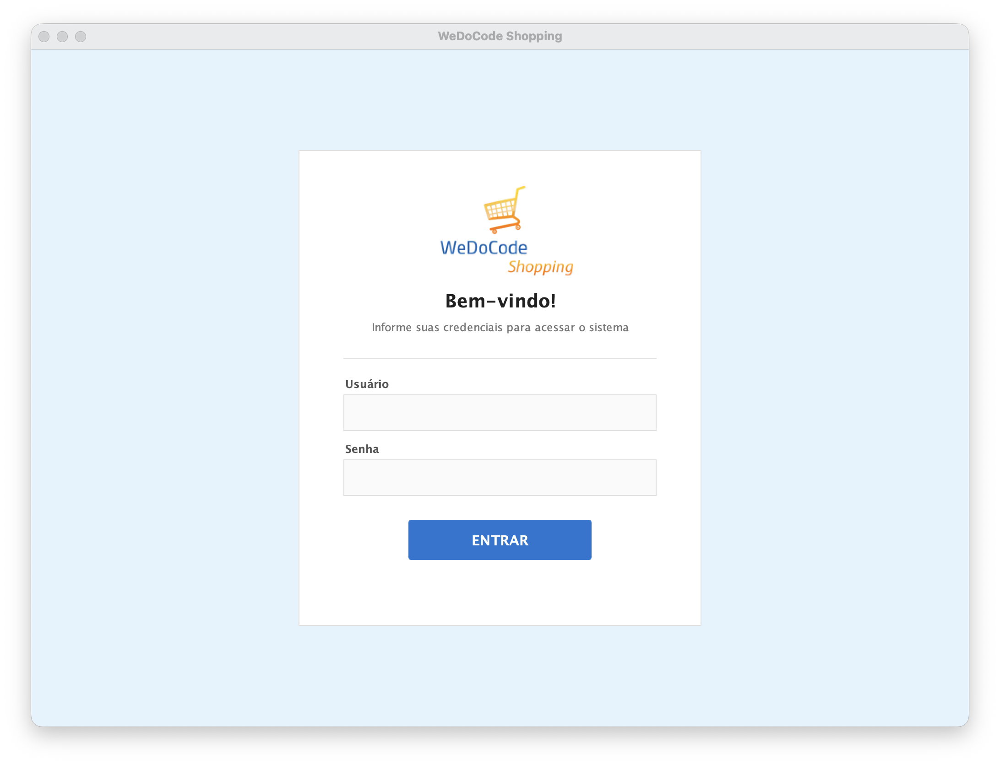
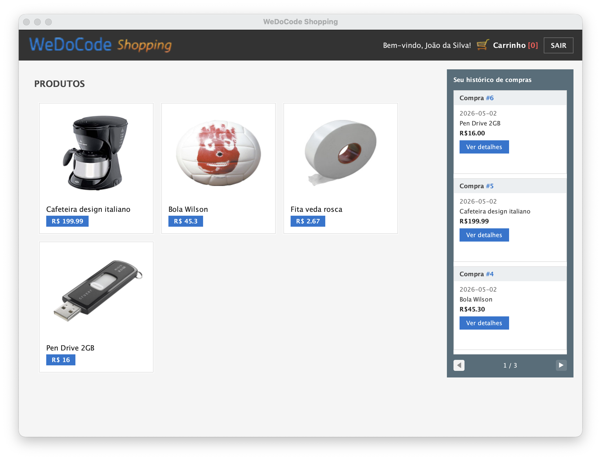
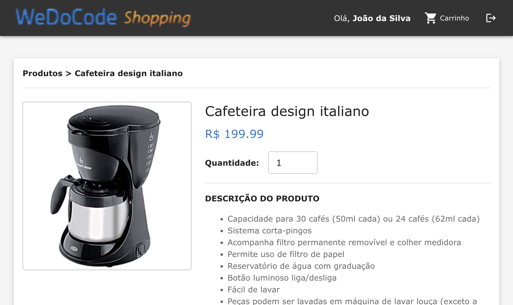
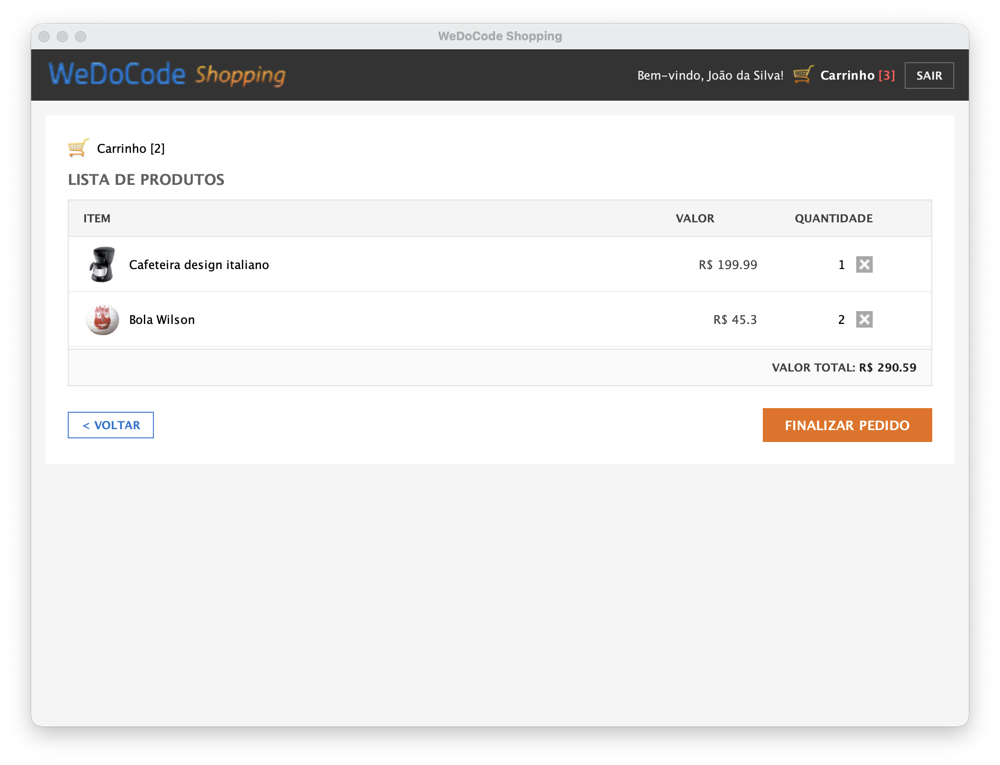
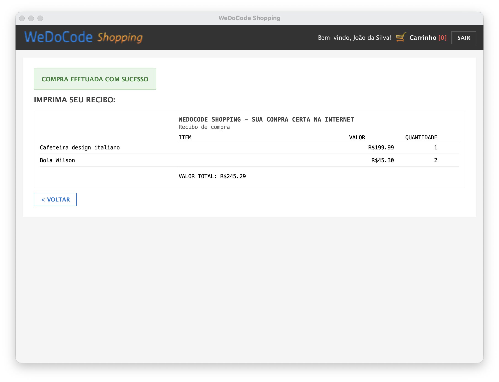
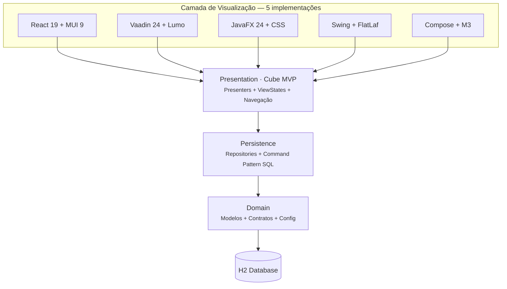

# 🛒 WeDoCode Shopping

Um **sistema de e-commerce completo** construído com arquitetura **Cube MVP**, demonstrando como a mesma lógica de negócio pode alimentar interfaces totalmente diferentes — **React (web)**, **Vaadin (web server-side)**, **JavaFX (desktop)**, **Swing (desktop)** e **Android (mobile)** — sem duplicar uma única linha de código de apresentação.

> **Cinco frontends. Mesma alma.**

---

## O que você vai encontrar

✅ Catálogo de produtos com imagens e descrições  
✅ Carrinho de compras com adição, remoção e cálculo de totais  
✅ Fluxo completo de compra com recibo  
✅ Histórico de compras paginado  
✅ Autenticação segura (RSA + AES-GCM na versão web)  
✅ Banco H2 embarcado — zero configuração para rodar  
✅ Virtual Threads (Java 26) — servidor web ultra-leve  
✅ Fat JAR (~11 MB) — deploy trivial

---

## Screenshots (versão React / Material UI)

### Login



Interface limpa e objetiva. Credenciais padrão: `admin` / `admin`.

---

### Página Inicial — Produtos e Histórico



Catálogo de produtos à direita com preços. Histórico de compras à esquerda com paginação e detalhamento.

---

### Detalhe do Produto



Descrição completa, seletor de quantidade e botão de adicionar ao carrinho. Breadcrumb de navegação no topo.

---

### Carrinho de Compras



Tabela com itens, valores, quantidades e opção de remoção individual. Total calculado em tempo real.

---

### Recibo de Compra



Confirmação visual de compra efetuada com sucesso e recibo formatado para impressão.

---

## Rode em 3 comandos

```bash
# 1. Clone
git clone https://github.com/mrcdom/wdc-cube-java-v2.git
cd wdc-cube-java-v2/fontes

# 2. Build (requer Java 26 + Maven 3.9+)
export JAVA_HOME=/Library/Java/JavaVirtualMachines/temurin-26.jdk/Contents/Home
mvn clean package -DskipTests

# 3. Execute
java --enable-preview -jar \
  br.com.wdc.shopping/br.com.wdc.shopping.view.react/br.com.wdc.shopping.view.react.javalin/target/br.com.wdc.shopping.view.react.javalin-1.0.0.jar
```

Abra **http://localhost:8080** e entre com `admin` / `admin`.

---

## Ou rode a versão Desktop (JavaFX)

```bash
export JAVA_HOME=/Library/Java/JavaVirtualMachines/jdk-26.jdk/Contents/Home
cd br.com.wdc.shopping/br.com.wdc.shopping.view.jfx
mvn javafx:run
```

Mesma aplicação, mesmo banco, mesma lógica — apenas a interface muda.

---

## Ou rode a versão Web Server-Side (Vaadin)

```bash
export JAVA_HOME=/Library/Java/JavaVirtualMachines/jdk-26.jdk/Contents/Home
cd br.com.wdc.shopping/br.com.wdc.shopping.view.vaadin
java --enable-preview -cp "$(mvn -q dependency:build-classpath -Dmdep.outputFile=/dev/stdout):target/classes" \
  br.com.wdc.shopping.view.vaadin.ShoppingVaadinMain
```

Abra **http://localhost:8090**. UI inteiramente server-side com Vaadin 24 + Lumo theme. Mesmos presenters, mesmo domínio.

---

## Ou rode a versão Desktop (Swing + FlatLaf)

```bash
export JAVA_HOME=/Library/Java/JavaVirtualMachines/jdk-26.jdk/Contents/Home
cd br.com.wdc.shopping/br.com.wdc.shopping.view.swing
java --enable-preview -cp "$(mvn -q dependency:build-classpath -Dmdep.outputFile=/dev/stdout):target/classes" \
  br.com.wdc.shopping.view.swing.ShoppingSwingMain
```

Aplicação desktop com Java Swing + FlatLaf (Material look-and-feel). Mesmos presenters, mesmo domínio, banco H2 embarcado.

---

## Ou rode a versão Mobile (Android)

```bash
# Compile dependências Java para mavenLocal
cd fontes && ./build-android-deps.sh

# Abra no Android Studio:
# fontes/br.com.wdc.shopping/br.com.wdc.shopping.view.android/
# Sync Gradle → Build → Run no emulador
```

App nativo Android com Jetpack Compose + Material 3. Mesmos presenters, mesmo domínio.

---

## Arquitetura em camadas



## Módulos

| Módulo | Responsabilidade |
|--------|-----------------|
| [`domain`](br.com.wdc.shopping.domain/) | Modelos, repositórios (interfaces), critérios, exceções |
| [`persistence`](br.com.wdc.shopping.persistence/) | Implementações SQL (JDBI + Command Pattern), DDL, DSL |
| [`presentation`](br.com.wdc.shopping.presentation/) | Presenters hierárquicos, ViewStates, serviços, navegação |
| [`scripts`](br.com.wdc.shopping.scripts/) | Scripts DDL (DBCreate, DBReset) |
| [`view.react`](br.com.wdc.shopping.view.react/) | Frontend web completo (React + Javalin + WebSocket) |
| [`view.vaadin`](br.com.wdc.shopping.view.vaadin/) | Frontend web server-side (Vaadin 24 + Jetty 12 + Lumo theme) |
| [`view.jfx`](br.com.wdc.shopping.view.jfx/) | Frontend desktop (JavaFX 24 + CSS Material) |
| [`view.swing`](br.com.wdc.shopping.view.swing/) | Frontend desktop (Java Swing + FlatLaf Material) |
| [`view.android`](br.com.wdc.shopping.view.android/) | Frontend mobile (Kotlin + Jetpack Compose + Material 3) |
| [`api`](br.com.wdc.shopping.api/) | Controllers REST (Javalin) para expor repositórios via HTTP |
| [`api-client`](br.com.wdc.shopping.api-client/) | Client REST (OkHttp + Gson) que implementa repositórios via HTTP |
| [`tests`](br.com.wdc.shopping.tests/) | Testes de workflow e repositórios |

---

## Por que explorar este projeto?

- **Sem Spring, sem CDI, sem magia** — injeção via `AtomicReference<T> BEAN`, 100% explícito
- **Separação real de concerns** — troque a UI inteira sem tocar em lógica (4 frontends provam isso)
- **Padrões sólidos** — Command, Repository, Presenter, ViewState
- **Tecnologia moderna** — Java 26, Virtual Threads, React 19, Vaadin 24, TypeScript
- **Código limpo** — ~3.5s de build completo, zero warnings
- **Segurança real** — RSA + PBKDF2 + AES-GCM (não apenas demonstrativo)

---

## Licença

[MIT License](https://github.com/mrcdom/wdc-cube-java-v2/blob/main/LICENSE) — use, modifique, distribua.

Copyright (c) 2026 Marcelo Domingos / WeDoCode Consultoria LTDA
