# br.com.wdc.shopping.domain

Módulo de **domínio puro** da aplicação Shopping. Define modelos, contratos de repositório, critérios de consulta, exceções de negócio e configuração — sem dependência de frameworks de persistência ou apresentação.

## Estrutura

```mermaid
graph TD
    root["domain/"]
    root --> ShoppingConfig["ShoppingConfig.java<br/><small>Diretórios da aplicação</small>"]

    root --> config["config/"]
    config --> AppConfig["AppConfig.java<br/><small>Carrega TOML</small>"]

    root --> model["model/ — POJOs"]
    model --> User["User.java"]
    model --> Product["Product.java"]
    model --> Purchase["Purchase.java"]
    model --> PurchaseItem["PurchaseItem.java"]

    root --> repos["repositories/ — Interfaces"]
    repos --> UserRepo["UserRepository"]
    repos --> ProductRepo["ProductRepository"]
    repos --> PurchaseRepo["PurchaseRepository"]
    repos --> PurchaseItemRepo["PurchaseItemRepository"]

    root --> criteria["criteria/ — Objetos de critério"]
    criteria --> UserCrit["UserCriteria"]
    criteria --> ProductCrit["ProductCriteria"]
    criteria --> PurchaseCrit["PurchaseCriteria"]
    criteria --> PurchaseItemCrit["PurchaseItemCriteria"]

    root --> exception["exception/ — Exceções de negócio"]
    exception --> BusinessEx["BusinessException (base)"]
    exception --> AccessDenied["AccessDeniedException"]
    exception --> InvalidCart["InvalidCartItemException"]
    exception --> Offline["OfflineException"]

    root --> security["security/ — RBAC"]
    security --> AuthSvc["AuthenticationService"]
    security --> AuthResult["AuthResult"]
    security --> Challenge["ChallengeResult"]
    security --> PasswordUtil["PasswordUtil (HMAC-SHA256)"]
    security --> Role["Role (ADMIN, CUSTOMER, MANAGER)"]
    security --> SecCtx["SecurityContext"]
    security --> SecHolder["SecurityContext.CURRENT"]

    root --> utils["utils/ — Projeção"]
    utils --> ProjValues["ProjectionValues"]
    utils --> ProjList["ProjectionList"]
    utils --> ProjSet["ProjectionSet"]
```



## Princípios

- **Sem dependências de infraestrutura** — apenas SLF4J e Commons IO
- **Modelos simples** — POJOs com campos públicos, sem anotações de persistência
- **Repositórios como interfaces** — registrados via `AtomicReference<XxxRepository> BEAN` (Service Locator leve)
- **Critérios tipados** — cada entidade tem seu `XxxCriteria` com filtros, projeção, paginação e ordenação
- **Segurança declarativa** — `Role` enum define permissões no formato `entity:operation`; `SecurityContext.CURRENT` propaga contexto via ThreadLocal

## Modelos

| Modelo | Campos principais |
|--------|-------------------|
| `User` | `id`, `userName`, `password`, `name`, `roles` |
| `Product` | `id`, `name`, `price`, `description`, `image` |
| `Purchase` | `id`, `buyDate`, `user`, `items` |
| `PurchaseItem` | `id`, `amount`, `price`, `purchase`, `product` |

## Repositórios

Todos os repositórios seguem o mesmo contrato:

```java
public interface XxxRepository {
    AtomicReference<XxxRepository> BEAN = new AtomicReference<>();

    boolean insert(Xxx entity);
    boolean update(Xxx newEntity, Xxx oldEntity);
    boolean insertOrUpdate(Xxx entity);
    int delete(XxxCriteria criteria);
    int count(XxxCriteria criteria);
    List<Xxx> fetch(XxxCriteria criteria);
    Xxx fetchById(Long id, Xxx projection);
}
```

A implementação concreta é injetada no `BEAN` pela camada de persistência na inicialização.

## Critérios

Cada `XxxCriteria` oferece uma API fluente para construir consultas:

```java
var criteria = new ProductCriteria()
    .withProductId(42L)
    .withProjection(projection)
    .withOffset(0)
    .withLimit(20)
    .withOrderBy(ProductCriteria.OrderBy.NAME_ASC);
```

## Projeção

O mecanismo de projeção permite indicar quais campos devem ser carregados. Um objeto "projeção" é um modelo cujos campos não-nulos indicam que aquela coluna deve ser incluída no SELECT. `ProjectionValues` fornece valores sentinela para cada tipo primitivo.

## Configuração

`AppConfig` carrega configurações de `work/config/application.toml` (ou caminho definido via `-Dshopping.config.file`). `ShoppingConfig` resolve os diretórios padrão da aplicação (`config/`, `data/`, `log/`, `temp/`).

## Segurança (RBAC)

O pacote `security/` define os contratos de autenticação e autorização:

| Classe | Responsabilidade |
|--------|-----------------|
| `Role` | Enum com papéis (ADMIN, CUSTOMER, MANAGER) e suas permissões no formato `entity:operation` |
| `SecurityContext` | Contexto imutável do usuário autenticado (userId, userName, roles, permissions) |
| `SecurityContext.CURRENT` | ThreadLocal para propagação do contexto entre camadas |
| `AuthenticationService` | Contrato de autenticação: `challenge()` → `ChallengeResult`, `login(user, digest, nonce)` → `AuthResult` |
| `PasswordUtil` | HMAC-SHA256 para gerar digest de autenticação sem trafegar senha em texto plano |
| `AccessDeniedException` | Exceção lançada quando o usuário não possui permissão para a operação |

O modelo é **allow-wins**: a permissão efetiva é a união de todos os papéis do usuário.

## Dependências

- SLF4J — logging
- Commons IO — utilitários de I/O
