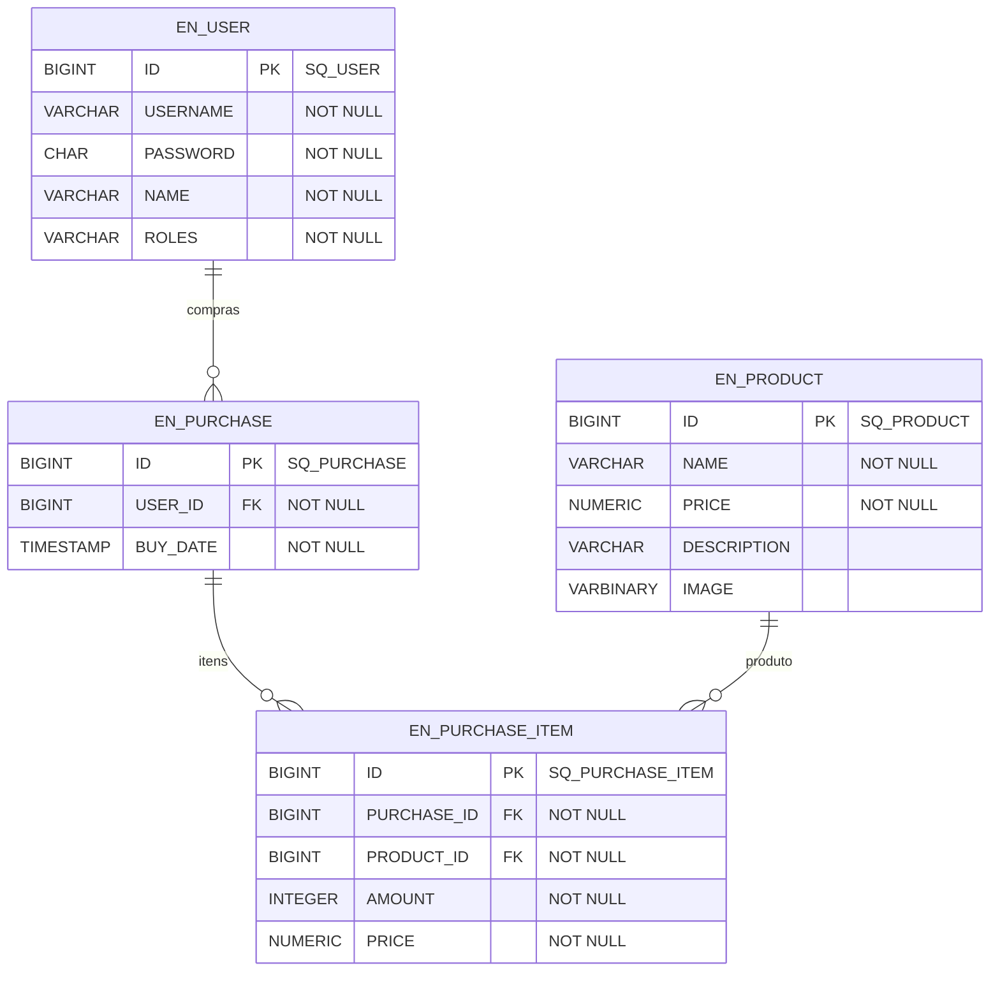

# WDC Shopping — Persistence

Camada de persistência do sistema Shopping. Implementa os repositórios definidos no módulo `domain` usando **jOOQ** e o framework **JsonQueryBuilder** para mapeamento declarativo bean↔tabela com projeção JSON e relações lazy. O banco de dados utilizado é **H2** (embarcado).

## Dependências

| Artefato | Papel |
|----------|-------|
| `br.com.wdc.shopping.domain` | Modelos de domínio, interfaces de repositório, critérios |
| `br.com.wdc.framework.jooq` | Framework JsonQueryBuilder (mapeamento declarativo) |
| `br.com.wdc.framework.commons` | Infraestrutura SQL (DataSource, utilitários) |
| `org.jooq:jooq` | Query builder type-safe e execução SQL |
| `com.google.code.gson:gson` | Deserialização de JSON (projeção JSON_OBJECT) |
| `commons-io` | Utilitários de I/O |

## Estrutura de Pacotes

```mermaid
graph TD
    root["br.com.wdc.shopping.persistence"]
    root --> Bootstrap["RepositoryBootstrap.java<br/><small>Inicializa DSLContext + BEANs</small>"]

    root --> concurrent["concurrent/"]
    concurrent --> SchedAdapter["ScheduledExecutorAdapter.java"]

    root --> security["security/ — RBAC Decorators"]
    security --> AccessCtx["AccessContext"]
    security --> AccessCache["AccessContextCache"]
    security --> AuthImpl["AuthenticationServiceImpl"]
    security --> JwtUtil["JwtUtil (HMAC-SHA256)"]
    security --> Nonce["NonceStore"]
    security --> Enforcer["SecurityEnforcer"]
    security --> SecUser["SecuredUserRepository"]
    security --> SecProduct["SecuredProductRepository"]
    security --> SecPurchase["SecuredPurchaseRepository"]
    security --> SecPurchItem["SecuredPurchaseItemRepository"]

    root --> jooq["jooq/ — Código gerado pelo jOOQ"]
    jooq --> Tables["Tables.java, Keys.java, Sequences.java"]
    jooq --> tbls["tables/"]
    tbls --> EnUser["EnUser.java"]
    tbls --> EnProduct["EnProduct.java"]
    tbls --> EnPurchase["EnPurchase.java"]
    tbls --> EnPurchaseitem["EnPurchaseitem.java"]

    root --> repository["repository/ — Implementações"]
    repository --> UserRepo["UserRepositoryImpl"]
    repository --> ProductRepo["ProductRepositoryImpl"]
    repository --> PurchaseRepo["PurchaseRepositoryImpl"]
    repository --> PurchaseItemRepo["PurchaseItemRepositoryImpl"]
```



## Arquitetura

### Padrões Utilizados

| Padrão | Implementação | Finalidade |
|--------|--------------|------------|
| **Repository** | `XxxRepositoryImpl implements XxxRepository` | Fachada de acesso a dados por entidade |
| **JsonQuery (Declarativo)** | `public static final JsonQuery<B, T> QUERY` | Mapeamento bean↔tabela declarativo com projeção JSON |
| **ApplyConditions** | Inner class `ApplyConditions` | Traduz critérios de negócio em `Condition` jOOQ |
| **Lazy Relations** | `addBeanField` / `addBeanListField` | Relações 1:1 e 1:N via subquery correlacionada |
| **Decorator (Security)** | `SecuredXxxRepository` | Envolve repositórios com verificação de permissões RBAC |

### Fluxo de uma Consulta

```
1. Camada de apresentação chama:
   ProductRepository.BEAN.get().fetch(criteria)

2. ProductRepositoryImpl.fetch():
   - Obtém bean de projeção (quais campos carregar)
   - Delega para QUERY.fetchToList(projection, (t, q) -> { ... })

3. JsonQueryBuilder:
   - Gera SELECT com JSON_OBJECT para os campos ativos na projeção
   - Aplica condições WHERE via ApplyConditions
   - Para campos lazy (relações), gera subqueries correlacionadas
   - Executa via jOOQ DSLContext
   - Deserializa JSON → Bean via Gson

4. Retorna List<Product> para o chamador
```

### Fluxo de uma Escrita

```
1. Camada de apresentação chama:
   ProductRepository.BEAN.get().insert(product)

2. ProductRepositoryImpl.insert():
   - Obtém DSLContext via JooqDSLContext.BEAN.get()
   - Gera ID via sequence (dsl.nextval(SQ_PRODUCT)) se necessário
   - Monta INSERT com dsl.insertInto(EN_PRODUCT).set(...) apenas para campos não-nulos
   - Executa diretamente via jOOQ
```

## Componentes Principais

### JsonQuery — Mapeamento Declarativo

Cada repositório define um `QUERY` estático que descreve o mapeamento completo bean↔tabela:

```java
public static final JsonQuery<User, EnUser> QUERY = new JsonQueryBuilder<User, EnUser>()
        .setAlias("u")
        .setBeanFactory(User::new)
        .setTableFactory(EN_USER::as)
        .addI64("id", u -> u.id, (u, v) -> u.id = v, t -> t.ID)
        .addStr("userName", u -> u.userName, (u, v) -> u.userName = v, t -> t.USERNAME)
        .addStr("password", u -> u.password, (u, v) -> u.password = v, t -> t.PASSWORD)
        .addStr("name", u -> u.name, (u, v) -> u.name = v, t -> t.NAME)
        .addStr("roles", u -> u.roles, (u, v) -> u.roles = v, t -> t.ROLES)
        .build();
```

O builder usa generics `<B, T extends Table<?>>` — eliminando a necessidade de factory de tabela por reflexão.

### Relações Lazy (1:1 e 1:N)

Relações são definidas no bloco `lazy(...)` e só são carregadas quando o campo correspondente está presente na projeção:

```java
.lazy(qb -> {
    // Relação 1:1: Purchase → User
    qb.addBeanField("user", p -> p.user, (p, v) -> p.user = v,
            UserRepositoryImpl.QUERY, cq -> {
                var enPurchase = cq.getSuperTable();
                var enUser = cq.getChildTable();
                cq.dsl().where()
                    .and(enUser.ID.eq(enPurchase.USERID))
                    .and(UserRepositoryImpl.applyConditions(cq));
            });

    // Relação 1:N: Purchase → Items
    qb.addBeanListField("items", p -> p.items, (p, v) -> p.items = v,
            PurchaseItemRepositoryImpl.QUERY, cq -> {
                var enPurchase = cq.getSuperTable();
                var enPurchaseItem = cq.getChildTable();
                cq.dsl().where()
                    .and(enPurchaseItem.PURCHASEID.eq(enPurchase.ID))
                    .and(PurchaseItemRepositoryImpl.applyConditions(cq));
            });
})
```

- `addBeanField` → gera subquery escalar (relação 1:1)
- `addBeanListField` → gera subquery que retorna JSON array (relação 1:N)
- `cq.getSuperTable()` → tabela-pai aliased
- `cq.getChildTable()` → tabela-filha aliased
- `cq.dsl()` → SelectConditionStep para compor JOINs

### ApplyConditions — Tradução de Critérios

Cada repositório expõe um método estático `applyConditions` que traduz critérios de negócio em `Condition` jOOQ. Isso permite composição entre repositórios (ex: filtro de userId propagado via subquery):

```java
// Método estático para uso em subqueries de outros repositórios
public static Condition applyConditions(JsonChildQueryBuilder<?, EnUser> cq) {
    if (cq.getCriteria() instanceof UserCriteria criteria) {
        return new ApplyConditions(cq.getChildTable(), cq.getCtx()).apply(criteria);
    }
    return DSL.noCondition();
}

// Inner class que constrói as condições
private static class ApplyConditions {
    EnUser enUser;
    QueryContext ctx;

    public Condition apply(UserCriteria criteria) {
        var condition = DSL.noCondition();
        if (criteria.userId() != null) {
            condition = condition.and(enUser.ID.eq(criteria.userId()));
        }
        if (criteria.userName() != null) {
            condition = condition.and(enUser.USERNAME.eq(criteria.userName()));
        }
        return condition;
    }
}
```

O `QueryContext` gerencia aliases únicos para tabelas em subqueries aninhadas, evitando colisões.

### Projeção Seletiva

O bean de projeção controla quais campos são carregados. Campos `null` no bean de projeção são ignorados na query:

```java
// Projeção completa (todos os campos)
var projection = QUERY.newProjectionBean();

// Projeção parcial (apenas id e name)
var projection = new User();
projection.id = 0L;      // != null → incluído
projection.name = "";    // != null → incluído
// userName, password → null → excluídos da query
```

### RepositoryBootstrap

Inicializa o `DSLContext` do jOOQ e registra todos os repositórios nos `BEAN` estáticos:

```java
// Modo básico (sem segurança — testes locais)
RepositoryBootstrap.initialize();

// Modo com log de SQL (jOOQ loga via SLF4J DEBUG)
RepositoryBootstrap.initialize(true);

// Modo com segurança RBAC (produção)
RepositoryBootstrap.initialize();
RepositoryBootstrap.initializeSecurity(jwtSecret);
```

A configuração `logSql` ativa `Settings.withExecuteLogging(true)` no jOOQ, que loga todos os SQLs executados via `org.jooq.tools.LoggerListener` em nível DEBUG.

Quando `initializeSecurity()` é chamado com um `jwtSecret` não-vazio, os repositórios são decorados com `Secured*Repository` que verificam permissões e restringem escopo ao userId do usuário autenticado (para não-admins).

### Tabelas jOOQ (Geradas)

As classes em `persistence.jooq.tables` são geradas pelo jOOQ Code Generator a partir do esquema H2. Cada classe (ex: `EnUser`) é um `TableImpl<EnUserRecord>` com campos tipados:

```java
// Uso como referência estática
import static br.com.wdc.shopping.persistence.jooq.tables.EnUser.EN_USER;

// Alias para subqueries
var enUser = EN_USER.as("u");
enUser.ID    // TableField<EnUserRecord, Long>
enUser.NAME  // TableField<EnUserRecord, String>
```

### Tratamento de Imagens (ProductRepositoryImpl)

O `ProductRepositoryImpl` usa jOOQ diretamente para operações com imagens (campo `VARBINARY`), sem necessidade de workarounds — o pool de conexões Agroal implementa JDBC 4.x completo, incluindo `createBlob()`:

```java
// Insert com imagem
dsl.insertInto(EN_PRODUCT)
        .set(EN_PRODUCT.ID, product.id)
        .set(EN_PRODUCT.IMAGE, product.image)  // byte[] direto via jOOQ
        .execute();

// Update de imagem isolado
dsl.update(EN_PRODUCT)
        .set(EN_PRODUCT.IMAGE, image)
        .where(EN_PRODUCT.ID.eq(productId))
        .execute();
```

## Convenções

| Tipo | Padrão | Exemplo |
|------|--------|---------|
| Tabela (jOOQ) | `En` + Entidade | `EnUser`, `EnProduct` |
| Constante de tabela | `EN_` + ENTIDADE | `EN_USER`, `EN_PRODUCT` |
| Sequence | `SQ_` + ENTIDADE | `SQ_USER`, `SQ_PRODUCT` |
| Repositório | Entidade + `RepositoryImpl` | `UserRepositoryImpl` |
| Query estática | `QUERY` | `UserRepositoryImpl.QUERY` |
| Condições estáticas | `applyConditions(cq)` | Composição entre repositórios |
| Inner class critérios | `ApplyConditions` | Tradução de criteria → Condition |

## Esquema do Banco


