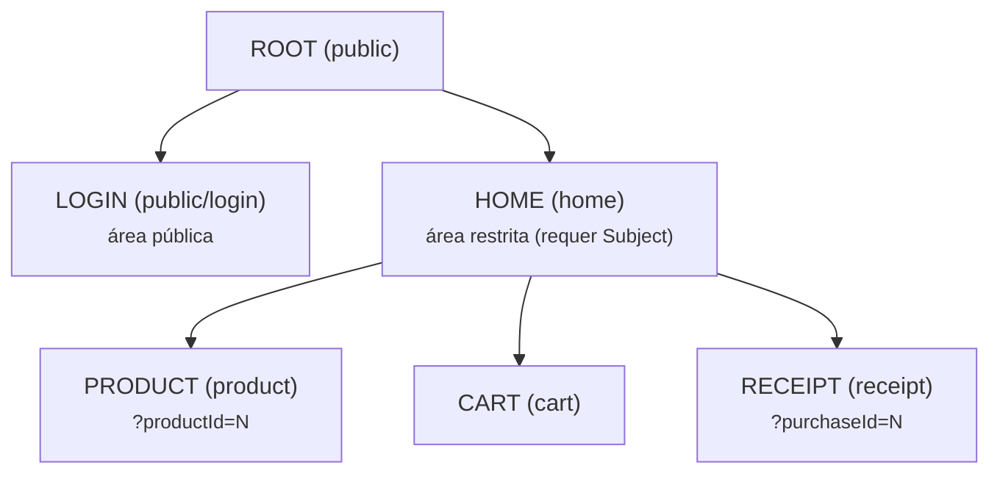
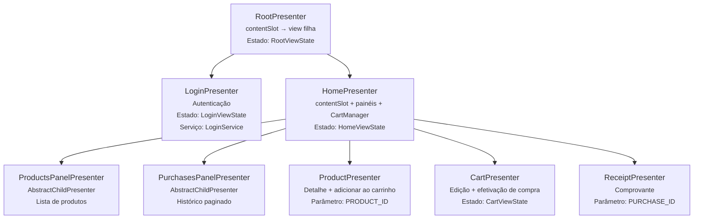
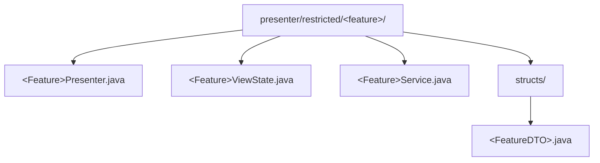

# WDC Shopping — Presentation

Camada de apresentação do sistema Shopping, implementada com o padrão **Cube MVP**. Contém os presenters, view states, serviços de apresentação, DTOs e o sistema de navegação. Esta camada é agnóstica de tecnologia de view — não depende de React, Javalin ou qualquer framework de UI.

## Dependências

| Artefato | Papel |
|----------|-------|
| `br.com.wdc.shopping.domain` | Modelos de domínio, repositórios, critérios |
| `br.com.wdc.framework.cube` | Motor Cube MVP (presenters, views, navegação) |
| `slf4j-api` | Logging |
| `jsr305` | Anotações `@Nullable` (scope provided) |

## Estrutura de Pacotes

```mermaid
graph TD
    root["br.com.wdc.shopping.presentation"]
    root --> ShoppingApp["ShoppingApplication.java"]
    root --> PlaceAttr["PlaceAttributes.java"]
    root --> PlaceParams["PlaceParameters.java"]

    root --> function["function/"]
    function --> GoAction["GoAction.java"]

    root --> exception["exception/"]
    exception --> WrongPlace["WrongPlace.java"]
    exception --> WrongParams["WrongParametersException.java"]
    exception --> ProductNotFound["ProductNotFoundException.java"]
    exception --> PurchaseNotFound["PurchaseNotFoundException.java"]

    root --> presenter["presenter/"]
    presenter --> Routes["Routes.java"]
    presenter --> RootP["RootPresenter.java"]
    presenter --> RootVS["RootViewState.java"]

    presenter --> login["open/login/"]
    login --> LoginP["LoginPresenter.java"]
    login --> LoginVS["LoginViewState.java"]
    login --> LoginSvc["LoginService.java"]
    login --> Subject["structs/Subject.java"]

    presenter --> restricted["restricted/"]
    restricted --> home["home/"]
    home --> HomeP["HomePresenter.java"]
    home --> HomeVS["HomeViewState.java"]
    home --> products_panel["products/"]
    products_panel --> ProdPanelP["ProductsPanelPresenter.java"]
    products_panel --> ProdPanelVS["ProductsPanelViewState.java"]
    home --> purchases_panel["purchases/"]
    purchases_panel --> PurchPanelP["PurchasesPanelPresenter.java"]
    purchases_panel --> PurchPanelVS["PurchasesPanelViewState.java"]
    purchases_panel --> PurchPanelSvc["PurchasesPanelService.java"]

    restricted --> products["products/"]
    products --> ProductP["ProductPresenter.java"]
    products --> ProductVS["ProductViewState.java"]
    products --> ProductSvc["ProductService.java"]

    restricted --> cart["cart/"]
    cart --> CartP["CartPresenter.java"]
    cart --> CartVS["CartViewState.java"]
    cart --> CartMgr["CartManager.java"]

    restricted --> receipt["receipt/"]
    receipt --> ReceiptP["ReceiptPresenter.java"]
    receipt --> ReceiptVS["ReceiptViewState.java"]
    receipt --> ReceiptSvc["ReceiptService.java"]
```



## Hierarquia de Navegação

O sistema possui 6 places organizados hierarquicamente:



A navegação é definida em `Routes.java` usando o builder `app.navigate().step(Place).execute(intent)`:

```java
// Navegar para o detalhe de um produto
var intent = app.newIntent();
intent.setParameter(PlaceParameters.PRODUCT_ID, productId);
Routes.product(app, intent);
```

O `RootPresenter` decide automaticamente se direciona para `LOGIN` ou `HOME` baseado na presença do `Subject`.

## Hierarquia de Presenters



### Dois tipos de presenter

| Tipo | Classe base | Ciclo de vida | Uso |
|------|------------|---------------|-----|
| **Presenter navegável** | `AbstractCubePresenter<ShoppingApplication>` | Gerenciado pelo sistema de navegação via `applyParameters` | Places no `Routes` |
| **Presenter filho (painel)** | `AbstractChildPresenter<ShoppingApplication>` | Gerenciado manualmente pelo presenter pai via `initialize()`/`release()` | Painéis embutidos na Home |

## Componentes do Módulo

### ShoppingApplication

Classe abstrata que estende `CubeApplication`. Mantém o estado global:

- `subject` — usuário autenticado (`Subject`)
- `securityContext` — contexto de segurança (`SecurityContext`) com roles e permissões
- `cart` — carrinho de compras (`CartManager`)
- Proxy delegates (via `SecurityContextDelegate`) para repositórios — propagam `SecurityContext` para a thread corrente em cada chamada
- `go(String)` / `go(CubeIntent)` — navegação programática
- `alertUnexpectedError(...)` — exibição de erros via `RootPresenter`

### ViewState

Cada presenter possui um `ViewState` que implementa `ViewState.write()` para serializar o estado em JSON. Este JSON é enviado ao frontend via WebSocket.

```java
public class ProductViewState implements ViewState {
    public ProductInfo product;
    public int errorCode;
    public String errorMessage;

    @Override
    public void write(String instanceId, ExtensibleObjectOutput json) {
        json.beginObject();
        json.name("id").value(instanceId);
        // ... serialização dos campos
        json.endObject();
    }
}
```

### Services

Serviços são classes com injeção de dependências via construtor (`ShoppingApplication` ou repositório específico), fazendo a ponte entre a camada de apresentação e os repositórios:

| Serviço | Responsabilidade |
|---------|------------------|
| `LoginService` | Autenticação via HMAC challenge-response (usa `AuthenticationService`) |
| `ProductService` | Carga de produtos (por ID, lista sem descrição) |
| `PurchasesPanelService` | Consulta de compras (paginação, contagem) |
| `ReceiptService` | Carga de recibos |

### DTOs (structs)

Objetos `Serializable` usados para transferir dados entre camadas. Cada DTO possui:

- **Campos públicos** (sem getters/setters)
- **`projection()`** — retorna uma instância do modelo de domínio indicando quais campos carregar
- **`create(Model)`** — factory method que converte do modelo de domínio para o DTO

| DTO | Origem | Campos principais |
|-----|--------|------------------|
| `Subject` | `User` | id, nickName |
| `ProductInfo` | `Product` | id, image, name, description, price |
| `CartItem` | `ProductInfo` | id, image, name, price, quantity |
| `PurchaseInfo` | `Purchase` | id, date, total, items (nomes) |
| `ReceiptForm` | `Purchase` | date, total, items |
| `ReceiptItem` | `PurchaseItem` | id, description, value, quantity |

### Constantes

- **`PlaceAttributes`** — identificadores de view slots e atributos transientes de navegação
- **`PlaceParameters`** — nomes de parâmetros de URL (`userId`, `productId`, `purchaseId`)

### CartManager

Gerenciador de carrinho in-memory com sistema de eventos:

- `addProduct(ProductInfo, quantity)` — adiciona ou incrementa item
- `modifyProductQuantity(productId, quantity)` — altera quantidade
- `removeProduct(productId)` — remove item
- `commit(Subject)` — persiste a compra diretamente via repositórios
- `addCommitListener(Runnable)` / `addChangeListener(Runnable)` — listeners para recarregar painéis

## Convenções

### Organização de pacotes por feature

Cada feature segue a estrutura:


### Padrão de um Presenter

```java
public class XxxPresenter extends AbstractCubePresenter<ShoppingApplication> {

    // 1. Logger
    private static final Logger LOG = LoggerFactory.getLogger(XxxPresenter.class);

    // 2. Factory de view (injetada pelo skeleton)
    public static Function<XxxPresenter, CubeView> createView;

    // 3. Estado público
    public final XxxViewState state = new XxxViewState();

    // 4. Campos internos
    private CubeViewSlot ownerSlot;

    // 5. Constructor
    public XxxPresenter(ShoppingApplication app) { super(app); }

    // 6. Cube API (applyParameters, publishParameters)
    // 7. User Actions (onXxx)
    // 8. Messages (alertXxx, errorXxx)
}
```

### Padrão de erros

Os presenters não lançam exceções para a view. Em vez disso, usam `errorCode` + `errorMessage` no ViewState e chamam `this.update()`:

```java
private void alertProductNotFound() {
    this.state.errorCode = 3;
    this.state.errorMessage = "Código do produto não localizado.";
    this.update();
}
```

Erros inesperados são delegados ao `RootPresenter`:

```java
this.app.alertUnexpectedError(LOG, "mensagem de contexto", caught);
```
