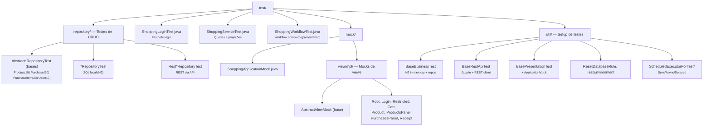

# br.com.wdc.shopping.tests

Módulo de **testes automatizados** da aplicação Shopping. Contém testes que exercitam desde serviços de negócio até workflows completos na camada de apresentação, sem necessidade de servidor HTTP ou navegador.

## Estrutura



## Abordagem

### Testes de repositório (`repository/`)

Os testes de repositório seguem uma hierarquia **Abstract → Concreto**:

- **`Abstract*RepositoryTest`** — define todos os cenários de teste (insert, update, delete, fetch, projeções, paginação, critérios, casos de borda)
- **`*RepositoryTest`** — estende o abstrato usando repositórios SQL locais (H2 in-memory via JDBI)
- **`Rest*RepositoryTest`** — estende o abstrato usando repositórios REST (OkHttp + Gson → Javalin → H2)

Isso garante que ambas as implementações (SQL direta e REST) passam exatamente pelos mesmos testes de contrato.

Cenários cobertos:

- **Projeções** (`ProjectionValues`) para verificar que apenas campos solicitados são retornados
- **Critérios de filtro** (por ID, por campos específicos, por FK)
- **Paginação** (`offset` / `limit`) e **ordenação** (`OrderBy.ACENDING` / `DESCENDING`)
- **Casos de borda**: IDs inexistentes, delete sem resultados, constraints de FK

Cada teste parte de um banco limpo com dados de seed (`DBReset`), garantindo determinismo.

| Classe base | Repositório | Testes | Implementações |
|---|---|---|---|
| `AbstractUserRepositoryTest` | `UserRepository` | 17 | SQL, REST |
| `AbstractProductRepositoryTest` | `ProductRepository` + `fetchImage` | 19 | SQL, REST |
| `AbstractPurchaseRepositoryTest` | `PurchaseRepository` | 20 | SQL, REST |
| `AbstractPurchaseItemRepositoryTest` | `PurchaseItemRepository` | 23 | SQL, REST |

### Testes de serviço (`ShoppingServiceTest`)

Exercitam diretamente os serviços e repositórios do domínio (login, consulta de produtos, compras, recibos) sobre um banco H2 in-memory populado com dados de seed (`DBReset`).

### Testes de apresentação (`ShoppingLoginTest`, `ShoppingWorkflowTest`)

Simulam a interação do usuário **no nível de apresentação** usando mocks de view. Cada view mock expõe o `state` e o `presenter`, permitindo:

1. Chamar ações do presenter como o usuário faria (ex.: `loginView.presenter.onEnter()`)
2. Inspecionar o estado resultante (ex.: `restrictedView.state.errorCode`)
3. Navegar entre telas verificando transições (ex.: login → home → produto → carrinho → recibo)

#### Exemplo: workflow completo de compra

```java
public class ShoppingWorkflowTest extends BasePresentationTest {

    @Test
    public void testComprarProduto() throws Exception {
        Routes.login(this.app);
        var rootView = this.app.getRootView();

        // Login
        var loginView = LoginViewMock.cast(rootView.state.contentView);
        loginView.state.userName = "admin";
        loginView.state.password = "admin";
        loginView.presenter.onEnter();

        // Navegar para produto
        var restrictedView = RestrictedViewMock.cast(rootView.state.contentView);
        restrictedView.presenter.onOpenProduct(DBReset.PEN_DRIVE2GB_ID);

        // Adicionar ao carrinho
        var produtoView = ProductViewMock.cast(restrictedView.state.contentView);
        produtoView.presenter.onAddToCart(1);

        // Finalizar compra
        var carrinhoView = CartViewMock.cast(restrictedView.state.contentView);
        carrinhoView.presenter.onBuy();

        // Verificar recibo
        var reciboView = ReceiptViewMock.cast(restrictedView.state.contentView);
        Assert.assertNotNull(reciboView.state.receipt);
    }
}
```

Este teste navega por **5 telas** (login → home → produto → carrinho → recibo) exercitando presenters reais com repositórios reais — apenas as views são mocks.

## Infraestrutura de teste

### `BaseBusinessTest`

- Cria banco H2 in-memory (`jdbc:h2:mem:wedocode-shopping`)
- Configura `SqlDataSource`, `ScheduledExecutor` e `RepositoryBootstrap`
- No `@Before` de cada teste, executa `DBCreate` + `DBReset` (banco limpo a cada teste)

### `BasePresentationTest`

Estende `BaseBusinessTest` e instancia `ShoppingApplicationMock`, que registra view mocks via `Presenter.createView`.

### View mocks

Cada mock (`LoginViewMock`, `CartViewMock`, etc.) estende `AbstractViewMock<P>` e expõe:
- `state` — o `ViewState` do presenter (acesso direto para leitura/escrita)
- `presenter` — o presenter real para invocar ações
- `cast(CubeView)` — método estático para obter o mock com asserção de tipo

## Dependências

- `persistence.impl` — repositórios SQL reais
- `br.com.wdc.shopping.presentation` — presenters e serviços reais
- `br.com.wdc.shopping.scripts` — `DBCreate` / `DBReset` para setup do banco
- `persistence.rest` — controllers REST (para testes REST)
- `persistence.client` — client REST (OkHttp + Gson)
- H2 Database — banco in-memory
- Javalin — servidor HTTP embarcado para testes REST
- JUnit 4 — framework de testes
- Logback — logging nos testes
