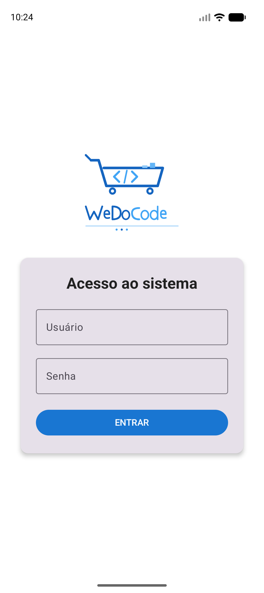
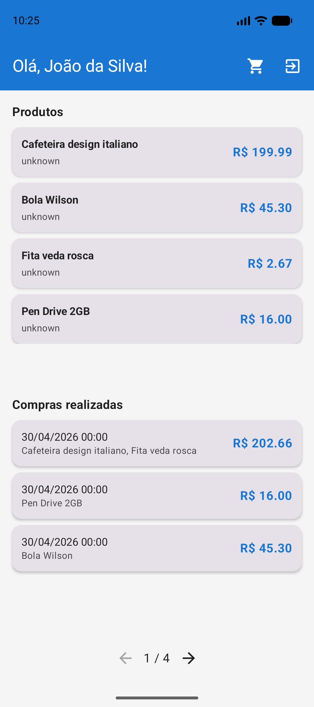
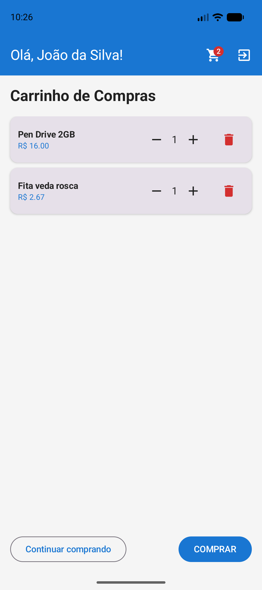
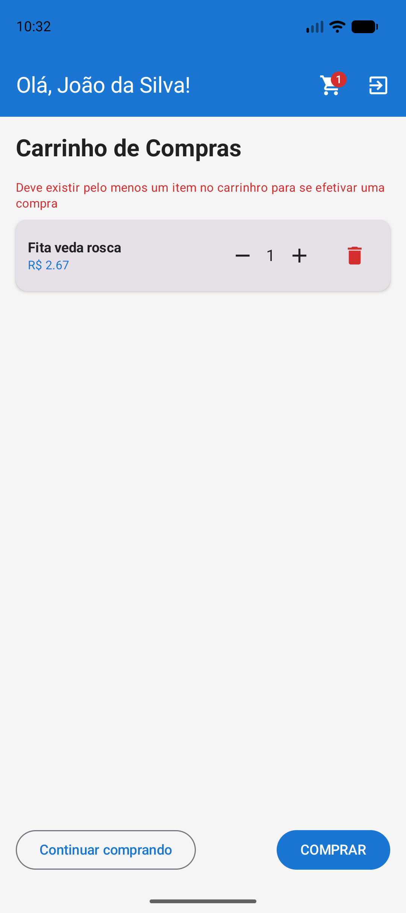

# WeDoCode Shopping — Android

Aplicativo Android nativo construído com **Kotlin + Jetpack Compose**, demonstrando como o framework **Cube MVP** permite compartilhar **100% da lógica de apresentação** entre frontends completamente diferentes — Desktop (JavaFX), Web (React) e Mobile (Android) — sem duplicar uma única linha de regra de negócio.

---

## Por que Cube MVP?

A maioria das arquiteturas mobile acopla a lógica de negócio à plataforma. Quando surge a necessidade de um novo frontend (web, desktop, wearable), a escolha é reescrever ou manter duas bases sincronizadas manualmente.

O **Cube MVP** resolve isso com uma separação radical:

```
┌──────────────────────────────────────────────────────────────────┐
│                      Camada de Apresentação                      │
│         (Java puro — sem dependência de UI framework)            │
│                                                                  │
│   Presenters  ←→  ViewState  ←→  CubeNavigation  ←→  Routes      │
└──────────┬───────────────────────────────────────────────────────┘
           │  interface CubeView { update(), release() }
           │  interface CubeViewSlot { setView(CubeView) }
           │
┌──────────▼─────────┐  ┌──────────────────┐  ┌────────────────────┐
│   Android/Compose  │  │   JavaFX/FXML    │  │   React/TypeScript │
│   (este projeto)   │  │   (view.jfx)     │  │   (view.react)     │
└────────────────────┘  └──────────────────┘  └────────────────────┘
```

### O que é compartilhado entre os 3 frontends?

| Camada | Módulo | Compartilhado? |
|--------|--------|:--------------:|
| Domínio (entidades, repositórios) | `shopping.domain` | ✅ 100% |
| Persistência (SQL, JDBI, H2) | `shopping.persistence` | ✅ 100% |
| Apresentação (presenters, navegação, estado) | `shopping.presentation` | ✅ 100% |
| UI (renderização visual) | `view.android` / `view.jfx` / `view.react` | ❌ Específico |

**O resultado:** cada frontend é uma _thin view layer_ de ~15 arquivos que apenas renderiza o estado que o presenter já calculou. Zero lógica duplicada.

---

## Screenshots

<p align="center">
  
  &nbsp;&nbsp;
  
  &nbsp;&nbsp;
  
</p>
<p align="center">
  
  &nbsp;&nbsp;
  
  &nbsp;&nbsp;
  
</p>

> **Para gerar os screenshots:** execute o app no emulador e use `adb exec-out screencap -p > docs/screenshots/<nome>.png`

---

## Arquitetura do App

### Visão Geral

```
MainActivity
 └─ onCreate()
     ├─ initializeBackend()      → H2, JDBI, Repositórios
     ├─ ShoppingAndroidApplication()
     │    └─ companion init { }  → Registra fábricas de view
     ├─ Routes.root(app)         → Inicia navegação Cube
     ├─ AndroidRenderLoop.start()→ Choreographer vsync loop
     └─ setContent { }           → RootComposable → RenderView()
```

### Integração Compose ↔ Cube MVP

O desafio central é que o Cube MVP atualiza estado em **threads de background** (pool de I/O), mas o Compose exige que `MutableState` seja escrito na **main thread**. A solução usa dois mecanismos:

#### 1. AndroidRenderLoop (Choreographer)

```
Background Thread              Main Thread (vsync)
─────────────────              ───────────────────
presenter.update()             AndroidRenderLoop.flushDirtyViews()
  → view.update()                → view.doUpdate()
    → markDirty(view)              → revision.value++ → Recomposição
```

- O presenter chama `view.update()` de qualquer thread
- A view é marcada como "dirty" em um `ConcurrentHashMap`
- No próximo frame vsync (~16ms), o Choreographer flush todas as dirty views **na main thread**
- `revision.value++` dispara recomposição do Compose

#### 2. ComposeViewSlot (pending/flush)

Para slots de navegação (ex: a HomeView tem 3 slots — conteúdo, painel de produtos, painel de compras):

```kotlin
class ComposeViewSlot : CubeViewSlot {
    @Volatile private var pending: CubeView? = null  // escrito em background
    val current: MutableState<CubeView?> = mutableStateOf(null)  // lido pelo Compose

    fun flush() {  // chamado na main thread via doUpdate()
        current.value = pending
    }
}
```

### Hierarquia de Views

```
RootComposable
 └─ RenderView(contentSlot)
     ├─ LoginComposable          → Login com logo WeDoCode
     └─ HomeComposable           → Scaffold + TopAppBar
         ├─ ProductsPanelComposable → Lista de produtos (LazyColumn)
         ├─ PurchasesPanelComposable → Compras com paginação
         ├─ CartComposable        → Carrinho com ±/delete
         ├─ ProductComposable     → Detalhe + imagem (Coil)
         └─ ReceiptComposable     → Comprovante de compra
```

### ViewDispatcher — O Switch Central

```kotlin
@Composable
fun RenderView(view: CubeView?) {
    when (view) {
        is LoginViewAndroid    -> LoginComposable(view)
        is HomeViewAndroid     -> HomeComposable(view)
        is CartViewAndroid     -> CartComposable(view)
        is ProductViewAndroid  -> ProductComposable(view)
        is ReceiptViewAndroid  -> ReceiptComposable(view)
        // ...
    }
}
```

O presenter **não sabe** que está rodando no Android. Ele apenas chama `slot.setView(myView)` e `view.update()`. O binding Compose faz o resto.

---

## Stack Tecnológica

| Camada | Tecnologia |
|--------|-----------|
| **UI** | Jetpack Compose + Material 3 |
| **Apresentação** | Cube MVP (presenters Java puros) |
| **Imagens** | Coil 2.7 (async loading + cache) |
| **HTML** | Parser leve → AnnotatedString (bullets, quebras de linha) |
| **Persistência** | H2 Database embarcado + JDBI |
| **Threading** | ScheduledExecutorService + Choreographer vsync |
| **Linguagem** | Kotlin 2.1 (view) + Java 26 (domínio/apresentação) |
| **Min SDK** | API 26 (Android 8.0) |
| **Target SDK** | API 35 (Android 15) |

---

## Estrutura de Arquivos

```
app/src/main/java/br/com/wdc/shopping/view/android/
├── MainActivity.kt                     → Bootstrap: H2, repositórios, app Cube, Compose
├── AbstractViewAndroid.kt              → Base CubeView com revision (MutableState<Int>)
├── AndroidRenderLoop.kt               → Choreographer vsync + ConcurrentHashMap de dirty views
├── ComposeViewSlot.kt                  → CubeViewSlot → pending/flush para MutableState
├── ScheduledExecutorAndroidAdapter.kt  → Ponte ScheduledExecutor → pool thread
├── ShoppingAndroidApplication.kt       → Fábricas de view + updateHistory()
├── impl/                               → CubeView concretas (thin wrappers)
│   ├── RootViewAndroid.kt              → 1 slot (conteúdo)
│   ├── HomeViewAndroid.kt              → 3 slots (conteúdo, produtos, compras)
│   └── ...ViewAndroid.kt              → 6 views simples (sem slots)
└── ui/                                 → Composables de renderização
    ├── ViewDispatcher.kt               → RenderView(): CubeView → Composable
    ├── RunAsync.kt                     → Helper para chamar presenters em background
    ├── HtmlText.kt                     → Parser HTML → AnnotatedString
    ├── Theme.kt                        → Material 3 light/dark
    └── *Composable.kt                  → 8 telas do app
```

---

## Como rodar

### Pré-requisitos

- **Android Studio** Ladybug 2024.2+ (ou superior)
- **Android SDK 35**
- **JDK 26** (Temurin) para compilar os módulos Java
- **JDK 17** (Gradle do Android usa JDK 17)

### 1. Compile os módulos Java para o Maven Local

```bash
export JAVA_HOME=/Library/Java/JavaVirtualMachines/temurin-26.jdk/Contents/Home

cd fontes/
./build-android-deps.sh
```

Este script compila com o perfil `-Pandroid-compat` (target Java 22, sem preview features) para compatibilidade com o D8/R8 do Android.

### 2. Abra no Android Studio

```
File → Open → fontes/br.com.wdc.shopping/br.com.wdc.shopping.view.android/
```

### 3. Sync Gradle & Run

- **Sync Gradle** (baixa dependências do `mavenLocal()`)
- **Build → Make Project**
- **Run** no emulador ou dispositivo

### Build via terminal

```bash
cd fontes/br.com.wdc.shopping/br.com.wdc.shopping.view.android
./gradlew assembleDebug
```

---

## Credenciais padrão

| Usuário | Senha |
|---------|-------|
| `admin` | `admin` |

---

## Comparação: esforço por frontend

O poder do Cube MVP fica evidente ao comparar o esforço de criação de cada frontend:

| Métrica | Android (Compose) | JavaFX (FXML) | React (TypeScript) |
|---------|:-----------------:|:--------------:|:------------------:|
| Arquivos de UI | ~15 | ~15 | ~20 |
| Presenters escritos | 0 | 0 | 0 |
| Regras de negócio duplicadas | 0 | 0 | 0 |
| Navegação customizada | 0 | 0 | 0 |
| Modelo de dados reescrito | 0 | 0 | 0 |

**Cada novo frontend é apenas uma camada de renderização** — um "skin" sobre a mesma lógica. A curva de aprendizado se resume a entender as 3 interfaces do Cube:

```java
interface CubeView {
    void update();    // presenter → view: "re-renderize"
    void release();   // cleanup
}

interface CubeViewSlot {
    void setView(CubeView view);  // presenter → view: "mude o conteúdo deste slot"
}

interface CubePresenter {
    boolean applyParameters(CubeIntent intent, boolean init, boolean deepest);
}
```

---

## Princípios de Design

1. **Presenter é dono do estado** — a view apenas lê `presenter.state.*`
2. **View não navega** — toda navegação passa por `Routes.*` → `CubeNavigation`
3. **Thread-safe por design** — background threads marcam dirty; main thread flush
4. **Zero dependência de plataforma nos presenters** — Java puro, testável sem emulador
5. **Composables são funções puras** — recebem a view, leem o estado, renderizam

---

## Licença

Propriedade de **WeDoCode** — todos os direitos reservados.
