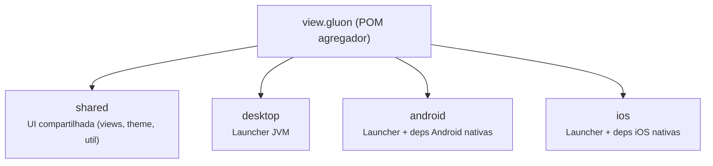
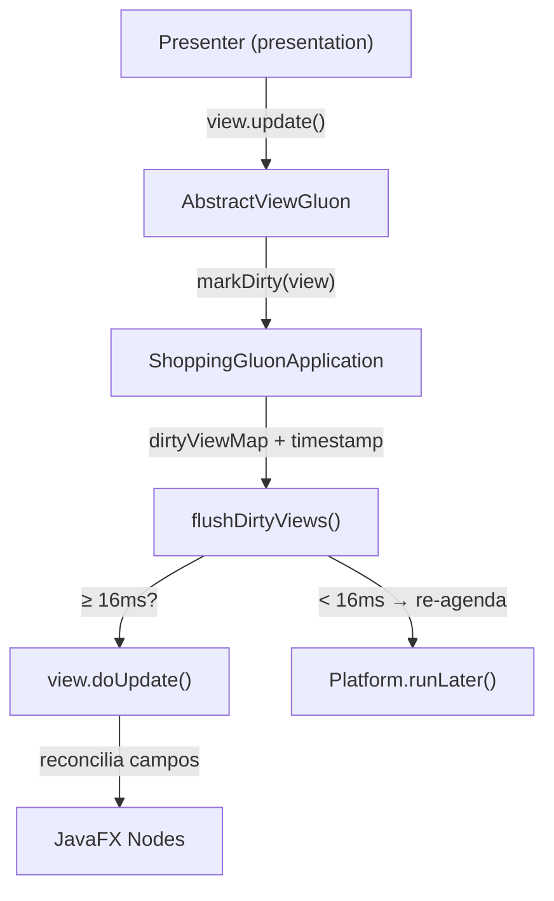
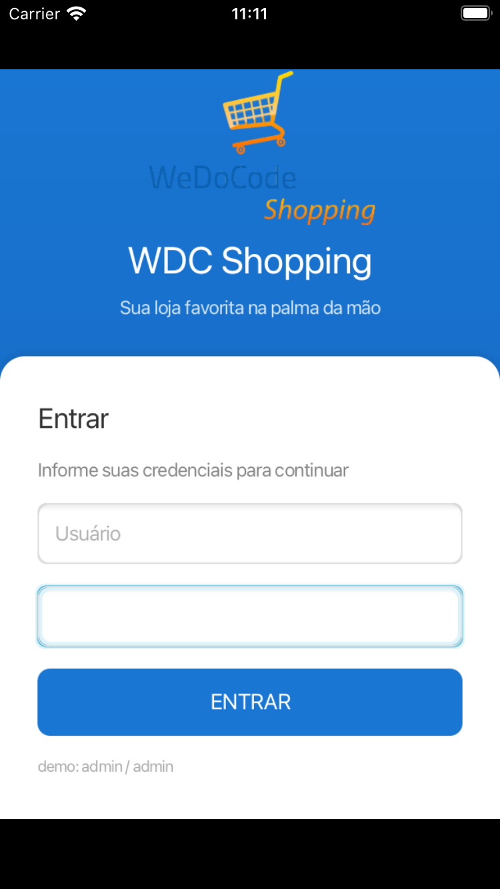
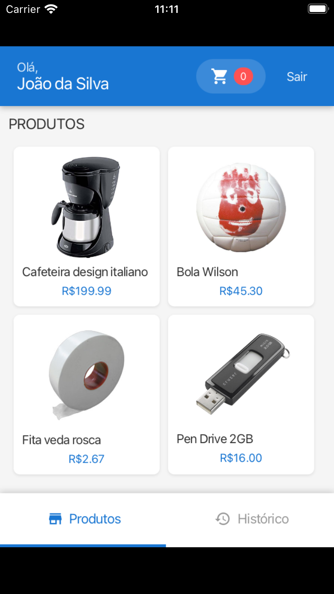
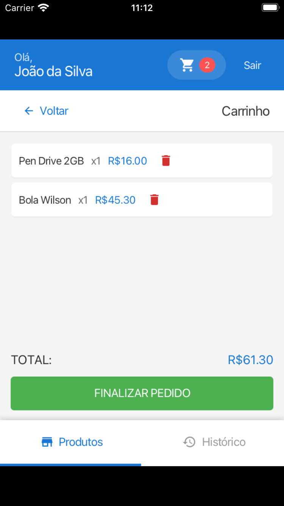
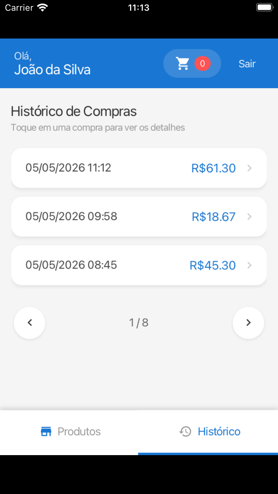
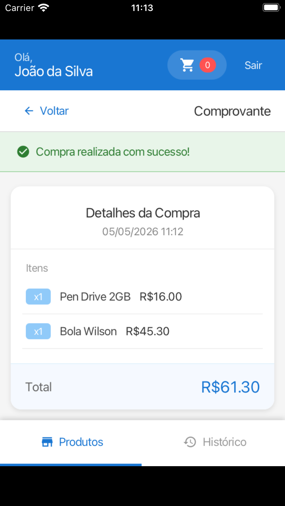

# br.com.wdc.shopping.view.gluon

Implementação **multiplataforma móvel** (iOS e Android) e **desktop** da aplicação **WeDoCode Shopping** utilizando [Gluon Mobile](https://gluonhq.com/) + JavaFX, com compilação nativa via GraalVM Native Image. Compartilha os mesmos Presenters, ViewStates e lógica de negócio das demais implementações (React, Vaadin, SWT) — apenas a camada de visualização é específica.

## Motivação

O Gluon Mobile permite escrever uma **única base de código JavaFX** que é compilada nativamente para iOS, Android e Desktop (AOT via GraalVM). O módulo demonstra que a separação **Cube MVP** funciona inclusive em cenários de compilação ahead-of-time com acesso a APIs nativas de dispositivo (display, lifecycle, storage, statusbar).

| Aspecto | Desktop (JVM) | iOS (nativo) | Android (nativo) |
|---------|---------------|--------------|------------------|
| **Runtime** | JVM HotSpot | GraalVM Native Image | GraalVM Native Image |
| **Target** | `host` | `ios` / `ios-sim` | `android` |
| **APIs nativas** | Gluon Attach (desktop) | Gluon Attach (iOS) | Gluon Attach (Android) |
| **Persistência** | API REST (remota) | API REST (remota) | API REST (remota) |

## Estrutura de Módulos



### Módulo Shared

Contém toda a lógica de visualização reutilizada entre as plataformas:

| Pacote | Conteúdo |
|--------|----------|
| `view.gluon` | `ShoppingGluonMain` (Application), `ShoppingGluonApplication`, `AbstractViewGluon` |
| `view.gluon.impl` | Views: `RootViewGluon`, `LoginViewGluon`, `HomeViewGluon`, `CartViewGluon`, `ProductViewGluon`, `ReceiptViewGluon`, `ProductsPanelViewGluon`, `PurchasesPanelViewGluon` |
| `view.gluon.theme` | `GluonStyles`, `GluonColors`, `GluonIcons` |
| `view.gluon.util` | `GluonDom`, `ResourceCatalog` |

### Módulos de Plataforma

Cada módulo de plataforma fornece apenas um **Launcher** que configura o classpath nativo e as dependências Gluon Attach específicas:

- `ShoppingGluonDesktopLauncher` — executa em JVM padrão
- `ShoppingGluonIosLauncher` — compilado para ARM64 iOS
- `ShoppingGluonAndroidLauncher` — compilado para Android

## Pré-requisitos

- **Java 21+** (Microsoft OpenJDK ou similar)
- **Maven 3.9+**
- **GraalVM** (para compilação nativa iOS/Android) — recomendado: `graalvm-gluon-23`
- **Xcode** + Command Line Tools (para iOS)
- **Android SDK** + NDK (para Android)

## Como Executar

### Desktop (JVM)

```bash
cd fontes/br.com.wdc.shopping/br.com.wdc.shopping.view.gluon/br.com.wdc.shopping.view.gluon.desktop
mvn javafx:run
```

### iOS (Simulador)

```bash
cd fontes/br.com.wdc.shopping/br.com.wdc.shopping.view.gluon/gluon.ios

# Build completo + deploy no simulador (detecta automaticamente o simulador Booted)
./build.sh --native --sim --deploy

# Build completo + deploy no simulador tablet
./build.sh --native --sim --tablet --deploy

# Apenas deploy (reutiliza build anterior)
./build.sh --deploy-only --sim
```

O script `build.sh` detecta automaticamente o simulador com status `Booted` do form factor selecionado (phone/tablet). Em Apple Silicon aplica automaticamente um workaround para o profile `ios-sim` que não funciona no GluonFX 1.0.25 (ver [README do módulo](gluon.ios/README.md) para detalhes).

### iOS (Dispositivo físico)

```bash
cd fontes/br.com.wdc.shopping/br.com.wdc.shopping.view.gluon/br.com.wdc.shopping.view.gluon.ios
mvn gluonfx:build gluonfx:package -Pgluonfx-ios
```

### Android

```bash
cd fontes/br.com.wdc.shopping/br.com.wdc.shopping.view.gluon/br.com.wdc.shopping.view.gluon.android
mvn gluonfx:build gluonfx:package
```

## Tecnologias

| Tecnologia | Versão | Uso |
|------------|--------|-----|
| JavaFX | 21.0.7 | UI toolkit |
| Gluon Attach | 4.0.22 | APIs nativas (display, lifecycle, storage, statusbar) |
| GluonFX Maven Plugin | 1.0.25 | Compilação nativa (GraalVM substrate) |
| H2 Database | — | Persistência local (iOS/Android) |
| SLF4J + Logback | — | Logging |

## Arquitetura

Segue o padrão **Cube MVP** do projeto:



### Ciclo de atualização com throttling de 16ms

O ciclo de atualização agrupa e limita as atualizações de views para evitar renderizações excessivas:

1. O **Presenter** chama `view.update()` ao modificar o ViewState
2. `AbstractViewGluon.update()` delega para `app.markDirty(view)`, que registra a view num `dirtyViewMap` com o timestamp atual (nanosegundos)
3. `scheduleFlush()` agenda `flushDirtyViews()` via `Platform.runLater()` (uma única vez por ciclo)
4. `flushDirtyViews()` percorre o mapa e só processa views cujo timestamp tenha **pelo menos 16ms de idade** (`FRAME_INTERVAL_NS = 16_000_000L`)
5. Views que ainda não completaram os 16ms permanecem no mapa e são re-agendadas
6. Cada `doUpdate()` faz reconciliação incremental — compara o valor antigo com o novo e só altera os nós JavaFX que realmente mudaram

Esse mecanismo garante no máximo ~60 atualizações/segundo por view (alinhado ao frame rate de 60 FPS), agrupando múltiplas chamadas `update()` dentro da mesma janela de 16ms numa única reconciliação.

## Screenshots

### Login



Card centralizado com campos de usuário/senha. Credenciais padrão: `admin` / `admin`.

### Página Inicial — Produtos e Histórico



Catálogo de produtos com cards clicáveis e histórico de compras com paginação.

### Detalhe do Produto


Imagem, descrição, seletor de quantidade e botão de adicionar ao carrinho.

### Carrinho de Compras



Lista de itens com preço, quantidade e remoção individual. Total calculado em tempo real.

### Listagem de Compras



Histórico de compras realizadas com paginação.

### Recibo de Compra



Confirmação de compra com recibo detalhado.
