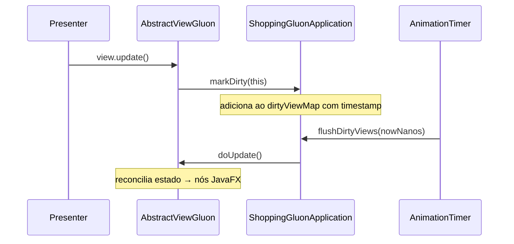
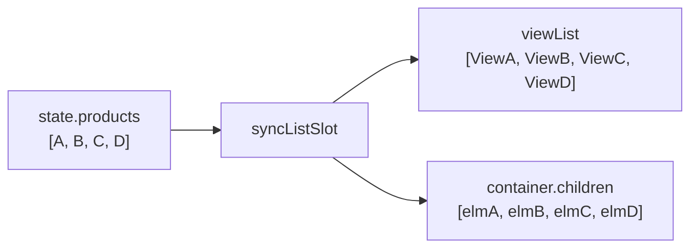
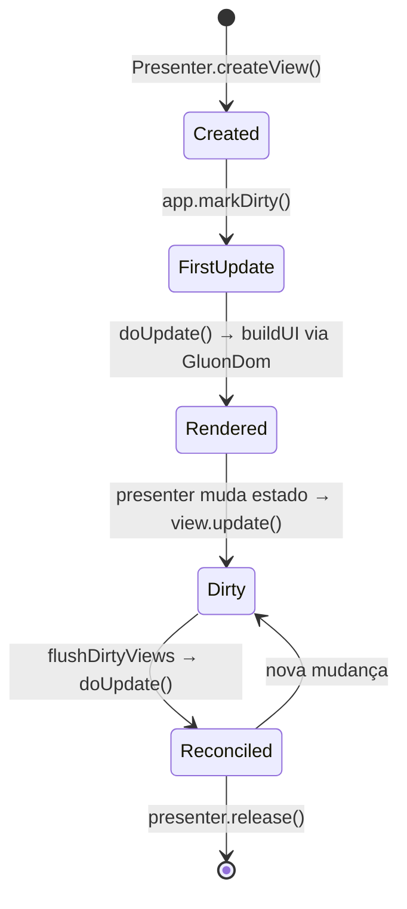

# br.com.wdc.shopping.view.gluon.shared

Módulo compartilhado que contém **toda a lógica de visualização** da aplicação Gluon. É o coração da camada de view — os módulos de plataforma (desktop, ios, android) são apenas launchers finos que delegam a este módulo.

## Arquitetura de Integração com a Apresentação

A integração entre o Gluon/JavaFX e a camada de apresentação (Cube MVP) se dá por três mecanismos centrais:

### 1. View Factories (registro estático)

Cada Presenter do Cube declara um campo estático `createView` que é uma factory responsável por instanciar a View correspondente. O `ShoppingGluonApplication` registra todas as factories no bloco `static`:

```java
static {
    RootPresenter.createView = p -> new RootViewGluon((ShoppingGluonApplication) p.app, p);
    LoginPresenter.createView = p -> new LoginViewGluon((ShoppingGluonApplication) p.app, p);
    HomePresenter.createView = p -> new HomeViewGluon((ShoppingGluonApplication) p.app, p);
    // ...
}
```

Isso permite que a camada de apresentação crie views sem conhecer a implementação concreta (Gluon, Swing, Vaadin, React, etc).

### 2. Render Loop via AnimationTimer (dirty-check)

A sincronização entre os ViewStates e a árvore de nós JavaFX é feita por um loop de renderização baseado em `AnimationTimer`:



O `AnimationTimer` dispara a cada frame (~60 fps). Apenas views marcadas como "dirty" cujo timestamp ultrapassou o intervalo mínimo (`FRAME_INTERVAL_NS = 16ms`) são atualizadas. Isso evita:

- Múltiplas atualizações redundantes no mesmo frame
- Conflitos de thread (o `flushDirtyViews` roda na JavaFX Application Thread)
- Overhead de reconciliação desnecessária

O `dirtyViewMap` é um `ConcurrentHashMap` porque `markDirty()` pode ser chamado de threads de background (callbacks REST, timers, etc).

### 3. Reconciliação incremental (doUpdate)

Cada view implementa `doUpdate()` seguindo o padrão de **reconciliação incremental por campo** — similar ao virtual DOM, mas sem diff genérico:

```java
@Override
public void doUpdate() {
    if (this.notRendered) {
        GluonDom.render((VBox) this.element, this::buildUI);
        this.notRendered = false;
    }

    if (!Objects.equals(this.nickNameOldValue, this.state.nickName)) {
        this.nickNameElm.setText(this.state.nickName);
        this.nickNameOldValue = this.state.nickName;
    }
    // ...
}
```

Cada campo do ViewState é comparado com o valor anterior. Apenas quando há diferença o nó JavaFX correspondente é mutado. Isso é O(n) no número de campos, não no número de nós da árvore.

## GluonDom — DSL de Construção de UI

A classe `GluonDom` é um builder fluente que constrói a árvore de nós JavaFX de forma declarativa, mantendo o rastreamento do container pai via uma pilha implícita:

```java
GluonDom.render((VBox) this.element, (dom, root) -> {
    dom.hbox(appBar -> {
        appBar.setAlignment(Pos.CENTER_LEFT);
        appBar.setSpacing(10);

        dom.label(greeting -> {
            greeting.setText("Olá,");
            greeting.setStyle(GluonStyles.TEXT_SMALL_WHITE);
        });

        dom.hSpacer();

        dom.button(exitBtn -> {
            exitBtn.setText("Sair");
            exitBtn.setOnAction(e -> safeAction("Exit", presenter::onExit));
        });
    });
});
```

**Princípio de funcionamento:**

- `render(root, renderer)` cria um `GluonDom` com o `currentParent` apontando para `root`
- Métodos de container (`vbox`, `hbox`, `stackPane`, `flowPane`) salvam o `currentParent`, criam o novo nó, apontam `currentParent` para ele, invocam o callback, restauram o pai original e adicionam o nó ao pai anterior
- Métodos de folha (`label`, `button`, `textField`, `imageView`) criam o nó, invocam o callback de configuração e adicionam ao `currentParent`
- Spacers (`hSpacer`, `vSpacer`) criam `Region` com `Priority.ALWAYS` para preencher espaço disponível

Isso elimina o aninhamento verboso de `new VBox(new HBox(new Label(...)))` e permite construir UIs complexas de forma legível e composicional.

## Sincronização de Listas (newListSlot)

O mecanismo `newListSlot` na `AbstractViewGluon` resolve o problema de sincronizar uma lista de dados (do ViewState) com uma lista de views filhas (nós JavaFX), de forma eficiente e sem recriação:

```java
protected <T, V extends AbstractViewGluon<?>> BiConsumer<List<T>, List<V>> newListSlot(
        Pane container, Supplier<V> factory, BiConsumer<V, T> updater) {
    return (items, viewList) -> syncListSlot(container, items, viewList, factory, updater);
}
```

**Algoritmo (`syncListSlot`):**

1. Se `viewList` tem mais itens que `items` → remove os excedentes (do final)
2. Se `viewList` tem menos itens que `items` → cria novos via `factory` e adiciona ao container
3. Para cada item existente → chama `updater(view, item)` para reconciliar



Uso típico:

```java
// Na buildUI:
this.contentSlot = this.newListSlot(flowPane, this::newItemView, this::updateItem);

// Na doUpdate:
this.contentSlot.accept(this.state.products, this.itemViewList);
```

O pattern evita recriações completas — views já existentes são reutilizadas e apenas seus dados são atualizados. A operação é O(n) no tamanho da lista.

## safeAction — Tratamento de Erros em Callbacks

Todo evento de UI (cliques, submits) é encapsulado por `safeAction`:

```java
protected void safeAction(String context, Runnable action) {
    try {
        action.run();
    } catch (Exception caught) {
        this.app.alertUnexpectedError(LOG, context, caught);
    }
}
```

**Por que existe:**

- Exceções em handlers JavaFX (`onAction`, `onMouseClicked`) são engolidas silenciosamente pelo framework se não tratadas
- O `safeAction` captura qualquer exceção, loga com contexto descritivo e exibe um Alert ao usuário
- Evita que um bug em um callback quebre o estado da aplicação inteira

Uso:

```java
card.setOnMouseClicked(
    e -> safeAction("Open product", () -> presenter.onOpenProduct(product.id)));
```

## Estrutura de Pacotes

| Pacote | Responsabilidade |
|--------|-----------------|
| `view.gluon` | Classes base: `AbstractViewGluon`, `ShoppingGluonApplication`, `ShoppingGluonMain` |
| `view.gluon.impl` | Implementações concretas de cada view (uma por Presenter) |
| `view.gluon.theme` | Design tokens: `GluonStyles` (inline CSS), `GluonColors` (paleta), `GluonIcons` (SVG paths) |
| `view.gluon.util` | `GluonDom` (DSL de build) e `ResourceCatalog` (cache de imagens) |

## Fluxo de Vida de uma View


