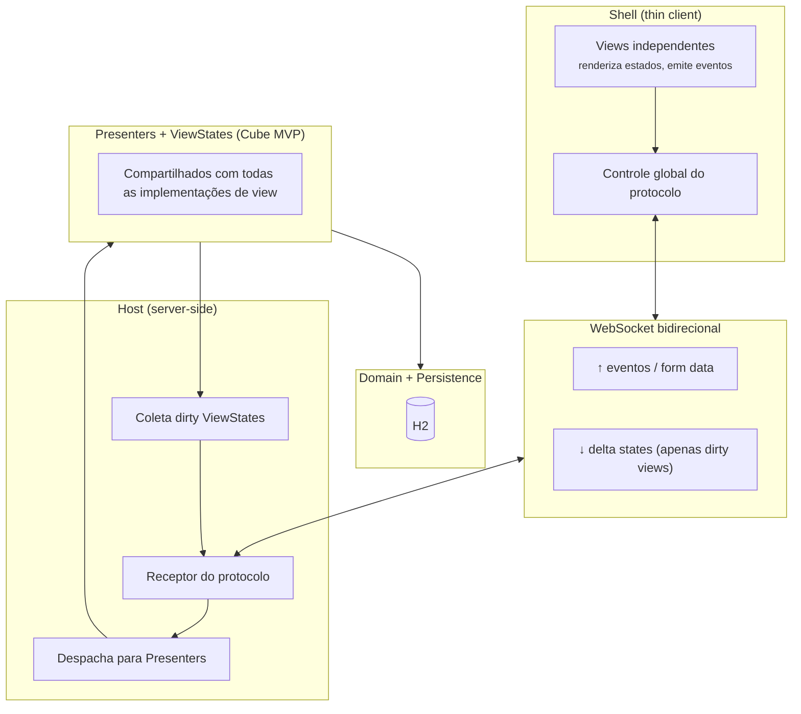
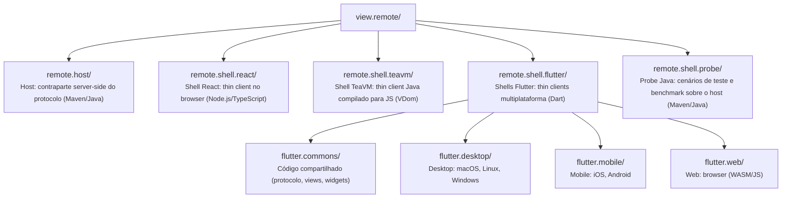
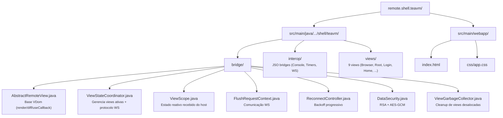
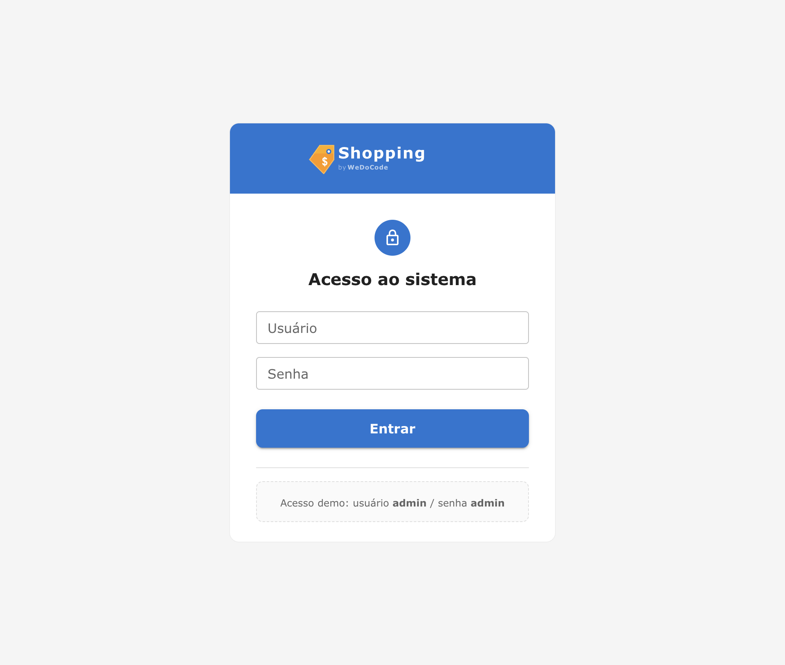
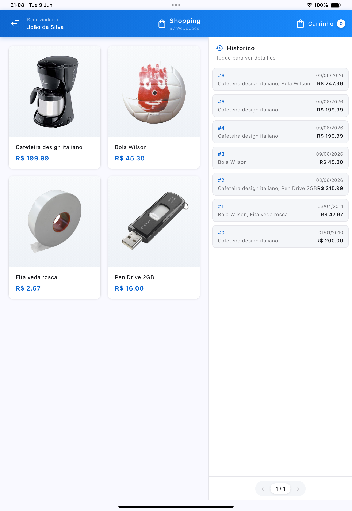
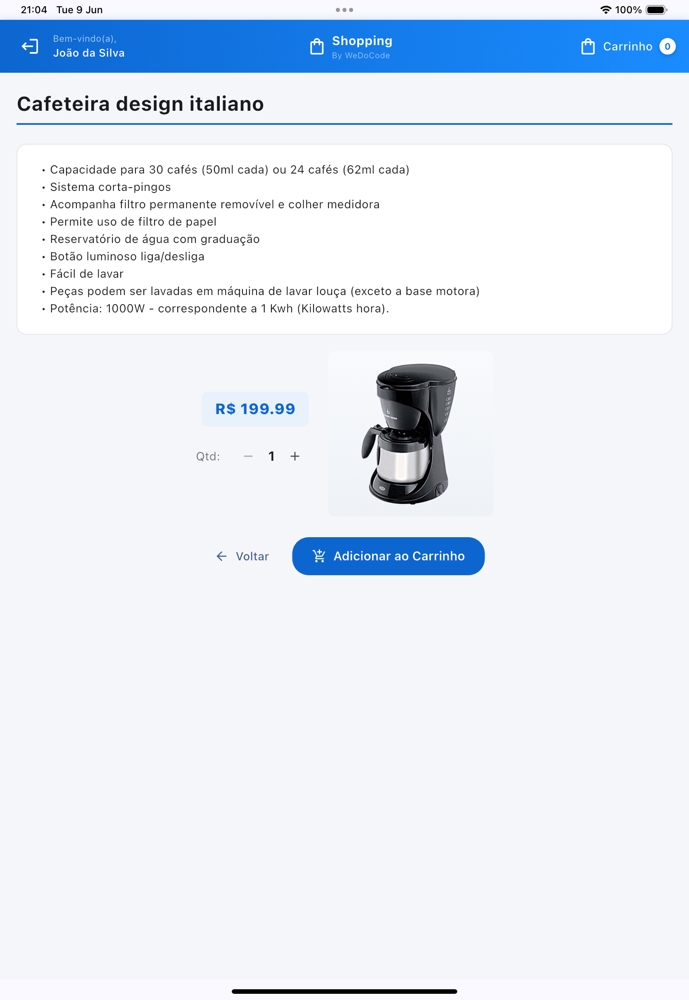
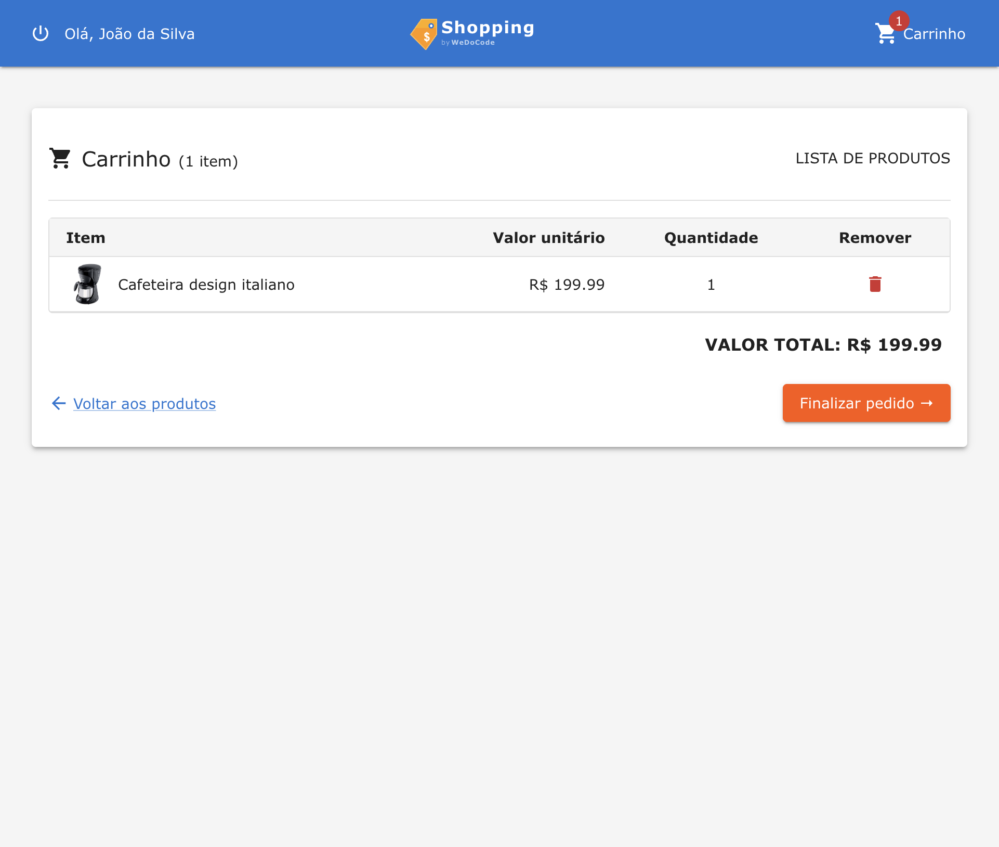
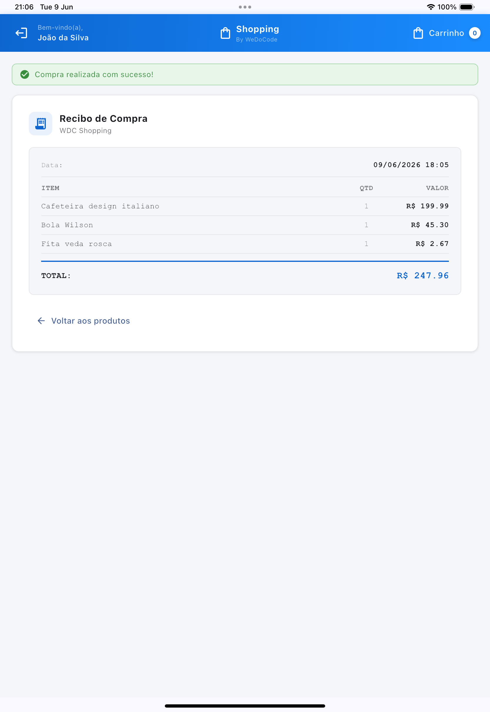

# br.com.wdc.shopping.view.remote

Implementação da técnica de **Remote Presentation** para a aplicação **WeDoCode Shopping**, baseada no padrão **Cube MVP**.

## Conceito

O módulo implementa um protocolo proprietário de **apresentação remota** — conceito análogo a um Remote Desktop, mas operando na camada de dados da aplicação em vez de pixels. O servidor mantém toda a lógica de negócio e estado das views; o cliente é um thin shell que apenas renderiza estados recebidos e emite eventos de interação do usuário.

### Como funciona

1. **O cliente (shell)** não possui lógica de negócio. Contém apenas as views, cada uma independente das demais. Eventos de interação do usuário são enviados diretamente dessas views. Um controle global no app utiliza o protocolo proprietário para encaminhar os pedidos ao servidor e receber de volta os novos estados das views que foram modificadas no backend — apenas as porções de dados que se tornaram "sujas" (dirty).

2. **O servidor (host)** é a contraparte desse protocolo. Recebe os pedidos vindos do cliente e os encaminha para a camada de apresentação, invocando os métodos nos Presenters correspondentes a cada view que existe no lado cliente. Após o processamento, coleta os ViewStates que mudaram e serializa apenas os deltas de volta.

O cliente atual é um browser (React), mas a arquitetura suporta qualquer tecnologia de renderização — poderia ser um aplicativo desktop nativo, mobile, ou qualquer outra superfície capaz de renderizar componentes e capturar eventos.



## Comparação com as outras implementações de view

| Aspecto | Remote (este módulo) | Vaadin (server-side) | JFX (desktop) | TeaVM (multiplataforma) |
|---------|---------------------|----------------------|---------------|------------------------|
| **Onde roda a UI** | Browser remoto (thin shell) | Browser via Server Push | JVM local | Browser / WebView (Tauri) |
| **Modelo** | Server-driven (delta states) | Server-driven (component tree) | Acesso direto em memória | Client-side (SPA) |
| **Transporte** | WebSocket (JSON delta) | Atmosphere (WebSocket/Push) | N/A (in-process) | REST (OkHttp → JS) |
| **Segurança** | RSA + AES-GCM + URL signing | HMAC-SHA256 URL signing | N/A (processo local) | HMAC + JWT |
| **Escalabilidade** | Virtual Threads (~1K por conexão) | Server Push automático | Instância única | Client-side (SPA) |
| **Código de UI** | TypeScript (React) / Dart (Flutter) | Java | Java | Java (compilado para JS) |
| **Presenters** | Mesmos | Mesmos | Mesmos | Mesmos |
| **ViewStates** | Mesmos | Mesmos | Mesmos | Mesmos |

## Estrutura de submódulos



Futuros clientes seguirão o padrão `remote.shell.<tecnologia>`.

### remote.host (Maven)

Servidor do protocolo de apresentação remota — recebe eventos do shell, despacha para os Presenters e devolve os ViewStates modificados:

| Classe | Responsabilidade |
|--------|------------------|
| `ApplicationReactImpl` | `ShoppingApplication` concreta; gerencia dirty views, dispatch de eventos, geração de resposta JSON |
| `ApplicationReactRegistry` | Registry de instâncias por sessão, lifecycle e cleanup |
| `GenericViewImpl` | Base abstrata: `instanceId`, `update()` (marca dirty), `syncClientToServer()`, `writeState()` |
| `BrowserPresenter` | Coordena navegação e dispatch de intent entre views |
| `AppSecurity` | RSA + SHA256withRSA para assinatura de URLs de navegação |
| `DataSecurity` | AES-GCM por sessão (derivado via PBKDF2, 250k iterações) para dados sensíveis |
| `ViewStateSerializer` | Serialização eficiente de ViewStates para JSON (apenas campos dirty) |
| `WebSocketConnection` | SPI — interface que o backend implementa para comunicação com o shell |

### remote.shell.react (Node.js — Parcel)

Thin client que atua como superfície de renderização no browser:

- **React 19** + **MUI 9** (Material UI) para componentes visuais
- **WebSocket** bidirecional para comunicação com o host
- **Sem lógica de negócio** — cada view renderiza o ViewState recebido e emite eventos de interação
- **Views independentes** — cada componente é autossuficiente, sem acoplamento entre views
- Build via **Parcel 2.13** — output copiado para `remote.host/META-INF/resources/`

### remote.shell.teavm (Maven — TeaVM)

Thin client em Java compilado para JavaScript via TeaVM, usando **Virtual DOM** (VNode API) com Spectrum Web Components:

- **VNode API** declarativa — `render()` retorna árvore virtual, framework faz diff eficiente
- **WebSocket** bidirecional para comunicação com o host (mesmo protocolo do shell React)
- **Sem lógica de negócio** — cada view renderiza o ViewState recebido via `ViewScope` e emite eventos
- **useCallback(key, listener)** — cache de listeners paramétricos para estabilidade de referência no diff
- **Stable fields** — listeners sem parâmetros extraídos para campos `final` (zero custo no diff)
- **Compact Css** — aliases (`u`/`c`/`icon`) para classes utilitárias do design system
- Build via **Maven + plugin TeaVM** — output em `target/classes/META-INF/resources/`



### remote.shell.flutter (Maven + Flutter/Dart)

Shells Flutter multiplataforma — thin clients em Dart que compartilham código via `flutter.commons`:

- **flutter.commons** — biblioteca compartilhada: protocolo WebSocket, segurança RSA+AES-GCM, views, widgets e design tokens
- **flutter.desktop** — app nativo macOS/Linux/Windows; build via `build.sh` (auto-detecta plataforma)
- **flutter.mobile** — app iOS/Android com deploy via `deploy.sh` (suporta simuladores, emuladores e devices físicos)
- **flutter.web** — app web via Flutter WASM/JS

### remote.shell.probe (Maven/Java)

Executa cenários programáticos sobre o host remoto — usado para benchmarks de throughput, medição de memória por sessão e validação comportamental:

- **`ConcurrentThroughputScenario`** — mede throughput com múltiplas sessões paralelas
- **`MemoryPerSessionScenario`** — mede consumo de memória por sessão ativa
- **`ComprarProdutoScenario`** — valida fluxo completo de compra via protocolo remoto
- Usa `remote.bridge.java` (framework) como base para conexão com o host

## Fluxo de comunicação

```
1. Shell conecta: ws://host/dispatcher/{sessionId}
2. Handshake de segurança:
   - Shell envia cookie app_signature (RSA-encrypted AES password)
   - Host deriva chave AES-256 via PBKDF2 (salt + 250k iterações)
3. Ciclo request/response:
   - Shell → Host: { requestId, eventCode, formData }
   - Host:
     a. syncClientToServer() — atualiza form data nas views
     b. submit() — despacha evento para o Presenter correto
     c. Presenter atualiza ViewState → marca views dirty
     d. commitComputedState() — propaga estados derivados
     e. Serializa apenas views dirty → JSON delta
   - Host → Shell: { requestId, uri, states: [...] }
4. Shell aplica delta nos componentes (reconciliação React)
```

Apenas **views modificadas** (dirty) são enviadas a cada resposta — transferência mínima, análoga a um Remote Desktop enviando apenas as regiões da tela que mudaram.

## Segurança

### Camada 1: Assinatura de navegação
- Cada URL/intent inclui parâmetro `sign` = `Base62(MD5(SHA256withRSA(intent)))`
- Servidor valida antes de navegar — previne manipulação de URLs

### Camada 2: Criptografia de dados sensíveis
- Chave AES-256 derivada por sessão via PBKDF2 (250.000 iterações)
- Campos sensíveis (senhas, tokens) são AES-GCM encrypted em trânsito
- Cada sessão possui chave única — comprometimento de uma não afeta outras

## Pré-requisitos

- **Java 21** (Temurin ou Microsoft JDK)
- **Maven 3.9+**
- **Node.js 20+** (para build do client)

## Build

```bash
# 1. Build do shell (gera assets em remote.host/META-INF/resources/)
cd fontes/br.com.wdc.shopping/br.com.wdc.shopping.view.remote/remote.shell.react
npm install && npm run build

# 2. Build Maven (host + backend)
cd fontes && mvn -q -DskipTests clean install
```

## Execução

```bash
# Servidor (porta 8080 por padrão)
cd fontes/br.com.wdc.shopping/br.com.wdc.shopping/br.com.wdc.shopping.backend
java -jar target/br.com.wdc.shopping.backend-1.0.0.jar

# Ou via script
./start-server.sh
```

### Configuração

Arquivo `work/config/application.toml`:

```toml
[app]
# basedir = "work"

[database]
# url = "jdbc:h2:file:..."
# username = "sa"
# password = "sa"
# reset = false

[server]
# port = 8080
```

### Desenvolvimento do shell

```bash
cd remote.shell.react
npm run watch   # Parcel em modo watch (hot reload)
```

## Virtual Threads

Este módulo utiliza Virtual Threads (Java 21+) para handlers HTTP e WebSocket, reduzindo o consumo de memória por conexão de ~1MB para ~1KB. Detalhes completos em [VIRTUAL_THREADS_STRATEGY.md](VIRTUAL_THREADS_STRATEGY.md).

## Screenshots

| Tela | Preview |
|------|---------|
| Login |  |
| Home / Produtos |  |
| Detalhe do Produto |  |
| Carrinho |  |
| Recibo |  |
| Histórico |  |

## Conclusão

Este módulo valida que o padrão Cube MVP suporta **apresentação remota**: toda a lógica permanece server-side no **host**, e o **shell** é um thin client intercambiável que renderiza estados serializados e captura interações. A separação host/shell garante que a mesma infraestrutura de protocolo pode alimentar diferentes tecnologias de frontend — basta criar um novo `remote.shell.<tecnologia>` que implemente a renderização de ViewStates e a emissão de eventos.
