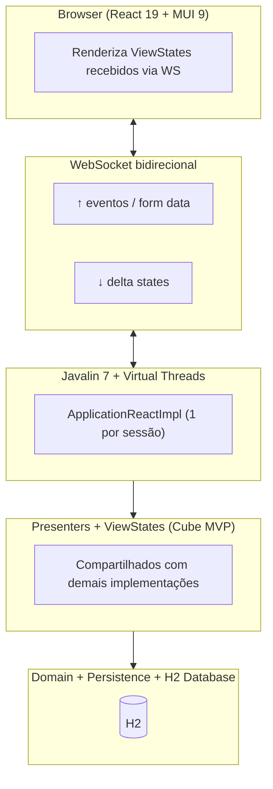
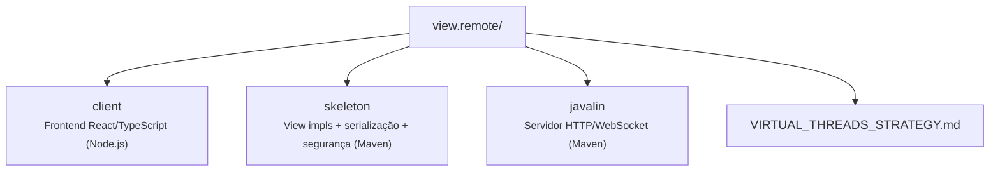

# br.com.wdc.shopping.view.remote

Implementação web (React + WebSocket) da aplicação **WeDoCode Shopping**, demonstrando a técnica de **visualização remota** no padrão **Cube MVP**.

## Motivação

Na arquitetura Cube MVP, os **Presenters** mantêm o estado da aplicação e expõem **ViewStates** — objetos serializáveis que descrevem o que deve ser exibido. A camada de view apenas consome esses estados para renderizar a interface.

Este módulo demonstra que essa separação permite uma abordagem de **visualização remota**: o estado da aplicação vive inteiramente no servidor Java, e o browser atua apenas como terminal de renderização. Toda lógica de negócio, navegação e controle de sessão permanece server-side.



## Comparação com as outras versões

| Aspecto | React (este módulo) | Vaadin (server-side) | JFX (desktop) | TeaVM (multiplataforma) |
|---------|---------------------|----------------------|---------------|------------------------|
| **Onde roda a UI** | Browser remoto | Browser via Server Push | JVM local | Browser / WebView (Tauri) |
| **Transporte** | WebSocket (JSON delta) | Atmosphere (WebSocket/Push) | Acesso direto em memória | REST (OkHttp → JS) |
| **Segurança** | RSA + AES-GCM + URL signing | HMAC-SHA256 URL signing | N/A (processo local) | HMAC + JWT |
| **Escalabilidade** | Virtual Threads (~1K por conexão) | Server Push automático | Instância única | Client-side (SPA) |
| **Código de UI** | TypeScript | Java | Java | Java (compilado para JS) |
| **Presenters** | Mesmos | Mesmos | Mesmos |
| **ViewStates** | Mesmos | Mesmos | Mesmos |

## Estrutura de submódulos



### client (Node.js — Parcel)

Frontend SPA que atua como terminal de renderização:

- **React 19** + **MUI 9** (Material UI) para componentes visuais
- **WebSocket** bidirecional para comunicação com servidor
- **Sem lógica de negócio** — apenas renderiza ViewStates recebidos e envia eventos/form data de volta
- Build via **Parcel 2.13** — output copiado para `skeleton/META-INF/resources/`

### skeleton (Maven)

Ponte entre os Presenters e o browser:

| Classe | Responsabilidade |
|--------|------------------|
| `ApplicationReactImpl` | `ShoppingApplication` concreta; gerencia dirty views, dispatch de eventos, geração de resposta JSON |
| `GenericViewImpl` | Base abstrata: `instanceId`, `update()` (marca dirty), `syncClientToServer()`, `writeState()` |
| `*ReactViewImpl` | Implementações por tela: lê form data do cliente, despacha para Presenter, serializa estado |
| `AppSecurity` | RSA + SHA256withRSA para assinatura de URLs de navegação |
| `DataSecurity` | AES-GCM por sessão (derivado via PBKDF2, 250k iterações) para dados sensíveis |

### javalin (Maven)

Servidor HTTP standalone:

- **Javalin 7.0.0** sobre **Jetty 12** com Virtual Threads nativas
- WebSocket route `/dispatcher/{sessionId}` — ponto de comunicação com cada browser
- Serve assets estáticos do classpath (`META-INF/resources/`)
- SPA fallback routing (rotas não-API → `index.html`)
- Gerenciamento de sessões com TTL e cleanup periódico
- Fat JAR (~11 MB) via maven-shade-plugin

## Fluxo de comunicação

```
1. Browser conecta: ws://host/dispatcher/{sessionId}
2. Handshake de segurança:
   - Client envia cookie app_signature (RSA-encrypted AES password)
   - Server deriva chave AES-256 via PBKDF2 (salt + 250k iterações)
3. Ciclo request/response:
   - Browser → Server: { requestId, eventCode, formData }
   - Server:
     a. syncClientToServer() — atualiza form data nas views
     b. submit() — despacha evento para o Presenter correto
     c. Presenter atualiza ViewState → marca views dirty
     d. commitComputedState() — propaga estados derivados
     e. Serializa apenas views dirty → JSON delta
   - Server → Browser: { requestId, uri, states: [...] }
4. Browser aplica delta nos componentes React (reconciliação)
```

Apenas **views modificadas** são enviadas a cada resposta (delta updates), minimizando tráfego.

## Segurança

### Camada 1: Assinatura de navegação
- Cada URL/intent inclui parâmetro `sign` = `Base62(MD5(SHA256withRSA(intent)))`
- Servidor valida antes de navegar — previne manipulação de URLs

### Camada 2: Criptografia de dados sensíveis
- Chave AES-256 derivada por sessão via PBKDF2 (250.000 iterações)
- Campos sensíveis (senhas, tokens) são AES-GCM encrypted em trânsito
- Cada sessão possui chave única — comprometimento de uma não afeta outras

## Pré-requisitos

- **Java 21** (Temurin ou Microsoft JDK)
- **Maven 3.9+**
- **Node.js 20+** (para build do client)

## Build

```bash
# 1. Build do client (gera assets em skeleton/META-INF/resources/)
cd fontes/br.com.wdc.shopping/br.com.wdc.shopping.view.remote/remote.shell.react
npm install && npm run build

# 2. Build Maven (skeleton + javalin)
cd fontes && mvn -q -DskipTests clean install
```

## Execução

```bash
# Servidor (porta 8080 por padrão)
cd fontes/br.com.wdc.shopping/br.com.wdc.shopping/br.com.wdc.shopping.backend
java -jar target/br.com.wdc.shopping.backend-1.0.0.jar

# Ou via script
./start-server.sh
```

### Configuração

Arquivo `work/config/application.toml`:

```toml
[app]
# basedir = "work"

[database]
# url = "jdbc:h2:file:..."
# username = "sa"
# password = "sa"
# reset = false

[server]
# port = 8080
```

### Desenvolvimento do client

```bash
cd remote.shell.react
npm run watch   # Parcel em modo watch (hot reload)
```

## Virtual Threads

Este módulo utiliza Virtual Threads (Java 21+) para handlers HTTP e WebSocket, reduzindo o consumo de memória por conexão de ~1MB para ~1KB. Detalhes completos em [VIRTUAL_THREADS_STRATEGY.md](VIRTUAL_THREADS_STRATEGY.md).

## Screenshots

| Tela | Preview |
|------|---------|
| Login |  |
| Home / Produtos |  |
| Detalhe do Produto |  |
| Carrinho |  |
| Recibo |  |
| Histórico |  |

## Conclusão

A versão React valida que o padrão Cube MVP suporta **visualização remota**: toda a lógica permanece server-side, e o browser é um thin client que renderiza estados serializados. Combinada com a [versão Gluon](../br.com.wdc.shopping.view.gluon/README.md) (visualização nativa multiplataforma), demonstra que **a mesma camada de Presenters/ViewStates pode alimentar qualquer tecnologia de frontend** — web, desktop ou mobile.
