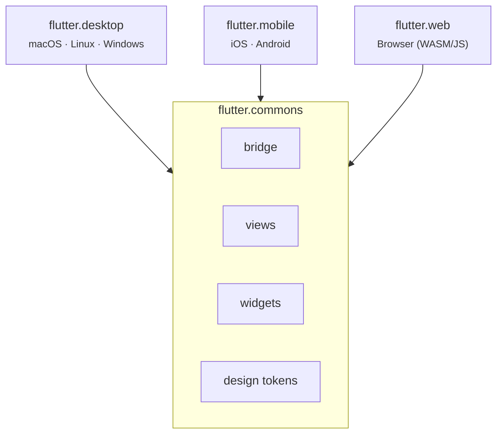

# remote.shell.flutter

Shells Flutter da aplicação **WeDoCode Shopping** — implementações do thin client de Remote Presentation em Dart/Flutter para múltiplas plataformas.

## Visão geral

Todos os shells Flutter compartilham a mesma base de código (`flutter_commons`) e apenas diferem na plataforma-alvo e configuração de deploy. Cada um é um thin client sem lógica de negócio — renderiza ViewStates e emite eventos via WebSocket.

## Módulos

| Módulo | Plataformas | Descrição |
|--------|-------------|-----------|
| `flutter.commons` | — | Biblioteca compartilhada: protocolo WS, segurança, views, widgets |
| `flutter.desktop` | macOS, Linux, Windows | App desktop nativo ("Shopping Native") |
| `flutter.mobile` | iOS, Android | App mobile ("Shopping Remote") com badge F |
| `flutter.web` | Browser (WASM/JS) | App web (alternativa Flutter ao shell React) |

## Arquitetura



## Pré-requisitos

- **Flutter 3.44+**
- **Dart SDK 3.12+**
- Backend rodando (porta 8080 por padrão)

## Quick start

```bash
# Desktop (macOS/Linux/Windows)
cd flutter.desktop && ./run.sh

# Mobile — simuladores iOS
cd flutter.mobile && ./deploy.sh run ios-sim      # iPhone Simulator
cd flutter.mobile && ./deploy.sh run ipad-sim     # iPad Simulator

# Mobile — emuladores Android
cd flutter.mobile && ./deploy.sh run android-emu         # phone emulator
cd flutter.mobile && ./deploy.sh run android-tablet-emu  # tablet emulator

# Mobile — devices físicos
cd flutter.mobile && ./deploy.sh run ios
cd flutter.mobile && ./deploy.sh run android

# Web
cd flutter.web && flutter run -d chrome --dart-define=WDC_ENDPOINT=http://localhost:8080
```

## Build via Maven (desktop)

O módulo `remote.shell.flutter` possui um `pom.xml` que integra o build do desktop ao ciclo Maven:

```bash
# A partir do diretório fontes/ — executa flutter pub get + flutter build desktop
mvn compile -pl br.com.wdc.shopping/br.com.wdc.shopping.view.remote/remote.shell.flutter -am
```

O `exec-maven-plugin` executa automaticamente:
1. `flutter pub get` (fase `initialize`)
2. `flutter.desktop/build.sh` — auto-detecta macOS/Linux/Windows (fase `compile`)

## Estrutura de dependências

```yaml
# Cada shell referencia flutter.commons como path dependency:
dependencies:
  flutter_commons:
    path: ../flutter.commons
```
