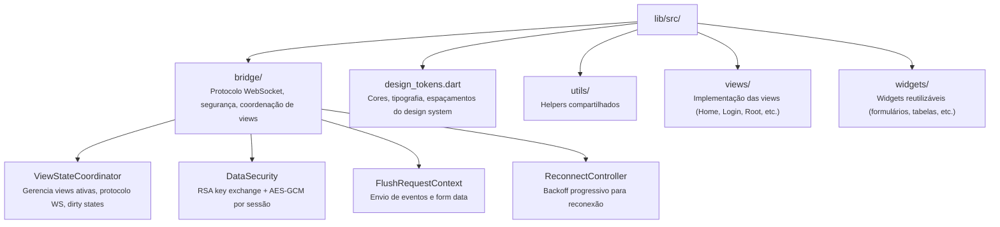

# flutter_commons

Biblioteca compartilhada para os shells Flutter (desktop, mobile, web) da aplicação **WeDoCode Shopping**.

Contém toda a infraestrutura necessária para que qualquer shell Flutter funcione como thin client do protocolo de Remote Presentation — sem lógica de negócio, apenas protocolo, renderização e interação.

## Módulos



## Uso

Referenciado como path dependency nos shells:

```yaml
dependencies:
  flutter_commons:
    path: ../flutter.commons
```

## Dependências externas

| Package | Uso |
|---------|-----|
| `web_socket_channel` | Comunicação WebSocket com o host |
| `pointycastle` | Criptografia RSA + AES-GCM |
