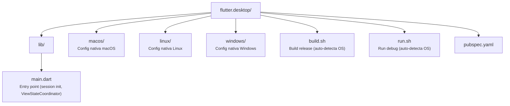

# Shopping Native — Flutter Desktop

Shell desktop (macOS, Linux, Windows) da aplicação **WeDoCode Shopping**, usando o protocolo de **Remote Presentation**. O app é um thin client que renderiza ViewStates recebidos do servidor via WebSocket.

## Características

- **Nome do app:** Shopping Native
- **Plataformas:** macOS, Linux, Windows
- **Protocolo:** WebSocket bidirecional com criptografia RSA + AES-GCM
- **Persistência de sessão:** Access token via SharedPreferences (auto-login)
- **Código compartilhado:** Usa `flutter_commons` para protocolo, views e widgets

## Pré-requisitos

- **Flutter 3.44+** (`flutter --version`)
- **Backend rodando** na porta 8080 (ou endpoint configurado)

## Execução

```bash
# Run (detecção automática do OS)
./run.sh

# Build release
./build.sh

# Ou com endpoint customizado
WDC_ENDPOINT=http://servidor:8080 ./run.sh
```

## Build via Maven

O módulo pai `remote.shell.flutter` integra este build ao ciclo Maven:

```bash
# A partir de fontes/ — faz pub get + build release
mvn compile -pl br.com.wdc.shopping/br.com.wdc.shopping.view.remote/remote.shell.flutter -am
```

## Estrutura



## Dependências

| Package | Uso |
|---------|-----|
| `flutter_commons` | Protocolo WS, views, widgets, segurança |
| `shared_preferences` | Persistência de access token |
