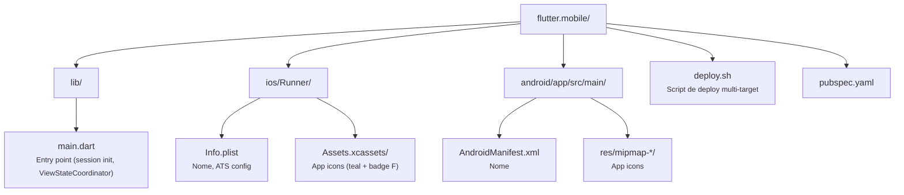

# Shopping Remote — Flutter Mobile

Shell mobile (iOS & Android) da aplicação **WeDoCode Shopping**, usando o protocolo de **Remote Presentation**. O app é um thin client que renderiza ViewStates recebidos do servidor via WebSocket e emite eventos de interação do usuário.

## Características

- **Nome do app:** Shopping Remote
- **Ícone:** Teal com carrinho WDC + badge "F" (Flutter)
- **Plataformas:** iPhone, iPad, Android phone, Android tablet
- **Protocolo:** WebSocket bidirecional com criptografia RSA + AES-GCM
- **Persistência de sessão:** Access token via SharedPreferences (auto-login)
- **Código compartilhado:** Usa `flutter_commons` para protocolo, views e widgets

## Pré-requisitos

- **Flutter 3.44+** (`flutter --version`)
- **Xcode 15+** (para iOS)
- **Android Studio** com SDK 34+ (para Android)
- **Backend rodando** na porta 8080 (ou endpoint configurado)

## Deploy

O script `deploy.sh` suporta todos os targets:

```bash
# Listar dispositivos disponíveis
./deploy.sh list

# Executar (modo debug com hot reload)
./deploy.sh run ios-sim              # iPhone Simulator
./deploy.sh run ipad-sim             # iPad Simulator
./deploy.sh run android-emu          # Android phone Emulator
./deploy.sh run android-tablet-emu   # Android tablet Emulator
./deploy.sh run ios                  # iPhone físico
./deploy.sh run android              # Android device físico

# Instalar (sem hot reload)
./deploy.sh install ios-sim
./deploy.sh install ipad-sim

# Build release
./deploy.sh build ios
./deploy.sh build android
./deploy.sh build all
```

### Opções

| Opção | Descrição |
|-------|-----------|
| `--release` | Build em release mode |
| `--debug` | Build em debug mode (padrão para `run`) |
| `--endpoint=URL` | Endpoint do backend (padrão: `http://localhost:8080`) |

> **Nota:** Para emuladores Android, `localhost` é substituído automaticamente por `10.0.2.2`.

## Estrutura



## Dependências

| Package | Uso |
|---------|-----|
| `flutter_commons` | Protocolo WS, views, widgets, segurança |
| `shared_preferences` | Persistência de access token |
