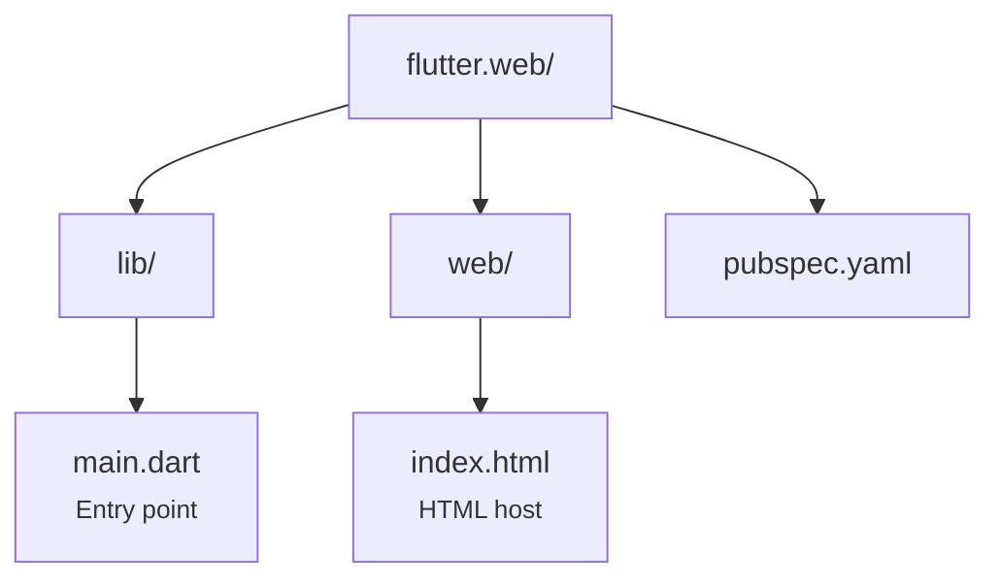

# Shopping Remote — Flutter Web

Shell web da aplicação **WeDoCode Shopping**, usando o protocolo de **Remote Presentation** via Flutter compilado para WebAssembly/JS. Thin client que renderiza ViewStates recebidos do servidor via WebSocket.

## Características

- **Plataforma:** Browser (WebAssembly ou JS)
- **Protocolo:** WebSocket bidirecional com criptografia RSA + AES-GCM
- **Código compartilhado:** Usa `flutter_commons` para protocolo, views e widgets
- **Alternativa ao shell React** — mesma funcionalidade, implementada em Dart/Flutter

## Pré-requisitos

- **Flutter 3.44+** (`flutter --version`)
- **Backend rodando** na porta 8080 (ou endpoint configurado)

## Execução

```bash
# Dev (hot reload)
flutter run -d chrome --dart-define=WDC_ENDPOINT=http://localhost:8080

# Build release
flutter build web --dart-define=WDC_ENDPOINT=http://localhost:8080
```

## Estrutura



## Dependências

| Package | Uso |
|---------|-----|
| `flutter_commons` | Protocolo WS, views, widgets, segurança |
