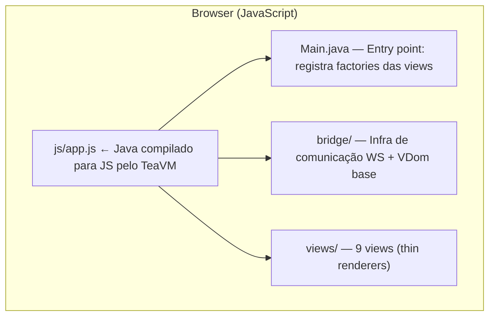
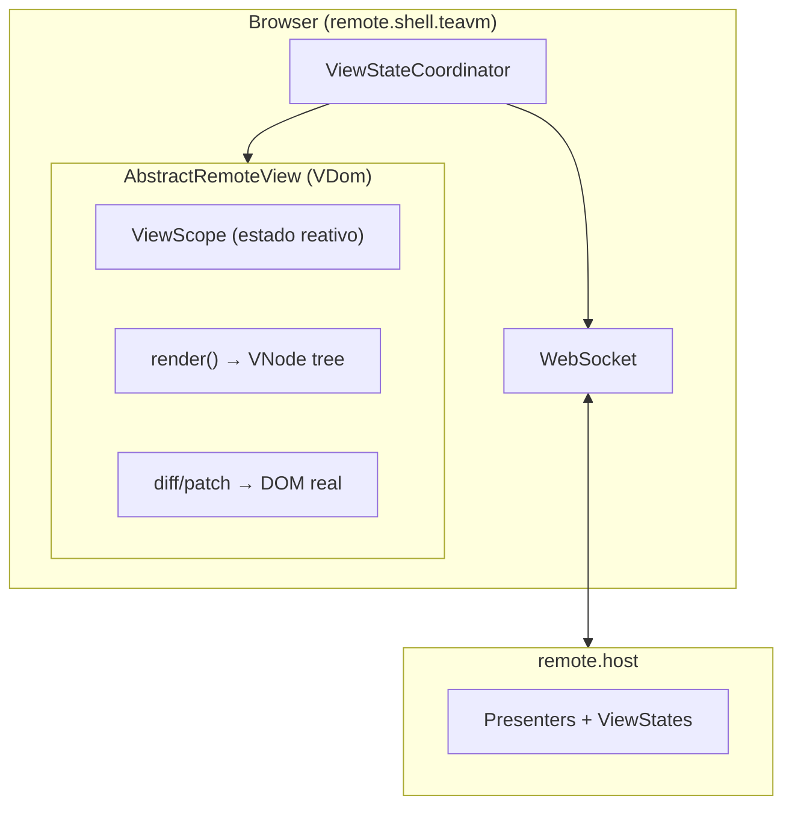
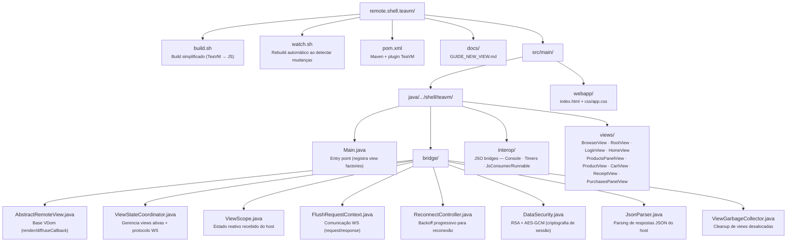
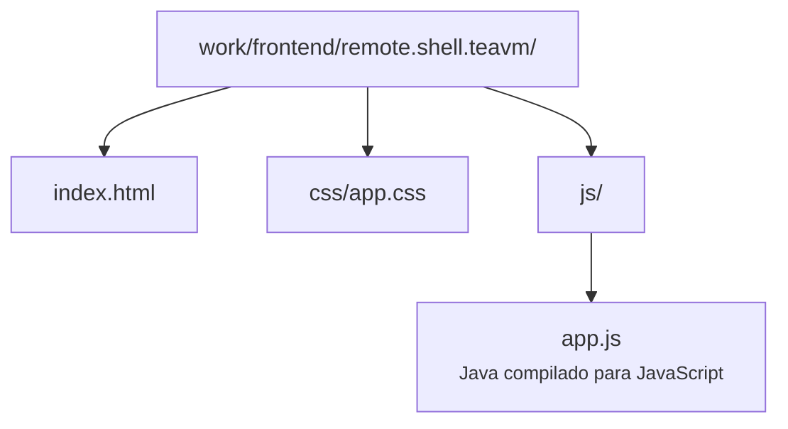

# Remote Shell TeaVM

Thin client Java compilado para JavaScript via **TeaVM 0.14.0**, usando **Virtual DOM** (VNode API) com Spectrum Web Components. Comunica-se com o `remote.host` via WebSocket — **sem lógica de negócio local**.

## Conceito

Este módulo é uma implementação alternativa do shell (cliente leve) da arquitetura de Remote Presentation. Substitui o React como engine de renderização, mantendo o mesmo protocolo WebSocket bidirecional:

- Recebe **ViewStates** serializados do host (apenas deltas/dirty)
- Renderiza usando Virtual DOM (diff eficiente → DOM real)
- Emite **eventos de interação** do usuário de volta ao host



## Arquitetura



## Estrutura do Projeto



## Virtual DOM

As views estendem `AbstractRemoteView` e implementam `render()` retornando uma árvore `VNode`:

```java
@Override
protected VNode render() {
    var state = scope.state();
    return div(Css.ROOT).children(
        h5(Css.TITLE).text(state.title),
        spButton("accent")
            .on("click", onConfirm)
            .children(span().text("Confirmar"))
    );
}
```

### Otimizações de Referência

O diff de event listeners compara por **identidade de referência**:

1. **Stable fields** — listeners sem parâmetros:
   ```java
   private final EventListener<Event> onBack = evt -> flush("back");
   ```

2. **`useCallback(key, listener)`** — listeners paramétricos cacheados:
   ```java
   .on("click", useCallback("remove-" + id, mkOnRemove(id)))
   ```

### Compact Css

```java
@SuppressWarnings({"java:S1214", "static-access"})
private interface Css {
    CssUtility u = CssUtility.INSTANCE;
    CssComponents c = CssComponents.INSTANCE;
    CssIcons icon = CssIcons.INSTANCE;

    String ROOT = u.PAGE_SCROLL_ROOT;
    String TITLE = clsx(c.CARD_TITLE, u.MB_12);
}
```

## Diferença vs. app.teavm (teavm.web)

| Aspecto | remote.shell.teavm | app.teavm (teavm.web) |
|---------|-------------------|----------------------|
| **Lógica de negócio** | Nenhuma (thin client) | Completa (SPA autônomo) |
| **Comunicação** | WebSocket bidirecional | REST (XMLHttpRequest) |
| **Estado** | Recebido do host (`ViewScope`) | Gerenciado localmente (Presenters) |
| **Presenters** | Server-side (remote.host) | Client-side (compilados junto) |
| **Vantagem** | Zero lógica no client | Funciona offline |

## Build

```bash
# Build simples
JAVA21_HOME=<caminho-jdk-21> ./build.sh

# Build completo (instala dependências do framework antes)
JAVA21_HOME=<caminho-jdk-21> ./build.sh --full
```

### Output



## Desenvolvimento

```bash
# Watch mode — rebuild automático ao salvar
./watch.sh
```

Requer `fswatch` instalado (`brew install fswatch` no macOS).

## Execução

O shell é servido como recurso estático pelo backend:

```
http://localhost:8080/remote.shell.teavm
```

## Guias

- [Como criar uma nova View](docs/GUIDE_NEW_VIEW.md) — passo a passo para implementar uma view neste projeto

## Screenshots

### Login


### Lista de Produtos


### Detalhe do Produto


### Carrinho


### Carrinho Vazio


### Recibo


### Histórico de Compras


