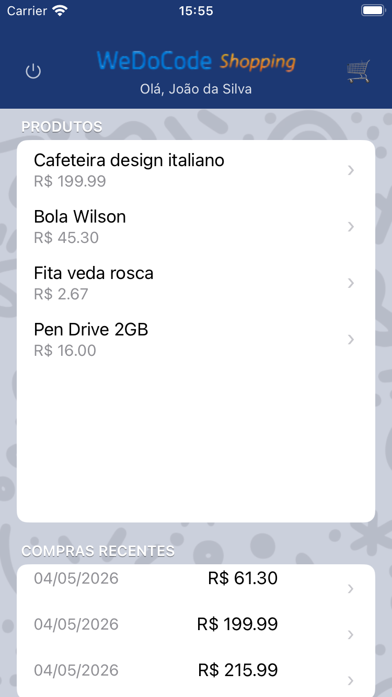
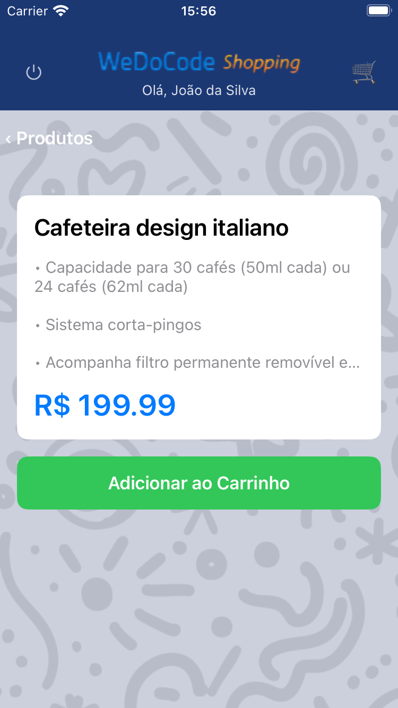
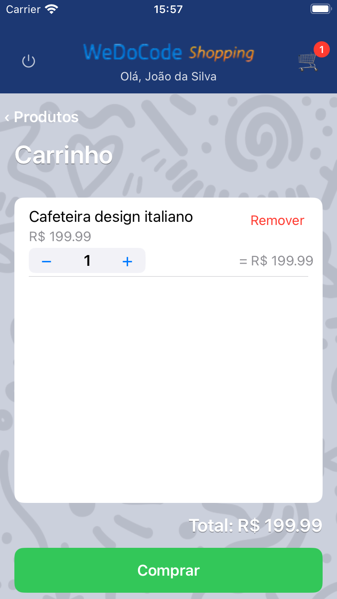
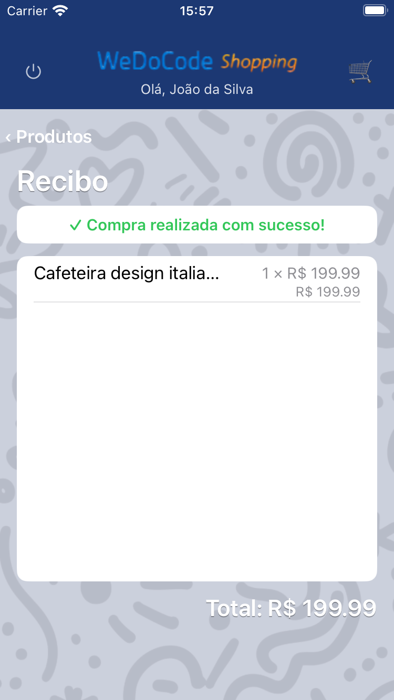

# WDC Shopping - iOS (RoboVM)

Aplicativo iOS nativo para o WDC Shopping, utilizando **MobiVM/RoboVM 2.3.24** para compilar Java em código nativo ARM64 via LLVM.

## Screenshots

| Login | Home | Produto |
|:-----:|:----:|:-------:|
|  |  |  |

| Carrinho | Recibo |
|:--------:|:------:|
|  |  |

## Arquitetura

```
┌─────────────────────────────────────────────┐
│            iOS App (RoboVM)                  │
│  ┌───────────────────────────────────────┐   │
│  │  UIKit Views (Java → Native ARM64)    │   │
│  │  UIKitDom declarative builder         │   │
│  │  LoginViewRoboVM, HomeViewRoboVM...   │   │
│  └───────────────┬───────────────────────┘   │
│                  │                            │
│  ┌───────────────┴───────────────────────┐   │
│  │  Infraestrutura                       │   │
│  │  AbstractViewRoboVM, RenderLoop,      │   │
│  │  ViewSlot, ScheduledExecutorAdapter   │   │
│  └───────────────┬───────────────────────┘   │
│                  │                            │
│  ┌───────────────┴───────────────────────┐   │
│  │  Camadas Compartilhadas (JARs)        │   │
│  │  framework.commons / framework.cube   │   │
│  │  shopping.domain / presentation       │   │
│  │  shopping.api-client                  │   │
│  └───────────────────────────────────────┘   │
└─────────────────────────────────────────────┘
         │ HTTP/REST
         ▼
   Backend Remoto (Javalin)
```

O app iOS reutiliza **100% da lógica de apresentação** (presenters, view states, navegação) e conecta-se ao backend via `api-client` REST, exatamente como os módulos Swing, Vaadin e Android.

## Pré-requisitos

- **macOS** com Xcode instalado (Command Line Tools)
- **Java 26** (para compilar os módulos compartilhados com perfil `robovm-compat`)
- **Maven 3.9+**
- **MobiVM/RoboVM 2.3.24** (Maven plugin, baixado automaticamente)
- Módulos compartilhados em `~/.m2/repository` (mavenLocal)

## Como Compilar

### 1. Compilar dependências compartilhadas

```bash
cd fontes
./build-robovm-deps.sh
```

Compila `framework.commons`, `framework.cube`, `shopping.domain`, `shopping.presentation` e `shopping.api-client` com o perfil `robovm-compat` (Java 22, sem preview) e instala em mavenLocal.

### 2. Executar no Simulador iOS

```bash
cd fontes/br.com.wdc.shopping/br.com.wdc.shopping.view.robovm
./run-sim.sh
```

Opções:
- `./run-sim.sh` — clean build + deploy no simulador
- `./run-sim.sh --no-clean` — build incremental (sem limpar target)
- `./run-sim.sh --deps` — reconstrói dependências antes do build

Ou manualmente:
```bash
mvn robovm:iphone-sim -Probovm-compat
```

## Estrutura do Módulo

```
br.com.wdc.shopping.view.robovm/
├── pom.xml                   # Maven + RoboVM plugin
├── run-sim.sh                # Script de build/deploy no simulador
├── robovm.xml                # Configuração RoboVM (main class, frameworks, archs)
├── Info.plist.xml            # Metadados do app iOS
├── docs/screenshots/         # Screenshots do app
└── src/main/java/.../robovm/
    ├── ShoppingRoboVMMain.java            # UIApplicationDelegate (entry point)
    ├── ShoppingRoboVMApplication.java     # Extends ShoppingApplication
    ├── AbstractViewRoboVM.java            # Base class com dirty-marking e list slots
    ├── RoboVMRenderLoop.java              # NSTimer ~60fps render loop
    ├── RoboVMViewSlot.java                # Thread-safe view slot
    ├── ScheduledExecutorRoboVMAdapter.java # Main thread dispatch
    ├── util/
    │   └── UIKitDom.java                  # Declarative UIKit builder
    └── impl/
        ├── RootViewRoboVM.java
        ├── LoginViewRoboVM.java
        ├── HomeViewRoboVM.java
        ├── ProductViewRoboVM.java
        ├── ProductsPanelViewRoboVM.java
        ├── PurchasesPanelViewRoboVM.java
        ├── CartViewRoboVM.java
        ├── ReceiptViewRoboVM.java
        ├── home/
        │   └── ProductItemViewRoboVM.java     # Item de produto (lista home)
        ├── cart/
        │   └── CartItemViewRoboVM.java        # Item do carrinho
        └── receipt/
            └── ReceiptItemViewRoboVM.java     # Item do recibo
```

## UIKitDom — Builder Declarativo

O `UIKitDom` é um builder declarativo para hierarquias UIKit, análogo ao `SwingDom` do módulo Swing. Ele simplifica a construção de views com:

- **Containers**: `vbox()`, `hbox()`, `overlay()`, `absolute()`, `scrollView()`
- **Elementos**: `label()`, `button()`, `textField()`, `imageView()`, `separator()`, `spacer()`
- **Layout automático**: VBOX empilha verticalmente, HBOX horizontalmente
- **Composição hierárquica**: via callbacks aninhados

Exemplo:
```java
UIKitDom.render(rootView, (dom, root) -> {
    dom.vbox(375, header -> {
        dom.label(375, 30, lbl -> lbl.setText("Título"));
        dom.button(200, 44, btn -> {
            btn.setTitle("Ação", UIControlState.Normal);
            btn.addOnTouchUpInsideListener((c, e) -> doSomething());
        });
    });
});
```

## Padrão de Implementação

Segue o mesmo padrão MVP dos demais módulos:

1. **View factories** registradas estaticamente em `ShoppingRoboVMApplication`
2. **AbstractViewRoboVM** implementa `CubeView`, com dirty-marking para render loop
3. **UIKitDom** constrói views de forma declarativa (análogo ao `SwingDom`)
4. **RoboVMRenderLoop** usa `NSTimer` no main thread para flush periódico (~60fps)
5. **RoboVMViewSlot** gerencia referências de sub-views thread-safe
6. **newListSlot / syncListSlot** sincroniza listas de itens (produtos, cart items, receipt items)

## Sobre o RoboVM/MobiVM

- **Fork ativo**: [MobiVM/RoboVM](https://github.com/MobiVM/robovm) v2.3.24
- **Compilação AOT**: Java bytecode → LLVM IR → ARM64 nativo
- **Sem JVM em runtime**: execução nativa como app Objective-C/Swift
- **UIKit bindings**: acesso completo às APIs nativas iOS via `robovm-cocoatouch`

## Limitações do RoboVM

- Os módulos compartilhados devem ser compilados com o perfil `robovm-compat` (Java 22, sem preview features)
- APIs não suportadas: `Date.from(Instant)`, `String.isBlank()`, `Map.of()`, `.toList()`
- O RoboVM **não suporta** Swing, AWT ou JavaFX — toda a UI é feita com UIKit nativo
- Reflexão pode exigir `forceLinkClasses` no `robovm.xml` para evitar remoção pelo tree shaker

## Comparação: Android vs iOS

| Aspecto | Android | iOS (RoboVM) |
|---------|---------|--------------|
| UI | Jetpack Compose (Kotlin) | UIKit via UIKitDom (Java) |
| Build | Gradle + AGP | Maven + RoboVM Plugin |
| Compilação | DEX (D8/R8) | AOT via LLVM |
| Runtime | ART | Nativo ARM64 |
| Dependências | mavenLocal (android-compat) | mavenLocal (robovm-compat) |
| Render Loop | Choreographer | NSTimer |
| Main Thread | Main Looper | NSOperationQueue.mainQueue |
