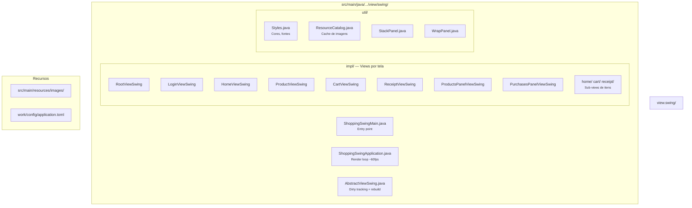
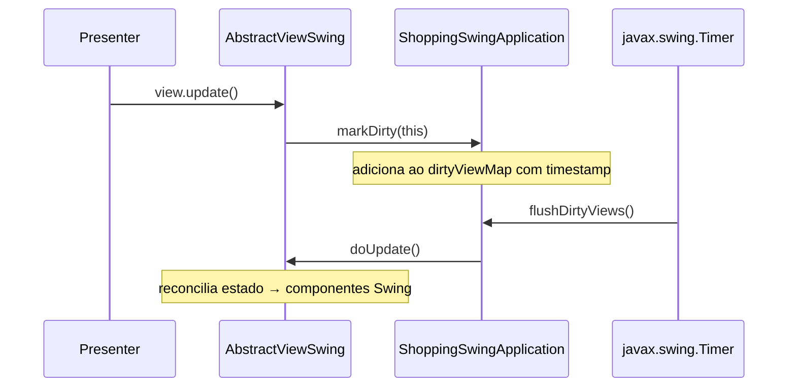
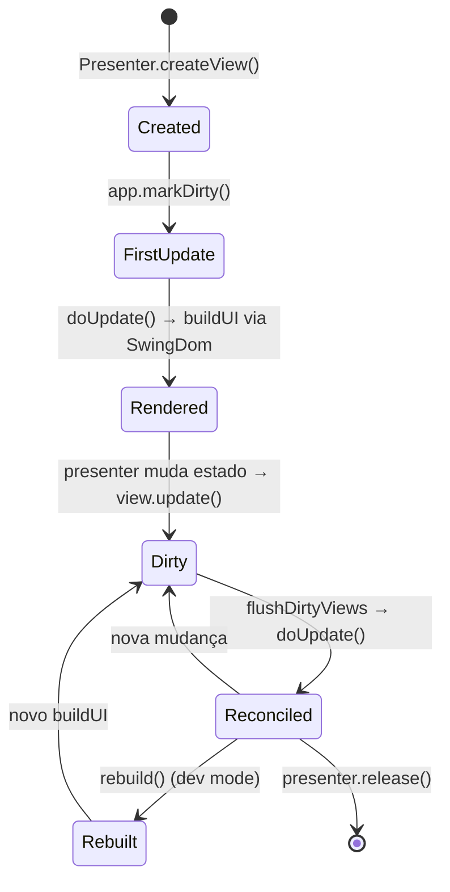
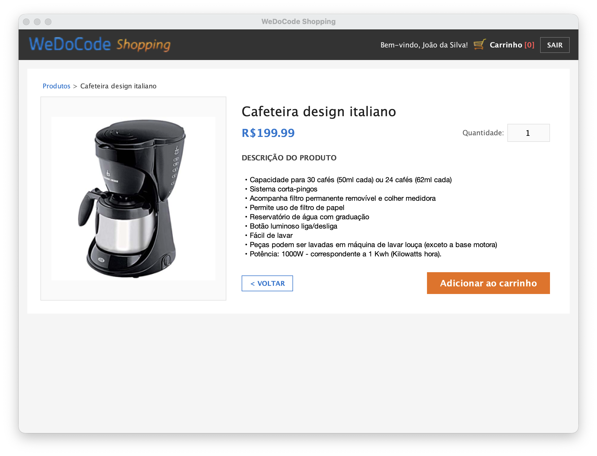

# WeDoCode Shopping — Swing Desktop

Frontend desktop do WeDoCode Shopping utilizando **Java Swing** com **FlatLaf** (Material Design look-and-feel). Compartilha os mesmos Presenters, ViewStates e lógica de negócio das demais implementações (React, Vaadin, Gluon) — apenas a camada de visualização é específica.

## Pré-requisitos

- **Java 21**
- **Maven 3.9+**

## Como executar

```bash
# 1. Build (a partir da raiz do projeto)
export JAVA_HOME=<caminho-para-jdk-21>  # ex: /Library/Java/JavaVirtualMachines/temurin-21.jdk/Contents/Home
cd fontes
mvn -DskipTests compile -pl br.com.wdc.shopping/br.com.wdc.shopping.view.swing -am

# 2. Execute
cd br.com.wdc.shopping/br.com.wdc.shopping.view.swing
java \
  -cp "$(mvn -q dependency:build-classpath -Dmdep.outputFile=/dev/stdout):target/classes" \
  br.com.wdc.shopping.view.swing.ShoppingSwingMain
```

## Configuração

O arquivo de configuração é lido de `work/config/application.toml` (relativo ao diretório de execução).

```toml
[database]
# url = "jdbc:h2:file:./work/data/wedocode-shopping"
username = "sa"
password = "sa"
reset = false

[server]
port = 8090

[dev]
# Habilita ferramentas de desenvolvimento (ex: clique no logo recria todas as views)
mode = true
```

| Chave | Default | Descrição |
|---|---|---|
| `app.basedir` | `work` | Diretório base (data, log, temp) |
| `database.url` | H2 file auto | URL JDBC |
| `database.username` | `sa` | Usuário do banco |
| `database.password` | `sa` | Senha do banco |
| `database.reset` | `false` | Recria tabelas no startup |
| `security.jwt.secret` | auto-gerado | Chave para assinatura JWT |
| `dev.mode` | `false` | Habilita modo desenvolvimento |

## Modo Desenvolvimento

Com `dev.mode = true`, clicar no **logo** no header da aplicação força a reconstrução de todas as views Swing. Útil ao rodar em modo debug — permite ver alterações de layout sem reiniciar o processo.

## Stack

| Componente | Versão |
|---|---|
| Java | 26 (preview) |
| Swing + FlatLaf | 3.5.4 |
| Jsoup | 1.18.3 (renderização HTML → StyledDocument) |
| H2 Database | embarcado |
| SLF4J + Logback | logging |

## Estrutura



## Arquitetura

A aplicação usa o padrão **Cube MVP** com integração ao Swing via os mesmos mecanismos utilizados na versão Gluon:

### 1. View Factories (registro estático)

Cada Presenter declara um campo estático `createView` que é preenchido pelo `ShoppingSwingApplication` no bloco `static`:

```java
static {
    RootPresenter.createView = RootViewSwing::new;
    LoginPresenter.createView = LoginViewSwing::new;
    HomePresenter.createView = HomeViewSwing::new;
    // ...
}
```

Cada construtor de View recebe apenas o Presenter (que já carrega a referência `app`), permitindo o uso de method references.

Isso permite que a camada de apresentação crie views sem conhecer a implementação concreta.

### 2. Render Loop via javax.swing.Timer (dirty-check)

A sincronização entre os ViewStates e os componentes Swing é feita por um `Timer` a ~60fps:



O `Timer` dispara a cada 16ms na EDT (Event Dispatch Thread). Apenas views cujo timestamp ultrapassou o intervalo mínimo são atualizadas. Isso evita:

- Múltiplas atualizações redundantes no mesmo frame
- Overhead de reconciliação desnecessária
- Conflitos entre threads de background e a EDT

O `dirtyViewMap` é um `ConcurrentHashMap` porque `markDirty()` pode ser chamado de threads de background (callbacks do banco, timers, etc).

### 3. Reconciliação incremental (doUpdate)

Cada view implementa `doUpdate()` com **reconciliação campo-a-campo** — compara o valor anterior com o atual e só muta o componente Swing quando há diferença:

```java
@Override
public void doUpdate() {
    if (this.notRendered) {
        SwingDom.render(this.element, this::buildUI);
        this.notRendered = false;
    }

    if (!Objects.equals(this.oldNickName, this.state.nickName)) {
        this.nickNameElm.setText(this.state.nickName);
        this.oldNickName = this.state.nickName;
    }
    // ...
}
```

### 4. SwingDom — DSL de Construção de UI

Análogo ao `GluonDom`, o `SwingDom` é um builder fluente que constrói a árvore de componentes Swing de forma declarativa, mantendo o rastreamento do container pai via pilha implícita:

```java
SwingDom.render(this.element, (dom, root) -> {
    dom.hbox(appBar -> {
        dom.label(greeting -> greeting.setText("Olá,"));
        dom.hSpacer();
        dom.button(exitBtn -> {
            exitBtn.setText("Sair");
            exitBtn.addActionListener(e -> safeAction("Exit", presenter::onExit));
        });
    });
});
```

**Diferenças em relação ao GluonDom:**

| Aspecto | SwingDom | GluonDom |
|---------|----------|----------|
| Containers | `JPanel` com `BoxLayout` | `VBox`, `HBox`, `StackPane` |
| Layout constraints | `.constraints(BorderLayout.CENTER)` | Propriedades diretas do nó |
| Layouts extras | `gridBagPane`, `borderPane` | — |
| Spacers | `Box.createHorizontalGlue()` | `Region` com `Priority.ALWAYS` |
| Scroll | `JScrollPane` | `ScrollPane` |

### 5. Sincronização de Listas (newListSlot)

O mecanismo `newListSlot` sincroniza uma lista de dados (do ViewState) com componentes Swing filhos, sem recriação:

```java
// Na buildUI:
this.contentSlot = this.newListSlot(container, this::newItemView, this::updateItem);

// Na doUpdate:
this.contentSlot.accept(this.state.products, this.itemViewList);
```

**Algoritmo (`syncListSlot`):**

1. Se há views excedentes → remove do final (e do container)
2. Se faltam views → cria via `factory` e adiciona ao container
3. Para cada item → chama `updater(view, item)` para reconciliar
4. `container.revalidate()` + `repaint()` ao final

### 6. safeAction — Tratamento de Erros em Callbacks

Todo evento de UI é encapsulado por `safeAction`:

```java
protected void safeAction(String context, Runnable action) {
    try {
        action.run();
    } catch (Exception caught) {
        this.app.alertUnexpectedError(LOG, context, caught);
    }
}
```

Captura exceções em listeners Swing, loga com contexto descritivo e exibe um diálogo de erro ao usuário.

### 7. rebuild() e Modo Desenvolvimento

Em `dev.mode = true`, clicar no logo do header invoca `rebuildAllViews()` que chama `rebuild()` em cada view — remove todos os filhos, reseta o flag `notRendered` e força novo `doUpdate()`. Útil para iterar no layout sem reiniciar a JVM.

### Fluxo de Vida de uma View



Isso permite que a mesma lógica de apresentação funcione em React, Vaadin, Gluon e Swing sem alteração.

## Screenshots

### Login


Card centralizado com campos de usuário/senha. Credenciais padrão: `admin` / `admin`.

### Página Inicial — Produtos e Histórico


Catálogo de produtos à esquerda com cards clicáveis. Histórico de compras à direita com paginação.

### Detalhe do Produto



Imagem, descrição com HTML renderizado, seletor de quantidade e botão de adicionar ao carrinho. Breadcrumb de navegação no topo.

### Carrinho de Compras


Tabela com itens, preço unitário, quantidade e remoção individual. Total calculado em tempo real.

### Recibo de Compra


Confirmação de compra com recibo detalhado.
