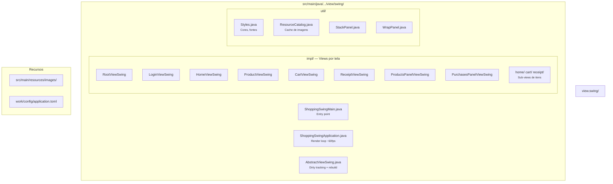

# WeDoCode Shopping — Swing Desktop

Frontend desktop do WeDoCode Shopping utilizando **Java Swing** com **FlatLaf** (Material Design look-and-feel). Compartilha os mesmos Presenters, ViewStates e lógica de negócio das demais implementações (React, Vaadin, Gluon) — apenas a camada de visualização é específica.

## Screenshots

### Login


Card centralizado com campos de usuário/senha. Credenciais padrão: `admin` / `admin`.

### Página Inicial — Produtos e Histórico


Catálogo de produtos à esquerda com cards clicáveis. Histórico de compras à direita com paginação.

### Detalhe do Produto


Imagem, descrição com HTML renderizado, seletor de quantidade e botão de adicionar ao carrinho. Breadcrumb de navegação no topo.

### Carrinho de Compras


Tabela com itens, preço unitário, quantidade e remoção individual. Total calculado em tempo real.

### Recibo de Compra


Confirmação de compra com recibo detalhado.

## Pré-requisitos

- **Java 26** (com `--enable-preview`)
- **Maven 3.9+**

## Como executar

```bash
# 1. Build (a partir da raiz do projeto)
export JAVA_HOME=/Library/Java/JavaVirtualMachines/jdk-26.jdk/Contents/Home
cd fontes
mvn -DskipTests compile -pl br.com.wdc.shopping/br.com.wdc.shopping.view.swing -am

# 2. Execute
cd br.com.wdc.shopping/br.com.wdc.shopping.view.swing
java --enable-preview \
  -cp "$(mvn -q dependency:build-classpath -Dmdep.outputFile=/dev/stdout):target/classes" \
  br.com.wdc.shopping.view.swing.ShoppingSwingMain
```

## Configuração

O arquivo de configuração é lido de `work/config/application.toml` (relativo ao diretório de execução).

```toml
[database]
# url = "jdbc:h2:file:./work/data/wedocode-shopping"
username = "sa"
password = "sa"
reset = false

[server]
port = 8090

[dev]
# Habilita ferramentas de desenvolvimento (ex: clique no logo recria todas as views)
mode = true
```

| Chave | Default | Descrição |
|---|---|---|
| `app.basedir` | `work` | Diretório base (data, log, temp) |
| `database.url` | H2 file auto | URL JDBC |
| `database.username` | `sa` | Usuário do banco |
| `database.password` | `sa` | Senha do banco |
| `database.reset` | `false` | Recria tabelas no startup |
| `security.jwt.secret` | auto-gerado | Chave para assinatura JWT |
| `dev.mode` | `false` | Habilita modo desenvolvimento |

## Modo Desenvolvimento

Com `dev.mode = true`, clicar no **logo** no header da aplicação força a reconstrução de todas as views Swing. Útil ao rodar em modo debug — permite ver alterações de layout sem reiniciar o processo.

## Stack

| Componente | Versão |
|---|---|
| Java | 26 (preview) |
| Swing + FlatLaf | 3.5.4 |
| Jsoup | 1.18.3 (renderização HTML → StyledDocument) |
| H2 Database | embarcado |
| SLF4J + Logback | logging |

## Estrutura



## Arquitetura

A aplicação usa o padrão **Cube MVP**:

- **Presenters** (camada `presentation`) gerenciam estado e lógica de navegação
- **ViewStates** armazenam dados exibidos pela UI
- **Views Swing** (`AbstractViewSwing`) implementam `CubeView` e fazem binding unidirecional state → UI
- **Render loop**: um `Timer` a ~60fps processa views marcadas como "dirty", chamando `doUpdate()` com diff incremental (só atualiza componentes cujo valor mudou)

Isso permite que a mesma lógica de apresentação funcione em React, Vaadin, Gluon e Swing sem alteração.
