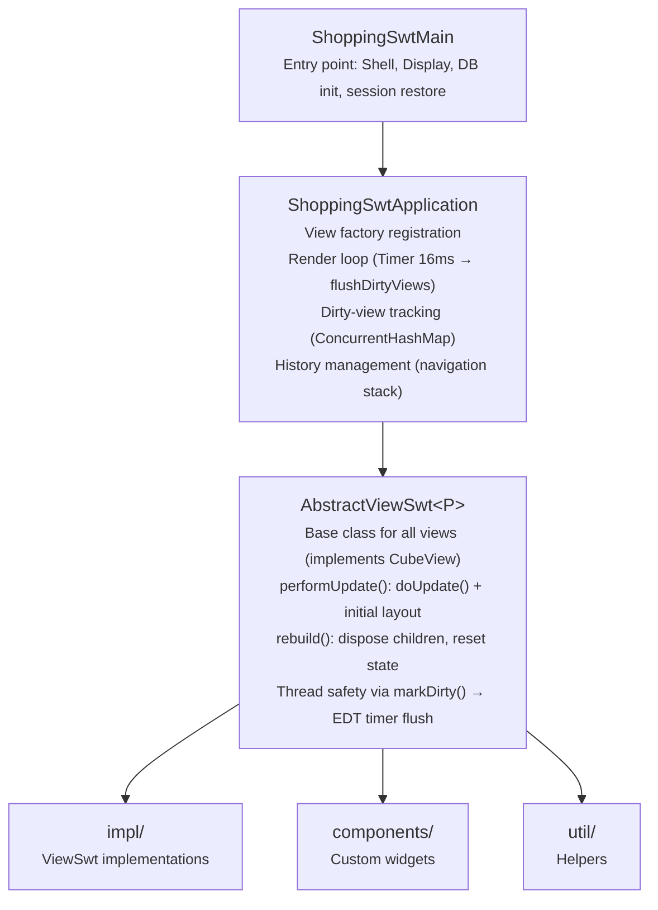
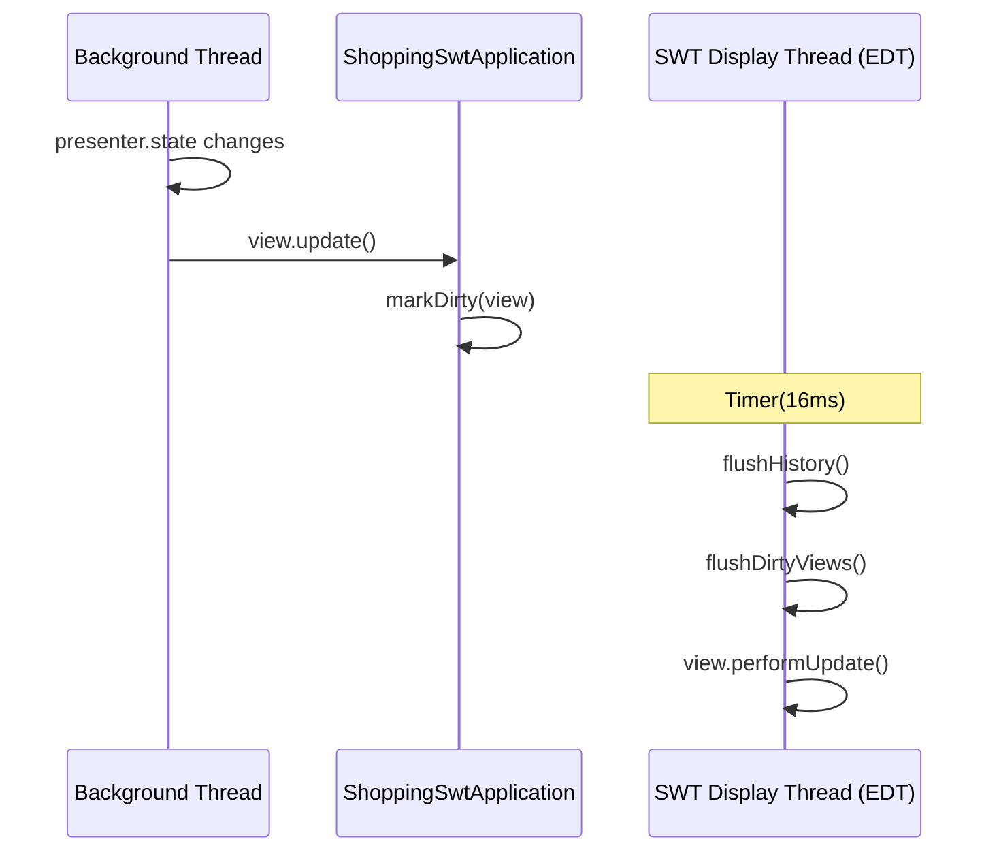
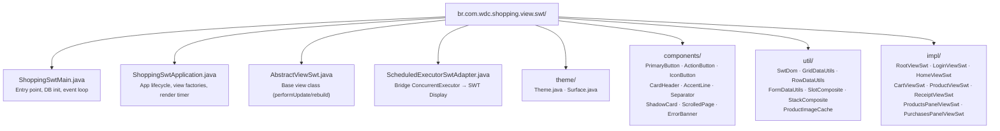
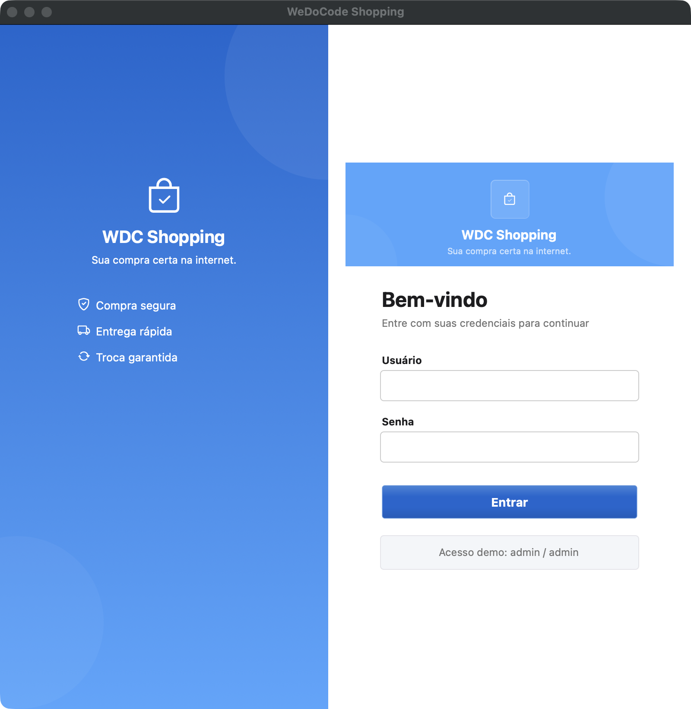
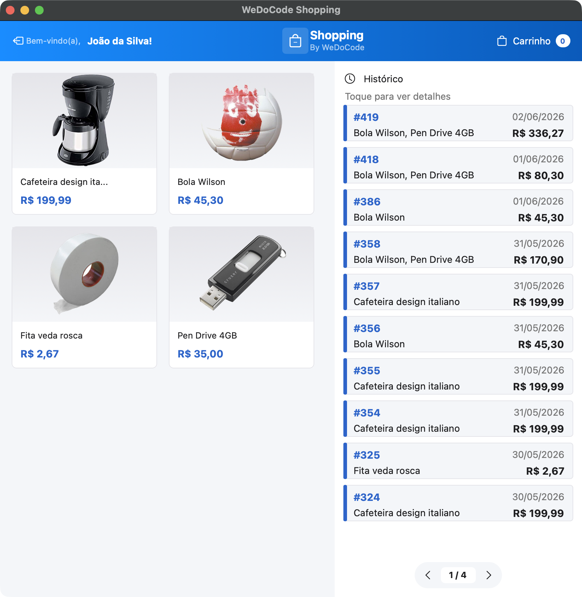
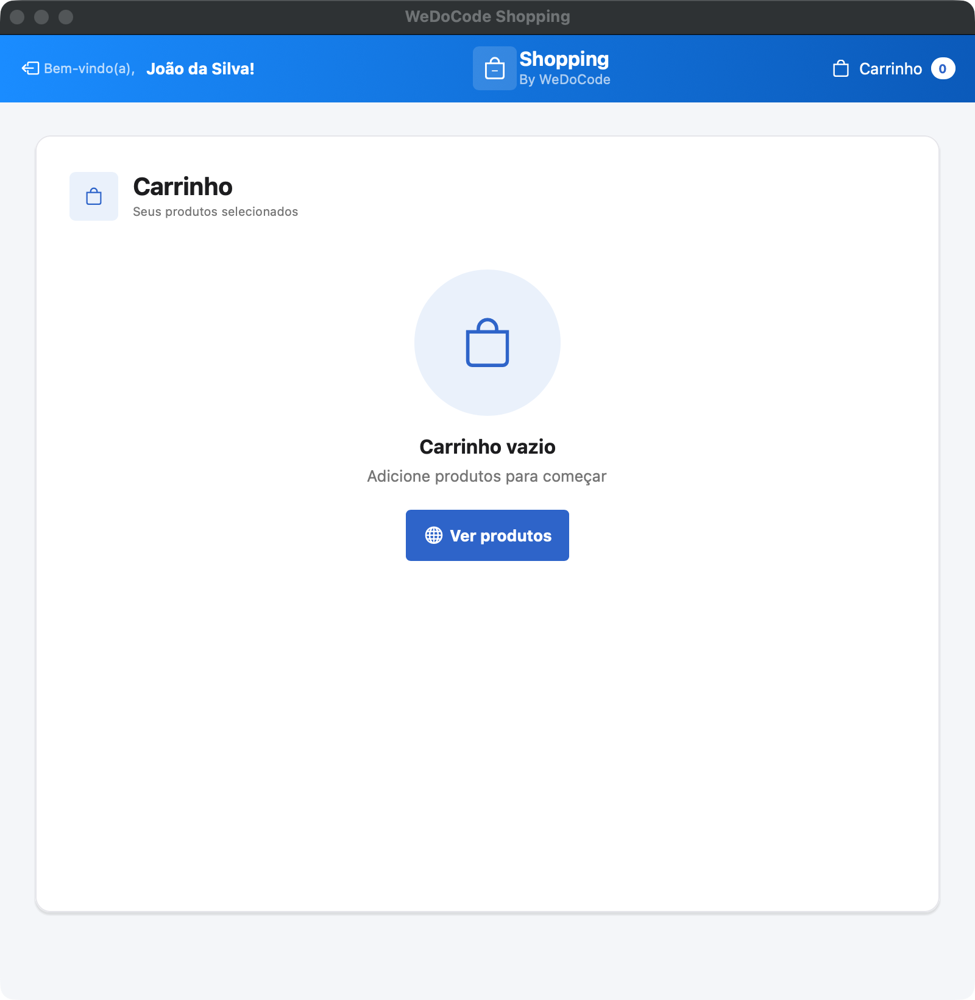
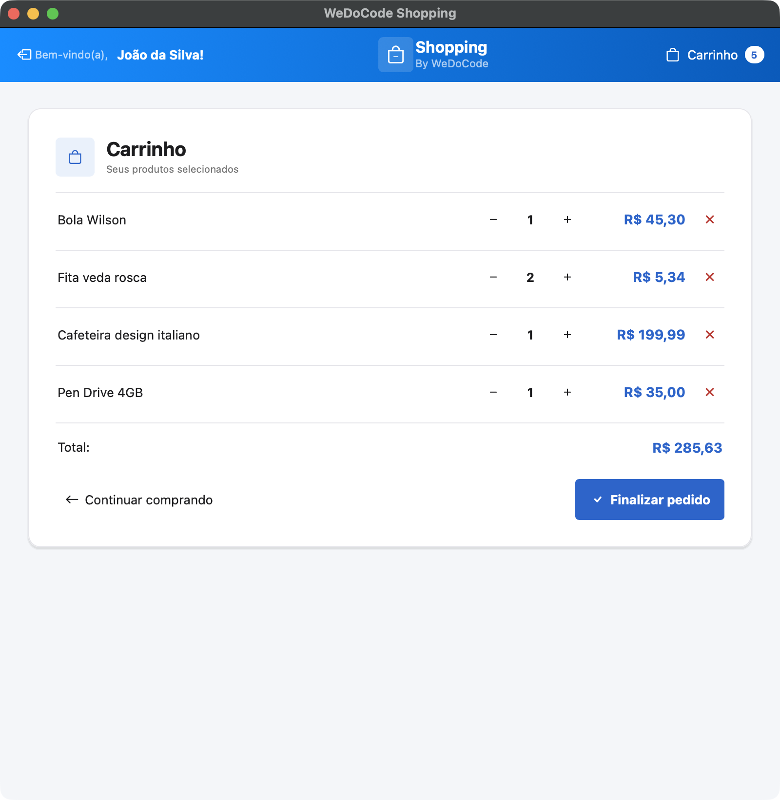
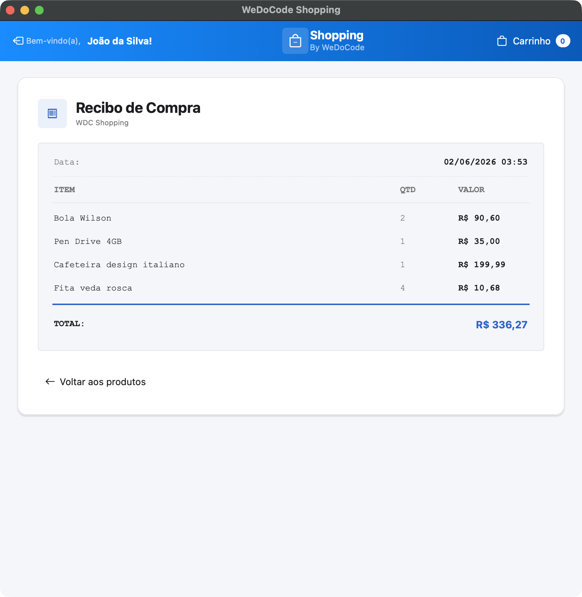
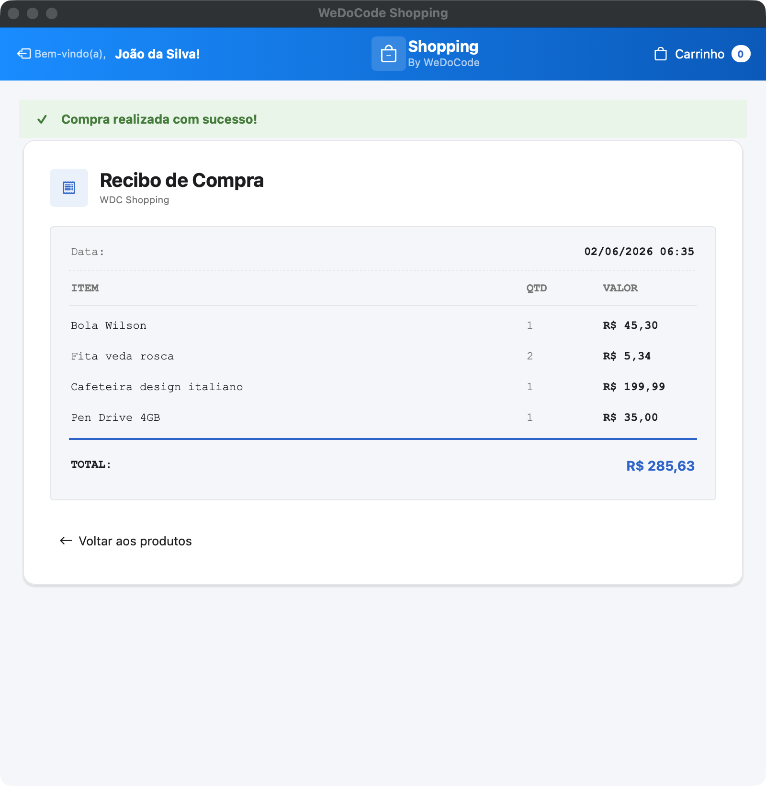

# WDC Shopping — SWT Desktop View

Implementação desktop nativa do WDC Shopping usando **Eclipse SWT 3.128.0** (Cocoa/macOS aarch64).
Compartilha a mesma camada de apresentação (Cube MVP) com as demais views (TeaVM, React, Gluon, Vaadin).

## Arquitetura



### Render Loop



### Estrutura de Pacotes



## Dependências Principais

| Dependência | Versão | Propósito |
|-------------|--------|-----------|
| Eclipse SWT (Cocoa macOS aarch64) | 3.128.0 | Toolkit gráfico nativo |
| br.com.wdc.shopping.presentation | 1.0.0 | Presenters e state (Cube MVP) |
| br.com.wdc.shopping.persistence | 1.0.0 | Repositórios (JOOQ + H2) |
| H2 Database | — | Banco de dados embarcado |
| Logback | — | Logging |

## Build

```bash
cd fontes/br.com.wdc.shopping/br.com.wdc.shopping.view.swt
JAVA_HOME=$JAVA21_HOME mvn clean compile -DskipTests
```

## Execução

```bash
cd fontes/br.com.wdc.shopping/br.com.wdc.shopping.view.swt
JAVA_HOME=$JAVA21_HOME mvn exec:java \
  -Dexec.mainClass="br.com.wdc.shopping.view.swt.ShoppingSwtMain"
```

> A aplicação inclui backend embarcado (H2 + repositórios), não requer servidor externo.

## Screenshots

### Login



### Home



### Carrinho (vazio)



### Carrinho (com produtos)



### Recibo (histórico)



### Recibo (pós-compra)


