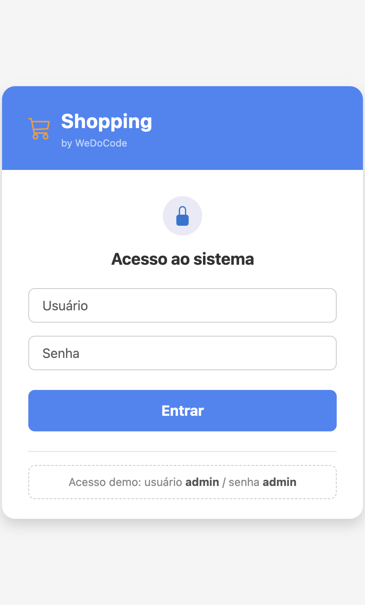
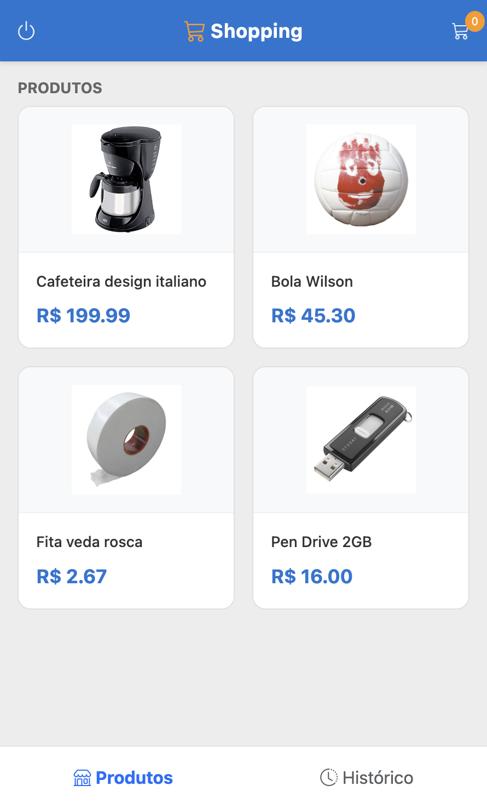
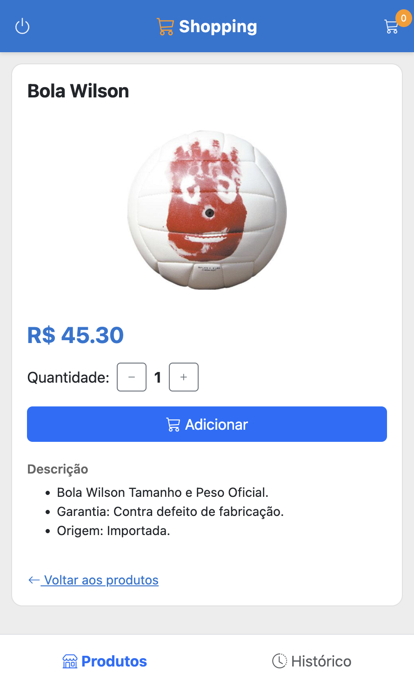
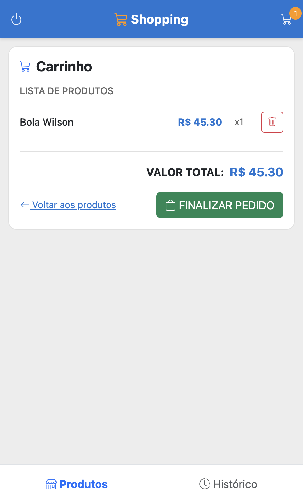
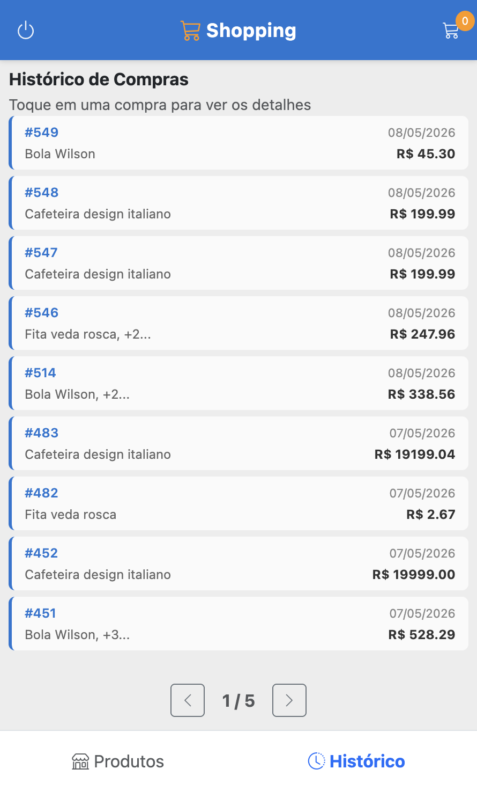

# WDC Shopping — View TeaVM

Implementação **multiplataforma** da aplicação **WeDoCode Shopping** utilizando [TeaVM](https://teavm.org/) — um compilador ahead-of-time que converte Java para JavaScript. O código Java (views, presenters, domain, api-client) é compilado para um SPA que roda diretamente no browser, e a partir dele pode ser empacotado como aplicativo nativo para **desktop**, **Android** e **iOS** via [Tauri 2](https://tauri.app/).

## Motivação

O TeaVM possibilita uma estratégia **"write once, run anywhere"** real a partir de Java:

1. **Escreva a UI em Java** — usando a API `HtmlDom` que gera HTML nativo com Bootstrap 5
2. **Compile para JavaScript** — o TeaVM gera um único `app.js` otimizado
3. **Execute em qualquer lugar** — no browser como SPA, ou empacotado como app nativo via Tauri

Isso permite atingir **4 plataformas** (Web, macOS, Android, iOS) com **uma única base de código** de UI, compartilhando os mesmos Presenters e ViewStates do padrão Cube MVP.

| Plataforma | Empacotamento | Runtime | Distribuição |
|------------|---------------|---------|-------------|
| **Web** | SPA servido pelo Javalin | Browser (JS engine) | URL |
| **macOS** | Tauri → `.app` bundle | WebView (WKWebView) | DMG / App Store |
| **Android** | Tauri → APK | WebView (Chrome/System) | APK / Play Store |
| **iOS** | Tauri → `.app` Simulator/Device | WebView (WKWebView) | Xcode / TestFlight |

## Estrutura de Módulos

```
br.com.wdc.shopping.view.teavm/          ← POM agregador (este diretório)
├── br.com.wdc.shopping.view.teavm.web/  ← Código Java das views + compilação TeaVM → JS
└── br.com.wdc.shopping.view.teavm.native/ ← Projeto Tauri 2 (desktop, Android, iOS)
```

### [teavm.web](br.com.wdc.shopping.view.teavm.web/) — Views + Compilação

Contém todo o código Java da camada de visualização (8 views, interop JS, tema Bootstrap, repositórios REST) e o plugin Maven do TeaVM que compila tudo para `app.js`. O output é um SPA completo (`index.html` + `app.js`) que pode ser servido por qualquer servidor HTTP ou embutido em um wrapper nativo.

### [teavm.native](br.com.wdc.shopping.view.teavm.native/) — Empacotamento Nativo

Projeto [Tauri 2](https://tauri.app/) que empacota o SPA gerado pelo módulo web em aplicativos nativos. O Tauri usa WebView nativa do SO (sem Chromium embarcado), resultando em binários leves. Suporta desktop (macOS), Android e iOS a partir de um único `build.sh`.

## Tecnologias

| Componente | Tecnologia | Versão |
|------------|-----------|--------|
| Compilador AOT | [TeaVM](https://teavm.org/) | 0.14.0 |
| UI Framework | [Bootstrap](https://getbootstrap.com/) | 5.3.3 |
| Ícones | [Bootstrap Icons](https://icons.getbootstrap.com/) | 1.11.3 |
| Wrapper nativo | [Tauri](https://tauri.app/) | 2.x |
| Linguagem (views) | Java 21 | — |
| Linguagem (nativo) | Rust | — |

## Como o TeaVM Funciona

O TeaVM compila as classes Java para um único arquivo JavaScript (`app.js`). O compilador realiza:

- **Dead code elimination** — remove classes/métodos não utilizados
- **Minificação** — otimiza o tamanho do bundle
- **Interop direto** — chamadas a APIs do browser (DOM, Fetch, Crypto) via anotações JSO, sem bridge pesado

A classe `HtmlDom` fornece uma API fluente para construção de elementos HTML em Java:

```java
dom.div("d-flex align-items-center gap-2", container -> {
    dom.button("btn btn-primary", btn -> {
        dom.icon(BsIcons.CART);
        dom.span(null, txt -> txt.setTextContent("Adicionar"));
        btn.addEventListener("click", evt -> presenter.onAddToCart(1));
    });
});
```

Isso gera HTML nativo com classes Bootstrap, sem Virtual DOM ou framework JavaScript adicional.

## Screenshots

### Login



### Lista de Produtos



### Detalhe do Produto



### Carrinho



### Recibo


### Histórico de Compras


