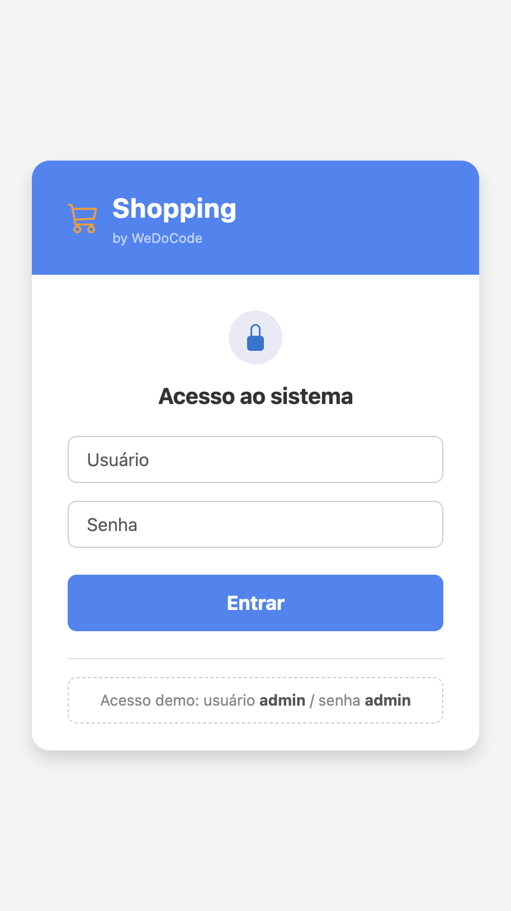
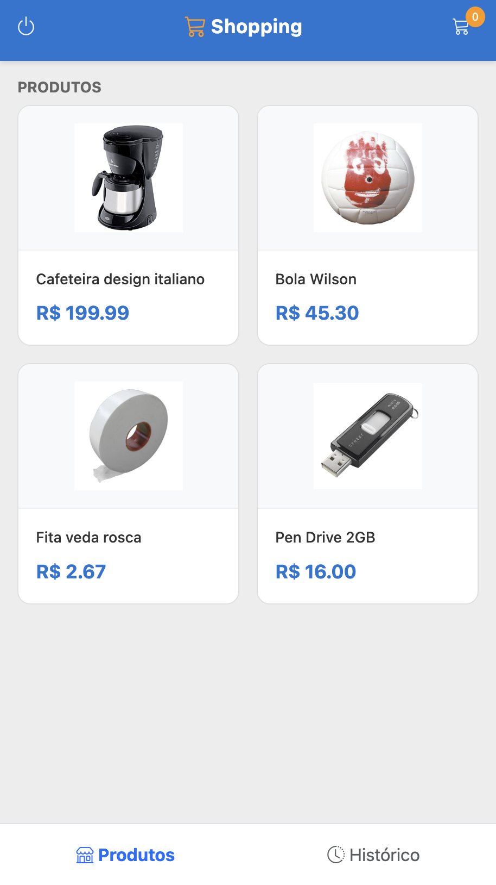
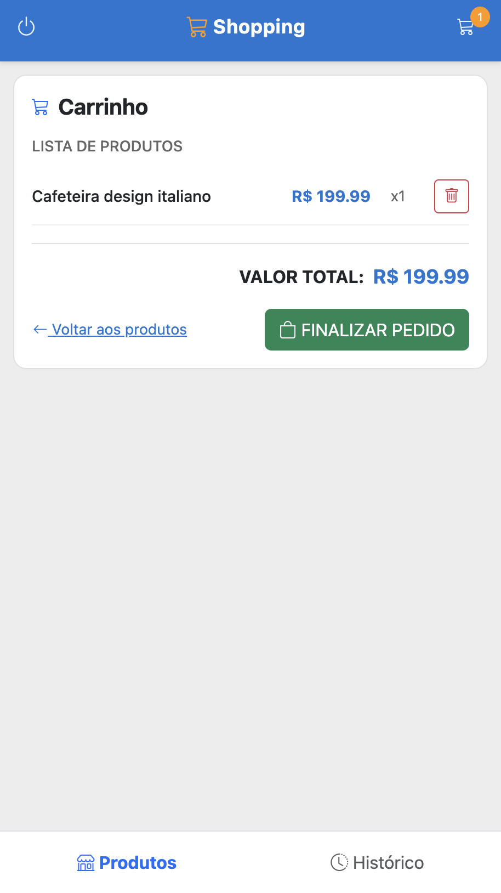
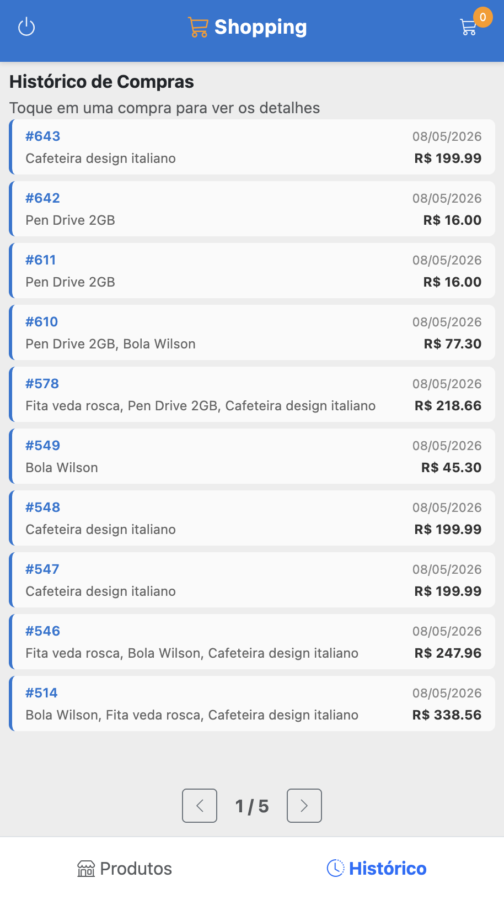

# WDC Shopping — TeaVM Web

Código-fonte Java das views TeaVM e compilação para JavaScript. Este módulo contém a implementação completa da UI usando a API `HtmlDom` com Bootstrap 5, que é compilada pelo TeaVM para um SPA executável no browser.

## Arquitetura

```
Browser (JavaScript)
├── index.html                          ← Carrega Bootstrap 5 CSS/JS + app.js
└── js/app.js                           ← Java compilado para JS pelo TeaVM
    ├── Main.java                       ← Entry point
    ├── ShoppingTeaVMApplication.java   ← Wiring de factories e render loop
    ├── AbstractViewTeaVM.java          ← Classe base para views
    ├── FetchHttpTransport.java         ← XMLHttpRequest (REST API calls)
    ├── BrowserCryptoProvider.java      ← Web Crypto API (HMAC-SHA256)
    ├── ScheduledExecutorBrowser.java   ← setTimeout/setInterval
    ├── interop/                        ← JSO bridges (Console, Timers, Fetch)
    ├── repo/                           ← Repositórios via REST API
    ├── theme/                          ← Constantes Bootstrap (ícones, cores)
    ├── util/                           ← HtmlDom builder, DateUtils
    └── views/                          ← 8 views
        ├── RootViewTeaVM.java
        ├── LoginViewTeaVM.java
        ├── HomeViewTeaVM.java
        ├── ProductsPanelViewTeaVM.java
        ├── ProductViewTeaVM.java
        ├── CartViewTeaVM.java
        ├── ReceiptViewTeaVM.java
        └── PurchasesPanelViewTeaVM.java
```

## Comunicação com o Servidor

As views se comunicam com o back-end Javalin via REST API usando `XMLHttpRequest` (implementado em `FetchHttpTransport`). A autenticação utiliza HMAC-SHA256 via Web Crypto API (`BrowserCryptoProvider`).

## Responsividade

O layout adapta-se a telas pequenas (iPhone SE) utilizando classes Bootstrap responsivas (`d-none d-sm-inline`, `flex-column-reverse flex-sm-row`, etc.). No cabeçalho, textos auxiliares são ocultados em telas estreitas, mantendo apenas os ícones essenciais.

## Build

```bash
# Via script (recomendado)
JAVA21_HOME=<caminho-para-jdk-21> bash build.sh

# Ou diretamente com Maven
JAVA_HOME=$JAVA21_HOME mvn process-classes -DskipTests
```

### Output

```
target/classes/META-INF/resources/teavm/
├── index.html    ← Página HTML (carrega Bootstrap + app.js)
└── js/
    └── app.js    ← Java compilado para JavaScript (~8000 métodos)
```

## Executar

O módulo não tem servidor próprio. O SPA é servido como recurso estático pelo servidor Javalin (`backend`) ou embutido pelo módulo `teavm.native` (Tauri):

```
http://localhost:8080/teavm
```

## Estrutura do Projeto

```
br.com.wdc.shopping.view.teavm.web/
├── build.sh                    ← Script de build simplificado
├── pom.xml                     ← Configuração Maven + plugin TeaVM
└── src/main/
    ├── java/.../view/teavm/
    │   ├── Main.java
    │   ├── ShoppingTeaVMApplication.java
    │   ├── AbstractViewTeaVM.java
    │   ├── FetchHttpTransport.java
    │   ├── BrowserCryptoProvider.java
    │   ├── JsonParsing.java
    │   ├── ScheduledExecutorBrowser.java
    │   ├── interop/            ← Console, Timers, FetchApi
    │   ├── repo/               ← Repositórios REST
    │   ├── theme/              ← BsIcons, BsColors, BsStyles
    │   ├── util/               ← HtmlDom, DateUtils
    │   └── views/              ← 8 views (Login, Home, Products, etc.)
    └── webapp/
        └── index.html
```

## Screenshots

### Login



### Lista de Produtos



### Detalhe do Produto


### Carrinho



### Recibo


### Histórico de Compras


