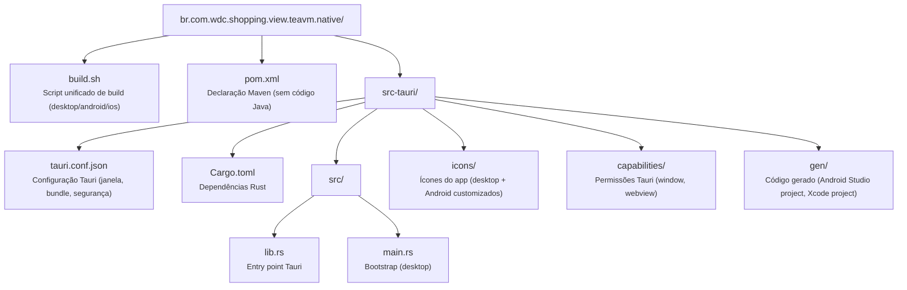
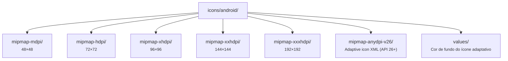
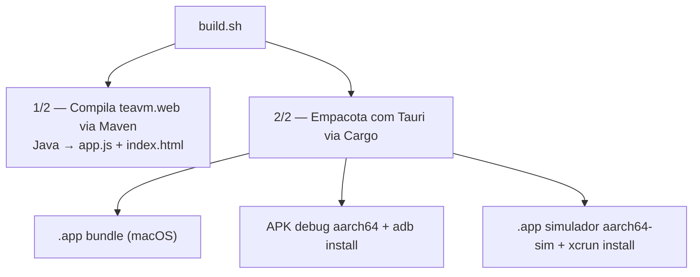

# WDC Shopping — TeaVM Native (Tauri)

Projeto [Tauri 2](https://tauri.app/) que empacota o SPA TeaVM como aplicativo nativo para **macOS**, **Android** e **iOS**. O Tauri utiliza a WebView nativa do sistema operacional (WKWebView no macOS/iOS, System WebView no Android), resultando em binários leves — sem Chromium embarcado.

## Pré-requisitos

- **Rust** toolchain (`rustup`)
- **Tauri CLI**: `cargo install tauri-cli --version "^2"`
- **Java 21** + **Maven** (para compilar o módulo `teavm.web`)
- **Android**: Android SDK (`ANDROID_HOME`), NDK, `adb`
- **iOS**: Xcode, `xcrun simctl`

## Build

O script `build.sh` automatiza todo o processo: compila o módulo `teavm.web` (Java → JS) e em seguida empacota com o Tauri.

```bash
# Desktop (macOS)
./build.sh desktop

# Desktop em dev mode (hot reload via devUrl)
./build.sh desktop --dev

# Android — build + deploy no dispositivo conectado
./build.sh android --api-url http://192.168.1.8:8080 --deploy

# iOS — build + deploy no simulador
./build.sh ios --api-url http://localhost:8080 --deploy
./build.sh ios --sim-name "iPhone 16 Pro" --deploy
```

### Opções

| Opção | Descrição |
|-------|-----------|
| `desktop` / `android` / `ios` | Plataforma alvo (1º argumento) |
| `--dev` | Dev mode — desktop only, usa `devUrl` do `tauri.conf.json` |
| `--deploy` | Instalar e abrir no dispositivo/simulador após o build |
| `--api-url <url>` | URL do servidor API (padrão: `localhost:8080`; Android auto-detecta IP da rede) |
| `--sim-name <name>` | Nome do simulador iOS (padrão: `"iPhone 16 Pro"`) |

## Estrutura



## Ícones Android

Os ícones customizados ficam em `src-tauri/icons/android/` e são copiados automaticamente pelo `build.sh` para `src-tauri/gen/android/.../res/` antes do build, sobrescrevendo os ícones padrão do Tauri:



## Fluxo de Build


