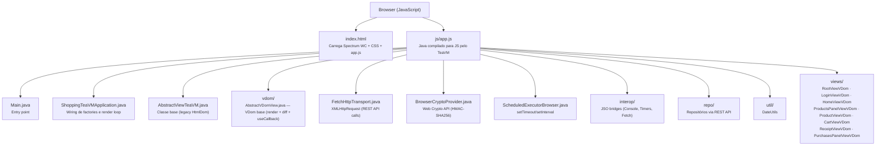
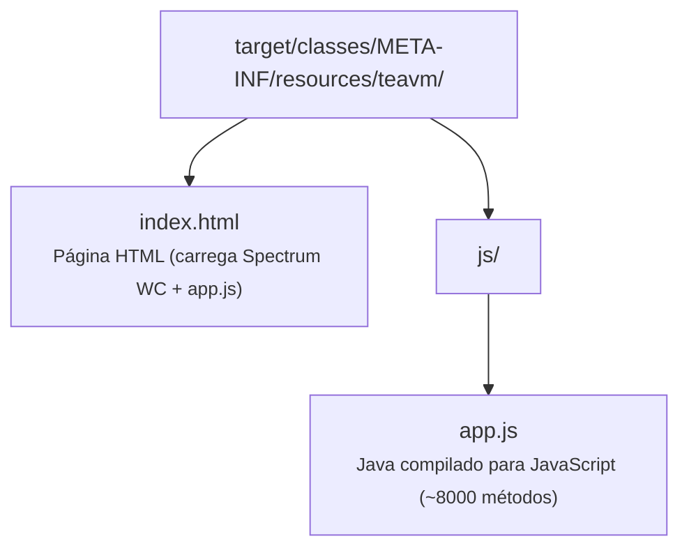
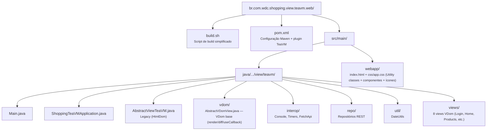
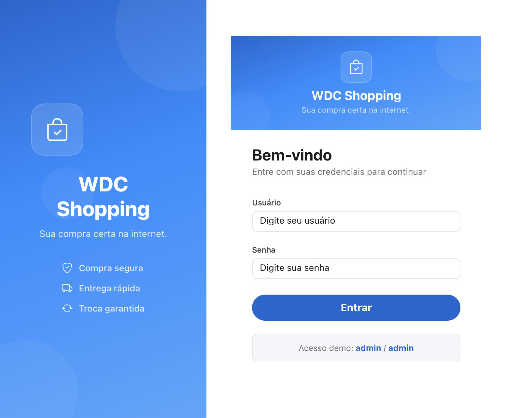
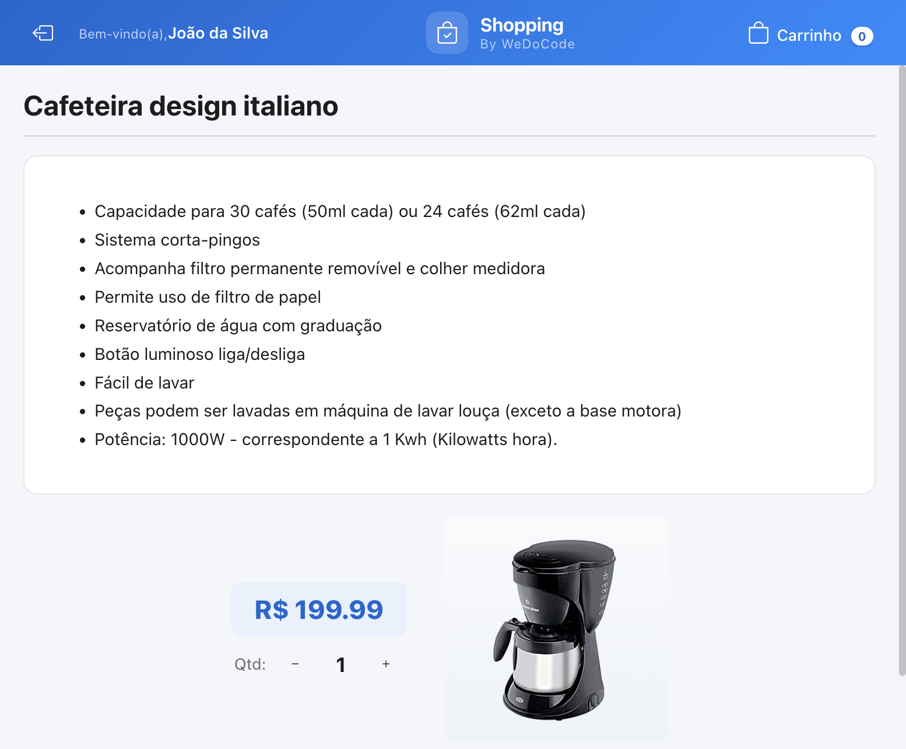
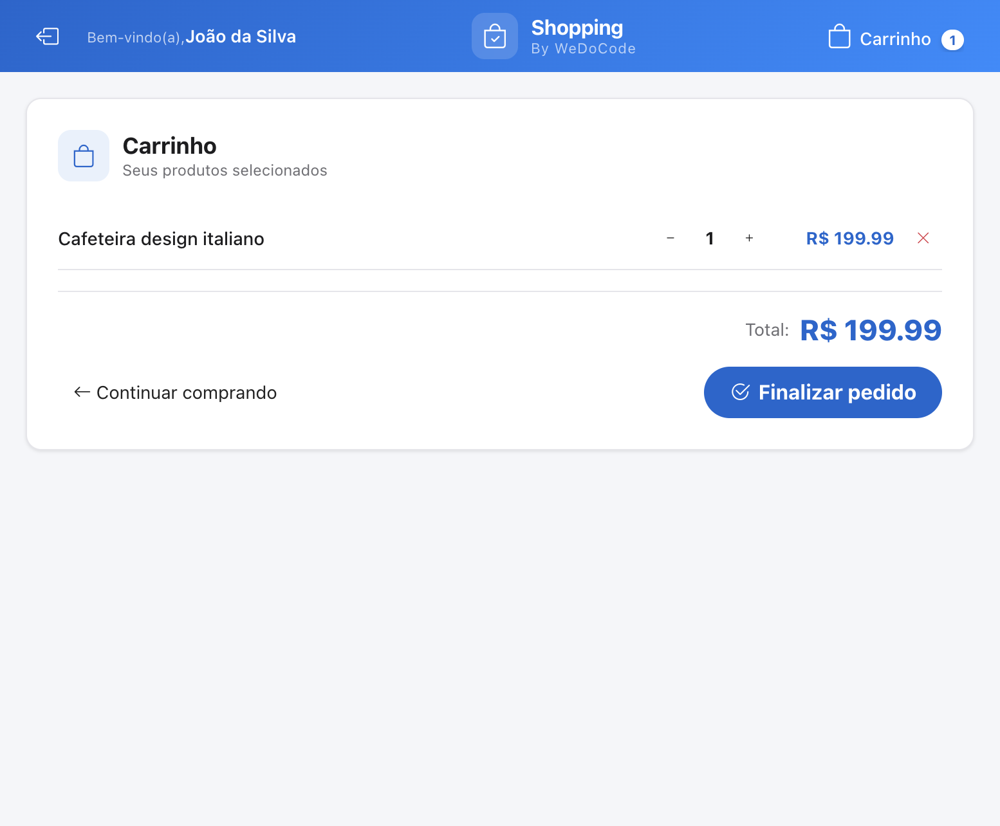
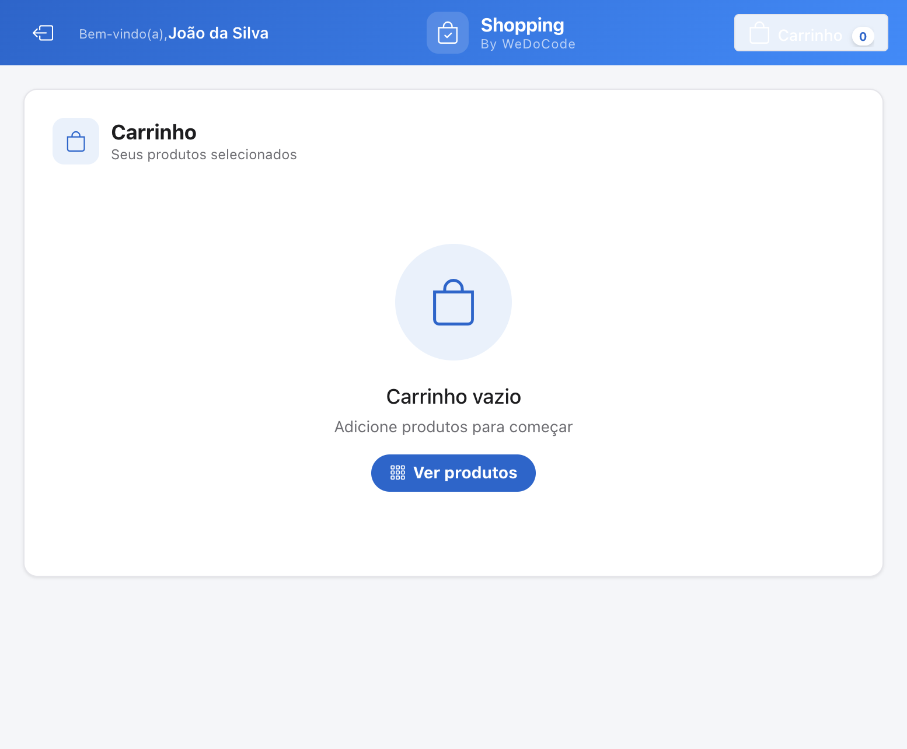
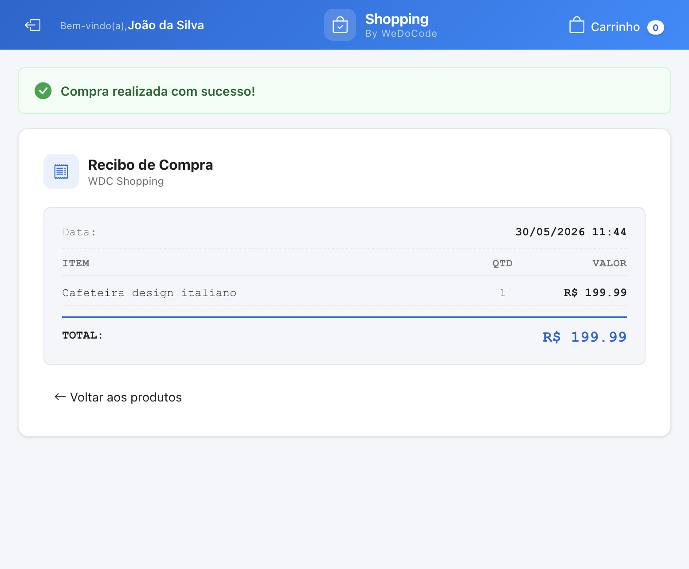
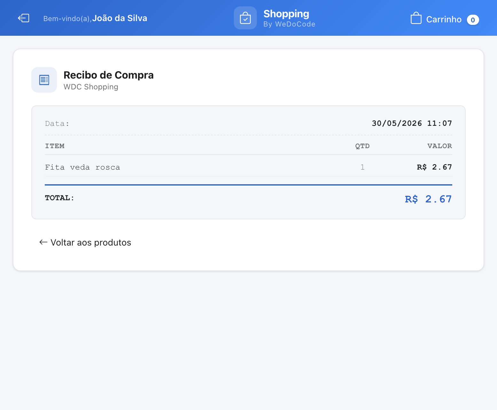

# WDC Shopping — TeaVM Web

Código-fonte Java das views TeaVM e compilação para JavaScript. Este módulo contém a implementação completa da UI usando **Virtual DOM** (VNode API) com Spectrum Web Components, que é compilada pelo TeaVM para um SPA executável no browser.

## Arquitetura



## Virtual DOM

As views utilizam a API `VNode` para construir árvores virtuais de forma declarativa. O framework realiza diff eficiente entre renders, aplicando apenas as mutações necessárias no DOM real:

```java
@Override
protected VNode render() {
    return div(Css.ROOT).children(
      div(Css.WRAPPER).children(
        h5(Css.TITLE).text(state.product.name),
        spButton("accent")
          .boolAttr("disabled", state.items.isEmpty())
          .children(span(Css.ICON_ADD), span().text("Adicionar"))
          .on("click", onAddToCart)));
}
```

### Otimizações de Referência

O diff de event listeners compara por **identidade de referência** — mesma referência = zero custo no DOM. Duas técnicas garantem estabilidade:

1. **Stable fields** — listeners sem parâmetros extraídos para campos `final`:
   ```java
   private final EventListener<Event> onBack = evt -> presenter.onOpenProducts();
   ```

2. **`useCallback(key, listener)`** — cache de listeners paramétricos (análogo ao React `useCallback`):
   ```java
   .on("click", useCallback("remove-" + itemId, mkOnRemove(itemId)))
   ```
   Retorna instância cacheada se a key já existe; após cada render, keys não utilizadas são descartadas automaticamente.

### Padrão Compact Css

Cada view define uma interface `Css` privada com aliases compactos para as classes do framework:

```java
@SuppressWarnings({"java:S1214", "static-access"})
private interface Css {
    CssUtility u = CssUtility.INSTANCE;
    CssComponents c = CssComponents.INSTANCE;
    CssIcons icon = CssIcons.INSTANCE;

    String ROOT = u.PAGE_SCROLL_ROOT;
    String ERROR = clsx(c.ALERT_ERROR, u.MB_12);
    String ICON_ADD = clsx(icon.BAG_PLUS, u.MR_6);
}
```

Isso permite escrever `Css.ROOT` em vez de `CssUtility.PAGE_SCROLL_ROOT`, mantendo o render method limpo e legível.

## Comunicação com o Servidor

As views se comunicam com o back-end Javalin via REST API usando `XMLHttpRequest` (implementado em `FetchHttpTransport`). A autenticação utiliza HMAC-SHA256 via Web Crypto API (`BrowserCryptoProvider`).

## Responsividade

O layout adapta-se a telas pequenas (iPhone SE) utilizando classes utilitárias responsivas. No cabeçalho, textos auxiliares são ocultados em telas estreitas, mantendo apenas os ícones essenciais.

## Build

```bash
# Via script (recomendado)
JAVA21_HOME=<caminho-para-jdk-21> bash build.sh

# Ou diretamente com Maven
JAVA_HOME=$JAVA21_HOME mvn process-classes -DskipTests
```

### Output



## Executar

O módulo não tem servidor próprio. O SPA é servido como recurso estático pelo servidor Javalin (`backend`) ou embutido pelo módulo `teavm.native` (Tauri):

```
http://localhost:8080/teavm
```

## Estrutura do Projeto



## Screenshots

### Login



### Lista de Produtos


### Detalhe do Produto



### Carrinho



### Carrinho Vazio



### Recibo



### Histórico de Compras



## Guias

- [Como criar uma nova View](docs/GUIDE_NEW_VIEW.md) — passo a passo para implementar uma view VDom neste projeto
