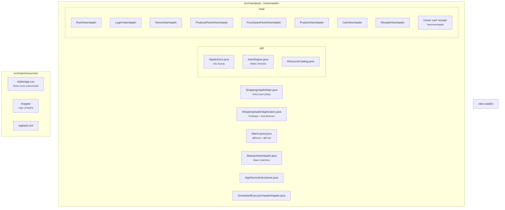
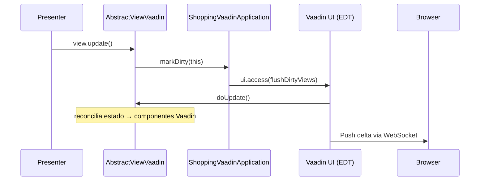
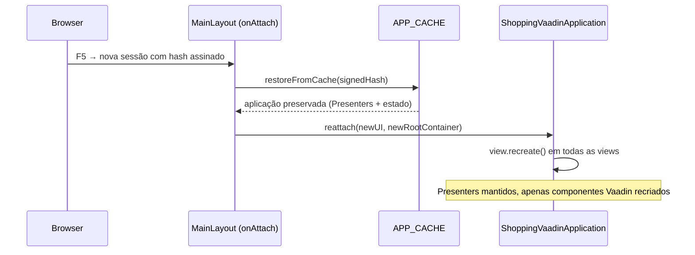
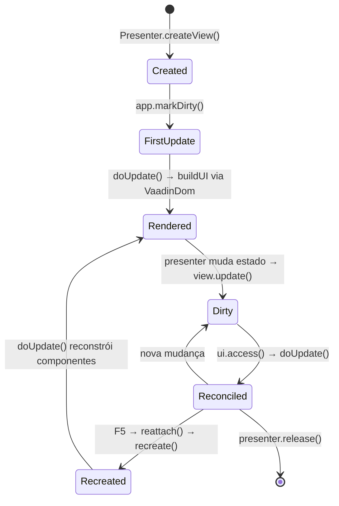

# br.com.wdc.shopping.view.vaadin

Implementação web (Vaadin 24) da aplicação **WeDoCode Shopping**, demonstrando a **independência entre visualização e lógica de apresentação** no padrão **Cube MVP**.

## Motivação

A arquitetura Cube MVP separa rigorosamente os **Presenters** (que controlam estado e navegação) dos **Views** (que renderizam a interface). Os Presenters expõem **ViewStates** — objetos simples com os dados que a view precisa exibir — e a view implementa a interface `CubeView` para se conectar ao ciclo de atualização.

Este módulo é a terceira implementação de UI da aplicação Shopping, desta vez utilizando **Vaadin Flow** — um framework server-side que renderiza componentes nativos no browser sem necessidade de código JavaScript/TypeScript customizado.

| Aspecto | React (remoto) | JavaFX (desktop) | Vaadin (este módulo) |
|---------|-----------------|-------------------|----------------------|
| **Onde roda** | Browser via WebSocket | JVM local | Browser via server-push |
| **Tecnologia de UI** | React 19 + MUI 9 | JavaFX 24 + CSS | Vaadin 24 + Lumo Theme |
| **Transporte** | WebSocket (JSON delta) | Direto em memória | Atmosphere (WebSocket/Push) |
| **Ciclo de render** | Virtual DOM React | AnimationTimer (16ms) | Server-push automático |
| **Código de UI** | TypeScript | Java | Java |

Todas as implementações utilizam **exatamente os mesmos Presenters, ViewStates e regras de negócio**.

## Como funciona

### Navegação e URLs

Diferente de um projeto Vaadin típico que usa `@Route` para navegação, este módulo utiliza uma **única rota** (`@Route("")` em `MainLayout`) e delega toda a navegação ao framework Cube MVP via `CubeNavigation.execute(intent)`.

As URLs utilizam hash-based navigation com assinatura HMAC-SHA256:

```
http://localhost:8080/#intent?sign=abc123
```

A classe `IntentSigner` gera e valida assinaturas usando Base62, garantindo que URLs não possam ser forjadas.

### Restauração de estado (F5)

Ao pressionar F5, o estado completo da aplicação é preservado:

1. `ShoppingVaadinApplication` mantém um `APP_CACHE` estático (ConcurrentHashMap) indexado pela assinatura da URL
2. No `onAttach` do `MainLayout`, se existe cache para a assinatura atual:
   - Os presenters são preservados (contêm o estado de negócio)
   - Apenas os componentes Vaadin são recriados via `view.recreate()`
   - A hierarquia de navegação é recomposta via `go(location)`

### Componentes Vaadin nativos

A UI é construída programaticamente usando componentes nativos do Vaadin:

- **LoginForm** com `LoginI18n` (labels em Português)
- **Grid** para listagens (carrinho, recibo)
- **IntegerField** com step buttons para quantidade
- **Notification** para mensagens de erro/sucesso
- **Badge** para contador do carrinho
- **Icon** (VaadinIcon) nos botões de ação
- **ButtonVariant** (LUMO_PRIMARY, LUMO_TERTIARY, LUMO_SMALL) para estilos
- **Scroller** para área de conteúdo com scroll
- **H2, H3, H4** para títulos semânticos

O tema CSS utiliza **Lumo design tokens** (`var(--lumo-*)`) para manter a aparência nativa do Vaadin.

### DSL para construção de UI

A classe `VaadinDom` fornece uma DSL fluente para construção programática de componentes, análoga ao `JfxDom` da versão JavaFX:

```java
VaadinDom.render(rootLayout, (dom, pane) -> {
    dom.h3(h -> h.setText("Título"));
    dom.horizontalLayout(row -> {
        dom.image(img -> img.setSrc("images/produto.png"));
        dom.verticalLayout(col -> {
            dom.span(label -> label.setText("Descrição"));
            dom.button(btn -> {
                btn.setText("Comprar");
                btn.addThemeVariants(ButtonVariant.LUMO_PRIMARY);
            });
        });
    });
});
```

### Registro de View Factories

```java
static {
    LoginPresenter.createView     = p -> new LoginViewVaadin(app, (LoginPresenter) p);
    HomePresenter.createView      = p -> new HomeViewVaadin(app, (HomePresenter) p);
    CartPresenter.createView      = p -> new CartViewVaadin(app, (CartPresenter) p);
    ProductPresenter.createView   = p -> new ProductViewVaadin(app, (ProductPresenter) p);
    ReceiptPresenter.createView   = p -> new ReceiptViewVaadin(app, (ReceiptPresenter) p);
    // ...
}
```

O Presenter nunca sabe qual tecnologia de UI está sendo usada.

## Estrutura



## Dependências principais

| Dependência | Versão | Uso |
|-------------|--------|-----|
| Vaadin (vaadin-core) | 24.6.3 | Framework de UI server-side |
| Jetty (jetty-ee10-webapp) | 12.0.16 | Servidor embarcado |
| H2 Database | (gerenciada) | Banco embarcado |
| SLF4J + Logback | (gerenciada) | Logging |

## Pré-requisitos

- **Oracle JDK 26** com preview features habilitadas
- **Maven 3.9+**

## Build

```bash
export JAVA_HOME=/Library/Java/JavaVirtualMachines/jdk-26.jdk/Contents/Home
export PATH="$JAVA_HOME/bin:$PATH"

# Build completo (a partir da raiz do projeto)
cd fontes && mvn -q -DskipTests clean install

# Build apenas do módulo Vaadin
cd fontes && mvn -DskipTests compile -pl br.com.wdc.shopping/br.com.wdc.shopping.view.vaadin -am
```

## Execução

```bash
cd fontes/br.com.wdc.shopping/br.com.wdc.shopping.view.vaadin
mvn exec:java
```

Ou via IDE usando a classe `ShoppingVaadinMain.java`.

Acesse: **http://localhost:8080**

## Configuração

O arquivo `work/config/application.toml` permite configurar:

```toml
[app]
# basedir = "work"

[database]
# url = "jdbc:h2:file:..."
# username = "sa"
# password = "sa"
# reset = false
```

## Notas técnicas

### Jetty + Java 26

O Jetty 12 com Java 26 requer uma configuração especial do `WebAppContext` para evitar erros de ASM ao escanear classes com bytecode preview:

- Um diretório WAR vazio é criado
- O `ContainerIncludeJarPattern` é restrito a `.*vaadin.*\.jar$|.*flow.*\.jar$|.*atmosphere.*\.jar$`

### Server Push

O `@Push(PushMode.AUTOMATIC)` no `MainLayout` habilita push via Atmosphere/WebSocket, permitindo que atualizações de estado nos Presenters sejam refletidas automaticamente no browser.

## Arquitetura de Integração Cube MVP

A integração entre o Vaadin e a camada de apresentação (Cube MVP) segue o mesmo padrão das versões Gluon e Swing, com nuances específicas do modelo server-side:

### 1. View Factories (registro estático)

Cada Presenter declara um campo estático `createView` preenchido pelo `ShoppingVaadinApplication`:

```java
static {
    RootPresenter.createView = p -> new RootViewVaadin((ShoppingVaadinApplication) p.app, p);
    LoginPresenter.createView = p -> new LoginViewVaadin((ShoppingVaadinApplication) p.app, p);
    HomePresenter.createView = p -> new HomeViewVaadin((ShoppingVaadinApplication) p.app, p);
    // ...
}
```

### 2. Render Loop via ui.access() (Server Push)

Diferente do Gluon (AnimationTimer ~60fps) e do Swing (javax.swing.Timer ~60fps), o Vaadin não usa polling periódico. Em vez disso, utiliza **server-push** via `@Push(PushMode.AUTOMATIC)`:



O `markDirty` agenda um `ui.access()` que executa `flushDirtyViews()` na thread do Vaadin, garantindo thread-safety sem necessidade de timer. Todas as views sujas são processadas de uma vez, e o Vaadin automaticamente envia as diferenças de DOM para o browser via Atmosphere/WebSocket.

| Aspecto | Gluon/Swing | Vaadin |
|---------|-------------|--------|
| Trigger | Timer periódico (16ms) | `ui.access()` sob demanda |
| Thread de UI | JavaFX App Thread / EDT | Vaadin session lock |
| Transporte | Direto em memória | WebSocket push |
| Throttling | Timestamp + threshold | Sem throttling (push imediato) |

### 3. Reconciliação incremental (doUpdate)

Idêntico às outras implementações — cada view compara campo-a-campo o valor anterior com o atual:

```java
@Override
public void doUpdate() {
    if (this.notRendered) {
        VaadinDom.render(this.element, this::buildUI);
        this.notRendered = false;
    }

    if (!Objects.equals(this.oldNickName, this.state.nickName)) {
        this.nickNameElm.setText(this.state.nickName);
        this.oldNickName = this.state.nickName;
    }
}
```

### 4. VaadinDom — DSL de Construção de UI

Análogo ao `GluonDom` e `SwingDom`, o `VaadinDom` fornece uma DSL fluente para construção de componentes Vaadin, com pilha implícita de container pai:

```java
VaadinDom.render(rootLayout, (dom, pane) -> {
    dom.horizontalLayout(row -> {
        dom.h3(h -> h.setText("Título"));
        dom.button(btn -> {
            btn.setText("Comprar");
            btn.addThemeVariants(ButtonVariant.LUMO_PRIMARY);
            btn.addClickListener(e -> safeAction("Buy", presenter::onBuy));
        });
    });
});
```

| Aspecto | SwingDom | GluonDom | VaadinDom |
|---------|----------|----------|-----------|
| Containers | `JPanel` + BoxLayout | `VBox`, `HBox` | `VerticalLayout`, `HorizontalLayout` |
| Componentes | `JLabel`, `JButton` | `Label`, `Button` | `Span`, `Button`, `Grid` |
| Semântica HTML | — | — | `H2`, `H3`, `H4`, `Div` |
| Spacers | `Box.createGlue()` | `Region` | `FlexLayout` / expand |

### 5. Sincronização de Listas (newListSlot)

Mesmo mecanismo das outras implementações — reutiliza views existentes, cria/remove conforme necessidade:

```java
this.contentSlot = this.newListSlot(container, this::newItemView, this::updateItem);

// Na doUpdate:
this.contentSlot.accept(this.state.products, this.itemViewList);
```

A operação `container.remove(view.getElement())` e `container.add(view.getElement())` do Vaadin é O(1) no servidor; o delta é enviado ao browser via push.

### 6. safeAction — Tratamento de Erros em Callbacks

```java
protected void safeAction(String context, Runnable action) {
    try {
        action.run();
    } catch (Exception caught) {
        this.app.alertUnexpectedError(LOG, context, caught);
    }
}
```

Captura exceções em listeners Vaadin e exibe `Notification.show()` com a mensagem de erro.

### 7. Restauração de Estado (F5 / refresh)

Nuance exclusiva do Vaadin: ao pressionar F5, o browser destrói o WebSocket e os componentes Java são desconectados. A solução:



- O `APP_CACHE` (ConcurrentHashMap estático) armazena a aplicação indexada pela assinatura HMAC da URL
- No `reattach`, cada view executa `recreate()` — reseta o flag `notRendered` e cria novos componentes Vaadin
- Os Presenters e seus estados são preservados intactos

### 8. Navegação por URL com HMAC-SHA256

A classe `IntentSigner` gera URLs hash-based com assinatura criptográfica:

```
http://localhost:8080/#intent?sign=<Base62>
```

- Evita que o usuário forje URLs de navegação
- Permite restauração de estado via cache
- Bloqueia URLs com assinatura inválida (`handleBrowserNavigation` rejeita e restaura a URL válida)

### Fluxo de Vida de uma View



## Conclusão

A existência deste módulo lado a lado com as versões React, Gluon e Swing valida o princípio central da arquitetura Cube MVP: **os ViewStates são contratos estáveis entre Presenters e Views, permitindo trocar a tecnologia de visualização sem alterar uma linha de lógica de negócio ou apresentação**.

A versão Vaadin demonstra que a mesma arquitetura funciona tanto com frameworks que requerem código client-side (React) quanto com frameworks puramente server-side (Vaadin), mantendo a mesma separação de responsabilidades.

## Screenshots

### Login


### Home (Produtos + Histórico de Compras)


### Detalhe do Produto


### Carrinho de Compras


### Recibo

