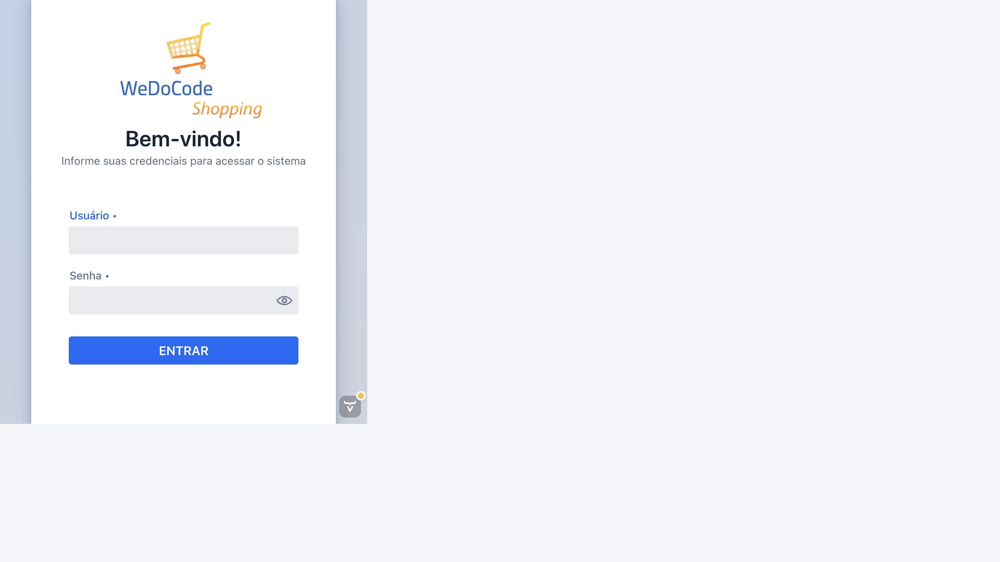
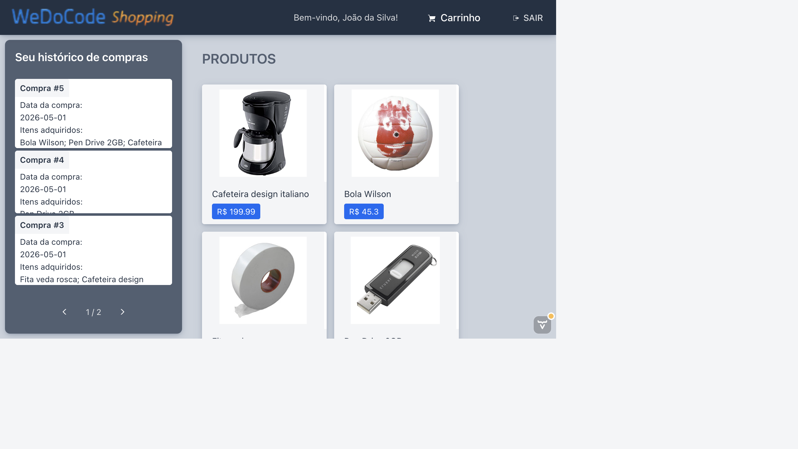
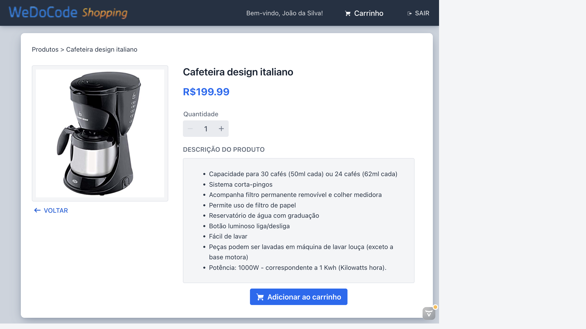
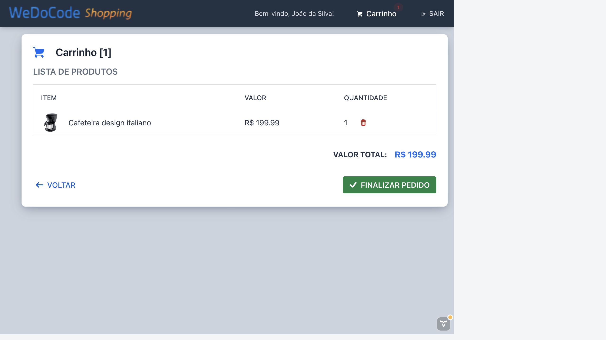
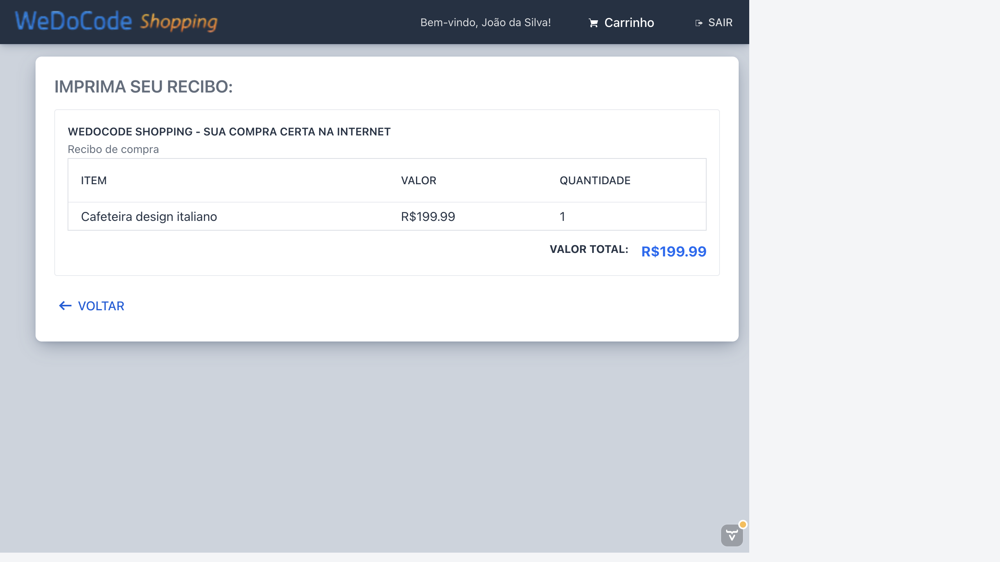

# br.com.wdc.shopping.view.vaadin

Implementação web (Vaadin 24) da aplicação **WeDoCode Shopping**, demonstrando a **independência entre visualização e lógica de apresentação** no padrão **Cube MVP**.

## Motivação

A arquitetura Cube MVP separa rigorosamente os **Presenters** (que controlam estado e navegação) dos **Views** (que renderizam a interface). Os Presenters expõem **ViewStates** — objetos simples com os dados que a view precisa exibir — e a view implementa a interface `CubeView` para se conectar ao ciclo de atualização.

Este módulo é a terceira implementação de UI da aplicação Shopping, desta vez utilizando **Vaadin Flow** — um framework server-side que renderiza componentes nativos no browser sem necessidade de código JavaScript/TypeScript customizado.

| Aspecto | React (remoto) | JavaFX (desktop) | Vaadin (este módulo) |
|---------|-----------------|-------------------|----------------------|
| **Onde roda** | Browser via WebSocket | JVM local | Browser via server-push |
| **Tecnologia de UI** | React 19 + MUI 9 | JavaFX 24 + CSS | Vaadin 24 + Lumo Theme |
| **Transporte** | WebSocket (JSON delta) | Direto em memória | Atmosphere (WebSocket/Push) |
| **Ciclo de render** | Virtual DOM React | AnimationTimer (16ms) | Server-push automático |
| **Código de UI** | TypeScript | Java | Java |

Todas as implementações utilizam **exatamente os mesmos Presenters, ViewStates e regras de negócio**.

## Screenshots

### Login


### Home (Produtos + Histórico de Compras)


### Detalhe do Produto


### Carrinho de Compras


### Recibo


## Como funciona

### Navegação e URLs

Diferente de um projeto Vaadin típico que usa `@Route` para navegação, este módulo utiliza uma **única rota** (`@Route("")` em `MainLayout`) e delega toda a navegação ao framework Cube MVP via `CubeNavigation.execute(intent)`.

As URLs utilizam hash-based navigation com assinatura HMAC-SHA256:

```
http://localhost:8080/#intent?sign=abc123
```

A classe `IntentSigner` gera e valida assinaturas usando Base62, garantindo que URLs não possam ser forjadas.

### Restauração de estado (F5)

Ao pressionar F5, o estado completo da aplicação é preservado:

1. `ShoppingVaadinApplication` mantém um `APP_CACHE` estático (ConcurrentHashMap) indexado pela assinatura da URL
2. No `onAttach` do `MainLayout`, se existe cache para a assinatura atual:
   - Os presenters são preservados (contêm o estado de negócio)
   - Apenas os componentes Vaadin são recriados via `view.recreate()`
   - A hierarquia de navegação é recomposta via `go(location)`

### Componentes Vaadin nativos

A UI é construída programaticamente usando componentes nativos do Vaadin:

- **LoginForm** com `LoginI18n` (labels em Português)
- **Grid** para listagens (carrinho, recibo)
- **IntegerField** com step buttons para quantidade
- **Notification** para mensagens de erro/sucesso
- **Badge** para contador do carrinho
- **Icon** (VaadinIcon) nos botões de ação
- **ButtonVariant** (LUMO_PRIMARY, LUMO_TERTIARY, LUMO_SMALL) para estilos
- **Scroller** para área de conteúdo com scroll
- **H2, H3, H4** para títulos semânticos

O tema CSS utiliza **Lumo design tokens** (`var(--lumo-*)`) para manter a aparência nativa do Vaadin.

### DSL para construção de UI

A classe `VaadinDom` fornece uma DSL fluente para construção programática de componentes, análoga ao `JfxDom` da versão JavaFX:

```java
VaadinDom.render(rootLayout, (dom, pane) -> {
    dom.h3(h -> h.setText("Título"));
    dom.horizontalLayout(row -> {
        dom.image(img -> img.setSrc("images/produto.png"));
        dom.verticalLayout(col -> {
            dom.span(label -> label.setText("Descrição"));
            dom.button(btn -> {
                btn.setText("Comprar");
                btn.addThemeVariants(ButtonVariant.LUMO_PRIMARY);
            });
        });
    });
});
```

### Registro de View Factories

```java
static {
    LoginPresenter.createView     = p -> new LoginViewVaadin(app, (LoginPresenter) p);
    HomePresenter.createView      = p -> new HomeViewVaadin(app, (HomePresenter) p);
    CartPresenter.createView      = p -> new CartViewVaadin(app, (CartPresenter) p);
    ProductPresenter.createView   = p -> new ProductViewVaadin(app, (ProductPresenter) p);
    ReceiptPresenter.createView   = p -> new ReceiptViewVaadin(app, (ReceiptPresenter) p);
    // ...
}
```

O Presenter nunca sabe qual tecnologia de UI está sendo usada.

## Estrutura

```
br.com.wdc.shopping.view.vaadin/
├── src/main/java/.../view/vaadin/
│   ├── ShoppingVaadinMain.java           # Entry point (Jetty embarcado)
│   ├── ShoppingVaadinApplication.java    # CubeApplication + APP_CACHE + view factories
│   ├── MainLayout.java                   # @Route("") + @Push — shell da aplicação
│   ├── AbstractViewVaadin.java           # Base: CubeView + recreate() + list slot sync
│   ├── AppServiceInitListener.java       # Configuração do Vaadin (CSS, etc.)
│   ├── ScheduledExecutorVaadinAdapter.java
│   ├── util/
│   │   ├── VaadinDom.java               # DSL fluente para construção de componentes
│   │   ├── IntentSigner.java            # HMAC-SHA256 + Base62 para URLs assinadas
│   │   └── ResourceCatalog.java         # Cache de recursos de imagem
│   └── impl/
│       ├── RootViewVaadin.java
│       ├── LoginViewVaadin.java          # LoginForm nativo
│       ├── HomeViewVaadin.java           # Header + sidebar compras + conteúdo central
│       ├── ProductsPanelViewVaadin.java  # Grid de cards de produtos
│       ├── PurchasesPanelViewVaadin.java # Sidebar com histórico + paginação
│       ├── ProductViewVaadin.java        # Detalhe do produto
│       ├── CartViewVaadin.java           # Grid de itens do carrinho
│       ├── ReceiptViewVaadin.java        # Grid de itens do recibo
│       ├── home/
│       │   ├── ProductItemViewVaadin.java
│       │   └── PurchaseItemViewVaadin.java
│       ├── cart/
│       │   └── CartItemViewVaadin.java
│       └── receipt/
│           └── ReceiptItemViewVaadin.java
├── src/main/resources/
│   ├── META-INF/resources/
│   │   ├── styles/app.css               # Tema Lumo customizado
│   │   └── images/                      # Imagens (logo, produtos)
│   └── logback.xml
└── pom.xml
```

## Dependências principais

| Dependência | Versão | Uso |
|-------------|--------|-----|
| Vaadin (vaadin-core) | 24.6.3 | Framework de UI server-side |
| Jetty (jetty-ee10-webapp) | 12.0.16 | Servidor embarcado |
| H2 Database | (gerenciada) | Banco embarcado |
| SLF4J + Logback | (gerenciada) | Logging |

## Pré-requisitos

- **Oracle JDK 26** com preview features habilitadas
- **Maven 3.9+**

## Build

```bash
export JAVA_HOME=/Library/Java/JavaVirtualMachines/jdk-26.jdk/Contents/Home
export PATH="$JAVA_HOME/bin:$PATH"

# Build completo (a partir da raiz do projeto)
cd fontes && mvn -q -DskipTests clean install

# Build apenas do módulo Vaadin
cd fontes && mvn -DskipTests compile -pl br.com.wdc.shopping/br.com.wdc.shopping.view.vaadin -am
```

## Execução

```bash
cd fontes/br.com.wdc.shopping/br.com.wdc.shopping.view.vaadin
mvn exec:java
```

Ou via IDE usando a classe `ShoppingVaadinMain.java`.

Acesse: **http://localhost:8080**

## Configuração

O arquivo `work/config/application.toml` permite configurar:

```toml
[app]
# basedir = "work"

[database]
# url = "jdbc:h2:file:..."
# username = "sa"
# password = "sa"
# reset = false
```

## Notas técnicas

### Jetty + Java 26

O Jetty 12 com Java 26 requer uma configuração especial do `WebAppContext` para evitar erros de ASM ao escanear classes com bytecode preview:

- Um diretório WAR vazio é criado
- O `ContainerIncludeJarPattern` é restrito a `.*vaadin.*\.jar$|.*flow.*\.jar$|.*atmosphere.*\.jar$`

### Server Push

O `@Push(PushMode.AUTOMATIC)` no `MainLayout` habilita push via Atmosphere/WebSocket, permitindo que atualizações de estado nos Presenters sejam refletidas automaticamente no browser.

## Conclusão

A existência deste módulo lado a lado com as versões React e JavaFX valida o princípio central da arquitetura Cube MVP: **os ViewStates são contratos estáveis entre Presenters e Views, permitindo trocar a tecnologia de visualização sem alterar uma linha de lógica de negócio ou apresentação**.

A versão Vaadin demonstra que a mesma arquitetura funciona tanto com frameworks que requerem código client-side (React) quanto com frameworks puramente server-side (Vaadin), mantendo a mesma separação de responsabilidades.
